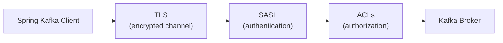

# Apache Kafka Security

[← Back to README](../README.md)

---

Kafka security has three orthogonal layers: **encryption** (TLS for in-transit data), **authentication** (SASL mechanisms — PLAIN, SCRAM-SHA-256/512, OAUTHBEARER — or mutual TLS), and **authorization** (ACLs stored in ZooKeeper or KRaft metadata). Spring Kafka exposes all three via `spring.kafka` properties or a `KafkaAdmin`/`SslBundles` bean. Production setups typically combine TLS + SASL/SCRAM + ACLs.



---

## Broker Configuration (server.properties)

```properties
# Listener for TLS + SASL/SCRAM
listeners=SASL_SSL://0.0.0.0:9093
advertised.listeners=SASL_SSL://kafka.example.com:9093
listener.security.protocol.map=SASL_SSL:SASL_SSL

# SASL mechanism on the broker side
sasl.enabled.mechanisms=SCRAM-SHA-256
sasl.mechanism.inter.broker.protocol=SCRAM-SHA-256
inter.broker.listener.name=SASL_SSL

# TLS
ssl.keystore.location=/etc/kafka/ssl/kafka.keystore.jks
ssl.keystore.password=${KEYSTORE_PASSWORD}
ssl.key.password=${KEY_PASSWORD}
ssl.truststore.location=/etc/kafka/ssl/kafka.truststore.jks
ssl.truststore.password=${TRUSTSTORE_PASSWORD}
ssl.client.auth=none   # "required" for mTLS

# Authorization
authorizer.class.name=kafka.security.authorizer.AclAuthorizer
allow.everyone.if.no.acl.found=false
super.users=User:admin
```

---

## Creating SCRAM Users

```bash
# Create SCRAM credentials for a new user (broker must be running)
kafka-configs.sh --bootstrap-server kafka:9093 \
  --command-config admin.properties \
  --alter --add-config 'SCRAM-SHA-256=[password=secret]' \
  --entity-type users --entity-name order-service

# Verify
kafka-configs.sh --bootstrap-server kafka:9093 \
  --command-config admin.properties \
  --describe --entity-type users --entity-name order-service
```

---

## Spring Kafka — SASL/SCRAM + TLS

```yaml
# application.yaml
spring:
  kafka:
    bootstrap-servers: kafka.example.com:9093
    security:
      protocol: SASL_SSL
    properties:
      sasl.mechanism: SCRAM-SHA-256
      sasl.jaas.config: >
        org.apache.kafka.common.security.scram.ScramLoginModule required
        username="${KAFKA_USERNAME}"
        password="${KAFKA_PASSWORD}";
    ssl:
      trust-store-location: classpath:kafka-truststore.jks
      trust-store-password: ${TRUSTSTORE_PASSWORD}
      trust-store-type: JKS
      # key-store-* only needed for mTLS (client certificates)
```

---

## Spring Kafka — SASL/PLAIN

```yaml
spring:
  kafka:
    bootstrap-servers: kafka.example.com:9092
    security:
      protocol: SASL_PLAINTEXT   # or SASL_SSL for encrypted channel
    properties:
      sasl.mechanism: PLAIN
      sasl.jaas.config: >
        org.apache.kafka.common.security.plain.PlainLoginModule required
        username="${KAFKA_USERNAME}"
        password="${KAFKA_PASSWORD}";
```

---

## Mutual TLS (mTLS) — Certificate Authentication

```yaml
spring:
  kafka:
    bootstrap-servers: kafka.example.com:9093
    security:
      protocol: SSL
    ssl:
      key-store-location: classpath:client-keystore.jks
      key-store-password: ${CLIENT_KEYSTORE_PASSWORD}
      key-store-type: JKS
      trust-store-location: classpath:kafka-truststore.jks
      trust-store-password: ${TRUSTSTORE_PASSWORD}
      trust-store-type: JKS
```

---

## Programmatic SSL Config with SslBundles (Spring Boot 3.1+)

```yaml
spring:
  ssl:
    bundle:
      jks:
        kafka-client:
          keystore:
            location: classpath:client-keystore.jks
            password: ${CLIENT_KEYSTORE_PASSWORD}
          truststore:
            location: classpath:kafka-truststore.jks
            password: ${TRUSTSTORE_PASSWORD}
  kafka:
    bootstrap-servers: kafka.example.com:9093
    security:
      protocol: SSL
    ssl:
      bundle: kafka-client
```

---

## OAUTHBEARER / OIDC Authentication

```yaml
spring:
  kafka:
    bootstrap-servers: kafka.example.com:9093
    security:
      protocol: SASL_SSL
    properties:
      sasl.mechanism: OAUTHBEARER
      sasl.login.callback.handler.class: >
        org.apache.kafka.common.security.oauthbearer.secured.OAuthBearerLoginCallbackHandler
      sasl.oauthbearer.token.endpoint.url: https://auth.example.com/oauth/token
      sasl.jaas.config: >
        org.apache.kafka.common.security.oauthbearer.OAuthBearerLoginModule required
        clientId="${OAUTH_CLIENT_ID}"
        clientSecret="${OAUTH_CLIENT_SECRET}"
        scope="kafka";
```

---

## ACL Management

```java
// Manage ACLs programmatically via KafkaAdmin
@Configuration
@RequiredArgsConstructor
public class KafkaAclConfig {

    private final KafkaAdmin kafkaAdmin;

    @Bean
    public ApplicationRunner setupAcls() {
        return args -> {
            try (AdminClient admin = AdminClient.create(kafkaAdmin.getConfigurationProperties())) {

                // Allow order-service to produce to "orders" topic
                AclBinding producerAcl = new AclBinding(
                    new ResourcePattern(ResourceType.TOPIC, "orders", PatternType.LITERAL),
                    new AccessControlEntry(
                        "User:order-service", "*",
                        AclOperation.WRITE, AclPermissionType.ALLOW));

                // Allow inventory-service to consume from "orders" topic
                AclBinding consumerTopicAcl = new AclBinding(
                    new ResourcePattern(ResourceType.TOPIC, "orders", PatternType.LITERAL),
                    new AccessControlEntry(
                        "User:inventory-service", "*",
                        AclOperation.READ, AclPermissionType.ALLOW));

                // Consumer also needs GROUP permission
                AclBinding consumerGroupAcl = new AclBinding(
                    new ResourcePattern(ResourceType.GROUP, "inventory-consumers", PatternType.LITERAL),
                    new AccessControlEntry(
                        "User:inventory-service", "*",
                        AclOperation.READ, AclPermissionType.ALLOW));

                admin.createAcls(List.of(producerAcl, consumerTopicAcl, consumerGroupAcl)).all().get();
                log.info("ACLs created successfully");
            }
        };
    }
}
```

---

## ACL Management via CLI

```bash
# Grant produce access
kafka-acls.sh --bootstrap-server kafka:9093 \
  --command-config admin.properties \
  --add --allow-principal User:order-service \
  --operation Write --topic orders

# Grant consume access (topic + consumer group)
kafka-acls.sh --bootstrap-server kafka:9093 \
  --command-config admin.properties \
  --add --allow-principal User:inventory-service \
  --operation Read --topic orders

kafka-acls.sh --bootstrap-server kafka:9093 \
  --command-config admin.properties \
  --add --allow-principal User:inventory-service \
  --operation Read --group inventory-consumers

# List ACLs for a topic
kafka-acls.sh --bootstrap-server kafka:9093 \
  --command-config admin.properties \
  --list --topic orders
```

---

## Credentials in Kubernetes Secrets

```yaml
# k8s Secret — never put credentials in application.yaml directly
apiVersion: v1
kind: Secret
metadata:
  name: kafka-credentials
type: Opaque
stringData:
  username: order-service
  password: supersecret
---
# Reference in Deployment
env:
  - name: KAFKA_USERNAME
    valueFrom:
      secretKeyRef:
        name: kafka-credentials
        key: username
  - name: KAFKA_PASSWORD
    valueFrom:
      secretKeyRef:
        name: kafka-credentials
        key: password
```

---

## Apache Kafka Security Summary

| Concept | Detail |
|---------|--------|
| `SASL_SSL` | Most common production protocol — SASL authentication over TLS-encrypted channel |
| `SASL_PLAINTEXT` | SASL without TLS — only for trusted internal networks |
| `SSL` | TLS-only (mTLS) — broker authenticates client via client certificate |
| SASL/PLAIN | Username/password in plaintext JAAS config — simple but no in-protocol hashing |
| SASL/SCRAM-SHA-256 | Salted challenge-response — passwords are not sent over the wire |
| SASL/OAUTHBEARER | Token-based auth (OIDC/OAuth2) — credentials issued by an identity provider |
| `ssl.client.auth=required` | Enables mutual TLS — broker rejects clients without a valid certificate |
| `AclAuthorizer` | Kafka's built-in ACL engine — ACLs stored in ZooKeeper/KRaft |
| `AclBinding` | Pair of `ResourcePattern` (topic/group/cluster) + `AccessControlEntry` (principal, op, allow/deny) |
| `allow.everyone.if.no.acl.found=false` | Deny-by-default — require explicit ALLOW ACL for each operation |
| `super.users` | Bypass ACL checks — reserved for admin tooling |
| `SslBundles` | Spring Boot 3.1+ centralised SSL config — reference by name in kafka.ssl.bundle |

---

[← Back to README](../README.md)
