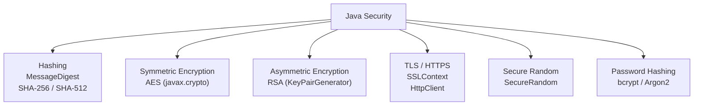

# Security

[← Back to README](../README.md)

---

Security in Java spans hashing, encryption, secure randomness, TLS, and defensive coding practices. The JDK ships `java.security` and `javax.crypto` for cryptographic operations — no third-party library required for the fundamentals.



---

## Hashing with MessageDigest

Hashing is one-way — you cannot reverse a hash back to the original input. Use it for data integrity and password verification (with a salt).

```java
import java.security.MessageDigest;
import java.util.HexFormat;

public class HashUtil {

    public static String sha256(String input) throws Exception {
        MessageDigest digest = MessageDigest.getInstance("SHA-256");
        byte[] hash = digest.digest(input.getBytes(java.nio.charset.StandardCharsets.UTF_8));
        return HexFormat.of().formatHex(hash);  // Java 17+
    }

    public static void main(String[] args) throws Exception {
        String hash = sha256("Hello, World!");
        System.out.println(hash);
        // dffd6021bb2bd5b0af676290809ec3a53191dd81c7f70a4b28688a362182986d
    }
}
```

### Available Algorithms

```java
MessageDigest.getInstance("MD5");     // 128-bit — INSECURE, do not use for security
MessageDigest.getInstance("SHA-1");   // 160-bit — deprecated for security use
MessageDigest.getInstance("SHA-256"); // 256-bit — recommended
MessageDigest.getInstance("SHA-512"); // 512-bit — stronger
```

### Hashing with a Salt

Never hash passwords without a salt — identical passwords produce identical hashes, enabling rainbow-table attacks.

```java
import java.security.*;
import java.util.HexFormat;

public class SaltedHash {

    public static byte[] generateSalt() {
        SecureRandom random = new SecureRandom();
        byte[] salt = new byte[16];
        random.nextBytes(salt);
        return salt;
    }

    public static String hashWithSalt(String password, byte[] salt) throws Exception {
        MessageDigest digest = MessageDigest.getInstance("SHA-256");
        digest.update(salt);
        byte[] hash = digest.digest(password.getBytes(java.nio.charset.StandardCharsets.UTF_8));
        return HexFormat.of().formatHex(hash);
    }
}
```

> For password hashing in production, prefer **bcrypt** or **Argon2** — they are deliberately slow and resist brute-force attacks far better than SHA-256 + salt.

---

## SecureRandom

`java.util.Random` is **not cryptographically secure** — it is predictable. Always use `SecureRandom` for tokens, nonces, salts, and any security-sensitive value.

```java
import java.security.SecureRandom;
import java.util.Base64;

SecureRandom random = new SecureRandom();

// generate a random 32-byte token
byte[] tokenBytes = new byte[32];
random.nextBytes(tokenBytes);
String token = Base64.getUrlEncoder().withoutPadding().encodeToString(tokenBytes);
System.out.println(token);  // e.g. "dGhpcyBpcyBhIHNlY3VyZSB0b2tlbg"

// random int in range [0, 100)
int pin = random.nextInt(100);

// random long
long sessionId = random.nextLong();
```

---

## Symmetric Encryption — AES

AES (Advanced Encryption Standard) is the standard for symmetric encryption — same key to encrypt and decrypt. Use **AES/GCM** mode, which provides both confidentiality and integrity.

```java
import javax.crypto.*;
import javax.crypto.spec.*;
import java.security.*;
import java.util.Base64;

public class AesGcm {

    private static final String ALGORITHM = "AES/GCM/NoPadding";
    private static final int    KEY_SIZE  = 256;  // bits
    private static final int    TAG_SIZE  = 128;  // bits
    private static final int    IV_SIZE   = 12;   // bytes (96-bit IV for GCM)

    public static SecretKey generateKey() throws Exception {
        KeyGenerator keygen = KeyGenerator.getInstance("AES");
        keygen.init(KEY_SIZE, new SecureRandom());
        return keygen.generateKey();
    }

    public static byte[] encrypt(byte[] plaintext, SecretKey key) throws Exception {
        byte[] iv = new byte[IV_SIZE];
        new SecureRandom().nextBytes(iv);

        Cipher cipher = Cipher.getInstance(ALGORITHM);
        cipher.init(Cipher.ENCRYPT_MODE, key, new GCMParameterSpec(TAG_SIZE, iv));
        byte[] ciphertext = cipher.doFinal(plaintext);

        // prepend IV so it can be extracted on decrypt
        byte[] result = new byte[IV_SIZE + ciphertext.length];
        System.arraycopy(iv, 0, result, 0, IV_SIZE);
        System.arraycopy(ciphertext, 0, result, IV_SIZE, ciphertext.length);
        return result;
    }

    public static byte[] decrypt(byte[] encryptedData, SecretKey key) throws Exception {
        byte[] iv         = new byte[IV_SIZE];
        byte[] ciphertext = new byte[encryptedData.length - IV_SIZE];

        System.arraycopy(encryptedData, 0,       iv,         0, IV_SIZE);
        System.arraycopy(encryptedData, IV_SIZE, ciphertext, 0, ciphertext.length);

        Cipher cipher = Cipher.getInstance(ALGORITHM);
        cipher.init(Cipher.DECRYPT_MODE, key, new GCMParameterSpec(TAG_SIZE, iv));
        return cipher.doFinal(ciphertext);
    }

    public static void main(String[] args) throws Exception {
        SecretKey key = generateKey();

        byte[] plaintext  = "Sensitive data".getBytes();
        byte[] encrypted  = encrypt(plaintext, key);
        byte[] decrypted  = decrypt(encrypted, key);

        System.out.println("Original:  " + new String(plaintext));
        System.out.println("Encrypted: " + Base64.getEncoder().encodeToString(encrypted));
        System.out.println("Decrypted: " + new String(decrypted));
    }
}
```

---

## Asymmetric Encryption — RSA

RSA uses a **key pair**: a public key to encrypt (or verify) and a private key to decrypt (or sign). Useful for exchanging keys and digital signatures.

```java
import java.security.*;
import javax.crypto.Cipher;
import java.util.Base64;

public class RsaExample {

    public static KeyPair generateKeyPair() throws Exception {
        KeyPairGenerator generator = KeyPairGenerator.getInstance("RSA");
        generator.initialize(2048, new SecureRandom());  // 2048-bit minimum
        return generator.generateKeyPair();
    }

    public static byte[] encrypt(byte[] data, PublicKey publicKey) throws Exception {
        Cipher cipher = Cipher.getInstance("RSA/ECB/OAEPWithSHA-256AndMGF1Padding");
        cipher.init(Cipher.ENCRYPT_MODE, publicKey);
        return cipher.doFinal(data);
    }

    public static byte[] decrypt(byte[] ciphertext, PrivateKey privateKey) throws Exception {
        Cipher cipher = Cipher.getInstance("RSA/ECB/OAEPWithSHA-256AndMGF1Padding");
        cipher.init(Cipher.DECRYPT_MODE, privateKey);
        return cipher.doFinal(ciphertext);
    }

    public static void main(String[] args) throws Exception {
        KeyPair keyPair = generateKeyPair();

        byte[] plaintext  = "Secret message".getBytes();
        byte[] encrypted  = encrypt(plaintext, keyPair.getPublic());
        byte[] decrypted  = decrypt(encrypted, keyPair.getPrivate());

        System.out.println("Decrypted: " + new String(decrypted));
    }
}
```

### Digital Signatures

```java
Signature signer = Signature.getInstance("SHA256withRSA");

// sign with private key
signer.initSign(keyPair.getPrivate());
signer.update("Message to sign".getBytes());
byte[] signature = signer.sign();

// verify with public key
signer.initVerify(keyPair.getPublic());
signer.update("Message to sign".getBytes());
boolean valid = signer.verify(signature);
System.out.println("Signature valid: " + valid);  // true
```

---

## HTTPS with HttpClient

Java's `HttpClient` (Java 11+) uses TLS by default when the URL scheme is `https`. No extra configuration needed for standard public CAs.

```java
import java.net.http.*;
import java.net.URI;

HttpClient client = HttpClient.newHttpClient();

HttpRequest request = HttpRequest.newBuilder()
    .uri(URI.create("https://api.example.com/data"))
    .header("Authorization", "Bearer " + token)
    .GET()
    .build();

HttpResponse<String> response = client.send(request,
    HttpResponse.BodyHandlers.ofString());

System.out.println(response.statusCode());  // 200
System.out.println(response.body());
```

### Custom TrustStore (internal CAs)

```java
import javax.net.ssl.*;
import java.security.KeyStore;
import java.io.FileInputStream;

KeyStore trustStore = KeyStore.getInstance("JKS");
try (var is = new FileInputStream("truststore.jks")) {
    trustStore.load(is, "changeit".toCharArray());
}

TrustManagerFactory tmf = TrustManagerFactory.getInstance(TrustManagerFactory.getDefaultAlgorithm());
tmf.init(trustStore);

SSLContext sslContext = SSLContext.getInstance("TLS");
sslContext.init(null, tmf.getTrustManagers(), new SecureRandom());

HttpClient secureClient = HttpClient.newBuilder()
    .sslContext(sslContext)
    .build();
```

---

## Password Hashing — bcrypt

Never store plaintext passwords or simple SHA hashes. Use an adaptive algorithm like **bcrypt** or **Argon2** — they include a built-in salt and cost factor.

```xml
<!-- jBCrypt — lightweight bcrypt for Java -->
<dependency>
    <groupId>org.mindrot</groupId>
    <artifactId>jbcrypt</artifactId>
    <version>0.4</version>
</dependency>
```

```java
import org.mindrot.jbcrypt.BCrypt;

// hash a password (work factor 12 — tune based on server speed)
String hashed = BCrypt.hashpw(plainPassword, BCrypt.gensalt(12));

// verify — safe against timing attacks
boolean match = BCrypt.checkpw(inputPassword, hashed);
```

Argon2 (Spring Security):

```java
// Spring Security ships Argon2PasswordEncoder
PasswordEncoder encoder = Argon2PasswordEncoder.defaultsForSpringSecurity_v5_8();
String hash = encoder.encode(rawPassword);
boolean ok  = encoder.matches(rawPassword, hash);
```

---

## Secure Coding Pitfalls

### SQL Injection

```java
// VULNERABLE — never do this
String sql = "SELECT * FROM users WHERE name = '" + username + "'";

// SAFE — always use PreparedStatement
PreparedStatement ps = conn.prepareStatement("SELECT * FROM users WHERE name = ?");
ps.setString(1, username);
```

### XML External Entity (XXE)

```java
// VULNERABLE — default SAX/DOM parsers resolve external entities
DocumentBuilderFactory factory = DocumentBuilderFactory.newInstance();

// SAFE — disable external entity resolution
factory.setFeature("http://apache.org/xml/features/disallow-doctype-decl", true);
factory.setFeature("http://xml.org/sax/features/external-general-entities", false);
factory.setFeature("http://xml.org/sax/features/external-parameter-entities", false);
factory.setExpandEntityReferences(false);
```

### Sensitive Data in Logs

```java
// NEVER log passwords, tokens, or PII
log.info("User logged in: username={}, password={}", username, password);  // BAD

// log identity only
log.info("User logged in: username={}", username);  // GOOD
```

### Timing Attacks on String Comparison

```java
// VULNERABLE — early exit leaks timing information
if (storedToken.equals(providedToken)) { ... }

// SAFE — constant-time comparison
import java.security.MessageDigest;
boolean safe = MessageDigest.isEqual(storedToken.getBytes(), providedToken.getBytes());
```

---

## Key Management

Never hardcode secrets in source code. Use:

| Option | When to use |
|--------|-------------|
| Environment variables | Simple apps, containers |
| `java.util.Properties` + external file | Config outside the JAR |
| AWS Secrets Manager / GCP Secret Manager | Cloud deployments |
| HashiCorp Vault | Enterprise / multi-cloud |
| Java KeyStore (JKS / PKCS#12) | TLS certificates, key pairs |

```java
// read secret from environment — NOT from source code
String dbPassword = System.getenv("DB_PASSWORD");
String apiKey     = System.getenv("API_KEY");

// load a KeyStore
KeyStore ks = KeyStore.getInstance("PKCS12");
try (var is = new FileInputStream("keystore.p12")) {
    ks.load(is, System.getenv("KEYSTORE_PASSWORD").toCharArray());
}
```

---

## Security Summary

| Concept | Class / Library |
|---------|----------------|
| Hashing | `MessageDigest` (`SHA-256`, `SHA-512`) |
| Secure random values | `SecureRandom` |
| Symmetric encryption | `Cipher` + AES/GCM |
| Asymmetric encryption | `KeyPairGenerator` + RSA |
| Digital signatures | `Signature` (`SHA256withRSA`) |
| TLS / HTTPS | `HttpClient` (built-in), `SSLContext` |
| Password hashing | bcrypt (`jBCrypt`), Argon2 (Spring Security) |
| Prevent SQL injection | `PreparedStatement` |
| Prevent XXE | Disable external entities on XML parsers |
| Secret management | Environment variables, Vault, cloud secret managers |

---

[← Back to README](../README.md)
