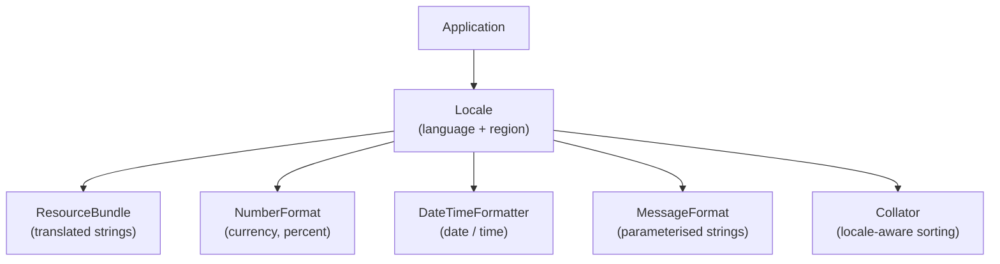

# Internationalization (i18n)

[← Back to README](../README.md)

---

**Internationalization** (i18n — 18 letters between "i" and "n") prepares an application to work across languages, regions, and cultures without code changes. **Localization** (l10n) is the act of adapting the app for a specific locale.



---

## Locale

`Locale` represents a language + optional region combination. It drives formatting and translation decisions.

```java
import java.util.Locale;

// common locales
Locale english   = Locale.ENGLISH;                    // en
Locale us        = Locale.US;                         // en_US
Locale uk        = Locale.UK;                         // en_GB
Locale french    = Locale.FRENCH;                     // fr
Locale germany   = Locale.GERMANY;                    // de_DE
Locale japan     = Locale.JAPAN;                      // ja_JP
Locale southAfrica = Locale.forLanguageTag("en-ZA");  // en_ZA

// build a locale
Locale custom = new Locale("pt", "BR");  // Portuguese, Brazil

// system default
Locale defaultLocale = Locale.getDefault();

// inspect
System.out.println(us.getLanguage());       // en
System.out.println(us.getCountry());        // US
System.out.println(us.getDisplayName());    // English (United States)

// list all available locales
for (Locale l : Locale.getAvailableLocales()) {
    System.out.println(l.toLanguageTag());
}
```

---

## ResourceBundle — Externalising Strings

`ResourceBundle` loads locale-specific `.properties` files so UI text can be translated without changing code.

### File structure

```
src/main/resources/
├── messages.properties          ← default / fallback
├── messages_en.properties       ← English
├── messages_fr.properties       ← French
├── messages_af.properties       ← Afrikaans
└── messages_zu.properties       ← Zulu
```

### messages.properties (default)

```properties
greeting=Hello, {0}!
farewell=Goodbye!
app.title=My Application
error.not_found=The item was not found.
```

### messages_fr.properties

```properties
greeting=Bonjour, {0} !
farewell=Au revoir !
app.title=Mon Application
error.not_found=L'élément est introuvable.
```

### messages_af.properties

```properties
greeting=Hallo, {0}!
farewell=Totsiens!
app.title=My Aansoek
error.not_found=Die item is nie gevind nie.
```

### Loading strings in code

```java
import java.util.*;

Locale locale = Locale.forLanguageTag("fr");

// loads messages_fr.properties (falls back to messages.properties if missing)
ResourceBundle bundle = ResourceBundle.getBundle("messages", locale);

System.out.println(bundle.getString("farewell"));   // Au revoir !
System.out.println(bundle.getString("app.title"));  // Mon Application
```

---

## MessageFormat — Parameterised Strings

`MessageFormat` substitutes values into translated strings using `{0}`, `{1}`, … placeholders.

```java
import java.text.MessageFormat;
import java.util.*;

Locale locale = Locale.FRENCH;
ResourceBundle bundle = ResourceBundle.getBundle("messages", locale);

String pattern = bundle.getString("greeting");  // "Bonjour, {0} !"
String message = MessageFormat.format(pattern, "Alice");

System.out.println(message);  // Bonjour, Alice !
```

### Plurals with MessageFormat

```java
// messages.properties
// items=You have {0,choice,0#no items|1#one item|1<{0} items}.

String pattern = bundle.getString("items");

System.out.println(MessageFormat.format(pattern, 0));  // You have no items.
System.out.println(MessageFormat.format(pattern, 1));  // You have one item.
System.out.println(MessageFormat.format(pattern, 5));  // You have 5 items.
```

---

## NumberFormat — Numbers, Currency, Percentages

```java
import java.text.NumberFormat;
import java.util.Locale;

double amount = 1234567.89;

// number formatting
NumberFormat nfUs  = NumberFormat.getNumberInstance(Locale.US);
NumberFormat nfDe  = NumberFormat.getNumberInstance(Locale.GERMANY);
System.out.println(nfUs.format(amount));  // 1,234,567.89
System.out.println(nfDe.format(amount));  // 1.234.567,89

// currency
NumberFormat currencyUs = NumberFormat.getCurrencyInstance(Locale.US);
NumberFormat currencyZa = NumberFormat.getCurrencyInstance(Locale.forLanguageTag("en-ZA"));
NumberFormat currencyEu = NumberFormat.getCurrencyInstance(Locale.GERMANY);
System.out.println(currencyUs.format(amount));  // $1,234,567.89
System.out.println(currencyZa.format(amount));  // R 1 234 567,89
System.out.println(currencyEu.format(amount));  // 1.234.567,89 €

// percentage
NumberFormat pct = NumberFormat.getPercentInstance(Locale.US);
pct.setMaximumFractionDigits(1);
System.out.println(pct.format(0.1234));  // 12.3%

// parsing a locale-formatted number
Number parsed = nfDe.parse("1.234.567,89");
System.out.println(parsed.doubleValue());  // 1234567.89
```

---

## Date and Time Formatting by Locale

`DateTimeFormatter` supports locale-sensitive formatting via `ofLocalizedDate`, `ofLocalizedDateTime`, and `ofPattern` with a `Locale`.

```java
import java.time.*;
import java.time.format.*;
import java.util.Locale;

LocalDateTime now = LocalDateTime.of(2026, 6, 14, 14, 30, 0);

// locale-aware built-in styles
DateTimeFormatter shortUs  = DateTimeFormatter.ofLocalizedDate(FormatStyle.SHORT).withLocale(Locale.US);
DateTimeFormatter longFr   = DateTimeFormatter.ofLocalizedDate(FormatStyle.LONG).withLocale(Locale.FRENCH);
DateTimeFormatter fullJa   = DateTimeFormatter.ofLocalizedDateTime(FormatStyle.FULL).withLocale(Locale.JAPAN);

System.out.println(now.format(shortUs));  // 6/14/26
System.out.println(now.format(longFr));   // 14 juin 2026
System.out.println(now.format(fullJa));   // 2026年6月14日日曜日 14時30分00秒

// custom pattern with locale
DateTimeFormatter custom = DateTimeFormatter
    .ofPattern("EEEE, d MMMM yyyy", Locale.forLanguageTag("af"));
System.out.println(now.format(custom));  // Sondag, 14 Junie 2026
```

---

## Collator — Locale-Aware Sorting

`Collator` sorts strings correctly for a given language (e.g., handling accented characters).

```java
import java.text.Collator;
import java.util.*;

List<String> names = new ArrayList<>(List.of("Zara", "Ángel", "Andre", "Åsa", "Ben"));

// default Java sort — purely code-point order, wrong for accented chars
Collections.sort(names);
System.out.println(names);  // [Andre, Ben, Zara, Ángel, Åsa] — Ángel/Åsa at end

// locale-aware sort
Collator collator = Collator.getInstance(Locale.forLanguageTag("es"));  // Spanish
names.sort(collator);
System.out.println(names);  // [Ángel, Andre, Åsa, Ben, Zara]
```

---

## Character Encoding

Java `String` uses UTF-16 internally. Specify encoding explicitly when reading or writing bytes.

```java
import java.nio.charset.StandardCharsets;
import java.nio.file.*;

// write UTF-8
Files.writeString(Path.of("output.txt"), "Héllo Wörld", StandardCharsets.UTF_8);

// read UTF-8
String content = Files.readString(Path.of("output.txt"), StandardCharsets.UTF_8);

// bytes ↔ String
byte[] bytes  = "Café".getBytes(StandardCharsets.UTF_8);
String back   = new String(bytes, StandardCharsets.UTF_8);

// available standard charsets (never use "UTF-8" as a string — use the constant)
StandardCharsets.UTF_8
StandardCharsets.UTF_16
StandardCharsets.ISO_8859_1
StandardCharsets.US_ASCII
```

---

## Putting It Together — A Simple i18n Application

```java
import java.text.*;
import java.time.*;
import java.time.format.*;
import java.util.*;

public class App {

    public static void run(Locale locale) {
        ResourceBundle bundle = ResourceBundle.getBundle("messages", locale);

        // greeting with user name
        String greeting = MessageFormat.format(bundle.getString("greeting"), "Alice");
        System.out.println(greeting);

        // formatted date
        DateTimeFormatter dtf = DateTimeFormatter
            .ofLocalizedDate(FormatStyle.LONG)
            .withLocale(locale);
        System.out.println(dtf.format(LocalDate.now()));

        // formatted amount
        NumberFormat currency = NumberFormat.getCurrencyInstance(locale);
        System.out.println(currency.format(1234.50));
    }

    public static void main(String[] args) {
        System.out.println("=== en_US ===");
        run(Locale.US);

        System.out.println("=== fr_FR ===");
        run(Locale.FRANCE);

        System.out.println("=== en_ZA ===");
        run(Locale.forLanguageTag("en-ZA"));
    }
}
```

**Output:**

```
=== en_US ===
Hello, Alice!
June 14, 2026
$1,234.50

=== fr_FR ===
Bonjour, Alice !
14 juin 2026
1 234,50 €

=== en_ZA ===
Hello, Alice!
14 June 2026
R 1 234,50
```

---

## i18n Best Practices

- **Never hardcode user-visible strings** — every label, message, and error belongs in a `ResourceBundle`.
- **Use `{0}` placeholders** in property files, not concatenation — translators need the full sentence.
- **Store dates/times as `Instant`** — convert to local time only for display.
- **Always specify encoding** — use `StandardCharsets.UTF_8` explicitly; never rely on the platform default.
- **Use `Locale.forLanguageTag`** — IETF BCP 47 tags (`"en-ZA"`, `"pt-BR"`) are the standard; `new Locale("en", "ZA")` is legacy.
- **Test with pseudo-locales** — replace strings with `[Xxxxxxxxxx]` to spot hardcoded text early.
- **Watch string length** — German and Finnish translations are often 30–50% longer than English; leave room in UI layouts.
- **Don't concatenate locale-formatted numbers/dates** — let `NumberFormat` and `DateTimeFormatter` do the work.

---

## i18n Summary

| Need | API |
|------|-----|
| Language + region | `Locale` |
| Translated strings | `ResourceBundle` + `.properties` files |
| Parameterised messages | `MessageFormat` |
| Number / currency formatting | `NumberFormat` |
| Date / time formatting | `DateTimeFormatter.withLocale()` |
| Locale-aware sorting | `Collator` |
| Character encoding | `StandardCharsets.UTF_8` |

---

[← Back to README](../README.md)
