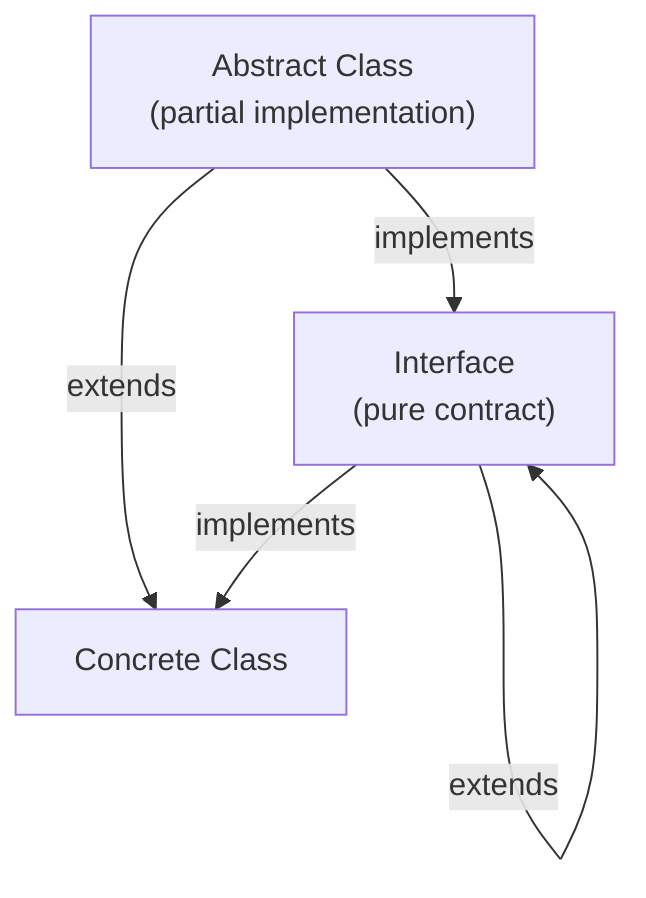

# Interfaces and Abstract Classes

[← Back to README](../README.md)

---

Both interfaces and abstract classes define contracts that concrete classes must fulfil. They look similar but serve different purposes — understanding the distinction is fundamental to good Java design.



---

## Interfaces

An interface declares **what** a type can do — it is a pure contract. A class can implement any number of interfaces.

```java
public interface Drawable {
    void draw();                         // abstract by default
    default String describe() {          // default method — has a body
        return "I am drawable";
    }
    static Drawable noOp() {             // static factory method
        return () -> {};
    }
}

public interface Resizable {
    void resize(double factor);
}

// a class can implement multiple interfaces
public class Circle implements Drawable, Resizable {
    private double radius;

    public Circle(double radius) { this.radius = radius; }

    @Override public void draw()                   { System.out.println("Drawing circle r=" + radius); }
    @Override public void resize(double factor)    { radius *= factor; }
}
```

### Interface modifiers summary

| Member | Keyword | Notes |
|--------|---------|-------|
| Abstract method | (none) | Must be implemented by concrete class |
| Default method | `default` | Optional to override; provides fallback behaviour |
| Static method | `static` | Called on the interface type, not the instance |
| Constant | `public static final` | Implicitly, no need to write it |
| Private method (Java 9+) | `private` | Helper shared by default/static methods |

```java
public interface Validator<T> {
    boolean validate(T value);

    // default — optional override
    default boolean isValid(T value) {
        return validate(value);
    }

    // private helper shared by default methods (Java 9+)
    private void log(String msg) {
        System.out.println("[Validator] " + msg);
    }

    // static factory
    static <T> Validator<T> of(java.util.function.Predicate<T> predicate) {
        return predicate::test;
    }
}
```

### Functional interfaces

An interface with exactly **one abstract method** is a functional interface — it can be used as a lambda target.

```java
@FunctionalInterface
public interface Transformer<T, R> {
    R transform(T input);
    // may also have default and static methods
}

Transformer<String, Integer> length = String::length;
System.out.println(length.transform("hello"));  // 5
```

---

## Abstract Classes

An abstract class provides **partial implementation** — it can have fields, constructors, concrete methods, and abstract methods. A class can extend only **one** abstract class.

```java
public abstract class Shape {
    private final String colour;

    protected Shape(String colour) {        // constructor — can't instantiate abstract class directly
        this.colour = colour;
    }

    // abstract — subclasses must implement
    public abstract double area();
    public abstract double perimeter();

    // concrete — shared implementation
    public String describe() {
        return "%s(colour=%s, area=%.2f)".formatted(getClass().getSimpleName(), colour, area());
    }

    public String getColour() { return colour; }
}

public class Rectangle extends Shape {
    private final double width, height;

    public Rectangle(String colour, double width, double height) {
        super(colour);
        this.width  = width;
        this.height = height;
    }

    @Override public double area()      { return width * height; }
    @Override public double perimeter() { return 2 * (width + height); }
}

public class Circle extends Shape {
    private final double radius;

    public Circle(String colour, double radius) {
        super(colour);
        this.radius = radius;
    }

    @Override public double area()      { return Math.PI * radius * radius; }
    @Override public double perimeter() { return 2 * Math.PI * radius; }
}
```

Usage:

```java
List<Shape> shapes = List.of(
    new Rectangle("red", 4, 5),
    new Circle("blue", 3)
);

shapes.forEach(s -> System.out.println(s.describe()));
// Rectangle(colour=red, area=20.00)
// Circle(colour=blue, area=28.27)
```

---

## Interface vs Abstract Class — When to Use Which

| | Interface | Abstract Class |
|--|-----------|---------------|
| Multiple inheritance | Yes — a class can implement many | No — only one superclass |
| Fields / state | No instance fields | Yes — can hold state |
| Constructor | No | Yes |
| Default behaviour | `default` methods (limited) | Full concrete methods |
| When to choose | Define a capability/role a type can play | Share code among closely related types |

**Rule of thumb:**
- "Can do" → interface (`Runnable`, `Comparable`, `Serializable`)
- "Is a" with shared code → abstract class (`AbstractList`, `HttpServlet`)

---

## Combining Both

Real-world design often uses both together: an interface for the public contract and an abstract class for a partial implementation.

```java
// contract
public interface Repository<T, ID> {
    T       findById(ID id);
    List<T> findAll();
    void    save(T entity);
    void    delete(ID id);
}

// shared logic — concrete methods and error handling
public abstract class AbstractRepository<T, ID> implements Repository<T, ID> {

    protected final Map<ID, T> store = new java.util.LinkedHashMap<>();

    @Override
    public List<T> findAll() {
        return List.copyOf(store.values());
    }

    @Override
    public void delete(ID id) {
        if (!store.containsKey(id)) {
            throw new java.util.NoSuchElementException("No entity with id " + id);
        }
        store.remove(id);
    }
    // findById and save are still abstract — subclass provides them
}

// concrete implementation
public class InMemoryUserRepository extends AbstractRepository<User, Integer> {

    @Override
    public User findById(Integer id) { return store.get(id); }

    @Override
    public void save(User user) { store.put(user.id(), user); }
}
```

---

## Sealed Interfaces (Java 17+)

A sealed interface restricts which classes may implement it — perfect for modelling closed sets of variants.

```java
public sealed interface Shape permits Circle, Rectangle, Triangle {}

public record Circle(double radius)              implements Shape {}
public record Rectangle(double width, double h)  implements Shape {}
public record Triangle(double base, double h)    implements Shape {}

// exhaustive pattern matching — no default needed
double area = switch (shape) {
    case Circle    c -> Math.PI * c.radius() * c.radius();
    case Rectangle r -> r.width() * r.h();
    case Triangle  t -> 0.5 * t.base() * t.h();
};
```

---

## Interface Segregation

Prefer many small, focused interfaces over one large one (the Interface Segregation Principle).

```java
// too broad — a read-only view is forced to implement write methods
public interface UserRepository {
    User findById(int id);
    void save(User user);
    void delete(int id);
}

// better — split by capability
public interface UserReader  { User findById(int id); }
public interface UserWriter  { void save(User user); void delete(int id); }
public interface UserRepository extends UserReader, UserWriter {}

// a read-only cache only needs to implement UserReader
public class CachedUserReader implements UserReader { ... }
```

---

## Summary

| Concept | Notes |
|---------|-------|
| Interface | Contract — what a type can do; supports multiple implementation |
| `default` method | Gives an interface a fallback implementation |
| `static` method | Utility / factory on the interface itself |
| Abstract class | Partial implementation — shares code among related types |
| `abstract` method | Forces subclasses to provide the implementation |
| Functional interface | One abstract method — can be used as a lambda |
| Sealed interface | Restricts implementors; pairs with switch pattern matching |
| Combine both | Interface for API contract, abstract class for shared code |

---

[← Back to README](../README.md)
