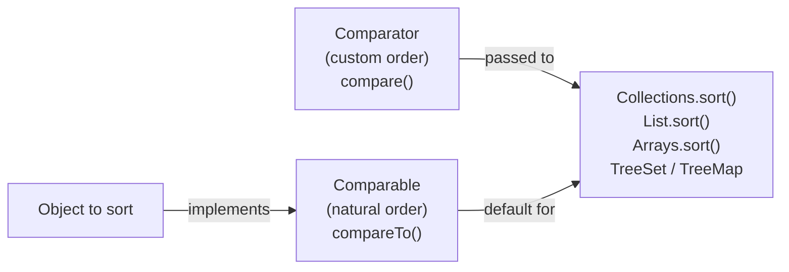

# Comparable and Comparator

[← Back to README](../README.md)

---

Java provides two interfaces for sorting objects: `Comparable` for **natural ordering** (defined on the class itself) and `Comparator` for **custom ordering** (defined externally, ad hoc).



---

## Comparable — Natural Ordering

Implement `Comparable<T>` on a class to define its default sort order. Collections and arrays can then sort it without any extra argument.

```java
public class Employee implements Comparable<Employee> {
    private final String name;
    private final double salary;
    private final int    age;

    public Employee(String name, double salary, int age) {
        this.name   = name;
        this.salary = salary;
        this.age    = age;
    }

    // natural order: alphabetical by name
    @Override
    public int compareTo(Employee other) {
        return this.name.compareTo(other.name);
    }

    // getters
    public String getName()   { return name; }
    public double getSalary() { return salary; }
    public int    getAge()    { return age; }

    @Override
    public String toString() {
        return "%s (age=%d, salary=%.0f)".formatted(name, age, salary);
    }
}
```

```java
List<Employee> employees = new ArrayList<>(List.of(
    new Employee("Charlie", 55000, 35),
    new Employee("Alice",   70000, 28),
    new Employee("Bob",     60000, 42)
));

Collections.sort(employees);  // uses compareTo — alphabetical
System.out.println(employees);
// [Alice (age=28, salary=70000), Bob (age=42, salary=60000), Charlie (age=35, salary=55000)]
```

### compareTo contract

`compareTo` must return:
- **negative** if `this` is less than `other`
- **zero** if `this` equals `other`
- **positive** if `this` is greater than `other`

```java
// comparing numbers safely — avoid subtraction (can overflow)
@Override
public int compareTo(Employee other) {
    return Integer.compare(this.age, other.age);     // safe
    // NOT: return this.age - other.age;             // overflow risk
}
```

---

## Comparator — Custom Ordering

`Comparator<T>` defines an ordering independently of the class. Multiple comparators can coexist for the same type.

### Old style (anonymous class)

```java
Comparator<Employee> bySalary = new Comparator<Employee>() {
    @Override
    public int compare(Employee a, Employee b) {
        return Double.compare(a.getSalary(), b.getSalary());
    }
};
```

### Lambda

```java
Comparator<Employee> bySalary = (a, b) -> Double.compare(a.getSalary(), b.getSalary());
```

### Comparator.comparing (preferred)

```java
Comparator<Employee> byName   = Comparator.comparing(Employee::getName);
Comparator<Employee> bySalary = Comparator.comparingDouble(Employee::getSalary);
Comparator<Employee> byAge    = Comparator.comparingInt(Employee::getAge);
```

---

## Chaining Comparators

```java
// primary: salary descending; secondary: name ascending
Comparator<Employee> comp = Comparator
    .comparingDouble(Employee::getSalary).reversed()
    .thenComparing(Employee::getName);

employees.sort(comp);
employees.forEach(System.out::println);
// Alice (age=28, salary=70000)
// Bob (age=42, salary=60000)
// Charlie (age=35, salary=55000)
```

### thenComparing chain example

```java
employees.sort(
    Comparator.comparingInt(Employee::getAge)       // first by age ascending
              .thenComparing(Employee::getName)      // then by name alphabetically
              .thenComparingDouble(Employee::getSalary)  // then by salary
);
```

---

## Null Handling

```java
// null-safe — nulls first
Comparator<Employee> nullsFirst = Comparator.nullsFirst(
    Comparator.comparing(Employee::getName));

// null-safe — nulls last
Comparator<Employee> nullsLast = Comparator.nullsLast(
    Comparator.comparing(Employee::getName));
```

---

## Sorting with Streams

```java
List<Employee> sorted = employees.stream()
    .sorted(Comparator.comparingDouble(Employee::getSalary).reversed())
    .toList();

// find min / max
Optional<Employee> highest = employees.stream()
    .max(Comparator.comparingDouble(Employee::getSalary));

Optional<Employee> youngest = employees.stream()
    .min(Comparator.comparingInt(Employee::getAge));
```

---

## TreeSet and TreeMap

`TreeSet` and `TreeMap` maintain sorted order — they use `compareTo` by default or a provided `Comparator`.

```java
// natural order (requires Comparable)
TreeSet<Employee> byName = new TreeSet<>(employees);

// custom order
TreeSet<Employee> bySalary = new TreeSet<>(
    Comparator.comparingDouble(Employee::getSalary));
bySalary.addAll(employees);

// TreeMap — sorted by key
TreeMap<String, Employee> byNameMap = new TreeMap<>();
employees.forEach(e -> byNameMap.put(e.getName(), e));
byNameMap.forEach((k, v) -> System.out.println(k + " → " + v));
```

---

## Comparable on Records

Records implement `equals`, `hashCode`, and `toString` automatically — you just add `compareTo`.

```java
public record Product(String name, double price) implements Comparable<Product> {
    @Override
    public int compareTo(Product other) {
        return Double.compare(this.price, other.price);
    }
}

List<Product> products = new ArrayList<>(List.of(
    new Product("Laptop", 999.99),
    new Product("Mouse",   29.99),
    new Product("Monitor", 399.99)
));

Collections.sort(products);
// [Product[name=Mouse, price=29.99], Product[name=Monitor, price=399.99], Product[name=Laptop, price=999.99]]
```

---

## Practical Example — Multi-field Sort

```java
record Student(String name, int grade, double gpa) {}

List<Student> students = List.of(
    new Student("Alice", 12, 3.9),
    new Student("Bob",   11, 3.9),
    new Student("Carol", 12, 3.7),
    new Student("Dave",  11, 3.5)
);

List<Student> sorted = students.stream()
    .sorted(
        Comparator.comparingInt(Student::grade).reversed()  // grade descending
                  .thenComparingDouble(Student::gpa).reversed()  // gpa descending
                  .thenComparing(Student::name)               // name ascending
    )
    .toList();

sorted.forEach(System.out::println);
// Student[name=Alice, grade=12, gpa=3.9]
// Student[name=Carol, grade=12, gpa=3.7]
// Student[name=Bob,   grade=11, gpa=3.9]
// Student[name=Dave,  grade=11, gpa=3.5]
```

---

## Summary

| | `Comparable` | `Comparator` |
|--|-------------|-------------|
| Where defined | Inside the class | Outside the class (or inline) |
| Method | `compareTo(T other)` | `compare(T a, T b)` |
| How many orderings | One natural order | Many — create as needed |
| Used by | `Collections.sort()`, `TreeSet`, `TreeMap` by default | Passed as argument |
| Java 8+ builder | — | `Comparator.comparing()`, `thenComparing()`, `reversed()` |

**Choose `Comparable`** when there is one obvious natural ordering (e.g., dates, numbers, names).  
**Choose `Comparator`** when you need multiple orderings or can't modify the class.

---

[← Back to README](../README.md)
