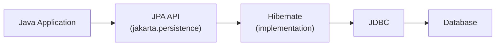

# JPA and Hibernate

[← Back to README](../README.md)

---

**JPA** (Jakarta Persistence API) is the standard Java specification for ORM — mapping Java objects to relational database tables. **Hibernate** is the most widely used JPA implementation. You write Java classes; JPA handles the SQL.



---

## Maven Dependencies

```xml
<!-- Hibernate ORM with JPA support -->
<dependency>
    <groupId>org.hibernate.orm</groupId>
    <artifactId>hibernate-core</artifactId>
    <version>6.5.2.Final</version>
</dependency>

<!-- PostgreSQL driver -->
<dependency>
    <groupId>org.postgresql</groupId>
    <artifactId>postgresql</artifactId>
    <version>42.7.3</version>
</dependency>

<!-- H2 for testing -->
<dependency>
    <groupId>com.h2database</groupId>
    <artifactId>h2</artifactId>
    <version>2.2.224</version>
    <scope>test</scope>
</dependency>
```

---

## persistence.xml

Lives in `src/main/resources/META-INF/persistence.xml`.

```xml
<persistence xmlns="https://jakarta.ee/xml/ns/persistence" version="3.0">

    <persistence-unit name="myapp" transaction-type="RESOURCE_LOCAL">
        <provider>org.hibernate.jpa.HibernatePersistenceProvider</provider>

        <properties>
            <property name="jakarta.persistence.jdbc.url"      value="jdbc:postgresql://localhost:5432/mydb"/>
            <property name="jakarta.persistence.jdbc.user"     value="alice"/>
            <property name="jakarta.persistence.jdbc.password" value="secret"/>

            <!-- create/drop on startup (dev); use validate/none in production -->
            <property name="jakarta.persistence.schema-generation.database.action" value="drop-and-create"/>

            <property name="hibernate.show_sql"      value="true"/>
            <property name="hibernate.format_sql"    value="true"/>
            <property name="hibernate.dialect"       value="org.hibernate.dialect.PostgreSQLDialect"/>
        </properties>
    </persistence-unit>

</persistence>
```

---

## Entity Mapping

```java
import jakarta.persistence.*;

@Entity
@Table(name = "users")
public class User {

    @Id
    @GeneratedValue(strategy = GenerationType.IDENTITY)  // auto-increment
    private Long id;

    @Column(name = "first_name", nullable = false, length = 100)
    private String firstName;

    @Column(unique = true, nullable = false)
    private String email;

    @Column
    private int age;

    // JPA requires a no-arg constructor
    protected User() {}

    public User(String firstName, String email, int age) {
        this.firstName = firstName;
        this.email     = email;
        this.age       = age;
    }

    // getters and setters
    public Long   getId()        { return id; }
    public String getFirstName() { return firstName; }
    public String getEmail()     { return email; }
    public int    getAge()       { return age; }

    public void setFirstName(String firstName) { this.firstName = firstName; }
    public void setEmail(String email)         { this.email = email; }
    public void setAge(int age)                { this.age = age; }

    @Override
    public String toString() {
        return "User{id=%d, name='%s', email='%s'}".formatted(id, firstName, email);
    }
}
```

---

## EntityManager — CRUD Operations

```java
EntityManagerFactory emf = Persistence.createEntityManagerFactory("myapp");
EntityManager em = emf.createEntityManager();

// CREATE
em.getTransaction().begin();
User user = new User("Alice", "alice@example.com", 30);
em.persist(user);
em.getTransaction().commit();
System.out.println("Saved: " + user.getId());  // ID is now set

// READ by primary key
User found = em.find(User.class, 1L);
System.out.println(found);

// UPDATE
em.getTransaction().begin();
found.setAge(31);  // just mutate — Hibernate detects the change
em.getTransaction().commit();

// DELETE
em.getTransaction().begin();
em.remove(found);
em.getTransaction().commit();

// close
em.close();
emf.close();
```

---

## JPQL — Queries

JPQL (Jakarta Persistence Query Language) operates on entity classes and fields, not tables and columns.

```java
// find all users
List<User> all = em.createQuery("SELECT u FROM User u ORDER BY u.firstName", User.class)
    .getResultList();

// with parameter
List<User> older = em.createQuery(
        "SELECT u FROM User u WHERE u.age > :minAge ORDER BY u.age", User.class)
    .setParameter("minAge", 25)
    .getResultList();

// single result
User alice = em.createQuery(
        "SELECT u FROM User u WHERE u.email = :email", User.class)
    .setParameter("email", "alice@example.com")
    .getSingleResult();

// aggregate
Long count = em.createQuery("SELECT COUNT(u) FROM User u", Long.class)
    .getSingleResult();

// update in bulk
em.getTransaction().begin();
int updated = em.createQuery("UPDATE User u SET u.age = u.age + 1 WHERE u.age < 30")
    .executeUpdate();
em.getTransaction().commit();
```

---

## Relationships

### @ManyToOne / @OneToMany

```java
@Entity
public class Order {
    @Id @GeneratedValue(strategy = GenerationType.IDENTITY)
    private Long id;

    // many orders → one user
    @ManyToOne(fetch = FetchType.LAZY)
    @JoinColumn(name = "user_id", nullable = false)
    private User user;

    private double total;
    // ...
}

// add bidirectional side to User:
@OneToMany(mappedBy = "user", cascade = CascadeType.ALL, orphanRemoval = true)
private List<Order> orders = new ArrayList<>();
```

### @ManyToMany

```java
@Entity
public class Student {
    @Id @GeneratedValue(strategy = GenerationType.IDENTITY)
    private Long id;
    private String name;

    @ManyToMany
    @JoinTable(
        name = "student_course",
        joinColumns        = @JoinColumn(name = "student_id"),
        inverseJoinColumns = @JoinColumn(name = "course_id")
    )
    private Set<Course> courses = new HashSet<>();
}

@Entity
public class Course {
    @Id @GeneratedValue(strategy = GenerationType.IDENTITY)
    private Long id;
    private String title;

    @ManyToMany(mappedBy = "courses")
    private Set<Student> students = new HashSet<>();
}
```

---

## Fetch Types

| Strategy | Loads relationship | When |
|----------|--------------------|------|
| `LAZY` | On first access | Default for collections — prefer this |
| `EAGER` | With the parent query | Default for `@ManyToOne` — can cause N+1 |

```java
// EAGER causes N+1 — one query for orders, then one per order for user
@ManyToOne(fetch = FetchType.EAGER)  // avoid unless you always need it

// LAZY — load on demand
@ManyToOne(fetch = FetchType.LAZY)
```

### Solve N+1 with JOIN FETCH

```java
// fetches User and all Orders in a single SQL JOIN
List<User> users = em.createQuery(
    "SELECT DISTINCT u FROM User u JOIN FETCH u.orders", User.class)
    .getResultList();
```

---

## Cascade Types

```java
@OneToMany(mappedBy = "user", cascade = CascadeType.ALL, orphanRemoval = true)
private List<Order> orders = new ArrayList<>();
```

| CascadeType | Effect |
|-------------|--------|
| `PERSIST` | Persist children when parent is persisted |
| `MERGE` | Merge children when parent is merged |
| `REMOVE` | Delete children when parent is deleted |
| `REFRESH` | Refresh children when parent is refreshed |
| `ALL` | All of the above |

---

## Named Queries

```java
@Entity
@NamedQuery(
    name  = "User.findByEmail",
    query = "SELECT u FROM User u WHERE u.email = :email"
)
public class User { ... }

// use it
User u = em.createNamedQuery("User.findByEmail", User.class)
    .setParameter("email", "alice@example.com")
    .getSingleResult();
```

---

## Repository Pattern with JPA

```java
public class UserRepository {
    private final EntityManagerFactory emf;

    public UserRepository(EntityManagerFactory emf) { this.emf = emf; }

    public User save(User user) {
        EntityManager em = emf.createEntityManager();
        try {
            em.getTransaction().begin();
            if (user.getId() == null) {
                em.persist(user);
            } else {
                user = em.merge(user);
            }
            em.getTransaction().commit();
            return user;
        } catch (Exception e) {
            em.getTransaction().rollback();
            throw e;
        } finally {
            em.close();
        }
    }

    public Optional<User> findById(Long id) {
        EntityManager em = emf.createEntityManager();
        try {
            return Optional.ofNullable(em.find(User.class, id));
        } finally {
            em.close();
        }
    }

    public List<User> findAll() {
        EntityManager em = emf.createEntityManager();
        try {
            return em.createQuery("SELECT u FROM User u", User.class).getResultList();
        } finally {
            em.close();
        }
    }

    public void delete(Long id) {
        EntityManager em = emf.createEntityManager();
        try {
            em.getTransaction().begin();
            User user = em.find(User.class, id);
            if (user != null) em.remove(user);
            em.getTransaction().commit();
        } catch (Exception e) {
            em.getTransaction().rollback();
            throw e;
        } finally {
            em.close();
        }
    }
}
```

---

## Hibernate-Specific Annotations

```java
// natural ID — business key alongside surrogate PK
@NaturalId
@Column(unique = true, nullable = false)
private String email;

// optimistic locking — prevents lost updates
@Version
private int version;

// soft delete
@Where(clause = "deleted = false")
@SQLDelete(sql = "UPDATE users SET deleted = true WHERE id = ?")
private boolean deleted = false;
```

---

## JPA Summary

| Concept | Annotation / Class |
|---------|-------------------|
| Entity class | `@Entity`, `@Table` |
| Primary key | `@Id`, `@GeneratedValue` |
| Column mapping | `@Column` |
| Many-to-one | `@ManyToOne`, `@JoinColumn` |
| One-to-many | `@OneToMany(mappedBy=...)` |
| Many-to-many | `@ManyToMany`, `@JoinTable` |
| Fetch strategy | `FetchType.LAZY` / `EAGER` |
| Cascade | `CascadeType.ALL` / specific types |
| CRUD | `em.persist()`, `em.find()`, `em.merge()`, `em.remove()` |
| Query language | JPQL — entity-centric, not table-centric |
| N+1 fix | `JOIN FETCH` in JPQL |
| Optimistic locking | `@Version` |

---

[← Back to README](../README.md)
