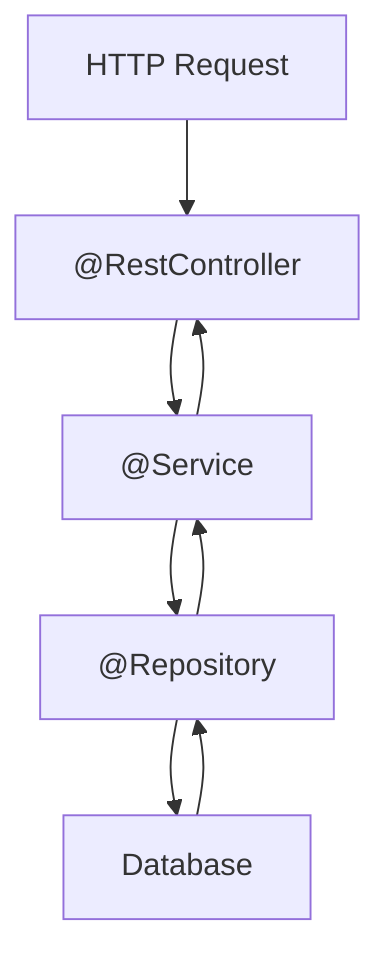

# Spring Boot

[← Back to README](../README.md)

---

**Spring Boot** is the dominant Java application framework. It builds on the Spring Framework, adding auto-configuration and an embedded server so you can run a production-ready application from a plain `main` method — no WAR files or app-server setup required.



---

## Project Setup

The fastest way to bootstrap a project: **[start.spring.io](https://start.spring.io)** — choose Maven/Gradle, Java version, and add dependencies (Spring Web, Spring Data JPA, PostgreSQL Driver, etc.). Download and unzip.

### Core Maven dependencies

```xml
<parent>
    <groupId>org.springframework.boot</groupId>
    <artifactId>spring-boot-starter-parent</artifactId>
    <version>3.3.0</version>
</parent>

<dependencies>
    <!-- web: embedded Tomcat + Spring MVC -->
    <dependency>
        <groupId>org.springframework.boot</groupId>
        <artifactId>spring-boot-starter-web</artifactId>
    </dependency>

    <!-- JPA + Hibernate -->
    <dependency>
        <groupId>org.springframework.boot</groupId>
        <artifactId>spring-boot-starter-data-jpa</artifactId>
    </dependency>

    <!-- PostgreSQL -->
    <dependency>
        <groupId>org.postgresql</groupId>
        <artifactId>postgresql</artifactId>
        <scope>runtime</scope>
    </dependency>

    <!-- validation -->
    <dependency>
        <groupId>org.springframework.boot</groupId>
        <artifactId>spring-boot-starter-validation</artifactId>
    </dependency>

    <!-- testing -->
    <dependency>
        <groupId>org.springframework.boot</groupId>
        <artifactId>spring-boot-starter-test</artifactId>
        <scope>test</scope>
    </dependency>
</dependencies>
```

---

## The Entry Point

```java
package com.example.demo;

import org.springframework.boot.SpringApplication;
import org.springframework.boot.autoconfigure.SpringBootApplication;

@SpringBootApplication  // = @Configuration + @EnableAutoConfiguration + @ComponentScan
public class DemoApplication {
    public static void main(String[] args) {
        SpringApplication.run(DemoApplication.class, args);
    }
}
```

Run with `mvn spring-boot:run` or as a plain Java main class. Spring starts on port 8080 by default.

---

## application.properties

```properties
# server
server.port=8080

# datasource
spring.datasource.url=jdbc:postgresql://localhost:5432/mydb
spring.datasource.username=alice
spring.datasource.password=secret

# JPA
spring.jpa.hibernate.ddl-auto=update
spring.jpa.show-sql=true

# logging
logging.level.com.example=DEBUG
```

Or use `application.yml`:

```yaml
server:
  port: 8080

spring:
  datasource:
    url: jdbc:postgresql://localhost:5432/mydb
    username: alice
    password: secret
  jpa:
    hibernate:
      ddl-auto: update
    show-sql: true
```

---

## Dependency Injection

Spring manages beans — objects created and wired by the framework. You declare what you need; Spring provides it.

### Stereotypes

| Annotation | Use |
|-----------|-----|
| `@Component` | Generic Spring-managed bean |
| `@Service` | Business logic layer |
| `@Repository` | Data access layer (also translates exceptions) |
| `@RestController` | HTTP controller that returns data (JSON by default) |
| `@Controller` | HTTP controller that returns views (Thymeleaf, etc.) |
| `@Configuration` | Bean factory class |

### Constructor injection (preferred)

```java
@Service
public class UserService {
    private final UserRepository userRepository;

    // Spring injects UserRepository automatically
    public UserService(UserRepository userRepository) {
        this.userRepository = userRepository;
    }

    public List<User> getAllUsers() {
        return userRepository.findAll();
    }
}
```

---

## Entity

```java
import jakarta.persistence.*;

@Entity
@Table(name = "users")
public class User {
    @Id
    @GeneratedValue(strategy = GenerationType.IDENTITY)
    private Long id;

    @Column(nullable = false)
    private String name;

    @Column(unique = true, nullable = false)
    private String email;

    protected User() {}
    public User(String name, String email) { this.name = name; this.email = email; }

    public Long   getId()    { return id; }
    public String getName()  { return name; }
    public String getEmail() { return email; }
    public void setName(String name)   { this.name = name; }
    public void setEmail(String email) { this.email = email; }
}
```

---

## Spring Data JPA Repository

Spring Data generates all the boilerplate SQL for you.

```java
import org.springframework.data.jpa.repository.JpaRepository;
import org.springframework.data.jpa.repository.Query;
import java.util.List;
import java.util.Optional;

public interface UserRepository extends JpaRepository<User, Long> {

    // Spring generates: SELECT * FROM users WHERE email = ?
    Optional<User> findByEmail(String email);

    // generated: SELECT * FROM users WHERE name LIKE %?% ORDER BY name
    List<User> findByNameContainingIgnoreCaseOrderByName(String name);

    // custom JPQL
    @Query("SELECT u FROM User u WHERE u.email LIKE %:domain")
    List<User> findByEmailDomain(String domain);

    // native SQL
    @Query(value = "SELECT * FROM users WHERE age > ?1", nativeQuery = true)
    List<User> findOlderThan(int age);
}
```

`JpaRepository` already provides: `findAll()`, `findById()`, `save()`, `delete()`, `count()`, pagination, sorting.

---

## REST Controller

```java
import org.springframework.http.*;
import org.springframework.web.bind.annotation.*;
import java.util.List;

@RestController
@RequestMapping("/api/users")
public class UserController {

    private final UserService userService;

    public UserController(UserService userService) {
        this.userService = userService;
    }

    @GetMapping
    public List<User> getAll() {
        return userService.getAllUsers();
    }

    @GetMapping("/{id}")
    public ResponseEntity<User> getById(@PathVariable Long id) {
        return userService.findById(id)
            .map(ResponseEntity::ok)
            .orElse(ResponseEntity.notFound().build());
    }

    @PostMapping
    public ResponseEntity<User> create(@RequestBody @Valid CreateUserRequest request) {
        User saved = userService.createUser(request.name(), request.email());
        return ResponseEntity.status(HttpStatus.CREATED).body(saved);
    }

    @PutMapping("/{id}")
    public ResponseEntity<User> update(@PathVariable Long id,
                                       @RequestBody @Valid CreateUserRequest request) {
        return userService.update(id, request.name(), request.email())
            .map(ResponseEntity::ok)
            .orElse(ResponseEntity.notFound().build());
    }

    @DeleteMapping("/{id}")
    public ResponseEntity<Void> delete(@PathVariable Long id) {
        userService.delete(id);
        return ResponseEntity.noContent().build();
    }
}
```

### Request / Response DTOs

```java
public record CreateUserRequest(
    @NotBlank String name,
    @Email    String email
) {}
```

---

## Service Layer

```java
import org.springframework.stereotype.Service;
import org.springframework.transaction.annotation.Transactional;
import java.util.*;

@Service
@Transactional(readOnly = true)  // default to read-only; override for writes
public class UserService {

    private final UserRepository userRepository;

    public UserService(UserRepository userRepository) {
        this.userRepository = userRepository;
    }

    public List<User> getAllUsers() {
        return userRepository.findAll();
    }

    public Optional<User> findById(Long id) {
        return userRepository.findById(id);
    }

    @Transactional  // write transaction
    public User createUser(String name, String email) {
        User user = new User(name, email);
        return userRepository.save(user);
    }

    @Transactional
    public Optional<User> update(Long id, String name, String email) {
        return userRepository.findById(id).map(user -> {
            user.setName(name);
            user.setEmail(email);
            return userRepository.save(user);
        });
    }

    @Transactional
    public void delete(Long id) {
        userRepository.deleteById(id);
    }
}
```

---

## Validation

Add `spring-boot-starter-validation` and annotate fields:

```java
public record CreateUserRequest(
    @NotBlank(message = "Name is required")
    String name,

    @Email(message = "Invalid email")
    @NotBlank
    String email,

    @Min(0) @Max(150)
    int age
) {}
```

In the controller use `@Valid` on the `@RequestBody` parameter — Spring returns 400 automatically if validation fails.

### Global error handler

```java
@RestControllerAdvice
public class GlobalExceptionHandler {

    @ExceptionHandler(MethodArgumentNotValidException.class)
    public ResponseEntity<Map<String, String>> handleValidation(MethodArgumentNotValidException ex) {
        Map<String, String> errors = new LinkedHashMap<>();
        ex.getBindingResult().getFieldErrors()
          .forEach(err -> errors.put(err.getField(), err.getDefaultMessage()));
        return ResponseEntity.badRequest().body(errors);
    }

    @ExceptionHandler(NoSuchElementException.class)
    public ResponseEntity<String> handleNotFound(NoSuchElementException ex) {
        return ResponseEntity.status(HttpStatus.NOT_FOUND).body(ex.getMessage());
    }
}
```

---

## Configuration Properties

```java
@ConfigurationProperties(prefix = "app")
public record AppProperties(
    String name,
    String version,
    int maxUsers
) {}
```

```properties
app.name=My App
app.version=1.0.0
app.max-users=1000
```

Enable with `@EnableConfigurationProperties(AppProperties.class)` on a `@Configuration` class.

---

## Testing

```java
// unit test — no Spring context
@ExtendWith(MockitoExtension.class)
class UserServiceTest {

    @Mock
    UserRepository userRepository;

    @InjectMocks
    UserService userService;

    @Test
    void findById_returnsUser() {
        User user = new User("Alice", "alice@example.com");
        when(userRepository.findById(1L)).thenReturn(Optional.of(user));

        Optional<User> result = userService.findById(1L);

        assertThat(result).isPresent();
        assertThat(result.get().getName()).isEqualTo("Alice");
    }
}

// integration test — full Spring context with H2
@SpringBootTest
@AutoConfigureMockMvc
class UserControllerTest {

    @Autowired MockMvc mockMvc;
    @Autowired UserRepository userRepository;

    @Test
    void getAll_returnsUsers() throws Exception {
        userRepository.save(new User("Alice", "alice@example.com"));

        mockMvc.perform(get("/api/users"))
               .andExpect(status().isOk())
               .andExpect(jsonPath("$[0].name").value("Alice"));
    }
}
```

---

## Spring Boot Summary

| Concept | Annotation / Class |
|---------|-------------------|
| Application entry point | `@SpringBootApplication` |
| Bean registration | `@Component`, `@Service`, `@Repository` |
| REST controller | `@RestController`, `@RequestMapping` |
| HTTP methods | `@GetMapping`, `@PostMapping`, `@PutMapping`, `@DeleteMapping` |
| Path / query params | `@PathVariable`, `@RequestParam`, `@RequestBody` |
| Configuration | `application.properties` / `.yml` |
| Data access | `JpaRepository` — extend it, Spring generates queries |
| Transactions | `@Transactional` |
| Validation | `@Valid`, `@NotBlank`, `@Email`, `@Min` etc. |
| Error handling | `@RestControllerAdvice`, `@ExceptionHandler` |
| Testing | `@SpringBootTest`, `MockMvc`, `@ExtendWith(MockitoExtension.class)` |

---

[← Back to README](../README.md)
