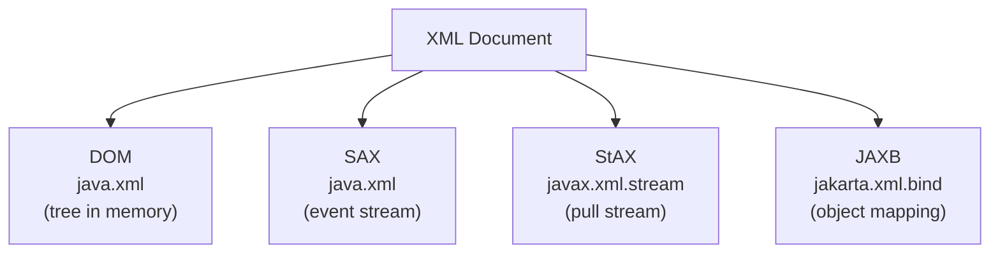

# XML Processing

[← Back to README](../README.md)

---

Java ships with three built-in APIs for reading and writing XML, each suited to different use cases.



| API | Style | Loads whole doc? | Best for |
|-----|-------|-----------------|----------|
| **DOM** | Tree | Yes | Random access, small/medium docs |
| **SAX** | Push events | No | Large docs, read-only |
| **StAX** | Pull stream | No | Large docs, read + write |
| **JAXB** | Object mapping | Yes (via DOM) | Known schema, Java ↔ XML |

---

## Sample XML

```xml
<!-- employees.xml -->
<?xml version="1.0" encoding="UTF-8"?>
<employees>
    <employee id="1">
        <name>Alice</name>
        <department>Engineering</department>
        <salary>70000</salary>
    </employee>
    <employee id="2">
        <name>Bob</name>
        <department>Marketing</department>
        <salary>55000</salary>
    </employee>
</employees>
```

---

## DOM — Document Object Model

DOM parses the entire XML into a tree. Good for small documents where you need random access.

### Reading with DOM

```java
import org.w3c.dom.*;
import javax.xml.parsers.*;
import java.io.File;

DocumentBuilderFactory factory = DocumentBuilderFactory.newInstance();

// disable XXE (always do this)
factory.setFeature("http://apache.org/xml/features/disallow-doctype-decl", true);
factory.setFeature("http://xml.org/sax/features/external-general-entities", false);

DocumentBuilder builder  = factory.newDocumentBuilder();
Document        document = builder.parse(new File("employees.xml"));
document.getDocumentElement().normalize();

NodeList employees = document.getElementsByTagName("employee");

for (int i = 0; i < employees.getLength(); i++) {
    Element emp = (Element) employees.item(i);
    String id     = emp.getAttribute("id");
    String name   = emp.getElementsByTagName("name").item(0).getTextContent();
    String salary = emp.getElementsByTagName("salary").item(0).getTextContent();
    System.out.printf("ID=%s  Name=%-10s  Salary=%s%n", id, name, salary);
}
```

### Writing with DOM

```java
DocumentBuilderFactory factory  = DocumentBuilderFactory.newInstance();
DocumentBuilder        builder  = factory.newDocumentBuilder();
Document               document = builder.newDocument();

Element root = document.createElement("employees");
document.appendChild(root);

Element employee = document.createElement("employee");
employee.setAttribute("id", "3");
root.appendChild(employee);

Element nameEl = document.createElement("name");
nameEl.setTextContent("Carol");
employee.appendChild(nameEl);

// write to file
import javax.xml.transform.*;
import javax.xml.transform.dom.DOMSource;
import javax.xml.transform.stream.StreamResult;

TransformerFactory tf = TransformerFactory.newInstance();
Transformer transformer = tf.newTransformer();
transformer.setOutputProperty(OutputKeys.INDENT, "yes");

transformer.transform(new DOMSource(document), new StreamResult(new File("output.xml")));
```

---

## SAX — Simple API for XML

SAX is event-driven — a parser fires events (`startElement`, `endElement`, `characters`) as it reads through the document. Low memory, but read-only and stateless.

```java
import org.xml.sax.*;
import org.xml.sax.helpers.DefaultHandler;
import javax.xml.parsers.SAXParser;
import javax.xml.parsers.SAXParserFactory;

public class EmployeeHandler extends DefaultHandler {
    private String current;
    private StringBuilder text = new StringBuilder();

    @Override
    public void startElement(String uri, String localName, String qName, Attributes attributes) {
        current = qName;
        text.setLength(0);
        if ("employee".equals(qName)) {
            System.out.println("Employee ID: " + attributes.getValue("id"));
        }
    }

    @Override
    public void characters(char[] ch, int start, int length) {
        text.append(ch, start, length);
    }

    @Override
    public void endElement(String uri, String localName, String qName) {
        switch (qName) {
            case "name"       -> System.out.println("  Name: "   + text.toString().trim());
            case "salary"     -> System.out.println("  Salary: " + text.toString().trim());
            case "department" -> System.out.println("  Dept: "   + text.toString().trim());
        }
    }
}

// use it
SAXParserFactory factory = SAXParserFactory.newInstance();
factory.setFeature("http://apache.org/xml/features/disallow-doctype-decl", true);

SAXParser parser = factory.newSAXParser();
parser.parse(new File("employees.xml"), new EmployeeHandler());
```

---

## StAX — Streaming API for XML

StAX is a pull-based stream — you ask for the next event rather than having it pushed to you. Supports both reading and writing.

### Reading with StAX

```java
import javax.xml.stream.*;
import java.io.FileReader;

XMLInputFactory factory = XMLInputFactory.newInstance();
factory.setProperty(XMLInputFactory.IS_SUPPORTING_EXTERNAL_ENTITIES, false);
factory.setProperty(XMLInputFactory.SUPPORT_DTD, false);

XMLStreamReader reader = factory.createXMLStreamReader(new FileReader("employees.xml"));

while (reader.hasNext()) {
    int event = reader.next();

    if (event == XMLStreamConstants.START_ELEMENT) {
        if ("employee".equals(reader.getLocalName())) {
            System.out.println("ID: " + reader.getAttributeValue(null, "id"));
        }
        if ("name".equals(reader.getLocalName())) {
            System.out.println("  Name: " + reader.getElementText());
        }
    }
}
reader.close();
```

### Writing with StAX

```java
import javax.xml.stream.*;
import java.io.FileWriter;

XMLOutputFactory factory = XMLOutputFactory.newInstance();
XMLStreamWriter  writer  = factory.createXMLStreamWriter(new FileWriter("output.xml"));

writer.writeStartDocument("UTF-8", "1.0");
writer.writeStartElement("employees");

writer.writeStartElement("employee");
writer.writeAttribute("id", "1");

writer.writeStartElement("name");
writer.writeCharacters("Alice");
writer.writeEndElement();

writer.writeEndElement();  // employee
writer.writeEndElement();  // employees
writer.writeEndDocument();
writer.close();
```

---

## JAXB — Java Architecture for XML Binding

JAXB maps XML directly to Java objects using annotations. Best when you have a known schema.

```xml
<!-- pom.xml — JAXB reference implementation -->
<dependency>
    <groupId>com.sun.xml.bind</groupId>
    <artifactId>jaxb-impl</artifactId>
    <version>4.0.5</version>
</dependency>
```

### Annotated classes

```java
import jakarta.xml.bind.annotation.*;
import java.util.List;

@XmlRootElement(name = "employees")
@XmlAccessorType(XmlAccessType.FIELD)
public class Employees {
    @XmlElement(name = "employee")
    private List<Employee> employees;

    public List<Employee> getEmployees() { return employees; }
    public void setEmployees(List<Employee> employees) { this.employees = employees; }
}

@XmlAccessorType(XmlAccessType.FIELD)
public class Employee {
    @XmlAttribute
    private int id;

    @XmlElement
    private String name;

    @XmlElement
    private String department;

    @XmlElement
    private double salary;

    // no-arg constructor required
    public Employee() {}
    public Employee(int id, String name, String department, double salary) {
        this.id = id; this.name = name;
        this.department = department; this.salary = salary;
    }

    // getters / setters ...
    public int getId()           { return id; }
    public String getName()      { return name; }
    public String getDepartment(){ return department; }
    public double getSalary()    { return salary; }
}
```

### Unmarshal (XML → Java)

```java
import jakarta.xml.bind.*;
import java.io.File;

JAXBContext context = JAXBContext.newInstance(Employees.class);
Unmarshaller unmarshaller = context.createUnmarshaller();
Employees employees = (Employees) unmarshaller.unmarshal(new File("employees.xml"));

employees.getEmployees().forEach(e ->
    System.out.printf("%-10s  %.0f%n", e.getName(), e.getSalary()));
```

### Marshal (Java → XML)

```java
JAXBContext context = JAXBContext.newInstance(Employees.class);
Marshaller marshaller = context.createMarshaller();
marshaller.setProperty(Marshaller.JAXB_FORMATTED_OUTPUT, true);

Employees employees = new Employees();
employees.setEmployees(List.of(
    new Employee(1, "Alice", "Engineering", 70000),
    new Employee(2, "Bob",   "Marketing",   55000)
));

marshaller.marshal(employees, new File("output.xml"));
marshaller.marshal(employees, System.out);   // also print to console
```

---

## XPath — Querying XML

XPath lets you query nodes with path expressions.

```java
import javax.xml.xpath.*;
import javax.xml.parsers.*;
import org.w3c.dom.*;

DocumentBuilderFactory dbf = DocumentBuilderFactory.newInstance();
dbf.setFeature("http://apache.org/xml/features/disallow-doctype-decl", true);
Document doc = dbf.newDocumentBuilder().parse(new File("employees.xml"));

XPathFactory xpf   = XPathFactory.newInstance();
XPath        xpath = xpf.newXPath();

// get all names
NodeList names = (NodeList) xpath.evaluate(
    "//employee/name", doc, XPathConstants.NODESET);
for (int i = 0; i < names.getLength(); i++) {
    System.out.println(names.item(i).getTextContent());
}

// get salary of employee with id=1
String salary = (String) xpath.evaluate(
    "//employee[@id='1']/salary", doc, XPathConstants.STRING);
System.out.println("Salary: " + salary);  // 70000
```

---

## XML Processing Summary

| Need | API |
|------|-----|
| Random access, small doc | DOM (`DocumentBuilder`) |
| Stream large read-only doc | SAX (`DefaultHandler`) |
| Stream large doc, read or write | StAX (`XMLStreamReader` / `XMLStreamWriter`) |
| Map XML to Java objects | JAXB (`JAXBContext`, `@XmlRootElement`) |
| Query with path expressions | XPath (`XPathFactory`) |
| XXE security | Always disable external entities on all parsers |

---

[← Back to README](../README.md)
