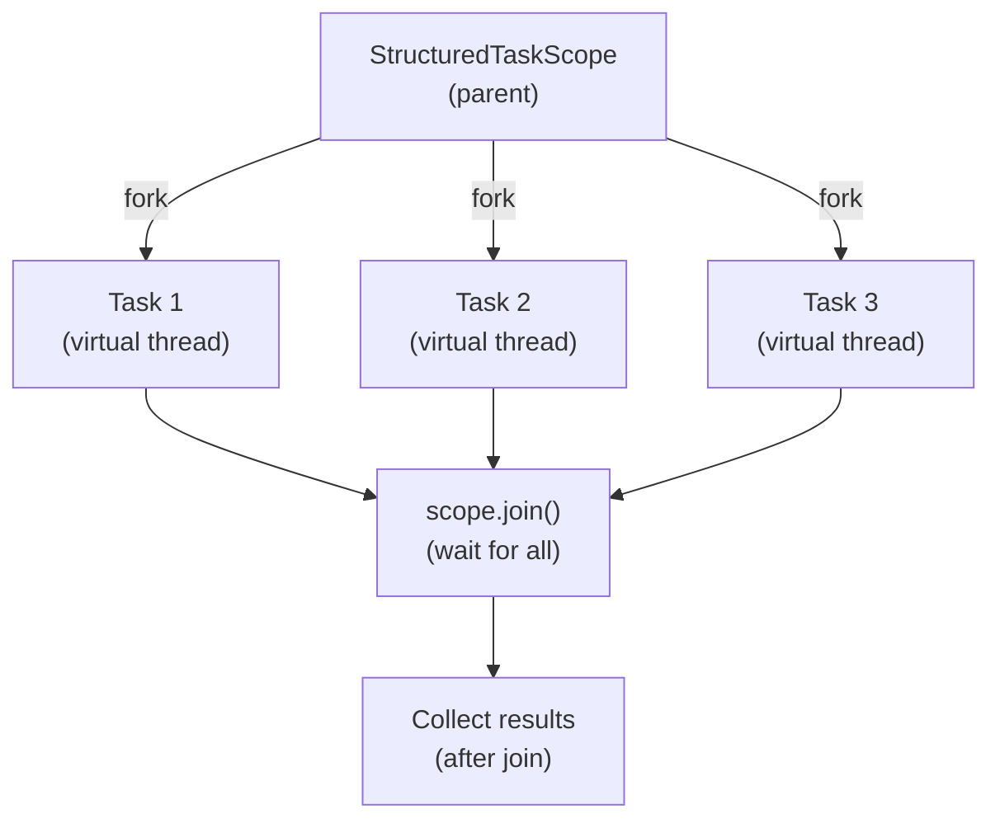

# Structured Concurrency

[← Back to README](../README.md)

---

**Structured concurrency** (Java 21, finalized in Java 24) treats a group of concurrent tasks as a single unit of work — they all start together and all finish together before the enclosing scope exits. This eliminates the common pitfalls of unstructured concurrency: leaked threads, orphaned tasks, and hard-to-handle partial failures.



---

## The Problem with Unstructured Concurrency

```java
// Old style — tasks can outlive their scope, errors are hard to propagate
ExecutorService exec = Executors.newVirtualThreadPerTaskExecutor();
Future<String> userFuture  = exec.submit(() -> fetchUser(id));
Future<String> orderFuture = exec.submit(() -> fetchOrders(id));

String user   = userFuture.get();   // what if orderFuture fails?
String orders = orderFuture.get();  // what if we're cancelled here?
// tasks may keep running even after an exception or cancellation
```

Structured concurrency fixes this: when the scope closes, all forked tasks are cancelled and any exception is propagated cleanly.

---

## StructuredTaskScope

`StructuredTaskScope` is the base class in `java.util.concurrent`. Two ready-made policies cover the common patterns.

### ShutdownOnFailure — cancel all if any fails

```java
import java.util.concurrent.StructuredTaskScope;

record UserDetails(String user, List<String> orders, String payment) {}

UserDetails fetchUserDetails(long userId) throws Exception {
    try (var scope = new StructuredTaskScope.ShutdownOnFailure()) {

        // fork tasks — each runs on its own virtual thread
        StructuredTaskScope.Subtask<String>       userTask    = scope.fork(() -> fetchUser(userId));
        StructuredTaskScope.Subtask<List<String>> ordersTask  = scope.fork(() -> fetchOrders(userId));
        StructuredTaskScope.Subtask<String>       paymentTask = scope.fork(() -> fetchPaymentInfo(userId));

        // wait for all tasks (or for one to fail / scope to be cancelled)
        scope.join()
             .throwIfFailed();  // re-throws if any task threw

        // all succeeded — collect results
        return new UserDetails(
            userTask.get(),
            ordersTask.get(),
            paymentTask.get()
        );
    }  // scope.close() cancels any still-running tasks
}
```

### ShutdownOnSuccess — return the first success, cancel the rest

```java
// Try two mirrors — use whichever responds first
String fetchFast(String resource) throws Exception {
    try (var scope = new StructuredTaskScope.ShutdownOnSuccess<String>()) {

        scope.fork(() -> fetchFrom("https://mirror1.example.com/" + resource));
        scope.fork(() -> fetchFrom("https://mirror2.example.com/" + resource));

        scope.join();
        return scope.result();  // result of the first successful task
    }
}
```

---

## Virtual Threads and Structured Concurrency

Structured concurrency is designed to work with **virtual threads** (Project Loom). Each forked task runs on a virtual thread — lightweight, so forking thousands is fine.

```java
// virtual threads are used automatically inside StructuredTaskScope
try (var scope = new StructuredTaskScope.ShutdownOnFailure()) {
    // each fork() creates a new virtual thread
    var tasks = ids.stream()
        .map(id -> scope.fork(() -> processItem(id)))
        .toList();

    scope.join().throwIfFailed();

    tasks.stream()
         .map(StructuredTaskScope.Subtask::get)
         .forEach(System.out::println);
}
```

---

## Subtask States

A `Subtask` is in one of three states after `join()`:

```java
Subtask.State.SUCCESS   // completed normally — call .get()
Subtask.State.FAILED    // threw an exception — call .exception()
Subtask.State.UNAVAILABLE  // was cancelled (scope shut down early)
```

```java
try (var scope = new StructuredTaskScope<String>()) {
    var task = scope.fork(() -> riskyOperation());
    scope.join();

    switch (task.state()) {
        case SUCCESS     -> System.out.println("Result: " + task.get());
        case FAILED      -> System.err.println("Error: "  + task.exception());
        case UNAVAILABLE -> System.out.println("Cancelled");
    }
}
```

---

## Custom Scope Policy

Extend `StructuredTaskScope` to implement custom logic — for example, collecting all results and all errors.

```java
import java.util.concurrent.*;
import java.util.*;

class AllResultsScope<T> extends StructuredTaskScope<T> {
    private final List<T>         results    = new CopyOnWriteArrayList<>();
    private final List<Throwable> exceptions = new CopyOnWriteArrayList<>();

    @Override
    protected void handleComplete(Subtask<? extends T> subtask) {
        switch (subtask.state()) {
            case SUCCESS -> results.add(subtask.get());
            case FAILED  -> exceptions.add(subtask.exception());
            default      -> {}
        }
    }

    List<T>         results()    { return Collections.unmodifiableList(results); }
    List<Throwable> exceptions() { return Collections.unmodifiableList(exceptions); }
}

// usage
try (var scope = new AllResultsScope<String>()) {
    scope.fork(() -> "result1");
    scope.fork(() -> { throw new RuntimeException("failure"); });
    scope.fork(() -> "result3");

    scope.join();

    System.out.println("Successes: " + scope.results());    // [result1, result3]
    System.out.println("Failures:  " + scope.exceptions()); // [RuntimeException: failure]
}
```

---

## Cancellation and Timeouts

```java
try (var scope = new StructuredTaskScope.ShutdownOnFailure()) {
    scope.fork(() -> slowOperation());
    scope.fork(() -> anotherSlowOperation());

    // cancel everything if not done in 5 seconds
    scope.joinUntil(Instant.now().plusSeconds(5));
    scope.throwIfFailed();

    // process results ...
} catch (TimeoutException e) {
    System.err.println("Timed out — all tasks cancelled");
}
```

---

## Structured vs Unstructured — Side by Side

```java
// UNSTRUCTURED — old CompletableFuture
CompletableFuture<String> f1 = CompletableFuture.supplyAsync(() -> fetchUser(id));
CompletableFuture<String> f2 = CompletableFuture.supplyAsync(() -> fetchOrders(id));
// if f1 fails mid-way, f2 keeps running
// cancellation is manual
// exception handling is messy
String result = f1.thenCombine(f2, (u, o) -> u + o).join();

// STRUCTURED — clean lifecycle
try (var scope = new StructuredTaskScope.ShutdownOnFailure()) {
    var f1 = scope.fork(() -> fetchUser(id));
    var f2 = scope.fork(() -> fetchOrders(id));
    scope.join().throwIfFailed();
    // guaranteed: both finished, or both cancelled, before we leave the try block
    String result = f1.get() + f2.get();
}
```

---

## Enabling Structured Concurrency

Structured concurrency is available in Java 21+ (as a preview, finalized in Java 24).

```bash
# Java 21 — enable preview features
javac --enable-preview --release 21 Main.java
java  --enable-preview Main

# Java 24+ — no flag needed
javac --release 24 Main.java
java Main
```

---

## Structured Concurrency Summary

| Concept | Class / Method |
|---------|---------------|
| Task group | `StructuredTaskScope` |
| Fork a task | `scope.fork(callable)` |
| Wait for all | `scope.join()` |
| Cancel all on first failure | `StructuredTaskScope.ShutdownOnFailure` |
| Return first success | `StructuredTaskScope.ShutdownOnSuccess` |
| Get result | `subtask.get()` (after join) |
| Get error | `subtask.exception()` (after join) |
| Timeout | `scope.joinUntil(Instant)` |
| Propagate failure | `scope.throwIfFailed()` |
| Custom policy | Extend `StructuredTaskScope`, override `handleComplete` |

> Pair structured concurrency with **virtual threads** (see the Concurrency topic) for thousands of cheap, well-scoped concurrent tasks with simple, synchronous-looking code.

---

[← Back to README](../README.md)
