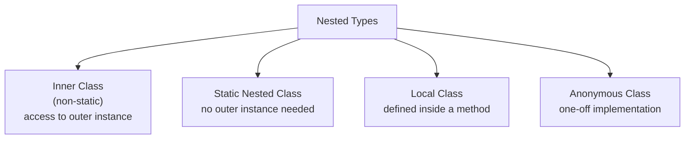

# Inner Classes

[← Back to README](../README.md)

---

Java supports four kinds of nested types — each with different scoping rules and access to the enclosing class.



---

## Inner Class (Non-Static)

An inner class is associated with an **instance** of the outer class — it can access all fields and methods of the outer class, including private ones.

```java
public class BankAccount {
    private String owner;
    private double balance;

    public BankAccount(String owner, double balance) {
        this.owner   = owner;
        this.balance = balance;
    }

    // inner class — has implicit reference to BankAccount instance
    public class Transaction {
        private final double amount;
        private final String type;

        public Transaction(double amount, String type) {
            this.amount = amount;
            this.type   = type;
        }

        public void apply() {
            // direct access to outer class fields
            if ("DEBIT".equals(type)) {
                balance -= amount;
            } else {
                balance += amount;
            }
            System.out.printf("%s: %s %.2f  →  balance=%.2f%n",
                owner, type, amount, balance);
        }
    }

    public Transaction newTransaction(double amount, String type) {
        return new Transaction(amount, type);
    }
}
```

```java
BankAccount account = new BankAccount("Alice", 1000.0);

// inner class must be created through an outer instance
BankAccount.Transaction tx = account.new Transaction(200.0, "DEBIT");
tx.apply();  // Alice: DEBIT 200.00  →  balance=800.00

// or via a factory method
account.newTransaction(500.0, "CREDIT").apply();  // balance=1300.00
```

### Accessing outer `this`

```java
public class Outer {
    private int value = 10;

    class Inner {
        private int value = 20;

        void print() {
            int value = 30;
            System.out.println(value);         // 30 — local
            System.out.println(this.value);    // 20 — inner field
            System.out.println(Outer.this.value); // 10 — outer field
        }
    }
}
```

---

## Static Nested Class

A static nested class has **no** reference to the outer instance — it behaves like a top-level class that happens to be namespaced inside another class.

```java
public class Config {
    private final String host;
    private final int    port;
    private final int    timeout;

    private Config(Builder builder) {
        this.host    = builder.host;
        this.port    = builder.port;
        this.timeout = builder.timeout;
    }

    // static nested — Builder pattern
    public static class Builder {
        private String host    = "localhost";
        private int    port    = 8080;
        private int    timeout = 30;

        public Builder host(String host)       { this.host = host;       return this; }
        public Builder port(int port)          { this.port = port;       return this; }
        public Builder timeout(int timeout)    { this.timeout = timeout; return this; }
        public Config  build()                 { return new Config(this); }
    }

    @Override
    public String toString() {
        return "Config{host='%s', port=%d, timeout=%d}".formatted(host, port, timeout);
    }
}
```

```java
// no outer instance needed
Config config = new Config.Builder()
    .host("example.com")
    .port(443)
    .timeout(60)
    .build();

System.out.println(config);
// Config{host='example.com', port=443, timeout=60}
```

---

## Local Class

A local class is defined **inside a method**. It can access local variables if they are effectively final.

```java
public List<String> formatNames(List<String> names, String prefix) {
    // local class — visible only within this method
    class Formatter {
        String format(String name) {
            return prefix + ": " + name.toUpperCase();  // captures 'prefix'
        }
    }

    Formatter formatter = new Formatter();
    return names.stream()
                .map(formatter::format)
                .toList();
}
```

Local classes are rare in modern Java — lambdas handle most of these cases more concisely.

---

## Anonymous Class

An anonymous class is a one-off implementation of an interface or abstract class, defined and instantiated in a single expression.

```java
// pre-lambda style — still seen with abstract classes
Comparator<String> byLength = new Comparator<String>() {
    @Override
    public int compare(String a, String b) {
        return Integer.compare(a.length(), b.length());
    }
};

List<String> words = new ArrayList<>(List.of("banana", "fig", "apple", "kiwi"));
words.sort(byLength);
System.out.println(words);  // [fig, fig, kiwi, apple, banana]
```

### Anonymous class vs lambda

```java
// interface with one abstract method → prefer lambda
Comparator<String> lambda = Comparator.comparingInt(String::length);

// abstract class or interface with multiple methods → anonymous class
Runnable withState = new Runnable() {
    private int count = 0;   // anonymous classes can have fields
    @Override public void run() { System.out.println("Run #" + ++count); }
};
withState.run();  // Run #1
withState.run();  // Run #2
```

---

## Common Patterns

### Iterator via inner class

```java
public class NumberRange implements Iterable<Integer> {
    private final int start, end;

    public NumberRange(int start, int end) {
        this.start = start;
        this.end   = end;
    }

    @Override
    public Iterator<Integer> iterator() {
        return new Iterator<>() {         // anonymous class
            private int current = start;

            @Override public boolean hasNext() { return current <= end; }
            @Override public Integer next()    { return current++; }
        };
    }
}

for (int n : new NumberRange(1, 5)) {
    System.out.print(n + " ");  // 1 2 3 4 5
}
```

### Event listener (Swing / JavaFX style)

```java
button.addActionListener(new ActionListener() {
    @Override
    public void actionPerformed(ActionEvent e) {
        System.out.println("Button clicked");
    }
});

// modern — lambda
button.addActionListener(e -> System.out.println("Button clicked"));
```

---

## Summary

| Kind | Static? | Outer instance? | Where declared | Typical use |
|------|---------|----------------|---------------|-------------|
| Inner class | No | Required | Inside a class body | Close coupling with outer state |
| Static nested | Yes | Not needed | Inside a class body | Builder, helper types |
| Local class | — | Can capture effectively-final locals | Inside a method | Rare — prefer lambda |
| Anonymous class | — | Can capture effectively-final locals | Inline expression | One-off impl, abstract classes |

> In modern Java, **lambdas** replace most anonymous and local class uses for functional interfaces. Use inner/static nested classes when you need state, multiple methods, or explicit type identity.

---

[← Back to README](../README.md)
