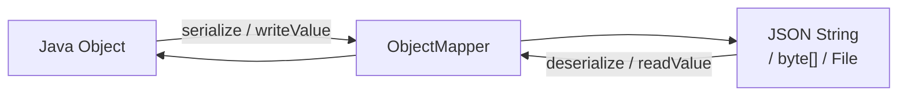

# JSON with Jackson

[← Back to README](../README.md)

---

**Jackson** is the de-facto standard Java library for JSON — serializing Java objects to JSON and deserializing JSON back into Java objects. Spring Boot uses it by default.



---

## Maven Dependency

```xml
<dependency>
    <groupId>com.fasterxml.jackson.core</groupId>
    <artifactId>jackson-databind</artifactId>
    <version>2.17.1</version>
</dependency>

<!-- Java 8 date/time support -->
<dependency>
    <groupId>com.fasterxml.jackson.datatype</groupId>
    <artifactId>jackson-datatype-jsr310</artifactId>
    <version>2.17.1</version>
</dependency>
```

In Spring Boot you don't need to add Jackson — `spring-boot-starter-web` pulls it in automatically.

---

## ObjectMapper — the Core Class

Create one `ObjectMapper` and **reuse** it — it is thread-safe and expensive to construct.

```java
import com.fasterxml.jackson.databind.ObjectMapper;
import com.fasterxml.jackson.databind.SerializationFeature;
import com.fasterxml.jackson.datatype.jsr310.JavaTimeModule;

ObjectMapper mapper = new ObjectMapper()
    .registerModule(new JavaTimeModule())                         // LocalDate, Instant, etc.
    .disable(SerializationFeature.WRITE_DATES_AS_TIMESTAMPS);    // ISO strings, not epoch millis
```

---

## Serialization — Java → JSON

```java
public class User {
    private Long   id;
    private String name;
    private String email;

    // Jackson requires either a no-arg constructor + setters, or @JsonCreator
    public User() {}
    public User(Long id, String name, String email) {
        this.id = id; this.name = name; this.email = email;
    }
    public Long   getId()    { return id; }
    public String getName()  { return name; }
    public String getEmail() { return email; }
}
```

```java
User user = new User(1L, "Alice", "alice@example.com");

// to JSON string
String json = mapper.writeValueAsString(user);
System.out.println(json);
// {"id":1,"name":"Alice","email":"alice@example.com"}

// pretty-printed
String pretty = mapper.writerWithDefaultPrettyPrinter().writeValueAsString(user);

// to file
mapper.writeValue(new File("user.json"), user);

// to byte array
byte[] bytes = mapper.writeValueAsBytes(user);
```

---

## Deserialization — JSON → Java

```java
String json = """
    {"id":1,"name":"Alice","email":"alice@example.com"}
    """;

// from string
User user = mapper.readValue(json, User.class);

// from file
User fromFile = mapper.readValue(new File("user.json"), User.class);

// from URL
User fromUrl = mapper.readValue(new URL("https://api.example.com/users/1"), User.class);

// list
String listJson = """
    [{"id":1,"name":"Alice"},{"id":2,"name":"Bob"}]
    """;
List<User> users = mapper.readValue(listJson,
    mapper.getTypeFactory().constructCollectionType(List.class, User.class));

// map
String mapJson = """
    {"key1":"value1","key2":"value2"}
    """;
Map<String, String> map = mapper.readValue(mapJson,
    new com.fasterxml.jackson.core.type.TypeReference<Map<String, String>>() {});
```

---

## Jackson Annotations

### Naming

```java
public class Product {

    @JsonProperty("product_id")     // JSON field name differs from Java field name
    private Long id;

    @JsonProperty("product_name")
    private String name;

    @JsonIgnore                     // exclude from serialization AND deserialization
    private String internalCode;

    @JsonIgnoreProperties({"field1", "field2"})  // at class level — ignore specific fields
    // ...
}
```

### Constructors and creators

```java
public class Point {
    public final int x;
    public final int y;

    @JsonCreator
    public Point(@JsonProperty("x") int x,
                 @JsonProperty("y") int y) {
        this.x = x;
        this.y = y;
    }
}
```

### Including / excluding nulls

```java
@JsonInclude(JsonInclude.Include.NON_NULL)   // skip null fields in output
public class Response {
    private String data;
    private String error;  // omitted if null
}
```

### Date and time

```java
public class Event {
    private String       name;
    private LocalDate    date;
    private LocalDateTime startTime;

    @JsonFormat(pattern = "dd/MM/yyyy")   // custom format
    private LocalDate formattedDate;
}
```

---

## Records with Jackson

Jackson 2.12+ supports records natively — no annotations needed for simple cases.

```java
public record UserDto(Long id, String name, String email) {}

UserDto dto  = new UserDto(1L, "Alice", "alice@example.com");
String  json = mapper.writeValueAsString(dto);
// {"id":1,"name":"Alice","email":"alice@example.com"}

UserDto back = mapper.readValue(json, UserDto.class);
```

---

## JsonNode — Dynamic / Unknown JSON

When the JSON structure is unknown at compile time, use `JsonNode` to navigate it like a tree.

```java
String json = """
    {
      "user": {"name": "Alice", "age": 30},
      "roles": ["admin", "user"],
      "active": true
    }
    """;

JsonNode root = mapper.readTree(json);

String name    = root.get("user").get("name").asText();  // "Alice"
int    age     = root.get("user").get("age").asInt();    // 30
boolean active = root.get("active").asBoolean();          // true

// iterate array
root.get("roles").forEach(role -> System.out.println(role.asText()));
// admin
// user

// check presence
if (root.has("roles") && root.get("roles").isArray()) {
    // ...
}
```

---

## Custom Serializer and Deserializer

For types Jackson can't handle automatically:

```java
// custom serializer
public class MoneySerializer extends JsonSerializer<BigDecimal> {
    @Override
    public void serialize(BigDecimal value, JsonGenerator gen, SerializerProvider p)
            throws IOException {
        gen.writeString(value.setScale(2, RoundingMode.HALF_UP).toPlainString());
    }
}

// custom deserializer
public class MoneyDeserializer extends JsonDeserializer<BigDecimal> {
    @Override
    public BigDecimal deserialize(JsonParser p, DeserializationContext ctx)
            throws IOException {
        return new BigDecimal(p.getText().replace(",", ""));
    }
}

// register on a field
public class Invoice {
    @JsonSerialize(using = MoneySerializer.class)
    @JsonDeserialize(using = MoneyDeserializer.class)
    private BigDecimal total;
}
```

---

## ObjectMapper Configuration

```java
ObjectMapper mapper = new ObjectMapper()
    // date/time
    .registerModule(new JavaTimeModule())
    .disable(SerializationFeature.WRITE_DATES_AS_TIMESTAMPS)

    // ignore unknown fields in JSON (safe for API consumers)
    .configure(DeserializationFeature.FAIL_ON_UNKNOWN_PROPERTIES, false)

    // skip null fields in output
    .setSerializationInclusion(JsonInclude.Include.NON_NULL)

    // camelCase Java → snake_case JSON
    .setPropertyNamingStrategy(PropertyNamingStrategies.SNAKE_CASE);
```

---

## Spring Boot Auto-Configuration

In Spring Boot, Jackson is pre-configured. Customise it in `application.properties`:

```properties
spring.jackson.serialization.indent-output=true
spring.jackson.serialization.write-dates-as-timestamps=false
spring.jackson.deserialization.fail-on-unknown-properties=false
spring.jackson.default-property-inclusion=non_null
spring.jackson.property-naming-strategy=SNAKE_CASE
```

Or via a bean:

```java
@Bean
public Jackson2ObjectMapperBuilderCustomizer jsonCustomizer() {
    return builder -> builder
        .featuresToDisable(SerializationFeature.WRITE_DATES_AS_TIMESTAMPS)
        .featuresToDisable(DeserializationFeature.FAIL_ON_UNKNOWN_PROPERTIES)
        .serializationInclusion(JsonInclude.Include.NON_NULL);
}
```

---

## Jackson Summary

| Task | API |
|------|-----|
| Create mapper | `new ObjectMapper()` — reuse; it's thread-safe |
| Serialize to string | `mapper.writeValueAsString(obj)` |
| Deserialize from string | `mapper.readValue(json, Type.class)` |
| Deserialize generics | `new TypeReference<List<User>>() {}` |
| Rename field | `@JsonProperty("snake_name")` |
| Ignore field | `@JsonIgnore` |
| Skip nulls | `@JsonInclude(NON_NULL)` |
| Custom constructor | `@JsonCreator` + `@JsonProperty` |
| Navigate unknown JSON | `mapper.readTree(json)` → `JsonNode` |
| Custom format | `@JsonFormat(pattern="...")` |
| Date/time support | Register `JavaTimeModule` |

---

[← Back to README](../README.md)
