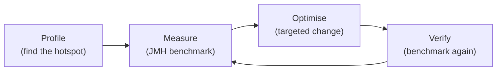

# Performance and Profiling

[← Back to README](../README.md)

---

Performance work follows a strict order: **measure first, then optimise**. Guessing where the bottleneck is wastes time and often makes code worse. Java's toolchain gives you everything you need to find real hotspots.



---

## JMH — Microbenchmarking

**JMH** (Java Microbenchmark Harness) is the only reliable way to benchmark Java code. It handles JVM warm-up, dead-code elimination, and statistical noise.

### Maven setup

```xml
<dependency>
    <groupId>org.openjdk.jmh</groupId>
    <artifactId>jmh-core</artifactId>
    <version>1.37</version>
</dependency>
<dependency>
    <groupId>org.openjdk.jmh</groupId>
    <artifactId>jmh-generator-annprocess</artifactId>
    <version>1.37</version>
    <scope>provided</scope>
</dependency>
```

### Writing a benchmark

```java
import org.openjdk.jmh.annotations.*;
import java.util.concurrent.TimeUnit;
import java.util.*;

@BenchmarkMode(Mode.AverageTime)
@OutputTimeUnit(TimeUnit.MICROSECONDS)
@State(Scope.Thread)
@Warmup(iterations = 3, time = 1)
@Measurement(iterations = 5, time = 1)
@Fork(2)
public class StringBenchmark {

    @Param({"100", "1000", "10000"})
    private int size;

    private List<String> words;

    @Setup
    public void setup() {
        words = new ArrayList<>();
        for (int i = 0; i < size; i++) {
            words.add("word" + i);
        }
    }

    @Benchmark
    public String concatenation() {
        String result = "";
        for (String w : words) result += w;   // creates many String objects
        return result;
    }

    @Benchmark
    public String stringBuilder() {
        StringBuilder sb = new StringBuilder();
        for (String w : words) sb.append(w);  // single buffer
        return sb.toString();
    }

    @Benchmark
    public String joining() {
        return String.join("", words);         // stream collector
    }
}
```

Run:

```bash
mvn clean install
java -jar target/benchmarks.jar StringBenchmark
```

Sample output:

```
Benchmark                    (size)  Mode  Cnt    Score    Error  Units
StringBenchmark.concatenation  1000  avgt    10  4823.4 ±  92.1  us/op
StringBenchmark.stringBuilder  1000  avgt    10    12.3 ±   0.4  us/op
StringBenchmark.joining        1000  avgt    10    14.1 ±   0.6  us/op
```

### JMH annotations

| Annotation | Purpose |
|-----------|---------|
| `@Benchmark` | Marks the method to measure |
| `@BenchmarkMode` | `AverageTime`, `Throughput`, `SampleTime` |
| `@OutputTimeUnit` | `NANOSECONDS`, `MICROSECONDS`, `MILLISECONDS` |
| `@State(Scope.Thread)` | State object per thread |
| `@Setup` / `@TearDown` | Run before/after benchmarks |
| `@Param` | Parameterise the benchmark |
| `@Warmup` | JVM warm-up iterations |
| `@Measurement` | Measurement iterations |
| `@Fork` | Number of separate JVM processes |

### Preventing dead-code elimination

```java
@Benchmark
public void badBenchmark() {
    Math.sqrt(42.0);   // result unused — JIT may eliminate this entirely
}

@Benchmark
public double goodBenchmark(Blackhole bh) {
    double result = Math.sqrt(42.0);
    bh.consume(result);   // Blackhole "uses" the result — JIT can't eliminate it
    return result;        // or return the value
}
```

---

## Profiling Tools

### Java Flight Recorder (JFR)

JFR is a low-overhead production profiler built into the JDK — less than 1% overhead.

```bash
# start the app with JFR
java -XX:StartFlightRecording=filename=recording.jfr,duration=60s -jar app.jar

# or attach to a running process
jcmd <pid> JFR.start duration=60s filename=recording.jfr
jcmd <pid> JFR.stop
```

Open `recording.jfr` in **JDK Mission Control** (`jmc`) to view:
- CPU hotspot methods
- Memory allocation by class
- Thread activity and locks
- GC events

### async-profiler

Low-overhead sampling profiler — can profile CPU, allocation, wall-clock, and lock contention.

```bash
# attach to running process
./profiler.sh -e cpu -d 30 -f flamegraph.html <pid>

# or start with JVM agent
java -agentpath:/path/to/libasyncProfiler.so=start,event=cpu,file=output.html -jar app.jar
```

### VisualVM

GUI profiler bundled with older JDKs, downloadable separately. Connect to a local or remote JVM, profile CPU and memory.

```bash
jvisualvm
```

---

## Heap Analysis

### Heap dump

```bash
# dump on OOM (add to JVM flags)
java -XX:+HeapDumpOnOutOfMemoryError -XX:HeapDumpPath=/tmp/heap.hprof -jar app.jar

# dump a running process
jcmd <pid> GC.heap_dump /tmp/heap.hprof
# or
jmap -dump:format=b,file=/tmp/heap.hprof <pid>
```

Open `.hprof` in **Eclipse MAT** or **VisualVM** to find:
- Largest objects and their retention paths
- Duplicate strings, large collections
- Memory leak suspects

### Programmatic heap info

```java
Runtime runtime = Runtime.getRuntime();
long total = runtime.totalMemory();  // current heap size
long free  = runtime.freeMemory();
long max   = runtime.maxMemory();    // -Xmx limit

System.out.printf("Used: %d MB / %d MB (max %d MB)%n",
    (total - free) / 1_048_576,
    total / 1_048_576,
    max   / 1_048_576);
```

---

## GC Tuning

```bash
# print GC logs (Java 11+)
java -Xlog:gc*:file=gc.log:time,uptime:filecount=5,filesize=20m -jar app.jar

# common heap flags
-Xms512m          # initial heap size
-Xmx2g            # max heap size
-XX:+UseG1GC      # G1 (default Java 9+)
-XX:+UseZGC       # ZGC — low latency (Java 15+, production-ready Java 17+)
-XX:+UseShenandoahGC  # Shenandoah — low latency (OpenJDK)

# GC pause target for G1
-XX:MaxGCPauseMillis=200
```

---

## Common Performance Pitfalls

### Autoboxing in hot loops

```java
// slow — autoboxes int → Integer every iteration
Long sum = 0L;
for (int i = 0; i < 1_000_000; i++) sum += i;

// fast — primitive
long sum = 0L;
for (int i = 0; i < 1_000_000; i++) sum += i;
```

### Unnecessary object creation

```java
// slow — new Pattern compiled every call
boolean valid = "hello".matches("[a-z]+");

// fast — compile once
private static final Pattern LOWER = Pattern.compile("[a-z]+");
boolean valid = LOWER.matcher("hello").matches();
```

### Wrong collection for the job

```java
// slow — O(n) contains check
List<String> set = new ArrayList<>(names);
set.contains("Alice");  // linear scan

// fast — O(1) lookup
Set<String> set = new HashSet<>(names);
set.contains("Alice");
```

### Stream vs loop for primitive-heavy work

```java
// boxed Stream — slower for large primitive arrays
int[] arr = new int[1_000_000];
int sum = Arrays.stream(arr).sum();  // IntStream — OK, avoids boxing

// direct loop — fastest
int sum = 0;
for (int v : arr) sum += v;
```

### String concatenation in loops

```java
// O(n²) — each + creates a new String
String result = "";
for (String s : list) result += s;

// O(n) — one buffer
StringBuilder sb = new StringBuilder();
for (String s : list) sb.append(s);
String result = sb.toString();
```

---

## System.nanoTime for Quick Timing

For a rough measurement (not a replacement for JMH):

```java
long start = System.nanoTime();

// code to measure
doWork();

long elapsed = System.nanoTime() - start;
System.out.printf("%.3f ms%n", elapsed / 1_000_000.0);
```

> `System.nanoTime()` measures elapsed wall time; `System.currentTimeMillis()` gives calendar time. Use `nanoTime` for intervals.

---

## Performance Summary

| Task | Tool |
|------|------|
| Microbenchmark | JMH — `@Benchmark`, `@Warmup`, `@Measurement` |
| CPU profiling | Java Flight Recorder, async-profiler |
| Memory analysis | JFR, heap dump + Eclipse MAT |
| GC tuning | `-Xlog:gc*`, G1/ZGC flags |
| Quick timing | `System.nanoTime()` |
| Avoid | Autoboxing in loops, wrong collections, String `+` in loops |

---

[← Back to README](../README.md)
