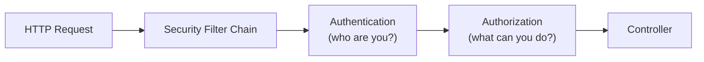

# Spring Security

[← Back to README](../README.md)

---

**Spring Security** handles authentication (who are you?) and authorization (what can you do?) for Spring Boot applications. It integrates with the servlet filter chain, intercepting every request before it reaches your controllers.



---

## Maven Dependency

```xml
<dependency>
    <groupId>org.springframework.boot</groupId>
    <artifactId>spring-boot-starter-security</artifactId>
</dependency>

<!-- JWT support -->
<dependency>
    <groupId>io.jsonwebtoken</groupId>
    <artifactId>jjwt-api</artifactId>
    <version>0.12.6</version>
</dependency>
<dependency>
    <groupId>io.jsonwebtoken</groupId>
    <artifactId>jjwt-impl</artifactId>
    <version>0.12.6</version>
    <scope>runtime</scope>
</dependency>
<dependency>
    <groupId>io.jsonwebtoken</groupId>
    <artifactId>jjwt-jackson</artifactId>
    <version>0.12.6</version>
    <scope>runtime</scope>
</dependency>
```

---

## Security Configuration

```java
import org.springframework.context.annotation.*;
import org.springframework.security.config.annotation.web.builders.HttpSecurity;
import org.springframework.security.config.annotation.web.configuration.EnableWebSecurity;
import org.springframework.security.config.http.SessionCreationPolicy;
import org.springframework.security.web.*;
import org.springframework.security.web.authentication.UsernamePasswordAuthenticationFilter;

@Configuration
@EnableWebSecurity
public class SecurityConfig {

    private final JwtAuthFilter jwtAuthFilter;

    public SecurityConfig(JwtAuthFilter jwtAuthFilter) {
        this.jwtAuthFilter = jwtAuthFilter;
    }

    @Bean
    public SecurityFilterChain securityFilterChain(HttpSecurity http) throws Exception {
        return http
            .csrf(csrf -> csrf.disable())   // disabled for stateless REST APIs
            .sessionManagement(sm -> sm
                .sessionCreationPolicy(SessionCreationPolicy.STATELESS))
            .authorizeHttpRequests(auth -> auth
                .requestMatchers("/api/auth/**").permitAll()       // public endpoints
                .requestMatchers("/api/admin/**").hasRole("ADMIN") // admin only
                .anyRequest().authenticated()                       // everything else: must be logged in
            )
            .addFilterBefore(jwtAuthFilter, UsernamePasswordAuthenticationFilter.class)
            .build();
    }

    @Bean
    public PasswordEncoder passwordEncoder() {
        return new BCryptPasswordEncoder();
    }

    @Bean
    public AuthenticationManager authenticationManager(AuthenticationConfiguration config)
            throws Exception {
        return config.getAuthenticationManager();
    }
}
```

---

## UserDetails and UserDetailsService

Spring Security loads user information through `UserDetailsService`.

```java
import org.springframework.security.core.userdetails.*;

@Service
public class CustomUserDetailsService implements UserDetailsService {

    private final UserRepository userRepository;

    public CustomUserDetailsService(UserRepository userRepository) {
        this.userRepository = userRepository;
    }

    @Override
    public UserDetails loadUserByUsername(String email) throws UsernameNotFoundException {
        User user = userRepository.findByEmail(email)
            .orElseThrow(() -> new UsernameNotFoundException("User not found: " + email));

        return org.springframework.security.core.userdetails.User.builder()
            .username(user.getEmail())
            .password(user.getPassword())       // must be BCrypt-hashed
            .roles(user.getRole().name())       // e.g. "USER", "ADMIN"
            .build();
    }
}
```

---

## JWT Authentication

### JWT utility

```java
import io.jsonwebtoken.*;
import io.jsonwebtoken.security.Keys;
import java.security.Key;
import java.util.Date;

@Component
public class JwtUtil {
    private static final long EXPIRY_MS = 86_400_000L;  // 24 hours

    private final Key key = Keys.hmacShaKeyFor(
        java.util.Base64.getDecoder().decode(
            System.getenv("JWT_SECRET")));  // 256-bit base64-encoded secret

    public String generateToken(String email, String role) {
        return Jwts.builder()
            .subject(email)
            .claim("role", role)
            .issuedAt(new Date())
            .expiration(new Date(System.currentTimeMillis() + EXPIRY_MS))
            .signWith(key)
            .compact();
    }

    public String extractEmail(String token) {
        return parseClaims(token).getPayload().getSubject();
    }

    public boolean isValid(String token) {
        try {
            parseClaims(token);
            return true;
        } catch (JwtException e) {
            return false;
        }
    }

    private Jws<Claims> parseClaims(String token) {
        return Jwts.parser().verifyWith((javax.crypto.SecretKey) key)
            .build().parseSignedClaims(token);
    }
}
```

### JWT filter

```java
import jakarta.servlet.*;
import jakarta.servlet.http.*;
import org.springframework.security.authentication.UsernamePasswordAuthenticationToken;
import org.springframework.security.core.context.SecurityContextHolder;
import org.springframework.web.filter.OncePerRequestFilter;

@Component
public class JwtAuthFilter extends OncePerRequestFilter {

    private final JwtUtil jwtUtil;
    private final CustomUserDetailsService userDetailsService;

    public JwtAuthFilter(JwtUtil jwtUtil, CustomUserDetailsService userDetailsService) {
        this.jwtUtil            = jwtUtil;
        this.userDetailsService = userDetailsService;
    }

    @Override
    protected void doFilterInternal(HttpServletRequest req,
                                    HttpServletResponse res,
                                    FilterChain chain) throws ServletException, IOException {

        String header = req.getHeader("Authorization");
        if (header == null || !header.startsWith("Bearer ")) {
            chain.doFilter(req, res);
            return;
        }

        String token = header.substring(7);
        if (!jwtUtil.isValid(token)) {
            chain.doFilter(req, res);
            return;
        }

        String email = jwtUtil.extractEmail(token);
        UserDetails user = userDetailsService.loadUserByUsername(email);

        var auth = new UsernamePasswordAuthenticationToken(
            user, null, user.getAuthorities());
        SecurityContextHolder.getContext().setAuthentication(auth);

        chain.doFilter(req, res);
    }
}
```

---

## Auth Controller

```java
@RestController
@RequestMapping("/api/auth")
public class AuthController {

    private final AuthenticationManager authManager;
    private final JwtUtil jwtUtil;
    private final PasswordEncoder passwordEncoder;
    private final UserRepository userRepository;

    public AuthController(AuthenticationManager authManager, JwtUtil jwtUtil,
                          PasswordEncoder passwordEncoder, UserRepository userRepository) {
        this.authManager     = authManager;
        this.jwtUtil         = jwtUtil;
        this.passwordEncoder = passwordEncoder;
        this.userRepository  = userRepository;
    }

    @PostMapping("/register")
    public ResponseEntity<String> register(@RequestBody RegisterRequest req) {
        if (userRepository.findByEmail(req.email()).isPresent()) {
            return ResponseEntity.badRequest().body("Email already registered");
        }
        User user = new User(req.name(), req.email(),
            passwordEncoder.encode(req.password()), Role.USER);
        userRepository.save(user);
        return ResponseEntity.status(HttpStatus.CREATED).body("Registered");
    }

    @PostMapping("/login")
    public ResponseEntity<TokenResponse> login(@RequestBody LoginRequest req) {
        authManager.authenticate(
            new UsernamePasswordAuthenticationToken(req.email(), req.password()));
        User user  = userRepository.findByEmail(req.email()).orElseThrow();
        String jwt = jwtUtil.generateToken(user.getEmail(), user.getRole().name());
        return ResponseEntity.ok(new TokenResponse(jwt));
    }
}

public record RegisterRequest(String name, String email, String password) {}
public record LoginRequest(String email, String password) {}
public record TokenResponse(String token) {}
```

---

## Method-Level Security

Enable with `@EnableMethodSecurity` on your `@Configuration` class.

```java
@Configuration
@EnableWebSecurity
@EnableMethodSecurity
public class SecurityConfig { ... }
```

```java
@Service
public class UserService {

    @PreAuthorize("hasRole('ADMIN')")
    public void deleteUser(Long id) { ... }

    @PreAuthorize("hasRole('ADMIN') or #id == authentication.principal.id")
    public User getUser(Long id) { ... }

    @PostAuthorize("returnObject.email == authentication.name")
    public User getProfile(Long id) { ... }

    @Secured("ROLE_ADMIN")
    public List<User> listAllUsers() { ... }
}
```

---

## Accessing the Current User

```java
// in a controller or service
import org.springframework.security.core.annotation.AuthenticationPrincipal;

@GetMapping("/me")
public ResponseEntity<UserDto> getCurrentUser(
        @AuthenticationPrincipal UserDetails userDetails) {
    User user = userRepository.findByEmail(userDetails.getUsername()).orElseThrow();
    return ResponseEntity.ok(new UserDto(user.getId(), user.getName(), user.getEmail()));
}

// programmatically
SecurityContext ctx  = SecurityContextHolder.getContext();
Authentication  auth = ctx.getAuthentication();
String email = auth.getName();
```

---

## CORS Configuration

```java
@Bean
public CorsConfigurationSource corsConfigurationSource() {
    CorsConfiguration config = new CorsConfiguration();
    config.setAllowedOrigins(List.of("https://app.example.com"));
    config.setAllowedMethods(List.of("GET", "POST", "PUT", "DELETE", "OPTIONS"));
    config.setAllowedHeaders(List.of("*"));
    config.setAllowCredentials(true);

    UrlBasedCorsConfigurationSource source = new UrlBasedCorsConfigurationSource();
    source.registerCorsConfiguration("/**", config);
    return source;
}

// enable in the filter chain
http.cors(cors -> cors.configurationSource(corsConfigurationSource()))
```

---

## Spring Security Summary

| Concept | Class / Annotation |
|---------|-------------------|
| Enable security | `@EnableWebSecurity` |
| Configure rules | `SecurityFilterChain` bean |
| URL access rules | `.authorizeHttpRequests()` |
| Password hashing | `BCryptPasswordEncoder` |
| Load users | `UserDetailsService.loadUserByUsername()` |
| JWT generation | `Jwts.builder().signWith(key).compact()` |
| JWT validation | Custom `OncePerRequestFilter` |
| Method security | `@EnableMethodSecurity`, `@PreAuthorize` |
| Current user | `@AuthenticationPrincipal`, `SecurityContextHolder` |
| CORS | `CorsConfigurationSource` bean |
| Stateless sessions | `SessionCreationPolicy.STATELESS` |

---

[← Back to README](../README.md)
