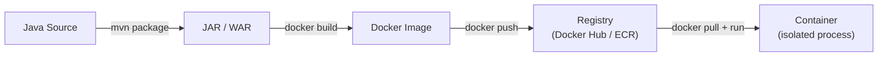

# Docker and Java

[← Back to README](../README.md)

---

Docker packages a Java application and all its dependencies into a **container** — a portable, reproducible unit that runs the same on every machine. This eliminates "works on my machine" problems and simplifies deployment.



---

## Basic Dockerfile

```dockerfile
# Use an official Java runtime
FROM eclipse-temurin:21-jre

# Set working directory inside the container
WORKDIR /app

# Copy the built JAR
COPY target/myapp-1.0.0.jar app.jar

# Expose the port the app listens on
EXPOSE 8080

# Run the app
ENTRYPOINT ["java", "-jar", "app.jar"]
```

Build and run:

```bash
mvn clean package -DskipTests
docker build -t myapp:1.0 .
docker run -p 8080:8080 myapp:1.0
```

---

## Multi-Stage Build (Recommended)

A multi-stage build compiles the source inside Docker — so you don't need Java or Maven installed locally.

```dockerfile
# ─── Stage 1: Build ──────────────────────────────────────────────
FROM maven:3.9-eclipse-temurin-21 AS builder

WORKDIR /build

# copy pom first — Docker caches this layer until pom.xml changes
COPY pom.xml .
RUN mvn dependency:go-offline -q

# copy source and build
COPY src ./src
RUN mvn clean package -DskipTests -q

# ─── Stage 2: Runtime ────────────────────────────────────────────
FROM eclipse-temurin:21-jre

WORKDIR /app

# copy only the JAR from the builder stage
COPY --from=builder /build/target/*.jar app.jar

# non-root user for security
RUN useradd -r -s /bin/false appuser
USER appuser

EXPOSE 8080

ENTRYPOINT ["java", "-jar", "app.jar"]
```

The final image contains only the JRE + JAR — no Maven, no source code, no build tools.

---

## JVM Flags for Containers

The JVM historically couldn't detect container CPU/memory limits. Modern JDK 11+ handles this correctly, but explicit flags help.

```dockerfile
ENTRYPOINT ["java",
    "-XX:+UseContainerSupport",
    "-XX:MaxRAMPercentage=75.0",
    "-XX:InitialRAMPercentage=50.0",
    "-XX:+ExitOnOutOfMemoryError",
    "-Djava.security.egd=file:/dev/./urandom",
    "-jar", "app.jar"]
```

| Flag | Purpose |
|------|---------|
| `-XX:+UseContainerSupport` | Read CPU/memory from cgroup limits (on by default Java 11+) |
| `-XX:MaxRAMPercentage=75.0` | Use 75% of container memory as max heap |
| `-XX:InitialRAMPercentage=50.0` | Start with 50% |
| `-XX:+ExitOnOutOfMemoryError` | Crash fast (let orchestrator restart) |
| `-Djava.security.egd=file:/dev/./urandom` | Faster startup on Linux |

---

## docker-compose for Local Development

```yaml
# compose.yml
services:
  app:
    build: .
    ports:
      - "8080:8080"
    environment:
      SPRING_DATASOURCE_URL: jdbc:postgresql://db:5432/mydb
      SPRING_DATASOURCE_USERNAME: alice
      SPRING_DATASOURCE_PASSWORD: secret
      JWT_SECRET: ${JWT_SECRET}
    depends_on:
      db:
        condition: service_healthy

  db:
    image: postgres:16-alpine
    environment:
      POSTGRES_DB: mydb
      POSTGRES_USER: alice
      POSTGRES_PASSWORD: secret
    ports:
      - "5432:5432"
    volumes:
      - pgdata:/var/lib/postgresql/data
    healthcheck:
      test: ["CMD-SHELL", "pg_isready -U alice -d mydb"]
      interval: 5s
      retries: 5

volumes:
  pgdata:
```

```bash
docker compose up --build    # start everything
docker compose down -v       # stop and remove volumes
docker compose logs -f app   # follow app logs
```

---

## Spring Boot Layered JARs

Spring Boot 2.3+ supports layered JARs — each layer becomes its own Docker layer, so unchanged dependencies are cached.

```dockerfile
FROM eclipse-temurin:21-jre AS builder
WORKDIR /build
COPY target/*.jar app.jar
RUN java -Djarmode=layertools -jar app.jar extract

FROM eclipse-temurin:21-jre
WORKDIR /app

# copy layers from least-changed to most-changed
COPY --from=builder /build/dependencies          ./
COPY --from=builder /build/spring-boot-loader    ./
COPY --from=builder /build/snapshot-dependencies ./
COPY --from=builder /build/application           ./

ENTRYPOINT ["java", "org.springframework.boot.loader.launch.JarLauncher"]
```

On a code-only change, Docker only rebuilds the `application` layer — the `dependencies` layer (the largest) is reused from cache.

Enable layers in `pom.xml`:

```xml
<build>
    <plugins>
        <plugin>
            <groupId>org.springframework.boot</groupId>
            <artifactId>spring-boot-maven-plugin</artifactId>
            <configuration>
                <layers><enabled>true</enabled></layers>
            </configuration>
        </plugin>
    </plugins>
</build>
```

---

## GraalVM Native Image

Compile a Spring Boot app to a native binary — near-instant startup, much lower memory.

```xml
<plugin>
    <groupId>org.graalvm.buildtools</groupId>
    <artifactId>native-maven-plugin</artifactId>
</plugin>
```

```bash
# requires GraalVM JDK
mvn -Pnative native:compile

# or with Docker (no local GraalVM needed)
mvn -Pnative spring-boot:build-image
```

```dockerfile
# native binary — no JVM needed at all
FROM debian:bookworm-slim
COPY target/myapp /app/myapp
ENTRYPOINT ["/app/myapp"]
```

Startup: ~50 ms vs ~3 s for JVM. Image: ~100 MB vs ~250 MB.

---

## Useful Docker Commands

```bash
# build
docker build -t myapp:latest .
docker build -t myapp:latest --no-cache .  # skip cache

# run
docker run -p 8080:8080 --env-file .env myapp:latest
docker run -d --name myapp myapp:latest     # detached

# inspect
docker logs -f myapp          # follow logs
docker exec -it myapp bash    # shell inside running container
docker stats myapp            # CPU/memory usage

# image management
docker images
docker rmi myapp:latest
docker image prune            # remove dangling images

# registry
docker tag myapp:latest registry.example.com/myapp:1.0
docker push registry.example.com/myapp:1.0
docker pull registry.example.com/myapp:1.0
```

---

## .dockerignore

```
target/
.git/
*.md
.env
*.iml
.idea/
```

Keeps the build context small — only files Docker actually needs are sent to the daemon.

---

## Docker Summary

| Task | Command / Concept |
|------|------------------|
| Basic Dockerfile | `FROM`, `WORKDIR`, `COPY`, `EXPOSE`, `ENTRYPOINT` |
| Multi-stage build | Builder stage (Maven) + runtime stage (JRE only) |
| Container memory | `-XX:MaxRAMPercentage=75.0` |
| Local dev stack | `docker compose up` |
| Layer caching | Spring Boot layered JARs |
| Fastest startup | GraalVM native image |
| Exclude files | `.dockerignore` |
| Non-root user | `RUN useradd ... && USER appuser` |

---

[← Back to README](../README.md)
