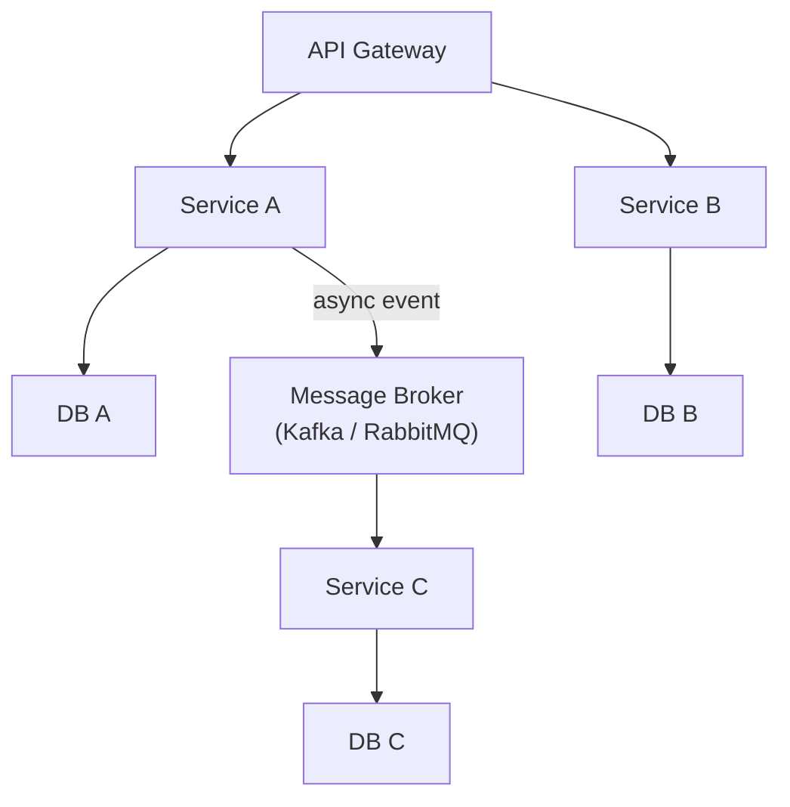
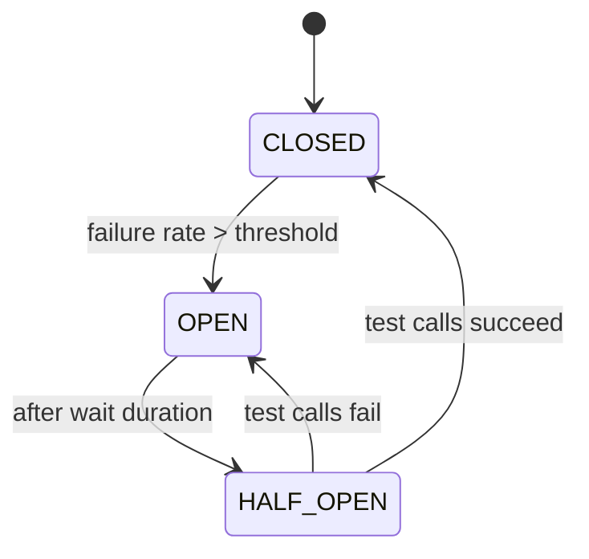

# Microservices Patterns

[← Back to README](../README.md)

---

Microservices split an application into small, independently deployable services. This solves scaling and team autonomy problems but introduces distributed systems challenges — network failures, partial failures, and latency. The patterns below are the standard answers to those challenges.



---

## Circuit Breaker — Resilience4j

A circuit breaker stops calling a failing service to give it time to recover and prevent cascading failures.

```xml
<dependency>
    <groupId>io.github.resilience4j</groupId>
    <artifactId>resilience4j-spring-boot3</artifactId>
    <version>2.2.0</version>
</dependency>
```

```yaml
# application.yml
resilience4j:
  circuitbreaker:
    instances:
      paymentService:
        sliding-window-size: 10         # evaluate last 10 calls
        failure-rate-threshold: 50      # open if >50% fail
        wait-duration-in-open-state: 10s
        permitted-number-of-calls-in-half-open-state: 3
  retry:
    instances:
      paymentService:
        max-attempts: 3
        wait-duration: 500ms
        retry-exceptions:
          - java.net.ConnectException
  timelimiter:
    instances:
      paymentService:
        timeout-duration: 3s
```

```java
import io.github.resilience4j.circuitbreaker.annotation.CircuitBreaker;
import io.github.resilience4j.retry.annotation.Retry;
import io.github.resilience4j.timelimiter.annotation.TimeLimiter;

@Service
public class OrderService {

    private final PaymentClient paymentClient;

    public OrderService(PaymentClient paymentClient) {
        this.paymentClient = paymentClient;
    }

    @CircuitBreaker(name = "paymentService", fallbackMethod = "paymentFallback")
    @Retry(name = "paymentService")
    @TimeLimiter(name = "paymentService")
    public CompletableFuture<String> processPayment(Order order) {
        return CompletableFuture.supplyAsync(() -> paymentClient.charge(order));
    }

    // called when circuit is open or all retries exhausted
    public CompletableFuture<String> paymentFallback(Order order, Throwable t) {
        return CompletableFuture.completedFuture("PENDING");  // queue for later
    }
}
```

### Circuit states



---

## Retry

```java
@Retry(name = "paymentService", fallbackMethod = "paymentFallback")
public String processPayment(Order order) {
    return paymentClient.charge(order);  // retried up to 3 times on exception
}
```

---

## Bulkhead — Limit Concurrency

Prevent one slow service from consuming all threads.

```yaml
resilience4j:
  bulkhead:
    instances:
      inventoryService:
        max-concurrent-calls: 10
        max-wait-duration: 100ms
```

```java
@Bulkhead(name = "inventoryService")
public List<Item> getInventory() {
    return inventoryClient.getAll();
}
```

---

## API Gateway

The API Gateway is the single entry point for all clients — it handles routing, authentication, rate limiting, and SSL termination.

**Spring Cloud Gateway** is the standard choice in the Spring ecosystem.

```xml
<dependency>
    <groupId>org.springframework.cloud</groupId>
    <artifactId>spring-cloud-starter-gateway</artifactId>
</dependency>
```

```yaml
spring:
  cloud:
    gateway:
      routes:
        - id: user-service
          uri: lb://user-service    # lb:// = load-balanced via service discovery
          predicates:
            - Path=/api/users/**
          filters:
            - StripPrefix=1
            - name: CircuitBreaker
              args:
                name: userService
                fallbackUri: forward:/fallback

        - id: order-service
          uri: lb://order-service
          predicates:
            - Path=/api/orders/**
          filters:
            - AddRequestHeader=X-Source, gateway
            - name: RequestRateLimiter
              args:
                redis-rate-limiter.replenishRate: 100
                redis-rate-limiter.burstCapacity: 200
```

---

## Service Discovery — Eureka

Services register themselves; clients look up instances by name.

```xml
<!-- Eureka server -->
<dependency>
    <groupId>org.springframework.cloud</groupId>
    <artifactId>spring-cloud-starter-netflix-eureka-server</artifactId>
</dependency>
```

```java
@SpringBootApplication
@EnableEurekaServer
public class DiscoveryServer { public static void main(String[] a) { SpringApplication.run(DiscoveryServer.class, a); } }
```

```yaml
# Each service registers on startup
eureka:
  client:
    service-url:
      defaultZone: http://localhost:8761/eureka/

spring:
  application:
    name: order-service   # registered name
```

---

## Inter-Service Communication

### Synchronous — OpenFeign

```xml
<dependency>
    <groupId>org.springframework.cloud</groupId>
    <artifactId>spring-cloud-starter-openfeign</artifactId>
</dependency>
```

```java
@FeignClient(name = "user-service")  // resolves via Eureka
public interface UserClient {

    @GetMapping("/api/users/{id}")
    UserDto findById(@PathVariable Long id);

    @PostMapping("/api/users")
    UserDto create(@RequestBody CreateUserRequest request);
}

// use in a service — looks like a local call
@Service
public class OrderService {
    private final UserClient userClient;

    public Order placeOrder(Long userId, List<Item> items) {
        UserDto user = userClient.findById(userId);  // HTTP call under the hood
        // ...
    }
}
```

### Asynchronous — Spring Events (within one service)

```java
// publish
applicationEventPublisher.publishEvent(new OrderPlacedEvent(this, order));

// listen
@EventListener
public void onOrderPlaced(OrderPlacedEvent event) {
    inventoryService.reserve(event.getOrder().getItems());
}
```

---

## Saga Pattern — Distributed Transactions

Databases can't participate in a single ACID transaction across services. The **Saga** pattern chains local transactions with compensating actions for rollback.

```java
// Choreography-based saga — each service reacts to events
@Service
public class InventoryService {

    @KafkaListener(topics = "order.placed")
    public void onOrderPlaced(OrderPlacedEvent event) {
        try {
            reserve(event.getItems());
            eventPublisher.publish(new InventoryReservedEvent(event.getOrderId()));
        } catch (InsufficientStockException e) {
            // compensate — tell order service to cancel
            eventPublisher.publish(new InventoryFailedEvent(event.getOrderId()));
        }
    }
}
```

---

## Distributed Tracing — Micrometer / Zipkin

Trace a request across multiple services with a shared trace ID.

```xml
<dependency>
    <groupId>io.micrometer</groupId>
    <artifactId>micrometer-tracing-bridge-brave</artifactId>
</dependency>
<dependency>
    <groupId>io.zipkin.reporter2</groupId>
    <artifactId>zipkin-reporter-brave</artifactId>
</dependency>
```

```yaml
management:
  tracing:
    sampling:
      probability: 1.0    # trace 100% of requests (lower in production)
  zipkin:
    tracing:
      endpoint: http://zipkin:9411/api/v2/spans
```

Spring Boot automatically propagates `X-B3-TraceId` and `X-B3-SpanId` headers across Feign/WebClient calls. All logs for one request share the same `traceId`.

---

## Microservices Summary

| Pattern | Library / Tool |
|---------|---------------|
| Circuit breaker | Resilience4j `@CircuitBreaker` |
| Retry | Resilience4j `@Retry` |
| Timeout | Resilience4j `@TimeLimiter` |
| Bulkhead | Resilience4j `@Bulkhead` |
| API Gateway | Spring Cloud Gateway |
| Service discovery | Netflix Eureka |
| Synchronous calls | OpenFeign `@FeignClient` |
| Async messaging | Kafka / RabbitMQ |
| Distributed transactions | Saga pattern |
| Distributed tracing | Micrometer + Zipkin |

---

[← Back to README](../README.md)
