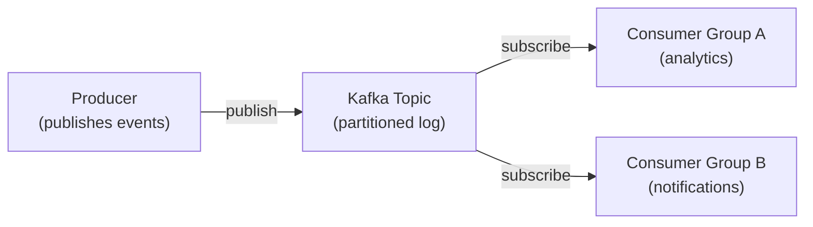

# Message Queues and Kafka

[← Back to README](../README.md)

---

Message queues decouple producers from consumers — the sender doesn't wait for the receiver, and the receiver processes at its own pace. **Apache Kafka** is the industry standard for high-throughput, durable event streaming.



---

## Key Concepts

| Concept | Meaning |
|---------|---------|
| **Topic** | Named, durable log of events |
| **Partition** | Ordered sub-log within a topic — enables parallelism |
| **Offset** | Position of a message within a partition |
| **Producer** | Writes messages to a topic |
| **Consumer** | Reads messages from a topic |
| **Consumer Group** | Group of consumers sharing the work of a topic |
| **Broker** | A Kafka server |
| **Retention** | How long messages are kept (default 7 days) |

---

## Spring Kafka — Maven

```xml
<dependency>
    <groupId>org.springframework.kafka</groupId>
    <artifactId>spring-kafka</artifactId>
</dependency>
```

Spring Boot auto-configures Kafka when this is on the classpath.

---

## Configuration

```yaml
# application.yml
spring:
  kafka:
    bootstrap-servers: localhost:9092

    producer:
      key-serializer:   org.apache.kafka.common.serialization.StringSerializer
      value-serializer: org.springframework.kafka.support.serializer.JsonSerializer
      acks: all              # wait for all replicas to acknowledge
      retries: 3
      properties:
        spring.json.add.type.headers: false

    consumer:
      group-id: my-app
      auto-offset-reset: earliest    # start from beginning if no committed offset
      key-deserializer:   org.apache.kafka.common.serialization.StringDeserializer
      value-deserializer: org.springframework.kafka.support.serializer.JsonDeserializer
      properties:
        spring.json.trusted.packages: "com.example.events"
```

---

## Producing Messages

```java
import org.springframework.kafka.core.KafkaTemplate;
import org.springframework.kafka.support.SendResult;

@Service
public class OrderEventPublisher {

    private final KafkaTemplate<String, OrderEvent> kafkaTemplate;

    public OrderEventPublisher(KafkaTemplate<String, OrderEvent> kafkaTemplate) {
        this.kafkaTemplate = kafkaTemplate;
    }

    public void publishOrderPlaced(Order order) {
        OrderEvent event = new OrderEvent(order.getId(), "ORDER_PLACED",
            order.getUserId(), order.getTotal(), Instant.now());

        // key = orderId → same order always goes to same partition
        kafkaTemplate.send("orders", order.getId().toString(), event)
            .whenComplete((result, ex) -> {
                if (ex != null) {
                    log.error("Failed to publish order event: {}", ex.getMessage());
                } else {
                    log.info("Published order event to partition {} offset {}",
                        result.getRecordMetadata().partition(),
                        result.getRecordMetadata().offset());
                }
            });
    }
}

public record OrderEvent(Long orderId, String type, Long userId,
                         double total, Instant occurredAt) {}
```

---

## Consuming Messages

```java
import org.springframework.kafka.annotation.KafkaListener;
import org.springframework.kafka.support.KafkaHeaders;
import org.springframework.messaging.handler.annotation.*;

@Component
public class OrderEventConsumer {

    private static final Logger log = LoggerFactory.getLogger(OrderEventConsumer.class);

    // basic listener
    @KafkaListener(topics = "orders", groupId = "notification-service")
    public void handleOrderEvent(OrderEvent event) {
        log.info("Received: {} for order {}", event.type(), event.orderId());
        // send email, push notification, etc.
    }

    // with headers and metadata
    @KafkaListener(topics = "orders", groupId = "analytics-service")
    public void handleWithMetadata(
            @Payload OrderEvent event,
            @Header(KafkaHeaders.RECEIVED_PARTITION) int partition,
            @Header(KafkaHeaders.OFFSET) long offset) {
        log.info("Event from partition={} offset={}: {}", partition, offset, event);
    }
}
```

---

## Batch Listening

```java
@KafkaListener(topics = "orders", groupId = "batch-processor",
               containerFactory = "batchKafkaListenerContainerFactory")
public void handleBatch(List<OrderEvent> events) {
    log.info("Processing batch of {} events", events.size());
    // bulk insert, bulk notify, etc.
}
```

```java
@Bean
public ConcurrentKafkaListenerContainerFactory<String, OrderEvent>
        batchKafkaListenerContainerFactory(ConsumerFactory<String, OrderEvent> cf) {
    var factory = new ConcurrentKafkaListenerContainerFactory<String, OrderEvent>();
    factory.setConsumerFactory(cf);
    factory.setBatchListener(true);
    factory.getContainerProperties().setPollTimeout(3000);
    return factory;
}
```

---

## Error Handling and Dead-Letter Topics

```yaml
spring:
  kafka:
    consumer:
      properties:
        max.poll.records: 10
    listener:
      ack-mode: MANUAL     # commit offsets manually
```

```java
@Bean
public DefaultErrorHandler errorHandler(KafkaTemplate<Object, Object> template) {
    // retry up to 3 times with 1s back-off, then send to DLT
    var recoverer = new DeadLetterPublishingRecoverer(template,
        (record, ex) -> new TopicPartition(record.topic() + ".DLT", record.partition()));

    var backOff = new FixedBackOff(1000L, 3);
    return new DefaultErrorHandler(recoverer, backOff);
}
```

Messages that fail after all retries go to `orders.DLT` for manual inspection and replay.

---

## Manual Offset Commit

```java
@KafkaListener(topics = "payments")
public void handlePayment(PaymentEvent event,
                          Acknowledgment ack) {
    try {
        processPayment(event);
        ack.acknowledge();   // commit offset only on success
    } catch (Exception e) {
        log.error("Failed to process payment, not committing offset", e);
        // message will be redelivered on restart
    }
}
```

---

## Topic Creation

```java
import org.apache.kafka.clients.admin.NewTopic;
import org.springframework.kafka.config.TopicBuilder;

@Configuration
public class KafkaTopicConfig {

    @Bean
    public NewTopic ordersTopic() {
        return TopicBuilder.name("orders")
            .partitions(6)
            .replicas(3)
            .build();
    }

    @Bean
    public NewTopic ordersDlt() {
        return TopicBuilder.name("orders.DLT")
            .partitions(1)
            .replicas(3)
            .build();
    }
}
```

---

## Running Kafka Locally

```yaml
# compose.yml
services:
  kafka:
    image: confluentinc/cp-kafka:7.6.1
    ports:
      - "9092:9092"
    environment:
      KAFKA_NODE_ID: 1
      KAFKA_PROCESS_ROLES: broker,controller
      KAFKA_LISTENERS: PLAINTEXT://0.0.0.0:9092,CONTROLLER://0.0.0.0:9093
      KAFKA_ADVERTISED_LISTENERS: PLAINTEXT://localhost:9092
      KAFKA_CONTROLLER_QUORUM_VOTERS: 1@kafka:9093
      KAFKA_CONTROLLER_LISTENER_NAMES: CONTROLLER
      KAFKA_OFFSETS_TOPIC_REPLICATION_FACTOR: 1
      CLUSTER_ID: MkU3OEVBNTcwNTJENDM2Qk
```

```bash
docker compose up -d kafka

# list topics
docker exec kafka kafka-topics --bootstrap-server localhost:9092 --list

# produce a test message
docker exec -it kafka kafka-console-producer \
  --bootstrap-server localhost:9092 --topic orders

# consume messages
docker exec kafka kafka-console-consumer \
  --bootstrap-server localhost:9092 --topic orders --from-beginning
```

---

## RabbitMQ (Alternative)

RabbitMQ suits simpler task queues and request/reply patterns. Spring AMQP provides the integration.

```xml
<dependency>
    <groupId>org.springframework.boot</groupId>
    <artifactId>spring-boot-starter-amqp</artifactId>
</dependency>
```

```java
// send
rabbitTemplate.convertAndSend("email-exchange", "email.welcome", emailRequest);

// receive
@RabbitListener(queues = "welcome-emails")
public void sendWelcomeEmail(EmailRequest request) {
    emailService.send(request);
}
```

---

## Kafka vs RabbitMQ

| | Kafka | RabbitMQ |
|--|-------|----------|
| Model | Distributed log (replay) | Message queue (consumed once) |
| Throughput | Millions/sec | Thousands/sec |
| Retention | Days/weeks (configurable) | Until consumed |
| Consumer groups | Multiple independent groups | Competing consumers |
| Best for | Event streaming, audit log | Task queues, RPC, routing |
| Ordering | Per-partition | Per-queue |

---

## Kafka Summary

| Concept | Spring / Config |
|---------|----------------|
| Publish a message | `KafkaTemplate.send(topic, key, value)` |
| Consume messages | `@KafkaListener(topics = "...")` |
| Batch consume | `@KafkaListener` + batch container factory |
| Error handling | `DefaultErrorHandler` + `DeadLetterPublishingRecoverer` |
| Manual offset commit | `Acknowledgment.acknowledge()` |
| Create topics | `TopicBuilder.name("...").partitions(n).build()` |
| Retry config | `spring.kafka.consumer.properties.max.poll.records` |

---

[← Back to README](../README.md)
