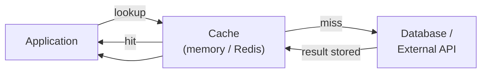

# Caching

[← Back to README](../README.md)

---

Caching stores the result of expensive operations so they don't need to be repeated. In Java applications the cache sits in front of the database or a slow external service — the application checks the cache first and only goes to the source on a miss.



---

## Spring Cache Abstraction

Spring's `@EnableCaching` + annotations work with any cache backend — swap Caffeine for Redis without changing business code.

```xml
<!-- Caffeine — in-process cache (dev / single node) -->
<dependency>
    <groupId>com.github.ben-manes.caffeine</groupId>
    <artifactId>caffeine</artifactId>
</dependency>

<!-- Redis — distributed cache (production / multi-node) -->
<dependency>
    <groupId>org.springframework.boot</groupId>
    <artifactId>spring-boot-starter-data-redis</artifactId>
</dependency>
```

Enable caching:

```java
@SpringBootApplication
@EnableCaching
public class App { ... }
```

---

## Core Annotations

```java
@Service
public class ProductService {

    private final ProductRepository repo;

    public ProductService(ProductRepository repo) { this.repo = repo; }

    // cache the return value; key defaults to method parameters
    @Cacheable("products")
    public Product findById(Long id) {
        return repo.findById(id).orElseThrow();   // DB hit only on cache miss
    }

    // cache with a custom key expression (SpEL)
    @Cacheable(value = "products", key = "#category + '-' + #page")
    public List<Product> findByCategory(String category, int page) {
        return repo.findByCategory(category, PageRequest.of(page, 20)).getContent();
    }

    // update the cache after a write
    @CachePut(value = "products", key = "#result.id")
    public Product save(Product product) {
        return repo.save(product);
    }

    // remove from cache on delete
    @CacheEvict(value = "products", key = "#id")
    public void delete(Long id) {
        repo.deleteById(id);
    }

    // evict the entire cache (use carefully)
    @CacheEvict(value = "products", allEntries = true)
    public void clearAll() {}

    // combine annotations
    @Caching(
        put  = { @CachePut(value = "products", key = "#result.id") },
        evict = { @CacheEvict(value = "productList", allEntries = true) }
    )
    public Product update(Product product) {
        return repo.save(product);
    }
}
```

---

## Caffeine — In-Process Cache

Best for a single-node app or local development. Ultra-fast, no network hop.

```yaml
# application.yml
spring:
  cache:
    type: caffeine
    caffeine:
      spec: maximumSize=1000,expireAfterWrite=10m
```

Per-cache configuration:

```java
@Bean
public CacheManager cacheManager() {
    CaffeineCacheManager manager = new CaffeineCacheManager();
    manager.registerCustomCache("products",
        Caffeine.newBuilder()
            .maximumSize(1_000)
            .expireAfterWrite(Duration.ofMinutes(10))
            .recordStats()        // enable hit/miss statistics
            .build());
    manager.registerCustomCache("users",
        Caffeine.newBuilder()
            .maximumSize(500)
            .expireAfterAccess(Duration.ofMinutes(30))
            .build());
    return manager;
}
```

---

## Redis — Distributed Cache

Required for multi-instance deployments — all nodes share the same cache.

```yaml
spring:
  data:
    redis:
      host: localhost
      port: 6379
      password: ${REDIS_PASSWORD:}
  cache:
    type: redis
    redis:
      time-to-live: 10m
      cache-null-values: false
```

Per-cache TTL:

```java
@Bean
public RedisCacheManager cacheManager(RedisConnectionFactory factory) {
    RedisCacheConfiguration defaults = RedisCacheConfiguration.defaultCacheConfig()
        .entryTtl(Duration.ofMinutes(10))
        .disableCachingNullValues()
        .serializeValuesWith(
            RedisSerializationContext.SerializationPair.fromSerializer(
                new GenericJackson2JsonRedisSerializer()));

    return RedisCacheManager.builder(factory)
        .cacheDefaults(defaults)
        .withCacheConfiguration("products",
            defaults.entryTtl(Duration.ofHours(1)))
        .withCacheConfiguration("users",
            defaults.entryTtl(Duration.ofMinutes(5)))
        .build();
}
```

Make sure cached objects are serializable (implement `Serializable` or use Jackson):

```java
public record Product(Long id, String name, double price)
    implements java.io.Serializable {}
```

---

## RedisTemplate — Direct Redis Access

For operations beyond key-value storage: sorted sets, pub/sub, atomic counters.

```java
@Service
public class RateLimiter {

    private final StringRedisTemplate redisTemplate;

    public RateLimiter(StringRedisTemplate redisTemplate) {
        this.redisTemplate = redisTemplate;
    }

    public boolean isAllowed(String userId) {
        String key = "rate:" + userId;
        Long count = redisTemplate.opsForValue().increment(key);
        if (count == 1) {
            redisTemplate.expire(key, Duration.ofMinutes(1));
        }
        return count <= 100;  // max 100 requests per minute
    }

    // leaderboard with sorted set
    public void recordScore(String player, double score) {
        redisTemplate.opsForZSet().add("leaderboard", player, score);
    }

    public Set<String> topPlayers(int n) {
        return redisTemplate.opsForZSet()
            .reverseRange("leaderboard", 0, n - 1);
    }
}
```

---

## Cache-Aside vs Write-Through

| Strategy | How it works | Good for |
|----------|-------------|----------|
| **Cache-aside** (lazy) | App checks cache → miss → load from DB → store in cache | Read-heavy, infrequently updated |
| **Write-through** | Write to cache and DB simultaneously | Data must be fresh immediately after write |
| **Write-behind** | Write to cache; async sync to DB | Write-heavy, eventual consistency OK |
| **Read-through** | Cache loads from DB automatically on miss | Transparent caching layer |

Spring `@Cacheable` implements cache-aside by default.

---

## Conditional Caching

```java
// only cache if result is not null
@Cacheable(value = "products", condition = "#result != null")
public Product findByCode(String code) { ... }

// only cache when the input meets a condition
@Cacheable(value = "products", condition = "#id > 0")
public Product findById(Long id) { ... }

// don't cache if result is empty list
@Cacheable(value = "products", unless = "#result.isEmpty()")
public List<Product> search(String query) { ... }
```

---

## Cache Statistics

```java
// Caffeine — get hit/miss rates
Cache<Object, Object> cache = ((CaffeineCache) cacheManager.getCache("products")).getNativeCache();
CacheStats stats = cache.stats();
System.out.printf("Hit rate: %.1f%%  Evictions: %d%n",
    stats.hitRate() * 100, stats.evictionCount());
```

With Spring Boot Actuator, Redis and Caffeine metrics are exposed at `/actuator/metrics/cache.*`.

---

## Running Redis Locally

```yaml
# compose.yml
services:
  redis:
    image: redis:7-alpine
    ports:
      - "6379:6379"
    command: redis-server --requirepass mysecret
    volumes:
      - redis-data:/data

volumes:
  redis-data:
```

```bash
docker compose up -d redis

# connect via CLI
docker exec -it <container> redis-cli -a mysecret
> SET foo bar
> GET foo
> TTL foo
> KEYS *
```

---

## Caching Summary

| Task | Annotation / API |
|------|-----------------|
| Cache a method result | `@Cacheable(value, key)` |
| Update cache after write | `@CachePut(value, key)` |
| Evict on delete | `@CacheEvict(value, key)` |
| Conditional cache | `condition` / `unless` on annotations |
| In-process cache | Caffeine + `CaffeineCacheManager` |
| Distributed cache | Redis + `RedisCacheManager` |
| TTL per cache | `RedisCacheConfiguration.entryTtl()` |
| Raw Redis ops | `RedisTemplate`, `StringRedisTemplate` |

---

[← Back to README](../README.md)
