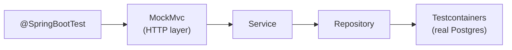

# Integration Testing and Testcontainers

[← Back to README](../README.md)

---

Unit tests verify isolated logic. **Integration tests** verify that components work together — the HTTP layer, service layer, and database all at once. **Testcontainers** spins up real Docker containers (Postgres, Redis, Kafka) for tests, then tears them down — so tests run against the real thing, not a mock.



---

## Dependencies

```xml
<!-- Spring Boot test starter (includes JUnit 5, MockMvc, AssertJ) -->
<dependency>
    <groupId>org.springframework.boot</groupId>
    <artifactId>spring-boot-starter-test</artifactId>
    <scope>test</scope>
</dependency>

<!-- Testcontainers -->
<dependency>
    <groupId>org.testcontainers</groupId>
    <artifactId>junit-jupiter</artifactId>
    <scope>test</scope>
</dependency>
<dependency>
    <groupId>org.testcontainers</groupId>
    <artifactId>postgresql</artifactId>
    <scope>test</scope>
</dependency>
<dependency>
    <groupId>org.testcontainers</groupId>
    <artifactId>kafka</artifactId>
    <scope>test</scope>
</dependency>

<!-- BOM for consistent versions -->
<dependencyManagement>
    <dependencies>
        <dependency>
            <groupId>org.testcontainers</groupId>
            <artifactId>testcontainers-bom</artifactId>
            <version>1.19.8</version>
            <type>pom</type>
            <scope>import</scope>
        </dependency>
    </dependencies>
</dependencyManagement>
```

---

## @SpringBootTest — Full Context

`@SpringBootTest` loads the entire Spring application context — real beans, real wiring.

```java
@SpringBootTest(webEnvironment = SpringBootTest.WebEnvironment.RANDOM_PORT)
class UserApiTest {

    @Autowired
    private TestRestTemplate restTemplate;

    @Autowired
    private UserRepository userRepository;

    @BeforeEach
    void setup() {
        userRepository.deleteAll();
    }

    @Test
    void createUser_returnsCreated() {
        CreateUserRequest req = new CreateUserRequest("Alice", "alice@example.com");

        ResponseEntity<UserDto> response = restTemplate.postForEntity(
            "/api/users", req, UserDto.class);

        assertThat(response.getStatusCode()).isEqualTo(HttpStatus.CREATED);
        assertThat(response.getBody().name()).isEqualTo("Alice");
    }

    @Test
    void getUser_notFound_returns404() {
        ResponseEntity<ErrorResponse> response = restTemplate.getForEntity(
            "/api/users/999", ErrorResponse.class);

        assertThat(response.getStatusCode()).isEqualTo(HttpStatus.NOT_FOUND);
    }
}
```

---

## MockMvc — Test the Web Layer

`MockMvc` calls controllers without starting a real HTTP server — faster than `TestRestTemplate` and gives richer assertions.

```java
@SpringBootTest
@AutoConfigureMockMvc
class UserControllerTest {

    @Autowired MockMvc mockMvc;
    @Autowired ObjectMapper objectMapper;
    @Autowired UserRepository userRepository;

    @Test
    void getAll_returnsUsers() throws Exception {
        userRepository.save(new User("Alice", "alice@example.com"));
        userRepository.save(new User("Bob",   "bob@example.com"));

        mockMvc.perform(get("/api/users")
                .contentType(MediaType.APPLICATION_JSON))
            .andExpect(status().isOk())
            .andExpect(jsonPath("$.content", hasSize(2)))
            .andExpect(jsonPath("$.content[0].name").value("Alice"));
    }

    @Test
    void createUser_invalidEmail_returns400() throws Exception {
        String body = objectMapper.writeValueAsString(
            new CreateUserRequest("Alice", "not-an-email"));

        mockMvc.perform(post("/api/users")
                .contentType(MediaType.APPLICATION_JSON)
                .content(body))
            .andExpect(status().isBadRequest())
            .andExpect(jsonPath("$.errors[0].field").value("email"));
    }

    @Test
    void deleteUser_notFound_returns404() throws Exception {
        mockMvc.perform(delete("/api/users/999"))
            .andExpect(status().isNotFound());
    }
}
```

---

## Testcontainers — Real Database

```java
@SpringBootTest
@Testcontainers
class UserRepositoryTest {

    @Container
    static PostgreSQLContainer<?> postgres =
        new PostgreSQLContainer<>("postgres:16-alpine")
            .withDatabaseName("testdb")
            .withUsername("test")
            .withPassword("test");

    @DynamicPropertySource
    static void configureProperties(DynamicPropertyRegistry registry) {
        registry.add("spring.datasource.url",      postgres::getJdbcUrl);
        registry.add("spring.datasource.username", postgres::getUsername);
        registry.add("spring.datasource.password", postgres::getPassword);
    }

    @Autowired
    private UserRepository repo;

    @Test
    void save_and_findByEmail() {
        User user = repo.save(new User("Alice", "alice@example.com"));

        Optional<User> found = repo.findByEmail("alice@example.com");

        assertThat(found).isPresent();
        assertThat(found.get().getName()).isEqualTo("Alice");
        assertThat(found.get().getId()).isEqualTo(user.getId());
    }
}
```

### Reuse container across tests (faster)

```java
// src/test/java/com/example/PostgresTestBase.java
@SpringBootTest
@Testcontainers
public abstract class PostgresTestBase {

    @Container
    static PostgreSQLContainer<?> postgres =
        new PostgreSQLContainer<>("postgres:16-alpine");

    @DynamicPropertySource
    static void props(DynamicPropertyRegistry r) {
        r.add("spring.datasource.url",      postgres::getJdbcUrl);
        r.add("spring.datasource.username", postgres::getUsername);
        r.add("spring.datasource.password", postgres::getPassword);
    }
}

// test classes extend the base — container is shared
class UserRepositoryTest extends PostgresTestBase { ... }
class OrderRepositoryTest extends PostgresTestBase { ... }
```

---

## Spring Boot 3.1+ — @ServiceConnection

Simplifies Testcontainers config — no `@DynamicPropertySource` needed.

```java
@SpringBootTest
@Testcontainers
class ModernTest {

    @Container
    @ServiceConnection
    static PostgreSQLContainer<?> postgres =
        new PostgreSQLContainer<>("postgres:16-alpine");

    @Container
    @ServiceConnection
    static RedisContainer redis =
        new RedisContainer("redis:7-alpine");

    // Spring Boot auto-wires the connection details — nothing else needed
}
```

---

## Testing with Kafka

```java
@SpringBootTest
@Testcontainers
class OrderEventTest {

    @Container
    static KafkaContainer kafka =
        new KafkaContainer(DockerImageName.parse("confluentinc/cp-kafka:7.6.1"));

    @DynamicPropertySource
    static void kafkaProps(DynamicPropertyRegistry r) {
        r.add("spring.kafka.bootstrap-servers", kafka::getBootstrapServers);
    }

    @Autowired private KafkaTemplate<String, OrderEvent> kafkaTemplate;
    @Autowired private OrderEventConsumer consumer;

    @Test
    void publishedEvent_isConsumed() throws Exception {
        CountDownLatch latch = new CountDownLatch(1);
        consumer.setLatch(latch);  // test hook on the consumer

        kafkaTemplate.send("orders", new OrderEvent(1L, "ORDER_PLACED"));

        assertThat(latch.await(10, TimeUnit.SECONDS)).isTrue();
        assertThat(consumer.getLastEvent().orderId()).isEqualTo(1L);
    }
}
```

---

## Slice Tests — Faster Targeted Tests

Spring Boot provides "slice" annotations that load only a portion of the context.

```java
// @WebMvcTest — loads only the web layer (controller + MockMvc)
// service and repository are mocked
@WebMvcTest(UserController.class)
class UserControllerSliceTest {

    @Autowired MockMvc mockMvc;

    @MockBean UserService userService;  // mocked, not real

    @Test
    void getById_callsService() throws Exception {
        when(userService.findById(1L))
            .thenReturn(Optional.of(new UserDto(1L, "Alice", "alice@example.com")));

        mockMvc.perform(get("/api/users/1"))
            .andExpect(status().isOk())
            .andExpect(jsonPath("$.name").value("Alice"));
    }
}

// @DataJpaTest — loads only JPA layer, uses H2 in-memory by default
@DataJpaTest
class UserRepositorySliceTest {

    @Autowired UserRepository repo;

    @Test
    void findByEmail_returnsUser() {
        repo.save(new User("Alice", "alice@example.com"));
        assertThat(repo.findByEmail("alice@example.com")).isPresent();
    }
}

// @DataJpaTest + Testcontainers — real DB, only JPA layer
@DataJpaTest
@AutoConfigureTestDatabase(replace = AutoConfigureTestDatabase.Replace.NONE)
@Testcontainers
class UserRepositoryRealDbTest {

    @Container @ServiceConnection
    static PostgreSQLContainer<?> postgres = new PostgreSQLContainer<>("postgres:16-alpine");

    @Autowired UserRepository repo;
    // ...
}
```

---

## Useful Assertions

```java
// AssertJ — fluent, readable
assertThat(response.getBody()).isNotNull();
assertThat(users).hasSize(3).extracting(User::getName).containsExactly("Alice", "Bob", "Carol");
assertThatThrownBy(() -> service.findById(-1L))
    .isInstanceOf(IllegalArgumentException.class)
    .hasMessageContaining("Invalid");

// MockMvc JSON assertions
.andExpect(jsonPath("$.name").value("Alice"))
.andExpect(jsonPath("$.orders", hasSize(2)))
.andExpect(jsonPath("$.orders[0].total").isNumber())
.andDo(print());   // print request + response to console
```

---

## Integration Testing Summary

| Tool / Annotation | Purpose |
|------------------|---------|
| `@SpringBootTest` | Load full Spring context |
| `MockMvc` | Call HTTP endpoints without real server |
| `TestRestTemplate` | Real HTTP calls to embedded server |
| `@WebMvcTest` | Web layer only — controller + MockMvc |
| `@DataJpaTest` | JPA/repository layer only |
| `@Testcontainers` | Enable Docker containers in tests |
| `@Container` | Declare a container (auto-starts/stops) |
| `@ServiceConnection` | Auto-wire container connection (Boot 3.1+) |
| `@DynamicPropertySource` | Wire container URLs into Spring config |
| `@MockBean` | Replace a Spring bean with a Mockito mock |

---

[← Back to README](../README.md)
