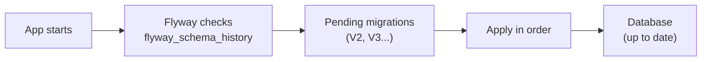

# Database Migrations

[← Back to README](../README.md)

---

Database migrations version-control your schema changes alongside your code. Every change — adding a table, dropping a column, creating an index — is a numbered, ordered, irreversible migration script. **Flyway** and **Liquibase** are the two standard tools; Flyway is simpler and more popular in Spring Boot projects.



---

## Flyway

### Maven dependency

```xml
<dependency>
    <groupId>org.flywaydb</groupId>
    <artifactId>flyway-core</artifactId>
</dependency>

<!-- For PostgreSQL 10+ -->
<dependency>
    <groupId>org.flywaydb</groupId>
    <artifactId>flyway-database-postgresql</artifactId>
</dependency>
```

Spring Boot auto-configures Flyway when it is on the classpath — it runs migrations on startup before the app accepts requests.

### Migration file naming

```
V{version}__{description}.sql

V1__create_users_table.sql
V2__add_email_index.sql
V3__create_orders_table.sql
V4__add_status_column_to_orders.sql
```

Rules:
- Prefix with `V` (versioned) or `R` (repeatable)
- Version uses numbers separated by `.` or `_`: `V1`, `V1.1`, `V2_3`
- Two underscores between version and description
- Place in `src/main/resources/db/migration/`

### Example migrations

```sql
-- V1__create_users_table.sql
CREATE TABLE users (
    id         BIGSERIAL PRIMARY KEY,
    name       VARCHAR(100) NOT NULL,
    email      VARCHAR(255) NOT NULL UNIQUE,
    password   VARCHAR(255) NOT NULL,
    role       VARCHAR(50)  NOT NULL DEFAULT 'USER',
    created_at TIMESTAMPTZ  NOT NULL DEFAULT NOW()
);
```

```sql
-- V2__create_orders_table.sql
CREATE TABLE orders (
    id         BIGSERIAL PRIMARY KEY,
    user_id    BIGINT       NOT NULL REFERENCES users(id),
    total      NUMERIC(10,2) NOT NULL,
    status     VARCHAR(50)   NOT NULL DEFAULT 'PENDING',
    created_at TIMESTAMPTZ   NOT NULL DEFAULT NOW()
);

CREATE INDEX idx_orders_user_id ON orders(user_id);
```

```sql
-- V3__add_phone_to_users.sql
ALTER TABLE users
    ADD COLUMN phone VARCHAR(20);
```

```sql
-- V4__rename_name_to_full_name.sql
ALTER TABLE users
    RENAME COLUMN name TO full_name;
```

### Configuration

```yaml
# application.yml
spring:
  flyway:
    enabled: true
    locations: classpath:db/migration
    baseline-on-migrate: true   # useful when adding Flyway to an existing DB
    validate-on-migrate: true   # fail if applied migrations have changed
    out-of-order: false         # reject migrations applied out of sequence
```

```yaml
# application-test.yml — clean DB on each test run
spring:
  flyway:
    clean-on-validation-error: true
  jpa:
    hibernate:
      ddl-auto: none   # let Flyway manage the schema, not Hibernate
```

### What NOT to do

```sql
-- WRONG — never modify an already-applied migration
-- V2__create_orders_table.sql
ALTER TABLE orders ADD COLUMN discount NUMERIC(10,2);  -- added later → BREAKS everything

-- RIGHT — create a new migration
-- V5__add_discount_to_orders.sql
ALTER TABLE orders ADD COLUMN discount NUMERIC(10,2) DEFAULT 0;
```

---

## Liquibase

Liquibase is more powerful — supports XML, YAML, JSON, and SQL formats, and can generate rollback scripts.

```xml
<dependency>
    <groupId>org.liquibase</groupId>
    <artifactId>liquibase-core</artifactId>
</dependency>
```

### Changelog master file

```yaml
# src/main/resources/db/changelog/db.changelog-master.yaml
databaseChangeLog:
  - include:
      file: db/changelog/changes/001-create-users.yaml
  - include:
      file: db/changelog/changes/002-create-orders.yaml
```

### A changeset

```yaml
# db/changelog/changes/001-create-users.yaml
databaseChangeLog:
  - changeSet:
      id: 001
      author: alice
      changes:
        - createTable:
            tableName: users
            columns:
              - column:
                  name: id
                  type: BIGINT
                  autoIncrement: true
                  constraints:
                    primaryKey: true
              - column:
                  name: email
                  type: VARCHAR(255)
                  constraints:
                    nullable: false
                    unique: true
              - column:
                  name: name
                  type: VARCHAR(100)
                  constraints:
                    nullable: false
      rollback:
        - dropTable:
            tableName: users
```

### Liquibase configuration

```yaml
spring:
  liquibase:
    change-log: classpath:db/changelog/db.changelog-master.yaml
    enabled: true
```

---

## Flyway vs Liquibase

| | Flyway | Liquibase |
|--|--------|-----------|
| Format | SQL (primary) | XML, YAML, JSON, SQL |
| Rollback | Manual (write down-scripts) | Built-in rollback |
| Simplicity | Simpler — just SQL files | More complex config |
| Spring Boot | Auto-configured | Auto-configured |
| Best for | SQL-first, simple schemas | Complex schemas needing rollback |

---

## Testing Migrations

```java
@SpringBootTest
@Testcontainers
class MigrationTest {

    @Container @ServiceConnection
    static PostgreSQLContainer<?> postgres =
        new PostgreSQLContainer<>("postgres:16-alpine");

    @Autowired Flyway flyway;
    @Autowired JdbcTemplate jdbc;

    @Test
    void allMigrationsApplyCleanly() {
        // Flyway runs on startup — if we got here, all migrations succeeded
        MigrationInfo[] applied = flyway.info().applied();
        assertThat(applied).isNotEmpty();
        Arrays.stream(applied).forEach(m ->
            assertThat(m.getState().isApplied()).isTrue());
    }

    @Test
    void usersTableExists() {
        Integer count = jdbc.queryForObject(
            "SELECT COUNT(*) FROM information_schema.tables WHERE table_name = 'users'",
            Integer.class);
        assertThat(count).isEqualTo(1);
    }
}
```

---

## Flyway Maven Plugin — CLI Commands

```bash
# validate — check applied migrations match files
mvn flyway:validate

# info — show applied and pending migrations
mvn flyway:info

# repair — fix checksum mismatches (after editing a migration in dev)
mvn flyway:repair

# clean — DROP all objects (NEVER in production)
mvn flyway:clean

# baseline — mark an existing DB as being at version 1
mvn flyway:baseline
```

---

## Best Practices

- **Never modify an applied migration** — create a new one instead.
- **Write SQL that works on the target database** — don't rely on Hibernate dialects.
- **Run migrations in CI before deploying** — catch errors before they hit production.
- **Keep migrations small** — one logical change per migration.
- **Add indexes in separate migrations** — building a large index can lock a table.
- **Test rollback** (Liquibase) or write compensating scripts (Flyway) for risky changes.
- **Use `ddl-auto=validate` or `none` in production** — let Flyway own the schema, not Hibernate.

---

## Database Migrations Summary

| Concept | Flyway |
|---------|--------|
| File location | `src/main/resources/db/migration/` |
| Naming | `V{n}__{description}.sql` |
| Track table | `flyway_schema_history` |
| Spring Boot auto-run | Yes — on startup |
| Validate on start | `spring.flyway.validate-on-migrate=true` |
| Never do | Edit an already-applied migration |
| CLI | `mvn flyway:info`, `flyway:validate`, `flyway:repair` |

---

[← Back to README](../README.md)
