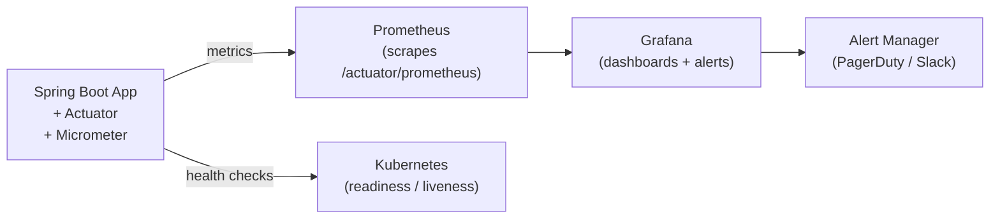

# Monitoring and Actuator

[← Back to README](../README.md)

---

You can't fix what you can't see. **Spring Boot Actuator** exposes health, metrics, and diagnostic endpoints. **Micrometer** is the metrics API that feeds data into Prometheus, Datadog, and other backends. Together they give you full observability in production.



---

## Spring Boot Actuator

```xml
<dependency>
    <groupId>org.springframework.boot</groupId>
    <artifactId>spring-boot-starter-actuator</artifactId>
</dependency>
```

### Exposing endpoints

```yaml
management:
  endpoints:
    web:
      exposure:
        include: health,info,metrics,prometheus,loggers,env,threaddump,heapdump
      base-path: /actuator
  endpoint:
    health:
      show-details: when-authorized   # or always / never
    shutdown:
      enabled: false                  # never expose in production
```

### Key endpoints

| Endpoint | Purpose |
|----------|---------|
| `/actuator/health` | App health (UP/DOWN) |
| `/actuator/info` | App version, build info |
| `/actuator/metrics` | All metric names |
| `/actuator/metrics/{name}` | A specific metric |
| `/actuator/prometheus` | Prometheus-format scrape endpoint |
| `/actuator/loggers` | View / change log levels at runtime |
| `/actuator/env` | Environment properties |
| `/actuator/threaddump` | Current thread dump |
| `/actuator/heapdump` | Download heap dump |

---

## Health Checks

```json
// GET /actuator/health
{
  "status": "UP",
  "components": {
    "db":          { "status": "UP", "details": { "database": "PostgreSQL" } },
    "redis":       { "status": "UP" },
    "diskSpace":   { "status": "UP", "details": { "free": 10737418240 } }
  }
}
```

### Custom health indicator

```java
import org.springframework.boot.actuate.health.*;

@Component
public class ExternalApiHealthIndicator implements HealthIndicator {

    private final ExternalApiClient client;

    public ExternalApiHealthIndicator(ExternalApiClient client) {
        this.client = client;
    }

    @Override
    public Health health() {
        try {
            boolean ok = client.ping();
            return ok
                ? Health.up().withDetail("responseTime", "< 200ms").build()
                : Health.down().withDetail("reason", "ping returned false").build();
        } catch (Exception e) {
            return Health.down(e).build();
        }
    }
}
```

### Liveness and Readiness (Kubernetes)

```yaml
management:
  endpoint:
    health:
      probes:
        enabled: true
  health:
    livenessstate:
      enabled: true
    readinessstate:
      enabled: true
```

```
GET /actuator/health/liveness   → { "status": "LIVE" }
GET /actuator/health/readiness  → { "status": "READY" }
```

Kubernetes probe config:

```yaml
livenessProbe:
  httpGet:
    path: /actuator/health/liveness
    port: 8080
  initialDelaySeconds: 30
  periodSeconds: 10

readinessProbe:
  httpGet:
    path: /actuator/health/readiness
    port: 8080
  initialDelaySeconds: 10
  periodSeconds: 5
```

---

## Micrometer Metrics

Micrometer is included via Actuator. Add the Prometheus registry to expose a scrape endpoint.

```xml
<dependency>
    <groupId>io.micrometer</groupId>
    <artifactId>micrometer-registry-prometheus</artifactId>
</dependency>
```

### Built-in metrics

Spring Boot auto-instruments:
- JVM: `jvm.memory.used`, `jvm.gc.pause`, `jvm.threads.live`
- HikariCP: `hikaricp.connections.active`, `hikaricp.connections.pending`
- HTTP: `http.server.requests` (count, sum, max by URI, method, status)
- Kafka: `kafka.consumer.records-consumed-rate`

```bash
# list all metric names
curl localhost:8080/actuator/metrics

# drill into a metric
curl "localhost:8080/actuator/metrics/http.server.requests?tag=uri:/api/users&tag=status:200"
```

### Custom metrics

```java
import io.micrometer.core.instrument.*;

@Service
public class OrderService {

    private final Counter ordersPlaced;
    private final Counter ordersFailed;
    private final Timer   orderProcessingTime;
    private final AtomicInteger activeOrders;

    public OrderService(MeterRegistry registry) {
        ordersPlaced = Counter.builder("orders.placed")
            .description("Total orders placed")
            .register(registry);

        ordersFailed = Counter.builder("orders.failed")
            .description("Total orders that failed")
            .tag("reason", "payment")
            .register(registry);

        orderProcessingTime = Timer.builder("orders.processing.time")
            .description("Time to process an order")
            .register(registry);

        activeOrders = registry.gauge("orders.active",
            new AtomicInteger(0));
    }

    public Order placeOrder(OrderRequest request) {
        activeOrders.incrementAndGet();
        return orderProcessingTime.record(() -> {
            try {
                Order order = processOrder(request);
                ordersPlaced.increment();
                return order;
            } catch (Exception e) {
                ordersFailed.increment();
                throw e;
            } finally {
                activeOrders.decrementAndGet();
            }
        });
    }
}
```

### @Timed annotation

```java
@Timed(value = "orders.processing.time", description = "Order processing duration")
public Order placeOrder(OrderRequest request) { ... }

// enable @Timed by registering a TimedAspect bean
@Bean
public TimedAspect timedAspect(MeterRegistry registry) {
    return new TimedAspect(registry);
}
```

---

## Build Info in /actuator/info

```xml
<!-- pom.xml -->
<build>
    <plugins>
        <plugin>
            <groupId>org.springframework.boot</groupId>
            <artifactId>spring-boot-maven-plugin</artifactId>
            <executions>
                <execution>
                    <goals><goal>build-info</goal></goals>
                </execution>
            </executions>
        </plugin>
    </plugins>
</build>
```

```yaml
# application.yml
info:
  app:
    name: "@project.name@"
    version: "@project.version@"
    description: "@project.description@"
```

```json
// GET /actuator/info
{
  "app":   { "name": "My App", "version": "1.2.3" },
  "build": { "time": "2026-06-14T14:30:00Z", "version": "1.2.3", "artifact": "myapp" }
}
```

---

## Prometheus + Grafana Stack

```yaml
# compose.yml
services:
  prometheus:
    image: prom/prometheus:v2.52.0
    ports:
      - "9090:9090"
    volumes:
      - ./prometheus.yml:/etc/prometheus/prometheus.yml

  grafana:
    image: grafana/grafana:10.4.2
    ports:
      - "3000:3000"
    environment:
      GF_SECURITY_ADMIN_PASSWORD: admin
```

```yaml
# prometheus.yml
global:
  scrape_interval: 15s

scrape_configs:
  - job_name: myapp
    static_configs:
      - targets: ['host.docker.internal:8080']
    metrics_path: /actuator/prometheus
```

Grafana dashboards: import **Spring Boot 3.x Statistics** (ID `19004`) for a ready-made dashboard.

---

## Changing Log Levels at Runtime

```bash
# get current level for a package
curl localhost:8080/actuator/loggers/com.example

# set DEBUG without restarting
curl -X POST localhost:8080/actuator/loggers/com.example \
  -H 'Content-Type: application/json' \
  -d '{"configuredLevel":"DEBUG"}'

# reset to default
curl -X POST localhost:8080/actuator/loggers/com.example \
  -H 'Content-Type: application/json' \
  -d '{"configuredLevel":null}'
```

---

## Securing Actuator Endpoints

```java
@Bean
public SecurityFilterChain filterChain(HttpSecurity http) throws Exception {
    return http
        .authorizeHttpRequests(auth -> auth
            .requestMatchers("/actuator/health/**").permitAll()
            .requestMatchers("/actuator/**").hasRole("ADMIN")
            .anyRequest().authenticated()
        )
        .build();
}
```

---

## Monitoring Summary

| Concern | Tool / Endpoint |
|---------|----------------|
| Health check | `/actuator/health` |
| Kubernetes liveness | `/actuator/health/liveness` |
| Kubernetes readiness | `/actuator/health/readiness` |
| Custom health | Implement `HealthIndicator` |
| Built-in metrics | Micrometer auto-instruments JVM, HTTP, DB pool |
| Custom counter | `Counter.builder(...).register(registry)` |
| Custom timer | `Timer.builder(...).register(registry)` |
| Method timing | `@Timed` + `TimedAspect` bean |
| Prometheus scrape | `/actuator/prometheus` |
| Grafana | Import dashboard ID `19004` |
| Runtime log level | `POST /actuator/loggers/{package}` |
| Build info | `/actuator/info` via `build-info` goal |

---

[← Back to README](../README.md)
