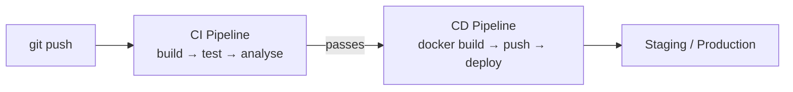

# CI/CD with GitHub Actions

[← Back to README](../README.md)

---

**CI (Continuous Integration)** automatically builds and tests every push. **CD (Continuous Deployment/Delivery)** automatically deploys passing builds to staging or production. GitHub Actions is the standard CI/CD platform for projects hosted on GitHub — workflows live in `.github/workflows/` as YAML files.



---

## Basic CI Workflow

```yaml
# .github/workflows/ci.yml
name: CI

on:
  push:
    branches: [ main, develop ]
  pull_request:
    branches: [ main ]

jobs:
  build-and-test:
    runs-on: ubuntu-latest

    services:
      postgres:
        image: postgres:16-alpine
        env:
          POSTGRES_DB: testdb
          POSTGRES_USER: test
          POSTGRES_PASSWORD: test
        ports:
          - 5432:5432
        options: >-
          --health-cmd pg_isready
          --health-interval 5s
          --health-timeout 5s
          --health-retries 5

    steps:
      - uses: actions/checkout@v4

      - name: Set up Java
        uses: actions/setup-java@v4
        with:
          java-version: '21'
          distribution: 'temurin'
          cache: maven

      - name: Build and test
        run: mvn clean verify
        env:
          SPRING_DATASOURCE_URL: jdbc:postgresql://localhost:5432/testdb
          SPRING_DATASOURCE_USERNAME: test
          SPRING_DATASOURCE_PASSWORD: test

      - name: Upload test reports
        uses: actions/upload-artifact@v4
        if: always()
        with:
          name: test-reports
          path: target/surefire-reports/

      - name: Upload coverage to Codecov
        uses: codecov/codecov-action@v4
        with:
          files: target/site/jacoco/jacoco.xml
```

---

## Matrix Build — Multiple Java Versions

```yaml
jobs:
  test:
    runs-on: ubuntu-latest
    strategy:
      matrix:
        java: [ '17', '21', '24' ]
    steps:
      - uses: actions/checkout@v4
      - uses: actions/setup-java@v4
        with:
          java-version: ${{ matrix.java }}
          distribution: temurin
          cache: maven
      - run: mvn clean verify
```

---

## CD — Build and Push Docker Image

```yaml
# .github/workflows/cd.yml
name: CD

on:
  push:
    branches: [ main ]
    tags: [ 'v*' ]

jobs:
  build-and-push:
    runs-on: ubuntu-latest
    needs: build-and-test    # only if CI passes

    permissions:
      contents: read
      packages: write

    steps:
      - uses: actions/checkout@v4

      - uses: actions/setup-java@v4
        with:
          java-version: '21'
          distribution: temurin
          cache: maven

      - name: Build JAR
        run: mvn clean package -DskipTests

      - name: Log in to GitHub Container Registry
        uses: docker/login-action@v3
        with:
          registry: ghcr.io
          username: ${{ github.actor }}
          password: ${{ secrets.GITHUB_TOKEN }}

      - name: Extract Docker metadata
        id: meta
        uses: docker/metadata-action@v5
        with:
          images: ghcr.io/${{ github.repository }}
          tags: |
            type=ref,event=branch
            type=semver,pattern={{version}}
            type=sha,prefix=sha-

      - name: Build and push Docker image
        uses: docker/build-push-action@v5
        with:
          context: .
          push: true
          tags: ${{ steps.meta.outputs.tags }}
          labels: ${{ steps.meta.outputs.labels }}
          cache-from: type=gha
          cache-to: type=gha,mode=max
```

---

## Deploy to a Server (SSH)

```yaml
  deploy:
    runs-on: ubuntu-latest
    needs: build-and-push
    environment: production

    steps:
      - name: Deploy via SSH
        uses: appleboy/ssh-action@v1
        with:
          host:     ${{ secrets.SERVER_HOST }}
          username: ${{ secrets.SERVER_USER }}
          key:      ${{ secrets.SSH_PRIVATE_KEY }}
          script: |
            docker pull ghcr.io/${{ github.repository }}:main
            docker stop myapp || true
            docker rm   myapp || true
            docker run -d \
              --name myapp \
              --restart unless-stopped \
              -p 8080:8080 \
              --env-file /etc/myapp/.env \
              ghcr.io/${{ github.repository }}:main
```

---

## Complete Pipeline with Quality Gates

```yaml
# .github/workflows/pipeline.yml
name: Pipeline

on:
  push:
    branches: [ main ]
  pull_request:
    branches: [ main ]

jobs:
  # ── 1. Test ────────────────────────────────────────────────────
  test:
    runs-on: ubuntu-latest
    steps:
      - uses: actions/checkout@v4
      - uses: actions/setup-java@v4
        with: { java-version: '21', distribution: temurin, cache: maven }
      - run: mvn clean verify -P coverage
      - name: Check coverage threshold
        run: mvn jacoco:check   # fails build if < 80% coverage

  # ── 2. Static Analysis ─────────────────────────────────────────
  analyse:
    runs-on: ubuntu-latest
    steps:
      - uses: actions/checkout@v4
        with: { fetch-depth: 0 }
      - uses: actions/setup-java@v4
        with: { java-version: '21', distribution: temurin, cache: maven }
      - name: SonarCloud Scan
        run: mvn verify sonar:sonar
        env:
          GITHUB_TOKEN: ${{ secrets.GITHUB_TOKEN }}
          SONAR_TOKEN:  ${{ secrets.SONAR_TOKEN }}

  # ── 3. Build Image ─────────────────────────────────────────────
  build-image:
    runs-on: ubuntu-latest
    needs: [ test, analyse ]
    if: github.ref == 'refs/heads/main'
    steps:
      - uses: actions/checkout@v4
      - uses: actions/setup-java@v4
        with: { java-version: '21', distribution: temurin, cache: maven }
      - run: mvn clean package -DskipTests
      - uses: docker/login-action@v3
        with:
          registry: ghcr.io
          username: ${{ github.actor }}
          password: ${{ secrets.GITHUB_TOKEN }}
      - uses: docker/build-push-action@v5
        with:
          push: true
          tags: ghcr.io/${{ github.repository }}:${{ github.sha }}

  # ── 4. Deploy to Staging ───────────────────────────────────────
  deploy-staging:
    runs-on: ubuntu-latest
    needs: build-image
    environment: staging
    steps:
      - name: Deploy to staging
        run: |
          echo "Deploying ${{ github.sha }} to staging"
          # kubectl set image deployment/myapp myapp=ghcr.io/... etc.
```

---

## Secrets Management

Store sensitive values in **GitHub Secrets** (`Settings → Secrets and variables → Actions`):

```yaml
env:
  DB_PASSWORD:     ${{ secrets.DB_PASSWORD }}
  JWT_SECRET:      ${{ secrets.JWT_SECRET }}
  SONAR_TOKEN:     ${{ secrets.SONAR_TOKEN }}
  SSH_PRIVATE_KEY: ${{ secrets.SSH_PRIVATE_KEY }}
```

Never hardcode secrets in workflow files.

---

## Dependency Caching

```yaml
- uses: actions/setup-java@v4
  with:
    java-version: '21'
    distribution: temurin
    cache: maven        # caches ~/.m2 keyed by pom.xml hash

# for Gradle
- uses: actions/setup-java@v4
  with:
    cache: gradle       # caches ~/.gradle
```

---

## Useful Actions

| Action | Purpose |
|--------|---------|
| `actions/checkout@v4` | Check out source code |
| `actions/setup-java@v4` | Install JDK |
| `docker/build-push-action@v5` | Build and push Docker image |
| `docker/login-action@v3` | Log in to a container registry |
| `docker/metadata-action@v5` | Generate Docker tags from git metadata |
| `appleboy/ssh-action@v1` | Run commands on a remote server |
| `codecov/codecov-action@v4` | Upload coverage to Codecov |
| `actions/upload-artifact@v4` | Save files between jobs |

---

## CI/CD Summary

| Concept | Implementation |
|---------|---------------|
| Trigger on push/PR | `on: push / pull_request` |
| Run tests | `mvn clean verify` |
| Service containers | `services:` block (Postgres, Redis) |
| Matrix builds | `strategy.matrix.java` |
| Build Docker image | `docker/build-push-action` |
| Push to GHCR | `docker/login-action` + `GITHUB_TOKEN` |
| Deploy via SSH | `appleboy/ssh-action` |
| Store secrets | GitHub Secrets, never in YAML |
| Cache dependencies | `actions/setup-java` with `cache: maven` |
| Quality gates | JaCoCo coverage check, SonarCloud |

---

[← Back to README](../README.md)
