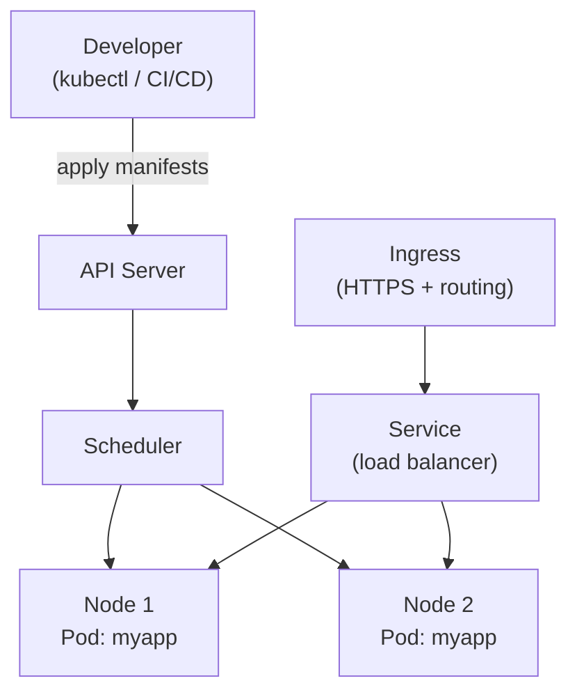

# Kubernetes

[← Back to README](../README.md)

---

**Kubernetes** (k8s) is the standard container orchestration platform. It runs Docker containers across a cluster of machines, handles restarts, scaling, rolling deploys, service discovery, and configuration — so you don't have to manage individual servers.



---

## Core Concepts

| Object | Purpose |
|--------|---------|
| **Pod** | Smallest deployable unit — one or more containers |
| **Deployment** | Manages Pods: desired count, rolling updates, rollback |
| **Service** | Stable network endpoint for a set of Pods |
| **Ingress** | HTTP/HTTPS routing into the cluster |
| **ConfigMap** | Non-sensitive configuration key-values |
| **Secret** | Sensitive data (base64-encoded in etcd) |
| **Namespace** | Logical cluster partitioning |
| **PersistentVolumeClaim** | Request for durable storage |

---

## Deployment

```yaml
# k8s/deployment.yml
apiVersion: apps/v1
kind: Deployment
metadata:
  name: myapp
  namespace: production
  labels:
    app: myapp
spec:
  replicas: 3
  selector:
    matchLabels:
      app: myapp
  strategy:
    type: RollingUpdate
    rollingUpdate:
      maxUnavailable: 1    # at most 1 pod down during update
      maxSurge: 1          # at most 1 extra pod during update
  template:
    metadata:
      labels:
        app: myapp
    spec:
      containers:
        - name: myapp
          image: ghcr.io/myorg/myapp:1.2.3
          ports:
            - containerPort: 8080
          env:
            - name: SPRING_PROFILES_ACTIVE
              value: production
            - name: DB_PASSWORD
              valueFrom:
                secretKeyRef:
                  name: myapp-secrets
                  key: db-password
          envFrom:
            - configMapRef:
                name: myapp-config
          resources:
            requests:
              memory: "256Mi"
              cpu: "250m"
            limits:
              memory: "512Mi"
              cpu: "500m"
          livenessProbe:
            httpGet:
              path: /actuator/health/liveness
              port: 8080
            initialDelaySeconds: 30
            periodSeconds: 10
          readinessProbe:
            httpGet:
              path: /actuator/health/readiness
              port: 8080
            initialDelaySeconds: 10
            periodSeconds: 5
```

---

## Service

```yaml
# k8s/service.yml
apiVersion: v1
kind: Service
metadata:
  name: myapp
  namespace: production
spec:
  selector:
    app: myapp            # routes to Pods with this label
  ports:
    - protocol: TCP
      port: 80            # service port
      targetPort: 8080    # container port
  type: ClusterIP         # internal only; use LoadBalancer for cloud
```

---

## Ingress (HTTPS routing)

```yaml
# k8s/ingress.yml
apiVersion: networking.k8s.io/v1
kind: Ingress
metadata:
  name: myapp
  namespace: production
  annotations:
    nginx.ingress.kubernetes.io/ssl-redirect: "true"
    cert-manager.io/cluster-issuer: letsencrypt-prod
spec:
  ingressClassName: nginx
  tls:
    - hosts: [ "api.example.com" ]
      secretName: myapp-tls
  rules:
    - host: api.example.com
      http:
        paths:
          - path: /
            pathType: Prefix
            backend:
              service:
                name: myapp
                port:
                  number: 80
```

---

## ConfigMap and Secrets

```yaml
# k8s/configmap.yml
apiVersion: v1
kind: ConfigMap
metadata:
  name: myapp-config
  namespace: production
data:
  SPRING_DATASOURCE_URL: "jdbc:postgresql://postgres:5432/mydb"
  SERVER_PORT: "8080"
  LOGGING_LEVEL_COM_EXAMPLE: "INFO"
```

```yaml
# k8s/secret.yml
apiVersion: v1
kind: Secret
metadata:
  name: myapp-secrets
  namespace: production
type: Opaque
data:
  # values must be base64 encoded: echo -n 'mysecret' | base64
  db-password: bXlzZWNyZXQ=
  jwt-secret: c3VwZXJzZWNyZXRrZXk=
```

> In production use **External Secrets Operator** or **Sealed Secrets** to sync from AWS Secrets Manager / Vault — never commit plain secrets to git.

---

## Horizontal Pod Autoscaler

```yaml
apiVersion: autoscaling/v2
kind: HorizontalPodAutoscaler
metadata:
  name: myapp
  namespace: production
spec:
  scaleTargetRef:
    apiVersion: apps/v1
    kind: Deployment
    name: myapp
  minReplicas: 2
  maxReplicas: 20
  metrics:
    - type: Resource
      resource:
        name: cpu
        target:
          type: Utilization
          averageUtilization: 70
    - type: Resource
      resource:
        name: memory
        target:
          type: AverageValue
          averageValue: 400Mi
```

---

## Essential kubectl Commands

```bash
# apply manifests
kubectl apply -f k8s/
kubectl apply -f k8s/deployment.yml

# status
kubectl get pods -n production
kubectl get deployments -n production
kubectl describe pod myapp-abc123 -n production

# logs
kubectl logs -f deployment/myapp -n production
kubectl logs myapp-abc123 -n production --previous  # crashed container logs

# rolling update
kubectl set image deployment/myapp myapp=ghcr.io/myorg/myapp:1.2.4 -n production
kubectl rollout status deployment/myapp -n production
kubectl rollout history deployment/myapp -n production

# rollback
kubectl rollout undo deployment/myapp -n production
kubectl rollout undo deployment/myapp --to-revision=2 -n production

# scale
kubectl scale deployment/myapp --replicas=5 -n production

# exec into a pod
kubectl exec -it deployment/myapp -n production -- sh

# port-forward for local debugging
kubectl port-forward deployment/myapp 8080:8080 -n production

# secrets and configmaps
kubectl get secret myapp-secrets -n production -o jsonpath='{.data.db-password}' | base64 -d
kubectl get configmap myapp-config -n production -o yaml
```

---

## Deploying from GitHub Actions

```yaml
# .github/workflows/deploy.yml
- name: Set up kubeconfig
  uses: azure/k8s-set-context@v3
  with:
    method: kubeconfig
    kubeconfig: ${{ secrets.KUBECONFIG }}

- name: Deploy to Kubernetes
  uses: azure/k8s-deploy@v4
  with:
    namespace: production
    manifests: |
      k8s/deployment.yml
      k8s/service.yml
    images: ghcr.io/myorg/myapp:${{ github.sha }}
```

---

## Java-Specific Configuration

```yaml
containers:
  - name: myapp
    image: ghcr.io/myorg/myapp:latest
    env:
      # tell Spring which profile to activate
      - name: SPRING_PROFILES_ACTIVE
        value: production

      # JVM container awareness
      - name: JAVA_TOOL_OPTIONS
        value: >-
          -XX:+UseContainerSupport
          -XX:MaxRAMPercentage=75.0
          -XX:+ExitOnOutOfMemoryError
          -Djava.security.egd=file:/dev/./urandom

    resources:
      requests:
        memory: "512Mi"
        cpu: "500m"
      limits:
        memory: "1Gi"      # MaxRAMPercentage reads this limit
        cpu: "1000m"
```

---

## Kubernetes Summary

| Concern | Resource / Command |
|---------|--------------------|
| Run containers | `Deployment` |
| Network endpoint | `Service` |
| HTTPS routing | `Ingress` |
| App config | `ConfigMap` |
| Secrets | `Secret` (+ External Secrets Operator) |
| Auto-scale | `HorizontalPodAutoscaler` |
| Rolling update | `kubectl set image` / `kubectl rollout` |
| Rollback | `kubectl rollout undo` |
| Logs | `kubectl logs -f deployment/myapp` |
| Health checks | `livenessProbe`, `readinessProbe` → Actuator endpoints |
| JVM in containers | `-XX:+UseContainerSupport -XX:MaxRAMPercentage=75` |

---

[← Back to README](../README.md)
