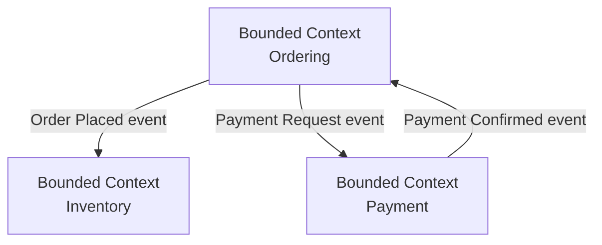

# Domain-Driven Design (DDD)

[← Back to README](../README.md)

---

**Domain-Driven Design** (DDD) is an approach to software design that centres on the **business domain** — the problem you're solving — rather than the technical stack. The code structure mirrors the language and concepts used by domain experts.



---

## Strategic DDD — the Big Picture

### Ubiquitous Language

Use the **same words** in code, conversations, and documentation. If a domain expert calls it an "Order", your class is `Order`, not `OrderRecord` or `OrderEntity`.

```java
// WRONG — technical jargon in the domain
public class OrderRecord { ... }
public void processOrderRecord(OrderRecord rec) { ... }

// RIGHT — domain language
public class Order { ... }
public void placeOrder(Order order) { ... }
```

### Bounded Context

A Bounded Context is a boundary within which a particular model applies. The word "Customer" means different things in Ordering (name, address, loyalty points) and Support (tickets, SLA tier). Each context owns its own model.

```
ordering-service/     ← Customer means: order history, shipping address
support-service/      ← Customer means: tickets, SLA
billing-service/      ← Customer means: invoices, payment method
```

---

## Tactical DDD — Building Blocks

### Entity

An object with a **unique identity** that persists over time. Two entities with the same identity are the same thing, even if their attributes differ.

```java
public class Order {
    private final OrderId id;       // identity — never changes
    private CustomerId customerId;
    private List<OrderLine> lines;
    private OrderStatus status;
    private Money total;

    public Order(OrderId id, CustomerId customerId) {
        this.id         = Objects.requireNonNull(id);
        this.customerId = Objects.requireNonNull(customerId);
        this.lines      = new ArrayList<>();
        this.status     = OrderStatus.DRAFT;
    }

    // business behaviour on the entity
    public void addLine(Product product, Quantity qty) {
        if (status != OrderStatus.DRAFT) {
            throw new IllegalStateException("Cannot modify a confirmed order");
        }
        lines.add(new OrderLine(product, qty));
        recalculateTotal();
    }

    public void confirm() {
        if (lines.isEmpty()) throw new IllegalStateException("Cannot confirm empty order");
        this.status = OrderStatus.CONFIRMED;
        // register domain event
        registerEvent(new OrderConfirmed(this.id, this.customerId, this.total));
    }

    // equals and hashCode based on identity only
    @Override public boolean equals(Object o) {
        return o instanceof Order other && id.equals(other.id);
    }
    @Override public int hashCode() { return id.hashCode(); }
}
```

### Value Object

An object with **no identity** — defined entirely by its attributes. Two value objects with the same attributes are interchangeable.

```java
// immutable — no setters, no ID
public record Money(BigDecimal amount, Currency currency) {

    public Money {
        Objects.requireNonNull(amount, "amount required");
        Objects.requireNonNull(currency, "currency required");
        if (amount.compareTo(BigDecimal.ZERO) < 0) throw new IllegalArgumentException("Amount cannot be negative");
    }

    public Money add(Money other) {
        if (!this.currency.equals(other.currency)) throw new IllegalArgumentException("Currency mismatch");
        return new Money(this.amount.add(other.amount), this.currency);
    }

    public Money multiply(int factor) {
        return new Money(amount.multiply(BigDecimal.valueOf(factor)), currency);
    }

    public static Money of(double amount, String currencyCode) {
        return new Money(BigDecimal.valueOf(amount), Currency.getInstance(currencyCode));
    }
}

public record OrderId(UUID value) {
    public static OrderId generate() { return new OrderId(UUID.randomUUID()); }
    public static OrderId of(String id) { return new OrderId(UUID.fromString(id)); }
}

public record Quantity(int value) {
    public Quantity { if (value <= 0) throw new IllegalArgumentException("Quantity must be positive"); }
}
```

### Aggregate

An **Aggregate** is a cluster of entities and value objects treated as a single unit for data changes. Every change goes through the **Aggregate Root** — the entry point that enforces invariants.

```java
// Order is the Aggregate Root
// OrderLine is an entity inside the aggregate — accessed only through Order
public class Order {   // aggregate root
    private final OrderId id;
    private final List<OrderLine> lines = new ArrayList<>();   // child entities

    // all access to lines goes through Order — never expose the list directly
    public void addLine(ProductId productId, String name, Money price, Quantity qty) {
        lines.add(new OrderLine(productId, name, price, qty));
    }

    public void removeLine(ProductId productId) {
        lines.removeIf(l -> l.getProductId().equals(productId));
    }

    // invariant enforced here, not in the caller
    public Money getTotal() {
        return lines.stream()
            .map(OrderLine::lineTotal)
            .reduce(Money.of(0, "ZAR"), Money::add);
    }
}
```

### Repository

A Repository gives the illusion that the aggregate root is stored in an in-memory collection. It hides all persistence details.

```java
// the interface lives in the domain layer — no JPA, no SQL
public interface OrderRepository {
    Order findById(OrderId id);
    List<Order> findByCustomer(CustomerId customerId);
    void save(Order order);
    void delete(OrderId id);
}

// the implementation lives in the infrastructure layer
@Repository
public class JpaOrderRepository implements OrderRepository {
    private final OrderJpaRepository jpa;   // Spring Data JPA repo

    @Override
    public Order findById(OrderId id) {
        return jpa.findById(id.value().toString())
            .map(OrderMapper::toDomain)
            .orElseThrow(() -> new OrderNotFoundException(id));
    }

    @Override
    public void save(Order order) {
        jpa.save(OrderMapper.toEntity(order));
    }
}
```

### Domain Service

Logic that doesn't naturally belong to any one entity or value object.

```java
// Pricing logic spans products and discounts — not in Order, not in Product
@Service
public class PricingService {

    public Money calculateTotal(Order order, DiscountPolicy policy) {
        Money subtotal = order.getSubtotal();
        Money discount = policy.apply(subtotal, order.getCustomerId());
        return subtotal.subtract(discount);
    }
}
```

---

## Domain Events

Domain events announce that something meaningful happened. Other parts of the system react without tight coupling.

```java
// domain event — immutable record of a fact
public record OrderConfirmed(
    OrderId orderId,
    CustomerId customerId,
    Money total,
    Instant occurredAt
) implements DomainEvent {
    public OrderConfirmed(OrderId orderId, CustomerId customerId, Money total) {
        this(orderId, customerId, total, Instant.now());
    }
}

// publish via Spring's ApplicationEventPublisher
@Service
public class OrderService {
    private final OrderRepository orders;
    private final ApplicationEventPublisher events;

    public void confirmOrder(OrderId id) {
        Order order = orders.findById(id);
        order.confirm();
        orders.save(order);
        events.publishEvent(new OrderConfirmed(order.getId(), order.getCustomerId(), order.getTotal()));
    }
}

// react in another service
@Component
public class InventoryService {
    @EventListener
    public void onOrderConfirmed(OrderConfirmed event) {
        reserveStock(event.orderId());
    }
}
```

---

## Layered Architecture (Hexagonal / Ports & Adapters)

```
src/
├── domain/                  ← pure business logic, no frameworks
│   ├── model/               Order, OrderLine, Money, OrderId
│   ├── repository/          OrderRepository (interface)
│   ├── service/             PricingService, DiscountPolicy
│   └── events/              OrderConfirmed, OrderCancelled
│
├── application/             ← use cases, orchestration
│   └── OrderApplicationService.java
│
└── infrastructure/          ← Spring, JPA, Kafka, REST
    ├── persistence/         JpaOrderRepository, OrderEntity, OrderMapper
    ├── messaging/           KafkaOrderEventPublisher
    └── web/                 OrderController, OrderRequest, OrderResponse
```

The **domain layer has zero dependencies** on Spring, JPA, or any framework — it can be tested with plain unit tests.

---

## DDD Summary

| Concept | Meaning |
|---------|---------|
| Ubiquitous Language | Use domain terms in code; same words as experts |
| Bounded Context | Boundary where a model is valid; each context owns its model |
| Entity | Object with unique identity; equality by ID |
| Value Object | Immutable; no identity; equality by attributes |
| Aggregate | Cluster of entities/VOs; root enforces invariants |
| Repository | Collection-like persistence abstraction |
| Domain Service | Business logic that spans multiple aggregates |
| Domain Event | Immutable record of a fact that occurred |
| Application Service | Orchestrates use cases; calls domain objects |
| Infrastructure | Framework-specific adapters (JPA, Kafka, REST) |

---

[← Back to README](../README.md)
