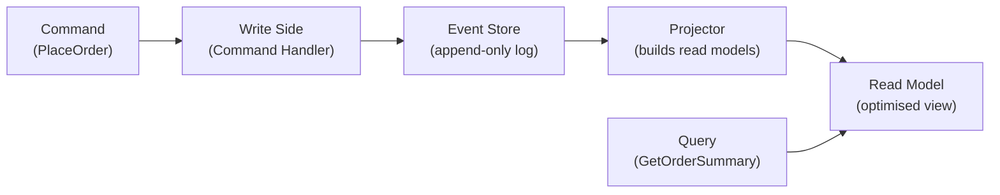

# Event Sourcing and CQRS

[← Back to README](../README.md)

---

**Event Sourcing** stores every state change as an immutable event — the current state is derived by replaying events. **CQRS** (Command Query Responsibility Segregation) separates the write model (commands) from the read model (queries), allowing each to be optimised independently.



---

## Event Sourcing

### Events — the source of truth

```java
// domain events — immutable records of what happened
public sealed interface OrderEvent permits
    OrderPlaced, ItemAdded, ItemRemoved, OrderConfirmed, OrderCancelled {}

public record OrderPlaced(
    String orderId, String customerId, Instant occurredAt) implements OrderEvent {}

public record ItemAdded(
    String orderId, String productId, String name,
    int quantity, BigDecimal price, Instant occurredAt) implements OrderEvent {}

public record OrderConfirmed(
    String orderId, BigDecimal total, Instant occurredAt) implements OrderEvent {}

public record OrderCancelled(
    String orderId, String reason, Instant occurredAt) implements OrderEvent {}
```

### Aggregate rebuilt by replaying events

```java
public class Order {
    private String orderId;
    private String customerId;
    private List<OrderLine> lines = new ArrayList<>();
    private OrderStatus status;
    private BigDecimal total;

    private final List<OrderEvent> uncommittedEvents = new ArrayList<>();

    // static factory — new order
    public static Order create(String customerId) {
        Order order = new Order();
        order.apply(new OrderPlaced(UUID.randomUUID().toString(), customerId, Instant.now()));
        return order;
    }

    // commands call apply()
    public void addItem(String productId, String name, int qty, BigDecimal price) {
        if (status != OrderStatus.DRAFT) throw new IllegalStateException("Order not in draft");
        apply(new ItemAdded(orderId, productId, name, qty, price, Instant.now()));
    }

    public void confirm() {
        if (lines.isEmpty()) throw new IllegalStateException("Cannot confirm empty order");
        apply(new OrderConfirmed(orderId, calculateTotal(), Instant.now()));
    }

    // apply mutates state — called both during command handling AND during replay
    private void apply(OrderEvent event) {
        switch (event) {
            case OrderPlaced e -> {
                this.orderId    = e.orderId();
                this.customerId = e.customerId();
                this.status     = OrderStatus.DRAFT;
            }
            case ItemAdded e -> {
                lines.add(new OrderLine(e.productId(), e.name(), e.quantity(), e.price()));
            }
            case OrderConfirmed e -> {
                this.status = OrderStatus.CONFIRMED;
                this.total  = e.total();
            }
            case OrderCancelled e -> {
                this.status = OrderStatus.CANCELLED;
            }
        }
        uncommittedEvents.add(event);
    }

    // rebuild from history (replay)
    public static Order reconstitute(List<OrderEvent> history) {
        Order order = new Order();
        history.forEach(order::applyFromHistory);
        return order;
    }

    private void applyFromHistory(OrderEvent event) {
        // same apply logic, but don't add to uncommittedEvents
        switch (event) {
            case OrderPlaced e    -> { orderId = e.orderId(); customerId = e.customerId(); status = OrderStatus.DRAFT; }
            case ItemAdded e      -> lines.add(new OrderLine(e.productId(), e.name(), e.quantity(), e.price()));
            case OrderConfirmed e -> { status = OrderStatus.CONFIRMED; total = e.total(); }
            case OrderCancelled e -> status = OrderStatus.CANCELLED;
        }
    }

    public List<OrderEvent> getUncommittedEvents() { return List.copyOf(uncommittedEvents); }
    public void clearUncommittedEvents()           { uncommittedEvents.clear(); }
}
```

### Event Store

```java
public interface EventStore {
    void append(String aggregateId, List<OrderEvent> events, int expectedVersion);
    List<OrderEvent> load(String aggregateId);
}

@Repository
public class JdbcEventStore implements EventStore {
    private final JdbcTemplate jdbc;
    private final ObjectMapper mapper;

    @Override
    @Transactional
    public void append(String aggregateId, List<OrderEvent> events, int expectedVersion) {
        // optimistic concurrency check
        int currentVersion = jdbc.queryForObject(
            "SELECT COALESCE(MAX(version), 0) FROM order_events WHERE aggregate_id = ?",
            Integer.class, aggregateId);

        if (currentVersion != expectedVersion) {
            throw new OptimisticLockingException("Concurrent modification detected");
        }

        int version = expectedVersion;
        for (OrderEvent event : events) {
            jdbc.update("""
                INSERT INTO order_events (aggregate_id, version, event_type, payload, occurred_at)
                VALUES (?, ?, ?, ?::jsonb, ?)
                """,
                aggregateId, ++version,
                event.getClass().getSimpleName(),
                mapper.writeValueAsString(event),
                Instant.now());
        }
    }

    @Override
    public List<OrderEvent> load(String aggregateId) {
        return jdbc.query(
            "SELECT event_type, payload FROM order_events WHERE aggregate_id = ? ORDER BY version",
            (rs, rowNum) -> deserialize(rs.getString("event_type"), rs.getString("payload")),
            aggregateId);
    }
}
```

---

## CQRS — Write Model

The **command handler** validates, loads the aggregate, executes the command, and saves new events.

```java
// commands are intentions
public record PlaceOrderCommand(String customerId) {}
public record AddItemCommand(String orderId, String productId, String name,
                              int quantity, BigDecimal price) {}
public record ConfirmOrderCommand(String orderId) {}

@Service
public class OrderCommandHandler {

    private final EventStore eventStore;

    public String handle(PlaceOrderCommand cmd) {
        Order order = Order.create(cmd.customerId());
        eventStore.append(order.getOrderId(), order.getUncommittedEvents(), 0);
        order.clearUncommittedEvents();
        return order.getOrderId();
    }

    public void handle(AddItemCommand cmd) {
        List<OrderEvent> history = eventStore.load(cmd.orderId());
        Order order = Order.reconstitute(history);
        int version = history.size();

        order.addItem(cmd.productId(), cmd.name(), cmd.quantity(), cmd.price());
        eventStore.append(cmd.orderId(), order.getUncommittedEvents(), version);
        order.clearUncommittedEvents();
    }

    public void handle(ConfirmOrderCommand cmd) {
        List<OrderEvent> history = eventStore.load(cmd.orderId());
        Order order = Order.reconstitute(history);
        order.confirm();
        eventStore.append(cmd.orderId(), order.getUncommittedEvents(), history.size());
    }
}
```

---

## CQRS — Read Model (Projection)

The **projector** listens to events and builds a denormalised, query-optimised view.

```java
// flat read model — optimised for UI display
@Entity
@Table(name = "order_summary")
public class OrderSummary {
    @Id private String orderId;
    private String customerId;
    private String status;
    private BigDecimal total;
    private int itemCount;
    private Instant createdAt;
    private Instant updatedAt;
}

@Component
public class OrderProjector {

    private final OrderSummaryRepository repo;

    @EventListener
    public void on(OrderPlaced event) {
        OrderSummary summary = new OrderSummary();
        summary.setOrderId(event.orderId());
        summary.setCustomerId(event.customerId());
        summary.setStatus("DRAFT");
        summary.setTotal(BigDecimal.ZERO);
        summary.setItemCount(0);
        summary.setCreatedAt(event.occurredAt());
        summary.setUpdatedAt(event.occurredAt());
        repo.save(summary);
    }

    @EventListener
    public void on(ItemAdded event) {
        repo.findById(event.orderId()).ifPresent(summary -> {
            summary.setItemCount(summary.getItemCount() + 1);
            summary.setTotal(summary.getTotal().add(
                event.price().multiply(BigDecimal.valueOf(event.quantity()))));
            summary.setUpdatedAt(event.occurredAt());
            repo.save(summary);
        });
    }

    @EventListener
    public void on(OrderConfirmed event) {
        repo.findById(event.orderId()).ifPresent(summary -> {
            summary.setStatus("CONFIRMED");
            summary.setTotal(event.total());
            summary.setUpdatedAt(event.occurredAt());
            repo.save(summary);
        });
    }
}
```

### Query side

```java
@RestController
@RequestMapping("/api/orders")
public class OrderQueryController {

    private final OrderSummaryRepository repo;

    @GetMapping
    public Page<OrderSummary> listByCustomer(
            @RequestParam String customerId, Pageable pageable) {
        return repo.findByCustomerIdOrderByCreatedAtDesc(customerId, pageable);
    }

    @GetMapping("/{orderId}")
    public ResponseEntity<OrderSummary> getOrder(@PathVariable String orderId) {
        return repo.findById(orderId)
            .map(ResponseEntity::ok)
            .orElse(ResponseEntity.notFound().build());
    }
}
```

---

## Benefits and Trade-offs

| Benefit | Trade-off |
|---------|-----------|
| Complete audit log — every change is recorded | Complexity — two models instead of one |
| Time-travel — replay to any point in time | Eventual consistency between write and read |
| Event-driven integration — publish events to other services | Projection lag — read model may be briefly stale |
| Optimised reads — read model shaped for each query | More infrastructure — event store, projectors |
| Easy A/B read models — build new projections from history | Harder to correct past events (append-only) |

---

## Event Sourcing + CQRS Summary

| Concept | Implementation |
|---------|---------------|
| Domain event | Immutable record of what happened |
| Event store | Append-only log, ordered by version |
| Aggregate replay | `reconstitute(eventStore.load(id))` |
| Command handler | Load → execute → append new events |
| Projector | Subscribe to events → update read model |
| Read model | Denormalised view, optimised for queries |
| Optimistic locking | Check `expectedVersion` before appending |
| CQRS | Commands mutate; queries read from projection |

---

[← Back to README](../README.md)
