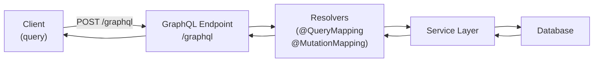

# GraphQL

[← Back to README](../README.md)

---

**GraphQL** is a query language for APIs. Instead of multiple REST endpoints returning fixed shapes, clients send a single query specifying exactly the fields they need — no more over-fetching or under-fetching. **Spring for GraphQL** is the official Spring integration.



---

## REST vs GraphQL

```
# REST — three round trips for a screen that needs user + orders + products
GET /api/users/1                 → User object (includes unused fields)
GET /api/users/1/orders          → All orders (includes unused fields)
GET /api/products/42             → Product (includes unused fields)

# GraphQL — one request, exactly the fields needed
{
  user(id: "1") {
    name
    email
    orders {
      total
      status
      items {
        product { name price }
        quantity
      }
    }
  }
}
```

---

## Maven Dependency

```xml
<dependency>
    <groupId>org.springframework.boot</groupId>
    <artifactId>spring-boot-starter-graphql</artifactId>
</dependency>
<dependency>
    <groupId>org.springframework.boot</groupId>
    <artifactId>spring-boot-starter-web</artifactId>
</dependency>
```

---

## Schema Definition Language (SDL)

The schema lives in `src/main/resources/graphql/schema.graphqls`.

```graphql
type Query {
    user(id: ID!): User
    users(page: Int = 0, size: Int = 20): UserPage!
    searchUsers(name: String): [User!]!
    product(id: ID!): Product
    products(category: String): [Product!]!
}

type Mutation {
    createUser(input: CreateUserInput!): User!
    updateUser(id: ID!, input: UpdateUserInput!): User!
    deleteUser(id: ID!): Boolean!
    placeOrder(input: PlaceOrderInput!): Order!
}

type Subscription {
    orderStatusChanged(orderId: ID!): Order!
}

type User {
    id: ID!
    name: String!
    email: String!
    orders: [Order!]!
    createdAt: String!
}

type Order {
    id: ID!
    user: User!
    items: [OrderItem!]!
    total: Float!
    status: OrderStatus!
}

type OrderItem {
    product: Product!
    quantity: Int!
    price: Float!
}

type Product {
    id: ID!
    name: String!
    price: Float!
    stock: Int!
}

type UserPage {
    content: [User!]!
    totalElements: Int!
    totalPages: Int!
}

enum OrderStatus {
    PENDING
    CONFIRMED
    SHIPPED
    DELIVERED
    CANCELLED
}

input CreateUserInput {
    name: String!
    email: String!
    password: String!
}

input UpdateUserInput {
    name: String
    email: String
}

input PlaceOrderInput {
    userId: ID!
    items: [OrderItemInput!]!
}

input OrderItemInput {
    productId: ID!
    quantity: Int!
}
```

---

## Resolvers — @QueryMapping and @MutationMapping

```java
import org.springframework.graphql.data.method.annotation.*;

@Controller
public class UserResolver {

    private final UserService userService;

    public UserResolver(UserService userService) {
        this.userService = userService;
    }

    @QueryMapping
    public Optional<User> user(@Argument Long id) {
        return userService.findById(id);
    }

    @QueryMapping
    public Page<User> users(@Argument int page, @Argument int size) {
        return userService.findAll(PageRequest.of(page, size));
    }

    @QueryMapping
    public List<User> searchUsers(@Argument String name) {
        return userService.search(name);
    }

    @MutationMapping
    public User createUser(@Argument CreateUserInput input) {
        return userService.create(input.name(), input.email(), input.password());
    }

    @MutationMapping
    public User updateUser(@Argument Long id, @Argument UpdateUserInput input) {
        return userService.update(id, input);
    }

    @MutationMapping
    public boolean deleteUser(@Argument Long id) {
        userService.delete(id);
        return true;
    }
}

public record CreateUserInput(String name, String email, String password) {}
public record UpdateUserInput(String name, String email) {}
```

---

## Field Resolvers — N+1 Prevention with @BatchMapping

Without batch loading, fetching `orders` for each user runs N queries. `@BatchMapping` batches them into one.

```java
@Controller
public class UserResolver {

    @BatchMapping                             // called once with all users at once
    public Map<User, List<Order>> orders(List<User> users) {
        List<Long> ids = users.stream().map(User::getId).toList();
        List<Order> orders = orderService.findByUserIds(ids);

        return orders.stream()
            .collect(Collectors.groupingBy(
                o -> users.stream()
                    .filter(u -> u.getId().equals(o.getUserId()))
                    .findFirst().orElseThrow()
            ));
    }
}
```

Without `@BatchMapping` you'd get N+1 queries. With it, Spring GraphQL batches the calls into one `SELECT ... WHERE user_id IN (...)`.

---

## Subscriptions — Real-time Updates

```java
@Controller
public class OrderResolver {

    private final OrderService orderService;
    private final Publisher<Order> orderPublisher;   // from Spring Reactor / event bus

    @SubscriptionMapping
    public Flux<Order> orderStatusChanged(@Argument String orderId) {
        return orderService.subscribeToOrderUpdates(orderId);
    }
}
```

```yaml
# application.yml — WebSocket transport for subscriptions
spring:
  graphql:
    websocket:
      path: /graphql
```

---

## Querying the API

```bash
# query
curl -X POST http://localhost:8080/graphql \
  -H "Content-Type: application/json" \
  -d '{
    "query": "{ user(id: \"1\") { name email orders { total status } } }"
  }'

# mutation
curl -X POST http://localhost:8080/graphql \
  -H "Content-Type: application/json" \
  -d '{
    "query": "mutation { createUser(input: { name: \"Alice\", email: \"alice@example.com\", password: \"secret\" }) { id name } }"
  }'
```

---

## GraphiQL — Browser IDE

```yaml
# application.yml
spring:
  graphql:
    graphiql:
      enabled: true
      path: /graphiql
```

Open `http://localhost:8080/graphiql` — interactive query editor with schema docs and autocomplete.

---

## Exception Handling

```java
import graphql.GraphQLError;
import graphql.schema.DataFetchingEnvironment;
import org.springframework.graphql.execution.DataFetcherExceptionResolverAdapter;

@Component
public class GraphQlExceptionHandler extends DataFetcherExceptionResolverAdapter {

    @Override
    protected GraphQLError resolveToSingleError(Throwable ex, DataFetchingEnvironment env) {
        if (ex instanceof UserNotFoundException) {
            return GraphQLError.newError()
                .errorType(graphql.ErrorType.NOT_FOUND)
                .message(ex.getMessage())
                .path(env.getExecutionStepInfo().getPath())
                .build();
        }
        if (ex instanceof ValidationException) {
            return GraphQLError.newError()
                .errorType(graphql.ErrorType.BAD_REQUEST)
                .message(ex.getMessage())
                .build();
        }
        return null;  // use default handling
    }
}
```

---

## Testing GraphQL

```java
@SpringBootTest
@AutoConfigureHttpGraphQlTester
class UserGraphQlTest {

    @Autowired
    HttpGraphQlTester tester;

    @Test
    void getUser_returnsCorrectFields() {
        tester.document("""
            {
              user(id: "1") {
                name
                email
              }
            }
            """)
            .execute()
            .path("user.name").entity(String.class).isEqualTo("Alice")
            .path("user.email").entity(String.class).isEqualTo("alice@example.com");
    }

    @Test
    void createUser_returnNewUser() {
        tester.document("""
            mutation {
              createUser(input: { name: "Bob", email: "bob@example.com", password: "secret" }) {
                id
                name
              }
            }
            """)
            .execute()
            .path("createUser.name").entity(String.class).isEqualTo("Bob");
    }
}
```

---

## GraphQL vs REST

| | GraphQL | REST |
|--|---------|------|
| Endpoint | Single `/graphql` | Multiple (`/users`, `/orders`) |
| Data shape | Client-specified | Server-defined |
| Over-fetching | None | Common |
| Under-fetching (N+1) | Avoid with `@BatchMapping` | Multiple requests |
| Schema | Strongly typed SDL | OpenAPI (optional) |
| Real-time | Subscriptions built-in | SSE / WebSocket manually |
| Learning curve | Higher | Lower |
| Best for | Complex UIs, mobile, multi-client | Simple CRUD, public APIs |

---

## GraphQL Summary

| Concept | Spring annotation / config |
|---------|---------------------------|
| Query handler | `@QueryMapping` |
| Mutation handler | `@MutationMapping` |
| Subscription | `@SubscriptionMapping` → `Flux<T>` |
| Argument | `@Argument` |
| N+1 batch loading | `@BatchMapping` |
| Schema file | `src/main/resources/graphql/schema.graphqls` |
| Browser IDE | `spring.graphql.graphiql.enabled=true` |
| Error handling | `DataFetcherExceptionResolverAdapter` |
| Testing | `HttpGraphQlTester` |

---

[← Back to README](../README.md)
