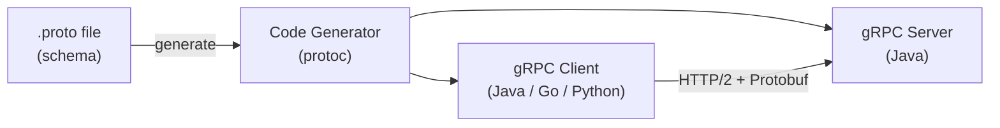

# gRPC

[← Back to README](../README.md)

---

**gRPC** is a high-performance RPC framework from Google. Services are defined in **Protocol Buffers** (`.proto` files) — a language-neutral schema that generates client and server code. gRPC uses HTTP/2, supports bidirectional streaming, and is far faster than REST for internal service-to-service calls.



---

## REST vs gRPC

| | REST | gRPC |
|--|------|------|
| Protocol | HTTP/1.1 | HTTP/2 |
| Format | JSON (text) | Protocol Buffers (binary) |
| Schema | Optional (OpenAPI) | Required (.proto) |
| Streaming | SSE / WebSocket (manual) | Built-in (4 modes) |
| Code generation | Optional | Required |
| Best for | Public APIs, browsers | Internal services, high-throughput |

---

## Maven Dependencies

```xml
<dependencies>
    <dependency>
        <groupId>io.grpc</groupId>
        <artifactId>grpc-netty-shaded</artifactId>
        <version>1.64.0</version>
    </dependency>
    <dependency>
        <groupId>io.grpc</groupId>
        <artifactId>grpc-protobuf</artifactId>
        <version>1.64.0</version>
    </dependency>
    <dependency>
        <groupId>io.grpc</groupId>
        <artifactId>grpc-stub</artifactId>
        <version>1.64.0</version>
    </dependency>
</dependencies>

<build>
    <extensions>
        <extension>
            <groupId>kr.motd.maven</groupId>
            <artifactId>os-maven-plugin</artifactId>
            <version>1.7.1</version>
        </extension>
    </extensions>
    <plugins>
        <plugin>
            <groupId>org.xolstice.maven.plugins</groupId>
            <artifactId>protobuf-maven-plugin</artifactId>
            <version>0.6.1</version>
            <configuration>
                <protocArtifact>
                    com.google.protobuf:protoc:3.25.3:exe:${os.detected.classifier}
                </protocArtifact>
                <pluginId>grpc-java</pluginId>
                <pluginArtifact>
                    io.grpc:protoc-gen-grpc-java:1.64.0:exe:${os.detected.classifier}
                </pluginArtifact>
            </configuration>
            <executions>
                <execution>
                    <goals>
                        <goal>compile</goal>
                        <goal>compile-custom</goal>
                    </goals>
                </execution>
            </executions>
        </plugin>
    </plugins>
</build>
```

---

## Defining the Service (.proto)

```protobuf
// src/main/proto/user_service.proto
syntax = "proto3";

option java_package         = "com.example.grpc";
option java_outer_classname = "UserServiceProto";
option java_multiple_files  = true;

package user;

// --- Messages ---

message User {
  int64  id    = 1;
  string name  = 2;
  string email = 3;
}

message GetUserRequest {
  int64 id = 1;
}

message CreateUserRequest {
  string name  = 1;
  string email = 2;
}

message UserList {
  repeated User users = 1;
}

message Empty {}

// --- Service ---

service UserService {
  // unary — one request, one response
  rpc GetUser    (GetUserRequest)    returns (User);
  rpc CreateUser (CreateUserRequest) returns (User);

  // server streaming — one request, stream of responses
  rpc ListUsers  (Empty)             returns (stream User);

  // client streaming — stream of requests, one response
  rpc BulkCreate (stream CreateUserRequest) returns (UserList);

  // bidirectional streaming
  rpc Chat       (stream CreateUserRequest) returns (stream User);
}
```

Run `mvn generate-sources` — protoc generates Java classes in `target/generated-sources/`.

---

## Server Implementation

```java
import io.grpc.stub.StreamObserver;

@GrpcService   // grpc-spring-boot-starter annotation
public class UserGrpcService extends UserServiceGrpc.UserServiceImplBase {

    private final UserRepository repo;

    public UserGrpcService(UserRepository repo) { this.repo = repo; }

    // unary
    @Override
    public void getUser(GetUserRequest request, StreamObserver<User> responseObserver) {
        try {
            com.example.domain.User user = repo.findById(request.getId())
                .orElseThrow(() -> new RuntimeException("Not found"));

            responseObserver.onNext(User.newBuilder()
                .setId(user.getId())
                .setName(user.getName())
                .setEmail(user.getEmail())
                .build());
            responseObserver.onCompleted();

        } catch (Exception e) {
            responseObserver.onError(
                io.grpc.Status.NOT_FOUND.withDescription(e.getMessage()).asException());
        }
    }

    // server streaming
    @Override
    public void listUsers(Empty request, StreamObserver<User> responseObserver) {
        repo.findAll().forEach(u ->
            responseObserver.onNext(User.newBuilder()
                .setId(u.getId()).setName(u.getName()).setEmail(u.getEmail()).build()));
        responseObserver.onCompleted();
    }

    // client streaming
    @Override
    public StreamObserver<CreateUserRequest> bulkCreate(StreamObserver<UserList> responseObserver) {
        List<User> created = new ArrayList<>();
        return new StreamObserver<>() {
            @Override public void onNext(CreateUserRequest req) {
                com.example.domain.User saved = repo.save(
                    new com.example.domain.User(req.getName(), req.getEmail()));
                created.add(User.newBuilder().setId(saved.getId())
                    .setName(saved.getName()).setEmail(saved.getEmail()).build());
            }
            @Override public void onError(Throwable t) { responseObserver.onError(t); }
            @Override public void onCompleted() {
                responseObserver.onNext(UserList.newBuilder().addAllUsers(created).build());
                responseObserver.onCompleted();
            }
        };
    }
}
```

### grpc-spring-boot-starter

```xml
<dependency>
    <groupId>net.devh</groupId>
    <artifactId>grpc-spring-boot-starter</artifactId>
    <version>3.1.0.RELEASE</version>
</dependency>
```

```yaml
# application.yml
grpc:
  server:
    port: 9090
```

---

## Client

```java
@Service
public class UserGrpcClient {

    @GrpcClient("user-service")   // grpc-spring-boot-starter — resolves via config
    private UserServiceGrpc.UserServiceBlockingStub blockingStub;

    public User getUser(long id) {
        return blockingStub.getUser(GetUserRequest.newBuilder().setId(id).build());
    }

    public List<User> listAll() {
        Iterator<User> iter = blockingStub.listUsers(Empty.getDefaultInstance());
        List<User> result = new ArrayList<>();
        iter.forEachRemaining(result::add);
        return result;
    }
}
```

```yaml
# application.yml (client service)
grpc:
  client:
    user-service:
      address: static://localhost:9090
      negotiation-type: plaintext   # TLS in production
```

---

## Error Handling

gRPC uses status codes instead of HTTP status codes:

```java
responseObserver.onError(
    io.grpc.Status.NOT_FOUND
        .withDescription("User not found: " + id)
        .asException());

responseObserver.onError(
    io.grpc.Status.INVALID_ARGUMENT
        .withDescription("ID must be positive")
        .asException());

// catching on client side
try {
    User u = stub.getUser(req);
} catch (StatusRuntimeException e) {
    if (e.getStatus().getCode() == io.grpc.Status.Code.NOT_FOUND) {
        System.out.println("Not found: " + e.getStatus().getDescription());
    }
}
```

| gRPC Status | Equivalent HTTP |
|-------------|----------------|
| `OK` | 200 |
| `NOT_FOUND` | 404 |
| `INVALID_ARGUMENT` | 400 |
| `UNAUTHENTICATED` | 401 |
| `PERMISSION_DENIED` | 403 |
| `ALREADY_EXISTS` | 409 |
| `INTERNAL` | 500 |
| `UNAVAILABLE` | 503 |

---

## TLS in Production

```yaml
grpc:
  server:
    port: 9090
    security:
      certificate-chain: classpath:server.crt
      private-key: classpath:server.pem

  client:
    user-service:
      address: static://user-service:9090
      negotiation-type: tls
      security:
        trust-cert-collection: classpath:ca.crt
```

---

## Testing gRPC

```java
@SpringBootTest
@GrpcSpringExtension
class UserGrpcServiceTest {

    @Autowired
    private UserRepository repo;

    @GrpcStub("userGrpcService")
    private UserServiceGrpc.UserServiceBlockingStub stub;

    @Test
    void getUser_returnsUser() {
        com.example.domain.User saved = repo.save(new com.example.domain.User("Alice", "alice@example.com"));

        User result = stub.getUser(GetUserRequest.newBuilder().setId(saved.getId()).build());

        assertThat(result.getName()).isEqualTo("Alice");
        assertThat(result.getEmail()).isEqualTo("alice@example.com");
    }

    @Test
    void getUser_notFound_throwsNotFound() {
        StatusRuntimeException ex = assertThrows(StatusRuntimeException.class,
            () -> stub.getUser(GetUserRequest.newBuilder().setId(999L).build()));

        assertThat(ex.getStatus().getCode()).isEqualTo(Status.Code.NOT_FOUND);
    }
}
```

---

## gRPC Summary

| Concept | Detail |
|---------|--------|
| Schema | `.proto` file with `message` and `service` definitions |
| Code gen | `protobuf-maven-plugin` → generates Java from `.proto` |
| Unary | One request → one response |
| Server streaming | One request → stream of responses |
| Client streaming | Stream of requests → one response |
| Bidirectional | Stream of requests ↔ stream of responses |
| Spring integration | `grpc-spring-boot-starter` + `@GrpcService`, `@GrpcClient` |
| Error handling | `io.grpc.Status` codes, not HTTP codes |
| Transport | HTTP/2, binary Protobuf — faster than REST/JSON |

---

[← Back to README](../README.md)
