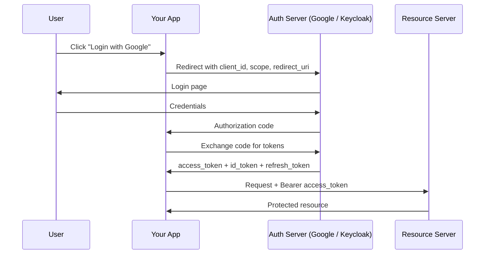

# OAuth2 and OpenID Connect

[← Back to README](../README.md)

---

**OAuth2** is the industry standard protocol for **delegated authorization** — letting a user grant a third-party app access to their resources without sharing their password. **OpenID Connect (OIDC)** is a thin identity layer on top of OAuth2 that adds user authentication (who are you?).



---

## Key Concepts

| Term | Meaning |
|------|---------|
| **Resource Owner** | The user who owns the data |
| **Client** | Your application requesting access |
| **Authorization Server** | Issues tokens (Google, Keycloak, Auth0, Okta) |
| **Resource Server** | API that accepts access tokens |
| **Access Token** | Short-lived token proving authorization (JWT) |
| **ID Token** | JWT containing user identity (OIDC only) |
| **Refresh Token** | Long-lived token to get new access tokens |
| **Scope** | What the client is allowed to do (`openid`, `email`, `profile`) |

---

## OAuth2 Grant Types (Flows)

| Flow | Use case |
|------|----------|
| **Authorization Code** | Web apps, mobile apps — most secure |
| **Authorization Code + PKCE** | SPAs and mobile apps (no client secret) |
| **Client Credentials** | Machine-to-machine, no user involved |
| **Refresh Token** | Exchange refresh token for new access token |
| ~~Implicit~~ | Deprecated — use Authorization Code + PKCE |
| ~~Password~~ | Deprecated — avoid |

---

## Spring Boot OAuth2 Client (Login with Google)

```xml
<dependency>
    <groupId>org.springframework.boot</groupId>
    <artifactId>spring-boot-starter-oauth2-client</artifactId>
</dependency>
<dependency>
    <groupId>org.springframework.boot</groupId>
    <artifactId>spring-boot-starter-security</artifactId>
</dependency>
```

```yaml
spring:
  security:
    oauth2:
      client:
        registration:
          google:
            client-id:     ${GOOGLE_CLIENT_ID}
            client-secret: ${GOOGLE_CLIENT_SECRET}
            scope: openid, email, profile
          github:
            client-id:     ${GITHUB_CLIENT_ID}
            client-secret: ${GITHUB_CLIENT_SECRET}
            scope: read:user, user:email
```

```java
@Configuration
@EnableWebSecurity
public class SecurityConfig {

    @Bean
    public SecurityFilterChain filterChain(HttpSecurity http) throws Exception {
        return http
            .authorizeHttpRequests(auth -> auth
                .requestMatchers("/", "/public/**").permitAll()
                .anyRequest().authenticated()
            )
            .oauth2Login(oauth -> oauth
                .defaultSuccessUrl("/dashboard", true)
                .failureUrl("/login?error")
            )
            .logout(logout -> logout
                .logoutSuccessUrl("/")
            )
            .build();
    }
}
```

### Accessing the authenticated user

```java
@GetMapping("/me")
public ResponseEntity<Map<String, Object>> getCurrentUser(
        @AuthenticationPrincipal OAuth2User principal) {
    return ResponseEntity.ok(Map.of(
        "name",  principal.getAttribute("name"),
        "email", principal.getAttribute("email"),
        "sub",   principal.getAttribute("sub")    // unique user ID from provider
    ));
}

// OIDC user (when scope includes openid)
@GetMapping("/me")
public ResponseEntity<Map<String, Object>> oidcUser(
        @AuthenticationPrincipal OidcUser oidcUser) {
    return ResponseEntity.ok(Map.of(
        "sub",   oidcUser.getSubject(),
        "email", oidcUser.getEmail(),
        "name",  oidcUser.getFullName(),
        "token", oidcUser.getIdToken().getTokenValue()
    ));
}
```

---

## OAuth2 Resource Server (Accepting JWTs)

Your API validates incoming Bearer tokens. The auth server publishes public keys at a well-known endpoint — Spring fetches and caches them.

```xml
<dependency>
    <groupId>org.springframework.boot</groupId>
    <artifactId>spring-boot-starter-oauth2-resource-server</artifactId>
</dependency>
```

```yaml
spring:
  security:
    oauth2:
      resourceserver:
        jwt:
          # Auth server publishes public keys here
          jwk-set-uri: https://accounts.google.com/.well-known/openid-configuration
          # or for Keycloak:
          # jwk-set-uri: http://keycloak:8080/realms/myrealm/protocol/openid-connect/certs
          issuer-uri: https://accounts.google.com
```

```java
@Configuration
@EnableWebSecurity
public class ResourceServerConfig {

    @Bean
    public SecurityFilterChain filterChain(HttpSecurity http) throws Exception {
        return http
            .csrf(csrf -> csrf.disable())
            .sessionManagement(sm -> sm.sessionCreationPolicy(SessionCreationPolicy.STATELESS))
            .authorizeHttpRequests(auth -> auth
                .requestMatchers("/public/**").permitAll()
                .requestMatchers("/api/admin/**").hasAuthority("SCOPE_admin")
                .anyRequest().authenticated()
            )
            .oauth2ResourceServer(oauth2 -> oauth2
                .jwt(jwt -> jwt.jwtAuthenticationConverter(jwtConverter()))
            )
            .build();
    }

    @Bean
    public JwtAuthenticationConverter jwtConverter() {
        JwtGrantedAuthoritiesConverter authorities = new JwtGrantedAuthoritiesConverter();
        authorities.setAuthoritiesClaimName("roles");      // custom claim name
        authorities.setAuthorityPrefix("ROLE_");

        JwtAuthenticationConverter converter = new JwtAuthenticationConverter();
        converter.setJwtGrantedAuthoritiesConverter(authorities);
        return converter;
    }
}
```

### Accessing JWT claims

```java
@GetMapping("/api/profile")
public ResponseEntity<Map<String, Object>> profile(
        @AuthenticationPrincipal Jwt jwt) {
    return ResponseEntity.ok(Map.of(
        "sub",    jwt.getSubject(),
        "email",  jwt.getClaimAsString("email"),
        "scopes", jwt.getClaimAsStringList("scp"),
        "roles",  jwt.getClaimAsStringList("roles")
    ));
}
```

---

## Client Credentials — Machine-to-Machine

When Service A calls Service B with no user involved:

```yaml
spring:
  security:
    oauth2:
      client:
        registration:
          order-service:
            client-id:     ${CLIENT_ID}
            client-secret: ${CLIENT_SECRET}
            authorization-grant-type: client_credentials
            scope: inventory:read, inventory:write
        provider:
          order-service:
            token-uri: https://auth.example.com/oauth/token
```

```java
@Configuration
public class WebClientConfig {

    @Bean
    public WebClient webClient(OAuth2AuthorizedClientManager manager) {
        var interceptor = new ServletOAuth2AuthorizedClientExchangeFilterFunction(manager);
        interceptor.setDefaultClientRegistrationId("order-service");

        return WebClient.builder()
            .apply(interceptor.oauth2Configuration())
            .baseUrl("https://inventory.internal")
            .build();
    }
}

@Service
public class InventoryClient {
    private final WebClient webClient;

    public List<Item> getItems() {
        return webClient.get()
            .uri("/api/items")
            // access token attached automatically
            .retrieve()
            .bodyToFlux(Item.class)
            .collectList()
            .block();
    }
}
```

---

## Keycloak — Self-Hosted Auth Server

```yaml
# compose.yml
services:
  keycloak:
    image: quay.io/keycloak/keycloak:24.0
    command: start-dev
    ports:
      - "8180:8080"
    environment:
      KEYCLOAK_ADMIN: admin
      KEYCLOAK_ADMIN_PASSWORD: admin
```

```yaml
# application.yml — using Keycloak as the auth server
spring:
  security:
    oauth2:
      client:
        registration:
          keycloak:
            client-id: myapp
            client-secret: ${KEYCLOAK_SECRET}
            scope: openid, email, profile, roles
        provider:
          keycloak:
            issuer-uri: http://keycloak:8180/realms/myrealm
      resourceserver:
        jwt:
          issuer-uri: http://keycloak:8180/realms/myrealm
```

---

## ID Token vs Access Token

```
ID Token (OIDC) — who the user is
{
  "sub": "user-123",
  "name": "Alice Smith",
  "email": "alice@example.com",
  "iss": "https://accounts.google.com",
  "aud": "my-client-id",
  "exp": 1718368200
}

Access Token — what the client can do
{
  "sub": "user-123",
  "scope": "openid email profile orders:read",
  "roles": ["USER"],
  "iss": "https://accounts.google.com",
  "exp": 1718368200
}
```

---

## OAuth2 Summary

| Concept | Spring annotation / config |
|---------|---------------------------|
| Login with provider | `spring-boot-starter-oauth2-client` + `oauth2Login()` |
| Current OAuth2 user | `@AuthenticationPrincipal OAuth2User` |
| Current OIDC user | `@AuthenticationPrincipal OidcUser` |
| Accept JWTs | `spring-boot-starter-oauth2-resource-server` + `oauth2ResourceServer(jwt(...))` |
| JWT claims | `@AuthenticationPrincipal Jwt` |
| Scope-based access | `.hasAuthority("SCOPE_read")` |
| Role-based access | `JwtGrantedAuthoritiesConverter` |
| M2M client credentials | `authorization-grant-type: client_credentials` |
| Auto-attach token (WebClient) | `ServletOAuth2AuthorizedClientExchangeFilterFunction` |

---

[← Back to README](../README.md)
