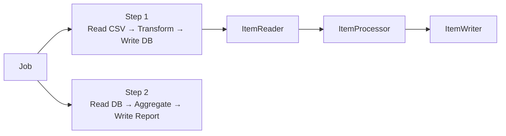

# Spring Batch

[← Back to README](../README.md)

---

**Spring Batch** is a framework for processing large volumes of records reliably. Instead of reading everything into memory, it processes data in **chunks** — read N records, process them, write them, commit a transaction, repeat. If it fails mid-way, it can restart from where it stopped.



---

## Maven Dependency

```xml
<dependency>
    <groupId>org.springframework.boot</groupId>
    <artifactId>spring-boot-starter-batch</artifactId>
</dependency>
<dependency>
    <groupId>com.h2database</groupId>
    <artifactId>h2</artifactId>
    <scope>runtime</scope>
</dependency>
```

Spring Batch stores job state in a database (the **job repository**). Spring Boot auto-creates the schema.

---

## Core Concepts

| Concept | Meaning |
|---------|---------|
| **Job** | The overall batch process — contains one or more Steps |
| **Step** | One phase of a Job — reader → processor → writer |
| **ItemReader** | Reads one item at a time from a source |
| **ItemProcessor** | Transforms or filters one item |
| **ItemWriter** | Writes a chunk (list) of processed items |
| **Chunk** | N items read, processed, and written in one transaction |
| **JobParameters** | Input parameters passed when launching the Job |
| **JobExecution** | One run of a Job — tracks status and timestamps |
| **StepExecution** | One run of a Step — tracks read/write/skip counts |

---

## Reading a CSV File

```
# src/main/resources/employees.csv
id,name,department,salary
1,Alice,Engineering,70000
2,Bob,Marketing,55000
3,Carol,Engineering,65000
```

```java
public record Employee(Long id, String name, String department, double salary) {}
```

```java
@Bean
public FlatFileItemReader<Employee> csvReader() {
    return new FlatFileItemReaderBuilder<Employee>()
        .name("employeeCsvReader")
        .resource(new ClassPathResource("employees.csv"))
        .delimited()
        .names("id", "name", "department", "salary")
        .fieldSetMapper(new BeanWrapperFieldSetMapper<>() {{
            setTargetType(Employee.class);
        }})
        .linesToSkip(1)   // skip header
        .build();
}
```

---

## Processing Items

```java
@Component
public class SalaryBoostProcessor implements ItemProcessor<Employee, Employee> {

    @Override
    public Employee process(Employee employee) {
        // return null to filter the item out (it won't be written)
        if (employee.salary() < 0) return null;

        double boosted = employee.salary() * 1.10;  // 10% raise
        return new Employee(employee.id(), employee.name(),
            employee.department(), boosted);
    }
}
```

---

## Writing to a Database

```java
@Bean
public JdbcBatchItemWriter<Employee> dbWriter(DataSource dataSource) {
    return new JdbcBatchItemWriterBuilder<Employee>()
        .itemSqlParameterSourceProvider(new BeanPropertyItemSqlParameterSourceProvider<>())
        .sql("INSERT INTO employees (id, name, department, salary) VALUES (:id, :name, :department, :salary)")
        .dataSource(dataSource)
        .build();
}
```

---

## Building the Job

```java
@Configuration
public class EmployeeBatchConfig {

    @Bean
    public Step importStep(JobRepository jobRepository,
                           PlatformTransactionManager txManager,
                           FlatFileItemReader<Employee> reader,
                           SalaryBoostProcessor processor,
                           JdbcBatchItemWriter<Employee> writer) {
        return new StepBuilder("importStep", jobRepository)
            .<Employee, Employee>chunk(100, txManager)   // read/process/write 100 at a time
            .reader(reader)
            .processor(processor)
            .writer(writer)
            .faultTolerant()
            .skipLimit(10)                               // skip up to 10 bad records
            .skip(FlatFileParseException.class)
            .retryLimit(3)                               // retry transient errors 3 times
            .retry(TransientDataAccessException.class)
            .build();
    }

    @Bean
    public Job importEmployeesJob(JobRepository jobRepository, Step importStep) {
        return new JobBuilder("importEmployeesJob", jobRepository)
            .start(importStep)
            .build();
    }
}
```

---

## Multi-Step Job

```java
@Bean
public Job multiStepJob(JobRepository repo, Step importStep,
                        Step aggregateStep, Step reportStep) {
    return new JobBuilder("multiStepJob", repo)
        .start(importStep)
        .next(aggregateStep)
        .next(reportStep)
        .build();
}
```

---

## Conditional Flow

```java
@Bean
public Job conditionalJob(JobRepository repo, Step importStep,
                          Step successStep, Step failureStep) {
    return new JobBuilder("conditionalJob", repo)
        .start(importStep)
            .on("COMPLETED").to(successStep)
            .on("FAILED").to(failureStep)
        .end()
        .build();
}
```

---

## Listeners

```java
@Component
public class JobCompletionListener implements JobExecutionListener {

    @Override
    public void beforeJob(JobExecution jobExecution) {
        log.info("Starting job: {}", jobExecution.getJobInstance().getJobName());
    }

    @Override
    public void afterJob(JobExecution jobExecution) {
        if (jobExecution.getStatus() == BatchStatus.COMPLETED) {
            log.info("Job finished: {} items processed",
                jobExecution.getStepExecutions().stream()
                    .mapToLong(StepExecution::getWriteCount).sum());
        } else {
            log.error("Job FAILED: {}", jobExecution.getAllFailureExceptions());
        }
    }
}
```

---

## Launching Jobs

### On startup (default Spring Boot behaviour)

```yaml
spring:
  batch:
    job:
      enabled: true    # auto-run on startup (default: true)
```

### Trigger manually via REST

```java
@RestController
@RequestMapping("/api/batch")
public class BatchController {

    private final JobLauncher jobLauncher;
    private final Job importEmployeesJob;

    @PostMapping("/import")
    public ResponseEntity<String> runImport() throws Exception {
        JobParameters params = new JobParametersBuilder()
            .addLong("run.id", System.currentTimeMillis())   // unique per run
            .addString("input.file", "employees.csv")
            .toJobParameters();

        JobExecution execution = jobLauncher.run(importEmployeesJob, params);
        return ResponseEntity.ok("Started: " + execution.getId());
    }

    @GetMapping("/status/{executionId}")
    public BatchStatus getStatus(@PathVariable long executionId) {
        return jobExplorer.getJobExecution(executionId).getStatus();
    }
}
```

### Scheduled

```java
@Scheduled(cron = "0 0 2 * * *")   // every night at 2 AM
public void runNightly() throws Exception {
    JobParameters params = new JobParametersBuilder()
        .addLong("timestamp", System.currentTimeMillis())
        .toJobParameters();
    jobLauncher.run(importEmployeesJob, params);
}
```

---

## Reading from a Database

```java
@Bean
public JdbcPagingItemReader<Employee> dbReader(DataSource ds) {
    Map<String, Order> sortKeys = new LinkedHashMap<>();
    sortKeys.put("id", Order.ASCENDING);

    return new JdbcPagingItemReaderBuilder<Employee>()
        .name("dbReader")
        .dataSource(ds)
        .selectClause("SELECT id, name, department, salary")
        .fromClause("FROM employees")
        .whereClause("WHERE active = true")
        .sortKeys(sortKeys)
        .pageSize(100)
        .rowMapper(new BeanPropertyRowMapper<>(Employee.class))
        .build();
}
```

---

## Partitioning — Parallel Processing

```java
@Bean
public Step partitionedStep(JobRepository repo, PartitionHandler handler,
                             Partitioner partitioner) {
    return new StepBuilder("partitionedStep", repo)
        .partitioner("workerStep", partitioner)
        .partitionHandler(handler)
        .gridSize(4)   // 4 parallel partitions
        .build();
}

@Bean
public Partitioner rangePartitioner(DataSource ds) {
    ColumnRangePartitioner partitioner = new ColumnRangePartitioner();
    partitioner.setColumn("id");
    partitioner.setTable("employees");
    partitioner.setDataSource(ds);
    return partitioner;
}
```

---

## Spring Batch Summary

| Concept | Class / Builder |
|---------|----------------|
| Define a job | `JobBuilder` |
| Define a step | `StepBuilder` with `.chunk(size, txManager)` |
| Read CSV | `FlatFileItemReaderBuilder` |
| Read DB | `JdbcPagingItemReaderBuilder` |
| Transform | `ItemProcessor<I, O>` |
| Write to DB | `JdbcBatchItemWriterBuilder` |
| Skip bad records | `.faultTolerant().skipLimit(n).skip(ExType.class)` |
| Retry transient errors | `.retryLimit(n).retry(ExType.class)` |
| Multi-step | `.start(step1).next(step2)` |
| Conditional flow | `.on("COMPLETED").to(nextStep)` |
| Parallel partitioning | `.partitioner("worker", partitioner).gridSize(n)` |
| Launch manually | `JobLauncher.run(job, params)` |
| Track status | `JobExplorer.getJobExecution(id)` |

---

[← Back to README](../README.md)
