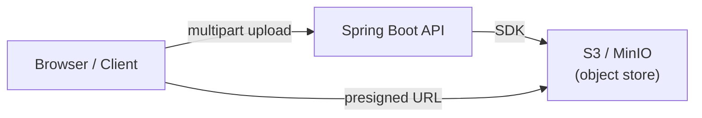

# File Storage (S3 / MinIO)

[← Back to README](../README.md)

---

Object storage is the standard way to store files in cloud applications — user uploads, generated reports, images, backups. **Amazon S3** is the dominant cloud offering; **MinIO** is an S3-compatible self-hosted alternative perfect for local development and on-premise deployments.



---

## Maven Dependency

```xml
<!-- AWS SDK v2 — also works with MinIO -->
<dependency>
    <groupId>software.amazon.awssdk</groupId>
    <artifactId>s3</artifactId>
    <version>2.25.60</version>
</dependency>
<dependency>
    <groupId>software.amazon.awssdk</groupId>
    <artifactId>sts</artifactId>
    <version>2.25.60</version>
</dependency>

<!-- Or the Spring Cloud AWS starter (simpler config) -->
<dependency>
    <groupId>io.awspring.cloud</groupId>
    <artifactId>spring-cloud-aws-starter-s3</artifactId>
    <version>3.1.1</version>
</dependency>
```

---

## Configuration

```yaml
# application.yml — AWS S3
spring:
  cloud:
    aws:
      credentials:
        access-key: ${AWS_ACCESS_KEY_ID}
        secret-key: ${AWS_SECRET_ACCESS_KEY}
      region:
        static: eu-west-1

# application-local.yml — MinIO (S3-compatible)
spring:
  cloud:
    aws:
      s3:
        endpoint: http://localhost:9000
      credentials:
        access-key: minioadmin
        secret-key: minioadmin
      region:
        static: us-east-1   # required but ignored by MinIO
```

```yaml
app:
  storage:
    bucket: my-app-uploads
```

---

## S3Client — Core Operations

```java
import software.amazon.awssdk.services.s3.S3Client;
import software.amazon.awssdk.services.s3.model.*;
import software.amazon.awssdk.core.sync.RequestBody;

@Service
public class StorageService {

    private final S3Client s3;

    @Value("${app.storage.bucket}")
    private String bucket;

    public StorageService(S3Client s3) { this.s3 = s3; }

    // upload bytes
    public String upload(String key, byte[] data, String contentType) {
        s3.putObject(PutObjectRequest.builder()
            .bucket(bucket)
            .key(key)
            .contentType(contentType)
            .build(),
            RequestBody.fromBytes(data));
        return key;
    }

    // upload InputStream (streaming — no full read into memory)
    public String upload(String key, InputStream stream, long size, String contentType) {
        s3.putObject(PutObjectRequest.builder()
            .bucket(bucket)
            .key(key)
            .contentType(contentType)
            .build(),
            RequestBody.fromInputStream(stream, size));
        return key;
    }

    // download
    public byte[] download(String key) {
        ResponseBytes<GetObjectResponse> response = s3.getObjectAsBytes(
            GetObjectRequest.builder().bucket(bucket).key(key).build());
        return response.asByteArray();
    }

    // download as stream (large files)
    public InputStream downloadStream(String key) {
        return s3.getObject(GetObjectRequest.builder()
            .bucket(bucket).key(key).build());
    }

    // delete
    public void delete(String key) {
        s3.deleteObject(DeleteObjectRequest.builder()
            .bucket(bucket).key(key).build());
    }

    // list objects with a prefix
    public List<String> listKeys(String prefix) {
        ListObjectsV2Response response = s3.listObjectsV2(
            ListObjectsV2Request.builder()
                .bucket(bucket).prefix(prefix).build());
        return response.contents().stream()
            .map(S3Object::key)
            .toList();
    }

    // check existence
    public boolean exists(String key) {
        try {
            s3.headObject(HeadObjectRequest.builder()
                .bucket(bucket).key(key).build());
            return true;
        } catch (NoSuchKeyException e) {
            return false;
        }
    }
}
```

---

## Handling Multipart Uploads in Spring

```java
@RestController
@RequestMapping("/api/files")
public class FileController {

    private final StorageService storage;

    public FileController(StorageService storage) { this.storage = storage; }

    @PostMapping("/upload")
    public ResponseEntity<UploadResponse> upload(
            @RequestParam("file") MultipartFile file,
            @RequestParam(defaultValue = "uploads") String folder) throws IOException {

        String extension = getExtension(file.getOriginalFilename());
        String key = folder + "/" + UUID.randomUUID() + "." + extension;

        storage.upload(key, file.getInputStream(),
            file.getSize(), file.getContentType());

        return ResponseEntity.ok(new UploadResponse(key, file.getSize()));
    }

    @GetMapping("/{*key}")
    public ResponseEntity<byte[]> download(@PathVariable String key) {
        byte[] data = storage.download(key);
        return ResponseEntity.ok()
            .header(HttpHeaders.CONTENT_DISPOSITION, "attachment; filename=\"" + key + "\"")
            .body(data);
    }

    @DeleteMapping("/{*key}")
    public ResponseEntity<Void> delete(@PathVariable String key) {
        storage.delete(key);
        return ResponseEntity.noContent().build();
    }

    private String getExtension(String filename) {
        if (filename == null) return "bin";
        int dot = filename.lastIndexOf('.');
        return dot >= 0 ? filename.substring(dot + 1) : "bin";
    }
}

public record UploadResponse(String key, long sizeBytes) {}
```

```yaml
# application.yml — set multipart limits
spring:
  servlet:
    multipart:
      max-file-size: 50MB
      max-request-size: 55MB
```

---

## Presigned URLs

A presigned URL lets a client upload or download directly to/from S3 — bypassing your server. The URL expires after a set time.

```java
import software.amazon.awssdk.services.s3.presigner.S3Presigner;
import software.amazon.awssdk.services.s3.presigner.model.*;

@Service
public class PresignedUrlService {

    private final S3Presigner presigner;

    @Value("${app.storage.bucket}")
    private String bucket;

    public PresignedUrlService(S3Presigner presigner) { this.presigner = presigner; }

    // client uploads directly to S3 — server never touches the bytes
    public String presignedPutUrl(String key, String contentType) {
        PresignedPutObjectRequest presigned = presigner.presignPutObject(r -> r
            .signatureDuration(Duration.ofMinutes(15))
            .putObjectRequest(put -> put
                .bucket(bucket)
                .key(key)
                .contentType(contentType)));
        return presigned.url().toString();
    }

    // client downloads directly from S3
    public String presignedGetUrl(String key) {
        PresignedGetObjectRequest presigned = presigner.presignGetObject(r -> r
            .signatureDuration(Duration.ofHours(1))
            .getObjectRequest(get -> get
                .bucket(bucket)
                .key(key)));
        return presigned.url().toString();
    }
}

// REST endpoint
@PostMapping("/upload-url")
public ResponseEntity<Map<String, String>> getUploadUrl(
        @RequestParam String filename,
        @RequestParam String contentType) {
    String key = "uploads/" + UUID.randomUUID() + "/" + filename;
    String url = presignedUrlService.presignedPutUrl(key, contentType);
    return ResponseEntity.ok(Map.of("url", url, "key", key));
}
```

Client workflow:
1. POST `/upload-url` → get `{ url, key }`
2. Client PUTs file directly to the presigned URL
3. Client POSTs `key` to your API to record the upload

---

## Running MinIO Locally

```yaml
# compose.yml
services:
  minio:
    image: minio/minio:latest
    ports:
      - "9000:9000"   # S3 API
      - "9001:9001"   # web console
    environment:
      MINIO_ROOT_USER: minioadmin
      MINIO_ROOT_PASSWORD: minioadmin
    command: server /data --console-address ":9001"
    volumes:
      - minio-data:/data

volumes:
  minio-data:
```

Open `http://localhost:9001` — MinIO console. Create a bucket, then point your app at `http://localhost:9000`.

---

## File Validation and Security

```java
@Component
public class FileValidator {

    private static final Set<String> ALLOWED_TYPES = Set.of(
        "image/jpeg", "image/png", "image/webp", "application/pdf");

    private static final long MAX_SIZE = 10 * 1024 * 1024L;  // 10 MB

    public void validate(MultipartFile file) {
        if (file.isEmpty()) throw new IllegalArgumentException("File is empty");

        if (!ALLOWED_TYPES.contains(file.getContentType())) {
            throw new IllegalArgumentException("File type not allowed: " + file.getContentType());
        }

        if (file.getSize() > MAX_SIZE) {
            throw new IllegalArgumentException("File too large: " + file.getSize());
        }

        // verify magic bytes — don't trust the Content-Type header alone
        byte[] header = file.getBytes();
        if (!isJpeg(header) && !isPng(header) && !isPdf(header)) {
            throw new IllegalArgumentException("File content does not match declared type");
        }
    }

    private boolean isJpeg(byte[] b) { return b.length > 2 && b[0] == (byte)0xFF && b[1] == (byte)0xD8; }
    private boolean isPng(byte[] b)  { return b.length > 3 && b[0] == (byte)0x89 && b[1] == 'P'; }
    private boolean isPdf(byte[] b)  { return b.length > 3 && b[0] == '%' && b[1] == 'P'; }
}
```

---

## File Storage Summary

| Task | API |
|------|-----|
| Upload bytes | `s3.putObject(request, RequestBody.fromBytes(data))` |
| Upload stream | `s3.putObject(request, RequestBody.fromInputStream(stream, size))` |
| Download | `s3.getObjectAsBytes(request).asByteArray()` |
| Delete | `s3.deleteObject(request)` |
| List keys | `s3.listObjectsV2(request).contents()` |
| Presigned upload URL | `S3Presigner.presignPutObject(...)` |
| Presigned download URL | `S3Presigner.presignGetObject(...)` |
| Local dev | MinIO — S3-compatible, Docker image `minio/minio` |
| Spring multipart | `@RequestParam MultipartFile file` |
| Size / type limit | `spring.servlet.multipart.max-file-size` |

---

[← Back to README](../README.md)
