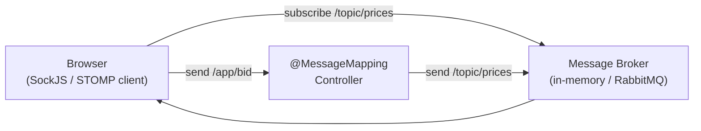

# WebSockets with Spring

[← Back to README](../README.md)

---

WebSockets provide a persistent, full-duplex channel between client and server — either side can push data at any time without the client polling. Spring supports both raw WebSockets and **STOMP** (a simple messaging protocol on top of WebSocket) which works naturally with Spring's `@MessageMapping` model.



---

## Maven Dependencies

```xml
<dependency>
    <groupId>org.springframework.boot</groupId>
    <artifactId>spring-boot-starter-websocket</artifactId>
</dependency>

<!-- optional — SockJS fallback for older browsers -->
<!-- included in spring-boot-starter-websocket -->
```

---

## STOMP WebSocket Configuration

```java
import org.springframework.messaging.simp.config.MessageBrokerRegistry;
import org.springframework.web.socket.config.annotation.*;

@Configuration
@EnableWebSocketMessageBroker
public class WebSocketConfig implements WebSocketMessageBrokerConfigurer {

    @Override
    public void configureMessageBroker(MessageBrokerRegistry config) {
        // /topic — broadcast to all subscribers
        // /queue  — send to a specific user
        config.enableSimpleBroker("/topic", "/queue");

        // prefix for messages sent from clients to server (@MessageMapping methods)
        config.setApplicationDestinationPrefixes("/app");

        // prefix for user-specific destinations
        config.setUserDestinationPrefix("/user");
    }

    @Override
    public void registerStompEndpoints(StompEndpointRegistry registry) {
        registry.addEndpoint("/ws")          // WebSocket handshake URL
                .setAllowedOriginPatterns("*")
                .withSockJS();               // SockJS fallback for browsers that don't support WS
    }
}
```

---

## Controller

```java
import org.springframework.messaging.handler.annotation.*;
import org.springframework.messaging.simp.SimpMessagingTemplate;

@Controller
public class ChatController {

    private final SimpMessagingTemplate messagingTemplate;

    public ChatController(SimpMessagingTemplate messagingTemplate) {
        this.messagingTemplate = messagingTemplate;
    }

    // client sends to /app/chat.message
    // broadcast to /topic/public
    @MessageMapping("/chat.message")
    @SendTo("/topic/public")
    public ChatMessage handleMessage(ChatMessage message) {
        return message;
    }

    // client sends to /app/chat.join
    // broadcast join notification
    @MessageMapping("/chat.join")
    @SendTo("/topic/public")
    public ChatMessage handleJoin(@Payload ChatMessage message,
                                  SimpMessageHeaderAccessor headerAccessor) {
        headerAccessor.getSessionAttributes().put("username", message.sender());
        return new ChatMessage("SERVER", message.sender() + " joined!", MessageType.JOIN);
    }

    // server-initiated push — send to all subscribers of a topic
    public void broadcastPriceUpdate(String symbol, double price) {
        messagingTemplate.convertAndSend("/topic/prices/" + symbol,
            new PriceUpdate(symbol, price, Instant.now()));
    }

    // send to a specific user's private queue
    public void sendPrivateMessage(String username, String content) {
        messagingTemplate.convertAndSendToUser(
            username, "/queue/notifications",
            new Notification(content));
    }
}

public record ChatMessage(String sender, String content, MessageType type) {}
public enum MessageType { CHAT, JOIN, LEAVE }
public record PriceUpdate(String symbol, double price, Instant timestamp) {}
public record Notification(String content) {}
```

---

## Server-Initiated Pushes (Scheduled)

```java
@Component
public class StockPriceBroadcaster {

    private final SimpMessagingTemplate messagingTemplate;

    public StockPriceBroadcaster(SimpMessagingTemplate messagingTemplate) {
        this.messagingTemplate = messagingTemplate;
    }

    @Scheduled(fixedRate = 1000)
    public void broadcastPrices() {
        List.of("AAPL", "GOOGL", "MSFT").forEach(symbol -> {
            double price = fetchLivePrice(symbol);
            messagingTemplate.convertAndSend(
                "/topic/prices/" + symbol,
                new PriceUpdate(symbol, price, Instant.now()));
        });
    }
}
```

---

## JavaScript Client

```javascript
// Using the STOMP.js library
import { Client } from '@stomp/stompjs';
import SockJS from 'sockjs-client';

const client = new Client({
    webSocketFactory: () => new SockJS('/ws'),
    onConnect: () => {
        // subscribe to a topic
        client.subscribe('/topic/public', (message) => {
            const chat = JSON.parse(message.body);
            displayMessage(chat);
        });

        // subscribe to a private queue
        client.subscribe('/user/queue/notifications', (message) => {
            showNotification(JSON.parse(message.body));
        });

        // send a message
        client.publish({
            destination: '/app/chat.join',
            body: JSON.stringify({ sender: 'Alice', content: '', type: 'JOIN' })
        });
    }
});

client.activate();

// send a chat message
function sendMessage(content) {
    client.publish({
        destination: '/app/chat.message',
        body: JSON.stringify({ sender: 'Alice', content, type: 'CHAT' })
    });
}
```

---

## Authentication with WebSockets

```java
@Configuration
@EnableWebSocketMessageBroker
public class WebSocketConfig implements WebSocketMessageBrokerConfigurer {

    @Override
    public void configureClientInboundChannel(ChannelRegistration registration) {
        registration.interceptors(new ChannelInterceptor() {
            @Override
            public Message<?> preSend(Message<?> message, MessageChannel channel) {
                StompHeaderAccessor accessor =
                    MessageHeaderAccessor.getAccessor(message, StompHeaderAccessor.class);

                if (StompCommand.CONNECT.equals(accessor.getCommand())) {
                    String token = accessor.getFirstNativeHeader("Authorization");
                    if (token != null && token.startsWith("Bearer ")) {
                        // validate JWT and set authentication
                        Authentication auth = jwtUtil.getAuthentication(token.substring(7));
                        accessor.setUser(auth);
                    }
                }
                return message;
            }
        });
    }
}
```

---

## Raw WebSocket (without STOMP)

For simpler use cases where STOMP is overkill:

```java
@Configuration
@EnableWebSocket
public class RawWebSocketConfig implements WebSocketConfigurer {

    @Override
    public void registerWebSocketHandlers(WebSocketHandlerRegistry registry) {
        registry.addHandler(new EchoWebSocketHandler(), "/echo")
                .setAllowedOrigins("*");
    }
}

public class EchoWebSocketHandler extends TextWebSocketHandler {

    private final Set<WebSocketSession> sessions = ConcurrentHashMap.newKeySet();

    @Override
    public void afterConnectionEstablished(WebSocketSession session) {
        sessions.add(session);
        log.info("Connected: {}", session.getId());
    }

    @Override
    protected void handleTextMessage(WebSocketSession session, TextMessage message) throws Exception {
        // echo to all connected sessions
        for (WebSocketSession s : sessions) {
            if (s.isOpen()) {
                s.sendMessage(message);
            }
        }
    }

    @Override
    public void afterConnectionClosed(WebSocketSession session, CloseStatus status) {
        sessions.remove(session);
        log.info("Disconnected: {}", session.getId());
    }
}
```

---

## External Broker (RabbitMQ) — for Multiple Instances

The in-memory broker only works on one app instance. For multiple instances, use RabbitMQ as the external broker:

```xml
<dependency>
    <groupId>org.springframework.boot</groupId>
    <artifactId>spring-boot-starter-reactor-netty</artifactId>
</dependency>
```

```java
@Override
public void configureMessageBroker(MessageBrokerRegistry config) {
    config.enableStompBrokerRelay("/topic", "/queue")
          .setRelayHost("localhost")
          .setRelayPort(61613)          // RabbitMQ STOMP port
          .setClientLogin("guest")
          .setClientPasscode("guest");
    config.setApplicationDestinationPrefixes("/app");
}
```

---

## WebSocket Summary

| Concept | Annotation / Class |
|---------|-------------------|
| Enable STOMP | `@EnableWebSocketMessageBroker` |
| Configure broker | `configureMessageBroker()` |
| Register endpoint | `registerStompEndpoints("/ws").withSockJS()` |
| Handle client message | `@MessageMapping("/chat.message")` |
| Broadcast to topic | `@SendTo("/topic/...")` or `SimpMessagingTemplate.convertAndSend` |
| Send to specific user | `SimpMessagingTemplate.convertAndSendToUser` |
| Server push (scheduled) | `@Scheduled` + `SimpMessagingTemplate.convertAndSend` |
| Auth in WebSocket | `ChannelInterceptor.preSend` on CONNECT |
| Raw WebSocket | `TextWebSocketHandler` + `@EnableWebSocket` |
| Multi-instance broker | RabbitMQ STOMP relay |

---

[← Back to README](../README.md)
