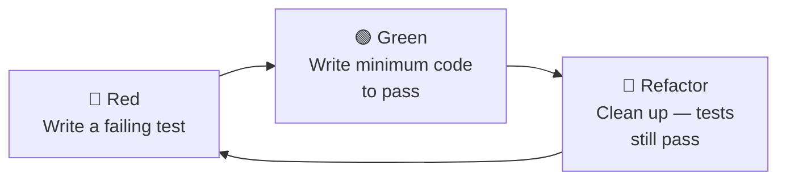

# Test-Driven Development (TDD)

[← Back to README](../README.md)

---

**TDD** is a development technique where you write a failing test *before* writing any production code, then write just enough code to make it pass, then refactor. The discipline forces small, well-defined units of behaviour and produces a comprehensive test suite as a side effect.



---

## The Three Rules of TDD

1. **Write no production code** unless it is needed to make a failing test pass.
2. **Write no more of a test** than is sufficient to fail (including compilation failures).
3. **Write no more production code** than is sufficient to make the failing test pass.

---

## A Complete TDD Example — Shopping Cart

We'll build a `ShoppingCart` class using TDD. No production class exists yet.

### Iteration 1 — empty cart

```java
// RED — write the test first
class ShoppingCartTest {

    @Test
    void newCart_isEmpty() {
        ShoppingCart cart = new ShoppingCart();
        assertThat(cart.getItemCount()).isZero();
        assertThat(cart.getTotal()).isEqualByComparingTo(BigDecimal.ZERO);
    }
}
```

This doesn't compile — `ShoppingCart` doesn't exist. Write just enough:

```java
// GREEN — minimum to compile and pass
public class ShoppingCart {
    public int getItemCount() { return 0; }
    public BigDecimal getTotal() { return BigDecimal.ZERO; }
}
```

Test passes. Nothing to refactor yet.

### Iteration 2 — add an item

```java
// RED
@Test
void addItem_increasesCountAndTotal() {
    ShoppingCart cart = new ShoppingCart();
    cart.add("Laptop", new BigDecimal("999.99"), 1);

    assertThat(cart.getItemCount()).isEqualTo(1);
    assertThat(cart.getTotal()).isEqualByComparingTo("999.99");
}
```

Fails — `add` doesn't exist. Minimum implementation:

```java
// GREEN
public class ShoppingCart {
    private final List<CartItem> items = new ArrayList<>();

    public void add(String name, BigDecimal price, int qty) {
        items.add(new CartItem(name, price, qty));
    }

    public int getItemCount() { return items.size(); }

    public BigDecimal getTotal() {
        return items.stream()
            .map(i -> i.price().multiply(BigDecimal.valueOf(i.qty())))
            .reduce(BigDecimal.ZERO, BigDecimal::add);
    }

    private record CartItem(String name, BigDecimal price, int qty) {}
}
```

### Iteration 3 — add same item twice

```java
// RED — does adding the same product merge quantities or create two lines?
@Test
void addSameItem_twice_mergesQuantity() {
    ShoppingCart cart = new ShoppingCart();
    cart.add("Book", new BigDecimal("19.99"), 1);
    cart.add("Book", new BigDecimal("19.99"), 2);

    assertThat(cart.getItemCount()).isEqualTo(1);  // one line item
    assertThat(cart.getTotal()).isEqualByComparingTo("59.97");  // 3 × 19.99
}
```

Fails with current impl. Fix:

```java
// GREEN
public void add(String name, BigDecimal price, int qty) {
    items.stream()
        .filter(i -> i.name().equals(name))
        .findFirst()
        .ifPresentOrElse(
            existing -> {
                items.remove(existing);
                items.add(new CartItem(name, price, existing.qty() + qty));
            },
            () -> items.add(new CartItem(name, price, qty))
        );
}
```

### Iteration 4 — remove an item

```java
@Test
void removeItem_removesItFromCart() {
    ShoppingCart cart = new ShoppingCart();
    cart.add("Pen", new BigDecimal("2.50"), 5);
    cart.remove("Pen");

    assertThat(cart.getItemCount()).isZero();
    assertThat(cart.getTotal()).isEqualByComparingTo(BigDecimal.ZERO);
}

@Test
void removeItem_notInCart_doesNothing() {
    ShoppingCart cart = new ShoppingCart();
    cart.remove("Ghost");  // should not throw
    assertThat(cart.getItemCount()).isZero();
}
```

```java
// GREEN
public void remove(String name) {
    items.removeIf(i -> i.name().equals(name));
}
```

### Iteration 5 — apply discount

```java
@Test
void applyDiscount_reducesTotal() {
    ShoppingCart cart = new ShoppingCart();
    cart.add("Shirt", new BigDecimal("100.00"), 2);
    cart.applyDiscount(new BigDecimal("0.10"));  // 10%

    assertThat(cart.getTotal()).isEqualByComparingTo("180.00");
}

@Test
void applyDiscount_greaterThan100Percent_throws() {
    ShoppingCart cart = new ShoppingCart();
    assertThatThrownBy(() -> cart.applyDiscount(new BigDecimal("1.5")))
        .isInstanceOf(IllegalArgumentException.class);
}
```

```java
// GREEN
private BigDecimal discountRate = BigDecimal.ZERO;

public void applyDiscount(BigDecimal rate) {
    if (rate.compareTo(BigDecimal.ONE) > 0 || rate.compareTo(BigDecimal.ZERO) < 0) {
        throw new IllegalArgumentException("Discount must be between 0 and 1");
    }
    this.discountRate = rate;
}

public BigDecimal getTotal() {
    BigDecimal subtotal = items.stream()
        .map(i -> i.price().multiply(BigDecimal.valueOf(i.qty())))
        .reduce(BigDecimal.ZERO, BigDecimal::add);
    return subtotal.multiply(BigDecimal.ONE.subtract(discountRate));
}
```

---

## TDD Patterns

### Arrange-Act-Assert (AAA)

```java
@Test
void completeOrder_marksCartAsCheckedOut() {
    // ARRANGE
    ShoppingCart cart = new ShoppingCart();
    cart.add("Hat", new BigDecimal("25.00"), 1);

    // ACT
    cart.checkout();

    // ASSERT
    assertThat(cart.isCheckedOut()).isTrue();
    assertThatThrownBy(() -> cart.add("Belt", new BigDecimal("15.00"), 1))
        .isInstanceOf(IllegalStateException.class)
        .hasMessageContaining("checked out");
}
```

### Triangulation — drive out generalisation with multiple examples

```java
// one example might be hardcoded — two forces a real algorithm
@Test void total_oneItem()  { ... assertThat(cart.getTotal()).isEqualByComparingTo("10.00"); }
@Test void total_twoItems() { ... assertThat(cart.getTotal()).isEqualByComparingTo("30.00"); }
```

### Obvious implementation vs fake it

- **Fake it** — return a hardcoded value just to go green, then write more tests to force the real implementation.
- **Obvious implementation** — when you already know the correct code, write it directly.

---

## When TDD Shines

| Situation | TDD value |
|-----------|-----------|
| Complex business rules | High — tests define the spec |
| Parsing / transformation | High — many edge cases to nail down |
| Public library API | High — tests become usage examples |
| Simple CRUD with no logic | Lower — integration tests may be more valuable |
| Exploring unfamiliar technology | Lower — write a spike first, then TDD the real code |

---

## Outside-In TDD (London School)

Start with a failing acceptance test, then drive out collaborators with mocks.

```java
// acceptance test — outside in
@Test
void placeOrder_sendsConfirmationEmail() {
    // collaborators mocked — we're testing OrderService's behaviour
    when(inventoryService.reserve(any())).thenReturn(true);

    orderService.placeOrder(new OrderRequest("alice@example.com", items));

    verify(emailService).sendOrderConfirmation("alice@example.com", any());
}
```

This forces you to define the `EmailService` interface before implementing it.

---

## TDD Summary

| Concept | Meaning |
|---------|---------|
| Red | Write a failing test first |
| Green | Write minimum code to pass |
| Refactor | Improve design — tests must still pass |
| AAA | Arrange → Act → Assert — structure of each test |
| Triangulate | Add multiple tests to force a real general solution |
| Fake it | Return hardcoded value first, then drive out with more tests |
| Outside-in | Start from acceptance test; mock collaborators; drive inward |

---

[← Back to README](../README.md)
