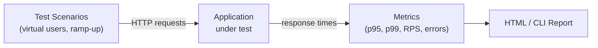

# Load Testing

[← Back to README](../README.md)

---

Load testing measures how your application behaves under concurrent user load — does it meet latency targets, where does it break, and how does it recover? The two most popular JVM-friendly tools are **Gatling** (Scala/Java DSL, HTML reports) and **k6** (JavaScript, CI-native).



---

## Gatling

### Maven Dependency

```xml
<plugin>
    <groupId>io.gatling</groupId>
    <artifactId>gatling-maven-plugin</artifactId>
    <version>4.9.6</version>
    <configuration>
        <simulationClass>simulations.ApiSimulation</simulationClass>
    </configuration>
</plugin>

<dependency>
    <groupId>io.gatling.highcharts</groupId>
    <artifactId>gatling-charts-highcharts</artifactId>
    <version>3.11.5</version>
    <scope>test</scope>
</dependency>
```

### Basic Simulation

```java
// src/test/java/simulations/ApiSimulation.java
import io.gatling.javaapi.core.*;
import io.gatling.javaapi.http.*;

import static io.gatling.javaapi.core.CoreDsl.*;
import static io.gatling.javaapi.http.HttpDsl.*;

public class ApiSimulation extends Simulation {

    HttpProtocolBuilder httpProtocol = http
        .baseUrl("http://localhost:8080")
        .acceptHeader("application/json")
        .contentTypeHeader("application/json");

    ScenarioBuilder scenario = scenario("Browse Products")
        .exec(
            http("GET /api/products")
                .get("/api/products")
                .check(status().is(200))
                .check(jsonPath("$[0].id").exists())
        )
        .pause(1)
        .exec(
            http("GET /api/products/1")
                .get("/api/products/1")
                .check(status().is(200))
                .check(jsonPath("$.name").exists())
        );

    {
        setUp(
            scenario.injectOpen(
                rampUsers(50).during(10),    // ramp 50 users over 10 s
                constantUsersPerSec(20).during(60) // hold 20 rps for 60 s
            )
        ).protocols(httpProtocol)
         .assertions(
             global().responseTime().percentile(95).lt(500),  // p95 < 500 ms
             global().successfulRequests().percent().gt(99.0)  // 99% success
         );
    }
}
```

### Feeding Test Data

```java
// CSV feeder — one row per virtual user iteration
FeederBuilder<String> userFeeder = csv("users.csv").circular();

ScenarioBuilder scenario = scenario("Login and browse")
    .feed(userFeeder)
    .exec(
        http("POST /api/auth/login")
            .post("/api/auth/login")
            .body(StringBody("""
                {"email":"#{email}","password":"#{password}"}
                """))
            .check(status().is(200))
            .check(jsonPath("$.token").saveAs("authToken"))
    )
    .exec(
        http("GET /api/orders")
            .get("/api/orders")
            .header("Authorization", "Bearer #{authToken}")
            .check(status().is(200))
    );
```

```csv
# src/test/resources/users.csv
email,password
alice@example.com,secret1
bob@example.com,secret2
carol@example.com,secret3
```

### Load Injection Profiles

```java
setUp(
    scenario.injectOpen(
        // Ramp up gradually
        rampUsers(100).during(Duration.ofSeconds(30)),

        // Spike — sudden burst
        atOnceUsers(200),

        // Stepped load
        incrementUsersPerSec(10)
            .times(5)
            .eachLevelLasting(20)
            .startingFrom(10),

        // Constant throughput
        constantUsersPerSec(50).during(Duration.ofMinutes(5))
    )
);
```

### Running Gatling

```bash
# Run simulation
mvn gatling:test

# Generate HTML report in target/gatling/
# Open target/gatling/apisimulaion-*/index.html
```

---

## k6

k6 is a Go-based tool with a JavaScript DSL — zero JVM overhead, excellent for CI.

### Installation

```bash
brew install k6           # macOS
choco install k6          # Windows
```

### Basic Script

```javascript
// load-test.js
import http from 'k6/http';
import { check, sleep } from 'k6';
import { Rate } from 'k6/metrics';

const errorRate = new Rate('errors');

export const options = {
    stages: [
        { duration: '30s', target: 50 },   // ramp up
        { duration: '1m',  target: 50 },   // hold
        { duration: '10s', target: 0  },   // ramp down
    ],
    thresholds: {
        http_req_duration: ['p(95)<500'],  // 95% of requests under 500 ms
        errors: ['rate<0.01'],             // error rate < 1%
    },
};

export default function () {
    const res = http.get('http://localhost:8080/api/products');

    const ok = check(res, {
        'status is 200':     (r) => r.status === 200,
        'response time OK':  (r) => r.timings.duration < 500,
    });

    errorRate.add(!ok);
    sleep(1);
}
```

### POST with JSON Body

```javascript
import http from 'k6/http';
import { check } from 'k6';

export default function () {
    const payload = JSON.stringify({
        name: 'Widget',
        price: 9.99,
        quantity: 3,
    });

    const params = {
        headers: { 'Content-Type': 'application/json' },
    };

    const res = http.post('http://localhost:8080/api/orders', payload, params);

    check(res, { 'order created': (r) => r.status === 201 });
}
```

### Running k6

```bash
k6 run load-test.js

# Output results to JSON
k6 run --out json=results.json load-test.js

# Stream metrics to InfluxDB / Grafana
k6 run --out influxdb=http://localhost:8086/k6 load-test.js
```

---

## Interpreting Results

### Key Metrics

| Metric | Description | Target |
|--------|-------------|--------|
| `p50` (median) | 50% of requests faster than this | < 200 ms |
| `p95` | 95% of requests faster than this | < 500 ms |
| `p99` | 99% of requests faster than this | < 1 000 ms |
| `RPS` | Requests per second (throughput) | depends on SLA |
| `error rate` | % of non-2xx responses | < 1% |
| `active users` | Concurrent virtual users | per test design |

### Gatling HTML Report Sections

- **Global Stats** — summary table of min, mean, p95, max, and error rate
- **Active Users** — virtual user count over time
- **Requests/s** — throughput over time
- **Response Time Distribution** — histogram of latency buckets
- **Response Time Percentiles** — p50/p75/p95/p99 over time

---

## CI Integration

### GitHub Actions — k6

```yaml
# .github/workflows/load-test.yml
name: Load Test

on:
  workflow_dispatch:
  schedule:
    - cron: '0 2 * * 1'   # every Monday at 02:00

jobs:
  load-test:
    runs-on: ubuntu-latest

    services:
      app:
        image: ghcr.io/yourorg/yourapp:latest
        ports:
          - 8080:8080

    steps:
      - uses: actions/checkout@v4

      - name: Install k6
        run: |
          sudo gpg -k
          sudo gpg --no-default-keyring --keyring /usr/share/keyrings/k6-archive-keyring.gpg \
            --keyserver hkp://keyserver.ubuntu.com:80 --recv-keys C5AD17C747E3415A3642D57D77C6C491D6AC1D69
          echo "deb [signed-by=/usr/share/keyrings/k6-archive-keyring.gpg] https://dl.k6.io/deb stable main" \
            | sudo tee /etc/apt/sources.list.d/k6.list
          sudo apt-get update && sudo apt-get install k6

      - name: Run load test
        run: k6 run --out json=results.json load-test.js

      - name: Upload results
        uses: actions/upload-artifact@v4
        with:
          name: load-test-results
          path: results.json
```

### GitHub Actions — Gatling

```yaml
- name: Run Gatling
  run: mvn gatling:test -pl load-tests

- name: Upload Gatling report
  uses: actions/upload-artifact@v4
  with:
    name: gatling-report
    path: target/gatling/
```

---

## Best Practices

```java
// Warm up JVM before measuring — add a warmup injection stage
setUp(
    scenario.injectOpen(
        rampUsers(10).during(10),          // warmup
        nothingFor(5),                     // pause
        rampUsers(100).during(30),         // real load
        constantUsersPerSec(50).during(120)
    )
).assertions(
    // Assert AFTER warmup — target the last stage
    forAll().responseTime().percentile(95).lt(500)
);
```

- **Isolate the system**: run only the target service; disable debug logging.
- **Use realistic data**: feeders with real-world payloads surface serialisation cost.
- **Baseline first**: run a low-load test to establish healthy p95 before ramping.
- **Watch for connection exhaustion**: ensure `HikariCP` pool and OS file descriptors are sized appropriately.
- **Don't load-test production**: use a staging environment with production-like data volumes.

---

## Load Testing Summary

| Tool | Language | Strengths |
|------|----------|-----------|
| Gatling | Java DSL | HTML reports, JVM-native, Maven plugin |
| k6 | JavaScript | Lightweight, CI-native, InfluxDB/Grafana integration |

| Concept | Meaning |
|---------|---------|
| Virtual Users | Simulated concurrent clients |
| Ramp-up | Gradually increasing load to find capacity |
| p95 / p99 | Latency percentile thresholds |
| Throughput | Requests per second the system sustains |
| Threshold | Pass/fail assertion on a metric |
| Feeder | Parameterised test data source |

---

[← Back to README](../README.md)
