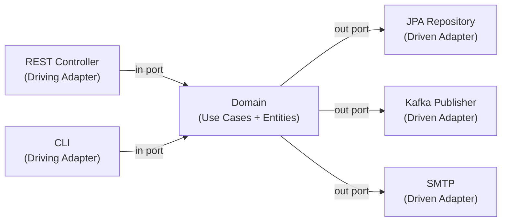

# Hexagonal Architecture (Ports & Adapters)

[← Back to README](../README.md)

---

**Hexagonal Architecture** (also called Ports & Adapters, coined by Alistair Cockburn) isolates business logic from delivery mechanisms and infrastructure. The domain sits at the centre; the outside world connects through well-defined ports (interfaces) that are satisfied by adapters (implementations).



The domain has **no** imports from Spring, JPA, Kafka, or any infrastructure library.

---

## Package Structure

```
src/main/java/com/example/
├── domain/                    ← pure Java, no framework imports
│   ├── model/
│   │   ├── Order.java
│   │   └── OrderId.java
│   ├── port/
│   │   ├── in/                ← driving ports (use-case interfaces)
│   │   │   ├── PlaceOrderUseCase.java
│   │   │   └── GetOrderUseCase.java
│   │   └── out/               ← driven ports (output interfaces)
│   │       ├── OrderRepository.java
│   │       └── PaymentGateway.java
│   └── service/               ← domain services implementing in-ports
│       └── OrderService.java
├── adapter/
│   ├── in/
│   │   └── web/               ← REST controllers (driving adapters)
│   │       └── OrderController.java
│   └── out/
│       ├── persistence/       ← JPA adapters (driven adapters)
│       │   ├── JpaOrderRepository.java
│       │   └── OrderJpaEntity.java
│       └── payment/           ← external payment adapter
│           └── StripePaymentGateway.java
└── configuration/             ← Spring @Configuration — wires everything
    └── BeanConfiguration.java
```

---

## Domain Layer

### Domain Model

```java
// domain/model/Order.java — pure Java record / class, no JPA
public class Order {

    private final OrderId id;
    private final String customerId;
    private final List<OrderLine> lines;
    private OrderStatus status;

    public Order(OrderId id, String customerId, List<OrderLine> lines) {
        this.id = id;
        this.customerId = customerId;
        this.lines = new ArrayList<>(lines);
        this.status = OrderStatus.PENDING;
    }

    public void confirm() {
        if (status != OrderStatus.PENDING) {
            throw new IllegalStateException("Order already " + status);
        }
        this.status = OrderStatus.CONFIRMED;
    }

    public BigDecimal total() {
        return lines.stream()
            .map(l -> l.price().multiply(BigDecimal.valueOf(l.quantity())))
            .reduce(BigDecimal.ZERO, BigDecimal::add);
    }

    public OrderId id()         { return id; }
    public String customerId()  { return customerId; }
    public OrderStatus status() { return status; }
    public List<OrderLine> lines() { return Collections.unmodifiableList(lines); }
}

public record OrderId(UUID value) {
    public static OrderId generate() { return new OrderId(UUID.randomUUID()); }
}

public record OrderLine(String productId, BigDecimal price, int quantity) {}
public enum OrderStatus { PENDING, CONFIRMED, CANCELLED }
```

### Driving Ports (In-Ports)

```java
// domain/port/in/PlaceOrderUseCase.java
public interface PlaceOrderUseCase {
    OrderId placeOrder(PlaceOrderCommand command);
}

public record PlaceOrderCommand(
    String customerId,
    List<OrderLineDto> lines
) {}

public record OrderLineDto(String productId, BigDecimal price, int quantity) {}
```

```java
// domain/port/in/GetOrderUseCase.java
public interface GetOrderUseCase {
    Order getOrder(OrderId id);
}
```

### Driven Ports (Out-Ports)

```java
// domain/port/out/OrderRepository.java
public interface OrderRepository {
    void save(Order order);
    Optional<Order> findById(OrderId id);
}
```

```java
// domain/port/out/PaymentGateway.java
public interface PaymentGateway {
    PaymentResult charge(String customerId, BigDecimal amount);
}

public record PaymentResult(boolean success, String transactionId) {}
```

### Domain Service

```java
// domain/service/OrderService.java
public class OrderService implements PlaceOrderUseCase, GetOrderUseCase {

    private final OrderRepository orderRepository;
    private final PaymentGateway paymentGateway;

    public OrderService(OrderRepository orderRepository,
                        PaymentGateway paymentGateway) {
        this.orderRepository = orderRepository;
        this.paymentGateway  = paymentGateway;
    }

    @Override
    public OrderId placeOrder(PlaceOrderCommand command) {
        List<OrderLine> lines = command.lines().stream()
            .map(l -> new OrderLine(l.productId(), l.price(), l.quantity()))
            .toList();

        Order order = new Order(OrderId.generate(), command.customerId(), lines);

        PaymentResult payment = paymentGateway.charge(
            command.customerId(), order.total());

        if (!payment.success()) {
            throw new PaymentFailedException("Payment declined");
        }

        order.confirm();
        orderRepository.save(order);
        return order.id();
    }

    @Override
    public Order getOrder(OrderId id) {
        return orderRepository.findById(id)
            .orElseThrow(() -> new OrderNotFoundException(id));
    }
}
```

---

## Adapter Layer

### Driving Adapter — REST Controller

```java
// adapter/in/web/OrderController.java
@RestController
@RequestMapping("/api/orders")
public class OrderController {

    private final PlaceOrderUseCase placeOrder;
    private final GetOrderUseCase getOrder;

    public OrderController(PlaceOrderUseCase placeOrder,
                           GetOrderUseCase getOrder) {
        this.placeOrder = placeOrder;
        this.getOrder   = getOrder;
    }

    @PostMapping
    public ResponseEntity<Map<String, String>> place(
            @RequestBody @Valid PlaceOrderRequest request) {
        OrderId id = placeOrder.placeOrder(request.toCommand());
        return ResponseEntity.status(HttpStatus.CREATED)
            .body(Map.of("orderId", id.value().toString()));
    }

    @GetMapping("/{id}")
    public ResponseEntity<OrderResponse> get(@PathVariable UUID id) {
        Order order = getOrder.getOrder(new OrderId(id));
        return ResponseEntity.ok(OrderResponse.from(order));
    }
}
```

### Driven Adapter — JPA Persistence

```java
// adapter/out/persistence/OrderJpaEntity.java
@Entity
@Table(name = "orders")
public class OrderJpaEntity {

    @Id
    private UUID id;
    private String customerId;
    @Enumerated(EnumType.STRING)
    private OrderStatus status;

    @OneToMany(cascade = CascadeType.ALL, orphanRemoval = true)
    @JoinColumn(name = "order_id")
    private List<OrderLineJpaEntity> lines;

    // static factory + toDomain() mapping
    public static OrderJpaEntity fromDomain(Order order) { ... }
    public Order toDomain() { ... }
}

// adapter/out/persistence/JpaOrderRepository.java
@Component
public class JpaOrderRepository implements OrderRepository {

    private final SpringDataOrderRepository springRepo;

    public JpaOrderRepository(SpringDataOrderRepository springRepo) {
        this.springRepo = springRepo;
    }

    @Override
    public void save(Order order) {
        springRepo.save(OrderJpaEntity.fromDomain(order));
    }

    @Override
    public Optional<Order> findById(OrderId id) {
        return springRepo.findById(id.value()).map(OrderJpaEntity::toDomain);
    }
}

// Spring Data repository — only used inside the adapter
interface SpringDataOrderRepository extends JpaRepository<OrderJpaEntity, UUID> {}
```

### Driven Adapter — External Payment

```java
// adapter/out/payment/StripePaymentGateway.java
@Component
public class StripePaymentGateway implements PaymentGateway {

    private final StripeClient stripeClient;

    public StripePaymentGateway(StripeClient stripeClient) {
        this.stripeClient = stripeClient;
    }

    @Override
    public PaymentResult charge(String customerId, BigDecimal amount) {
        try {
            Charge charge = stripeClient.charge(customerId,
                amount.movePointRight(2).longValue(), "usd");
            return new PaymentResult(true, charge.getId());
        } catch (StripeException e) {
            return new PaymentResult(false, null);
        }
    }
}
```

---

## Configuration — Wire Everything

```java
// configuration/BeanConfiguration.java
@Configuration
public class BeanConfiguration {

    @Bean
    public OrderService orderService(OrderRepository orderRepository,
                                     PaymentGateway paymentGateway) {
        return new OrderService(orderRepository, paymentGateway);
    }
}
```

Spring auto-detects the `@Component` adapters; the config class exposes the domain service as a bean implementing both use-case interfaces.

---

## Testing in Isolation

```java
// Unit test — pure domain, no Spring context
class OrderServiceTest {

    OrderRepository repository  = mock(OrderRepository.class);
    PaymentGateway  gateway     = mock(PaymentGateway.class);
    OrderService    service     = new OrderService(repository, gateway);

    @Test
    void placeOrder_chargesAndSavesOrder() {
        when(gateway.charge(any(), any()))
            .thenReturn(new PaymentResult(true, "txn_123"));

        PlaceOrderCommand cmd = new PlaceOrderCommand("customer-1",
            List.of(new OrderLineDto("prod-A", new BigDecimal("50.00"), 2)));

        OrderId id = service.placeOrder(cmd);

        assertThat(id).isNotNull();
        verify(repository).save(any());
    }

    @Test
    void placeOrder_paymentDeclined_throws() {
        when(gateway.charge(any(), any()))
            .thenReturn(new PaymentResult(false, null));

        assertThatThrownBy(() -> service.placeOrder(new PlaceOrderCommand(
                "customer-1",
                List.of(new OrderLineDto("prod-A", new BigDecimal("50.00"), 1)))))
            .isInstanceOf(PaymentFailedException.class);

        verify(repository, never()).save(any());
    }
}
```

---

## Hexagonal Architecture Summary

| Layer | Contents | Rule |
|-------|----------|------|
| Domain | Entities, use-case interfaces (ports), domain services | No framework imports |
| Driving Adapters | REST, CLI, message consumer | Calls in-ports |
| Driven Adapters | JPA, HTTP clients, queues | Implements out-ports |
| Configuration | Spring `@Configuration` | Wires adapters to domain |

| Term | Meaning |
|------|---------|
| Port | Interface owned by the domain |
| Adapter | Implementation of a port, lives outside the domain |
| Driving (in) port | Entry point into the domain (use case) |
| Driven (out) port | Dependency the domain needs (repository, gateway) |

---

[← Back to README](../README.md)
