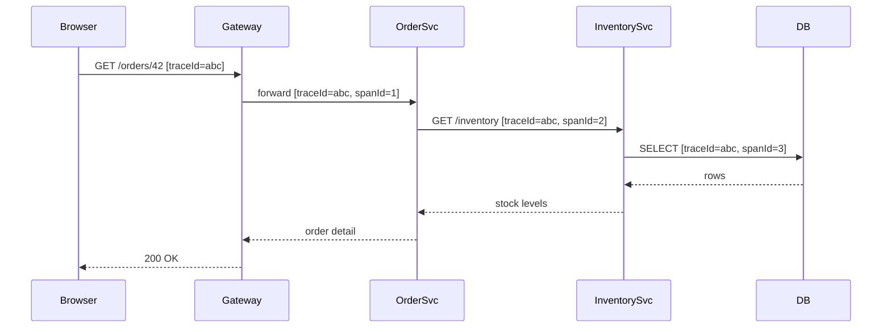

# Distributed Tracing

[← Back to README](../README.md)

---

**Distributed tracing** tracks a single request as it flows across multiple services. Each request gets a **trace ID**; each unit of work within it is a **span**. Collected spans form a flame-graph that shows exactly where time is spent and where errors occur.



---

## Dependencies

```xml
<!-- Micrometer Tracing (Bridge to OpenTelemetry or Brave) -->
<dependency>
    <groupId>io.micrometer</groupId>
    <artifactId>micrometer-tracing-bridge-otel</artifactId>
</dependency>

<!-- OpenTelemetry exporter — sends spans to Zipkin or OTLP collector -->
<dependency>
    <groupId>io.opentelemetry</groupId>
    <artifactId>opentelemetry-exporter-zipkin</artifactId>
</dependency>

<!-- or OTLP (Jaeger, Grafana Tempo) -->
<dependency>
    <groupId>io.opentelemetry</groupId>
    <artifactId>opentelemetry-exporter-otlp</artifactId>
</dependency>

<!-- Propagate trace headers through RestClient / WebClient -->
<dependency>
    <groupId>io.micrometer</groupId>
    <artifactId>micrometer-tracing</artifactId>
</dependency>
```

Spring Boot auto-configures tracing when these are on the classpath.

---

## Configuration

```yaml
# application.yml
management:
  tracing:
    sampling:
      probability: 1.0   # 1.0 = 100% of requests traced (use 0.1 in prod)

  zipkin:
    tracing:
      endpoint: http://localhost:9411/api/v2/spans

logging:
  pattern:
    level: "%5p [${spring.application.name},%X{traceId},%X{spanId}]"
```

```yaml
spring:
  application:
    name: order-service   # shown in traces
```

---

## Automatic Instrumentation

Spring Boot auto-instruments:
- Incoming HTTP requests (adds `traceId`/`spanId` to `MDC` — appears in logs)
- Outgoing `RestClient` / `WebClient` calls (propagates `traceparent` header)
- `@Scheduled` tasks
- Spring Data repository calls
- Kafka producer/consumer

No code changes needed for these.

---

## Custom Spans

```java
import io.micrometer.tracing.Span;
import io.micrometer.tracing.Tracer;

@Service
public class OrderService {

    private final Tracer tracer;
    private final PaymentClient paymentClient;

    public OrderService(Tracer tracer, PaymentClient paymentClient) {
        this.tracer        = tracer;
        this.paymentClient = paymentClient;
    }

    public OrderId placeOrder(PlaceOrderCommand command) {
        Span span = tracer.nextSpan().name("place-order").start();

        try (Tracer.SpanInScope ws = tracer.withSpan(span.start())) {
            span.tag("customer.id", command.customerId());
            span.tag("order.lines", String.valueOf(command.lines().size()));

            PaymentResult result = paymentClient.charge(command);

            if (!result.success()) {
                span.event("payment-declined");
                throw new PaymentFailedException();
            }

            span.event("payment-accepted");
            return saveOrder(command);

        } catch (Exception e) {
            span.error(e);
            throw e;
        } finally {
            span.end();
        }
    }
}
```

---

## Propagating Traces Across Services

Spring Boot auto-propagates `traceparent` (W3C) and `b3` (Zipkin) headers when you use `RestClient` or `WebClient` beans managed by Spring.

```java
// Just use a Spring-managed RestClient — propagation is automatic
@Bean
RestClient restClient(RestClient.Builder builder) {
    return builder.baseUrl("http://inventory-service").build();
}

@Service
public class InventoryClient {

    private final RestClient restClient;

    public StockLevel getStock(String productId) {
        // traceparent header is injected automatically
        return restClient.get()
            .uri("/api/inventory/{id}", productId)
            .retrieve()
            .body(StockLevel.class);
    }
}
```

---

## Running Zipkin Locally

```yaml
# compose.yml
services:
  zipkin:
    image: openzipkin/zipkin:latest
    ports:
      - "9411:9411"   # UI + HTTP API → http://localhost:9411
```

---

## Running Grafana Tempo (OTLP)

```yaml
# compose.yml
services:
  tempo:
    image: grafana/tempo:latest
    command: ["-config.file=/etc/tempo.yaml"]
    volumes:
      - ./tempo.yaml:/etc/tempo.yaml
    ports:
      - "3200:3200"    # Tempo UI / query
      - "4317:4317"    # OTLP gRPC
      - "4318:4318"    # OTLP HTTP

  grafana:
    image: grafana/grafana:latest
    ports:
      - "3000:3000"
    environment:
      GF_SECURITY_ADMIN_PASSWORD: admin
```

```yaml
# application.yml — send to Tempo via OTLP
management:
  otlp:
    tracing:
      endpoint: http://localhost:4318/v1/traces
  tracing:
    sampling:
      probability: 1.0
```

---

## Trace Context in Logs

With the MDC pattern configured, every log line includes the trace ID:

```
INFO [order-service,65f3a2b1c4d5e6f7,1a2b3c4d] Placed order 42 for customer cust-99
INFO [order-service,65f3a2b1c4d5e6f7,2b3c4d5e] Payment accepted txn_stripe_abc
```

Paste `65f3a2b1c4d5e6f7` into Zipkin or Grafana to see the full trace.

---

## OpenTelemetry Java Agent (Zero-Code Instrumentation)

The OTel Java agent auto-instruments any JVM application — no code changes, no dependencies:

```bash
java -javaagent:opentelemetry-javaagent.jar \
     -Dotel.service.name=order-service \
     -Dotel.exporter.otlp.endpoint=http://localhost:4317 \
     -jar app.jar
```

The agent instruments JDBC, HTTP clients, Kafka, gRPC, and more automatically.

---

## Distributed Tracing Summary

| Concept | Meaning |
|---------|---------|
| Trace | End-to-end journey of one request across all services |
| Span | A single unit of work within a trace |
| Trace ID | Unique ID shared across all spans of a trace |
| Parent span | The span that created the current span |
| `traceparent` | W3C header used to propagate context between services |
| Sampling | Fraction of requests to trace (1.0 = all, 0.1 = 10%) |

| Tool | Role |
|------|------|
| Micrometer Tracing | Spring integration layer (API + bridge) |
| OpenTelemetry (OTel) | Vendor-neutral standard for traces/metrics/logs |
| Zipkin | Lightweight trace collector and UI |
| Grafana Tempo | Scalable trace backend, integrates with Grafana dashboards |
| OTel Java Agent | Zero-code instrumentation via JVM agent |

---

[← Back to README](../README.md)
