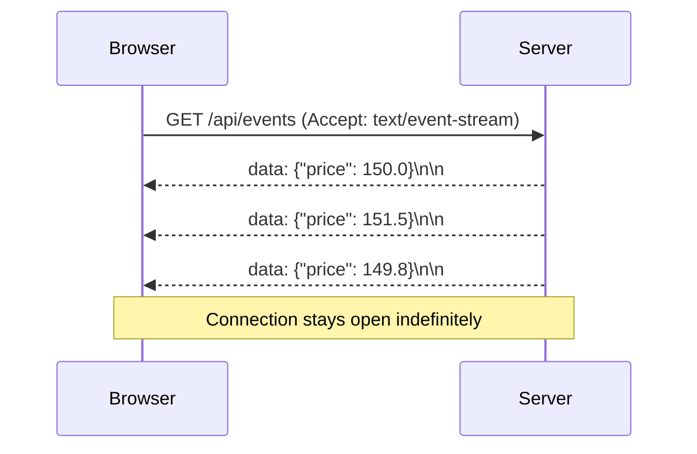

# Server-Sent Events (SSE)

[← Back to README](../README.md)

---

**Server-Sent Events** (SSE) is a lightweight HTTP-based protocol for one-way, server-to-client streaming. The server keeps the connection open and pushes text events whenever new data is available. Unlike WebSockets, SSE is unidirectional (server → client only) and uses plain HTTP — making it simpler to implement and compatible with standard load balancers and firewalls.



---

## When to Use SSE vs WebSockets

| | SSE | WebSockets |
|---|-----|------------|
| Direction | Server → Client only | Bidirectional |
| Protocol | HTTP/1.1 or HTTP/2 | WS upgrade |
| Reconnection | Built-in auto-reconnect | Manual |
| Load balancer support | Standard HTTP | Requires WS support |
| Use case | Live feeds, notifications, progress | Chat, collaborative editing |

---

## Spring MVC — SseEmitter

```java
import org.springframework.web.servlet.mvc.method.annotation.SseEmitter;

@RestController
@RequestMapping("/api")
public class PriceController {

    private final CopyOnWriteArrayList<SseEmitter> emitters = new CopyOnWriteArrayList<>();

    // Client connects here
    @GetMapping(value = "/prices/stream", produces = MediaType.TEXT_EVENT_STREAM_VALUE)
    public SseEmitter streamPrices() {
        SseEmitter emitter = new SseEmitter(Long.MAX_VALUE);  // no timeout

        emitters.add(emitter);

        emitter.onCompletion(() -> emitters.remove(emitter));
        emitter.onTimeout(()    -> emitters.remove(emitter));
        emitter.onError(e      -> emitters.remove(emitter));

        return emitter;
    }

    // Call this to push an event to all connected clients
    public void broadcastPrice(String symbol, double price) {
        List<SseEmitter> dead = new ArrayList<>();

        for (SseEmitter emitter : emitters) {
            try {
                emitter.send(SseEmitter.event()
                    .id(UUID.randomUUID().toString())
                    .name("price-update")
                    .data(Map.of("symbol", symbol, "price", price))
                    .reconnectTime(3000));
            } catch (IOException e) {
                dead.add(emitter);
            }
        }

        emitters.removeAll(dead);
    }
}
```

### Push on a Schedule

```java
@Component
public class StockPricePublisher {

    private final PriceController priceController;

    @Scheduled(fixedRate = 1000)
    public void publish() {
        List.of("AAPL", "GOOGL", "MSFT").forEach(symbol ->
            priceController.broadcastPrice(symbol, fetchLivePrice(symbol)));
    }
}
```

---

## Spring WebFlux — Reactive SSE

With WebFlux, SSE is built into `Flux` — no emitter management needed.

```java
import reactor.core.publisher.Flux;
import java.time.Duration;

@RestController
@RequestMapping("/api")
public class ReactiveEventController {

    private final PriceService priceService;

    @GetMapping(value = "/prices/stream", produces = MediaType.TEXT_EVENT_STREAM_VALUE)
    public Flux<ServerSentEvent<PriceUpdate>> streamPrices() {
        return Flux.interval(Duration.ofSeconds(1))
            .map(tick -> priceService.getLatestPrice("AAPL"))
            .map(price -> ServerSentEvent.<PriceUpdate>builder()
                .id(String.valueOf(price.timestamp()))
                .event("price-update")
                .data(price)
                .retry(Duration.ofSeconds(3))
                .build());
    }

    // Emit on demand via a Sinks.Many
    private final Sinks.Many<PriceUpdate> sink =
        Sinks.many().multicast().directBestEffort();

    @GetMapping(value = "/notifications/stream",
                produces = MediaType.TEXT_EVENT_STREAM_VALUE)
    public Flux<ServerSentEvent<PriceUpdate>> streamNotifications() {
        return sink.asFlux()
            .map(update -> ServerSentEvent.<PriceUpdate>builder()
                .data(update)
                .build());
    }

    public void pushUpdate(PriceUpdate update) {
        sink.tryEmitNext(update);
    }
}
```

---

## SSE Event Format

The raw HTTP stream looks like:

```
id: 1718012345678
event: price-update
retry: 3000
data: {"symbol":"AAPL","price":182.5}

id: 1718012346701
event: price-update
data: {"symbol":"GOOGL","price":175.1}

```

Each event ends with a blank line (`\n\n`). The `id` field allows clients to resume from the last seen event after reconnecting (via `Last-Event-ID` request header).

---

## JavaScript Client

```javascript
const source = new EventSource('/api/prices/stream');

// listen to a named event
source.addEventListener('price-update', (e) => {
    const price = JSON.parse(e.data);
    console.log(`${price.symbol}: ${price.price}`);
});

// generic message handler (events without a name field)
source.onmessage = (e) => console.log(e.data);

// handle errors / reconnection
source.onerror = (e) => {
    if (source.readyState === EventSource.CLOSED) {
        console.log('Connection closed');
    }
};

// close when done
source.close();
```

The browser automatically reconnects after `retry` milliseconds if the connection drops.

---

## Resuming from Last Event

```java
@GetMapping(value = "/events/stream", produces = MediaType.TEXT_EVENT_STREAM_VALUE)
public Flux<ServerSentEvent<OrderEvent>> stream(
        @RequestHeader(value = "Last-Event-ID", required = false)
        String lastEventId) {

    Flux<OrderEvent> events = lastEventId != null
        ? eventStore.loadFrom(lastEventId)   // replay missed events
        : eventStore.liveEvents();

    return events.map(event -> ServerSentEvent.<OrderEvent>builder()
        .id(event.id())
        .data(event)
        .build());
}
```

---

## Security — Authenticated SSE

```java
@GetMapping(value = "/notifications/stream",
            produces = MediaType.TEXT_EVENT_STREAM_VALUE)
public Flux<ServerSentEvent<Notification>> streamNotifications(
        @AuthenticationPrincipal UserDetails user) {

    return notificationService.streamFor(user.getUsername())
        .map(n -> ServerSentEvent.<Notification>builder().data(n).build());
}
```

SSE reuses standard HTTP security — `SecurityFilterChain` applies normally.

---

## Configuration

```yaml
# Spring MVC async timeout
spring:
  mvc:
    async:
      request-timeout: -1   # -1 = no timeout (default is 10 s)
```

For HTTP/2 (preferred for SSE — no 6-connection-per-domain limit):

```yaml
server:
  http2:
    enabled: true
  ssl:
    enabled: true   # HTTP/2 requires TLS in most browsers
```

---

## SSE Summary

| Concept | Spring MVC | Spring WebFlux |
|---------|-----------|----------------|
| Return type | `SseEmitter` | `Flux<ServerSentEvent<T>>` |
| Push event | `emitter.send(SseEmitter.event()...)` | `sink.tryEmitNext(value)` |
| Backpressure | Manual (remove dead emitters) | Built-in via Reactor |
| Connection limit | Per HTTP/1.1 limits (6/domain) | Better with HTTP/2 |

| Feature | Detail |
|---------|--------|
| Auto-reconnect | Built into `EventSource` API |
| Resume from last ID | Client sends `Last-Event-ID` header |
| Named events | `event:` field, client uses `addEventListener` |
| Retry interval | `retry:` field (milliseconds) |

---

[← Back to README](../README.md)
