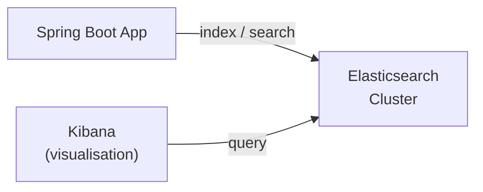

# Elasticsearch and Spring Data Elasticsearch

[← Back to README](../README.md)

---

**Elasticsearch** is a distributed full-text search engine built on Apache Lucene. It excels at searching large volumes of unstructured text, powering features like product search, log analysis, and autocomplete. Spring Data Elasticsearch provides a familiar repository abstraction on top of the Elasticsearch client.



---

## Maven Dependency

```xml
<dependency>
    <groupId>org.springframework.boot</groupId>
    <artifactId>spring-boot-starter-data-elasticsearch</artifactId>
</dependency>
```

---

## Configuration

```yaml
# application.yml
spring:
  elasticsearch:
    uris: http://localhost:9200
    username: elastic       # remove if security disabled
    password: ${ES_PASSWORD}
    connection-timeout: 5s
    socket-timeout: 30s
```

---

## Running Elasticsearch Locally

```yaml
# compose.yml
services:
  elasticsearch:
    image: docker.elastic.co/elasticsearch/elasticsearch:8.14.0
    environment:
      - discovery.type=single-node
      - xpack.security.enabled=false   # disable for local dev
      - ES_JAVA_OPTS=-Xms512m -Xmx512m
    ports:
      - "9200:9200"
    volumes:
      - es-data:/usr/share/elasticsearch/data

  kibana:
    image: docker.elastic.co/kibana/kibana:8.14.0
    ports:
      - "5601:5601"
    environment:
      ELASTICSEARCH_HOSTS: http://elasticsearch:9200

volumes:
  es-data:
```

---

## Document Mapping

```java
import org.springframework.data.elasticsearch.annotations.*;

@Document(indexName = "products")
public class ProductDocument {

    @Id
    private String id;

    @Field(type = FieldType.Text, analyzer = "english")
    private String name;

    @Field(type = FieldType.Text, analyzer = "english")
    private String description;

    @Field(type = FieldType.Keyword)
    private String category;

    @Field(type = FieldType.Double)
    private double price;

    @Field(type = FieldType.Boolean)
    private boolean inStock;

    @Field(type = FieldType.Date, format = DateFormat.date_time)
    private Instant createdAt;

    // getters / setters / constructors
}
```

---

## Repository

```java
public interface ProductSearchRepository
        extends ElasticsearchRepository<ProductDocument, String> {

    // derived query — full-text search on name
    List<ProductDocument> findByName(String name);

    // search within a price range
    List<ProductDocument> findByPriceBetween(double min, double max);

    // search by category and in stock
    Page<ProductDocument> findByCategoryAndInStockTrue(
        String category, Pageable pageable);
}
```

---

## Custom Queries with ElasticsearchOperations

```java
@Service
public class ProductSearchService {

    private final ElasticsearchOperations esOps;
    private final ProductSearchRepository repo;

    public ProductSearchService(ElasticsearchOperations esOps,
                                ProductSearchRepository repo) {
        this.esOps = esOps;
        this.repo  = repo;
    }

    // Full-text search across name and description
    public SearchPage<ProductDocument> search(String text, Pageable pageable) {
        Query query = NativeQuery.builder()
            .withQuery(q -> q
                .multiMatch(m -> m
                    .query(text)
                    .fields("name^3", "description")  // boost name 3×
                    .type(TextQueryType.BestFields)
                    .fuzziness("AUTO")))
            .withPageable(pageable)
            .build();

        SearchHits<ProductDocument> hits = esOps.search(query, ProductDocument.class);
        return SearchHitSupport.searchPageFor(hits, pageable);
    }

    // Boolean query — must match text, filter by category and price
    public List<ProductDocument> searchFiltered(String text,
                                                String category,
                                                double maxPrice) {
        Query query = NativeQuery.builder()
            .withQuery(q -> q
                .bool(b -> b
                    .must(m -> m.match(ma -> ma.field("name").query(text)))
                    .filter(f -> f.term(t -> t.field("category").value(category)))
                    .filter(f -> f.range(r -> r.field("price")
                        .to(JsonData.of(maxPrice))))))
            .build();

        return esOps.search(query, ProductDocument.class)
            .stream()
            .map(SearchHit::getContent)
            .toList();
    }
}
```

---

## Indexing Documents

```java
@Service
public class ProductIndexService {

    private final ProductSearchRepository repo;
    private final ProductRepository jpaRepo;  // JPA source of truth

    // Index a single product
    public void indexProduct(Product product) {
        ProductDocument doc = toDocument(product);
        repo.save(doc);
    }

    // Bulk index on startup / re-index
    public void reindexAll() {
        List<ProductDocument> docs = jpaRepo.findAll().stream()
            .map(this::toDocument)
            .toList();
        repo.saveAll(docs);
    }

    // Delete from index when product is deleted
    public void deleteFromIndex(String productId) {
        repo.deleteById(productId);
    }

    private ProductDocument toDocument(Product p) {
        return new ProductDocument(
            p.getId().toString(),
            p.getName(),
            p.getDescription(),
            p.getCategory(),
            p.getPrice().doubleValue(),
            p.isInStock(),
            p.getCreatedAt());
    }
}
```

---

## Aggregations

```java
// Count products per category
public Map<String, Long> countByCategory() {
    Query query = NativeQuery.builder()
        .withAggregation("by_category",
            Aggregation.of(a -> a
                .terms(t -> t.field("category").size(20))))
        .withMaxResults(0)  // we only want aggregations, not hits
        .build();

    ElasticsearchAggregations aggs = (ElasticsearchAggregations)
        esOps.search(query, ProductDocument.class).getAggregations();

    return aggs.get("by_category")
        .aggregation()
        .getAggregate()
        .sterms()
        .buckets()
        .array()
        .stream()
        .collect(Collectors.toMap(
            StringTermsBucket::key,
            StringTermsBucket::docCount));
}
```

---

## Autocomplete / Suggest

```java
// Prefix query for type-ahead
public List<String> suggest(String prefix) {
    Query query = NativeQuery.builder()
        .withQuery(q -> q
            .matchPhrasePrefix(m -> m
                .field("name")
                .query(prefix)
                .maxExpansions(10)))
        .withMaxResults(5)
        .withSourceFilter(new FetchSourceFilter(new String[]{"name"}, null))
        .build();

    return esOps.search(query, ProductDocument.class)
        .stream()
        .map(hit -> hit.getContent().getName())
        .distinct()
        .toList();
}
```

---

## Keeping JPA and Elasticsearch in Sync

A common pattern: write to JPA (source of truth), update Elasticsearch asynchronously via a domain event.

```java
@Service
public class ProductService {

    private final ProductRepository jpaRepo;
    private final ApplicationEventPublisher events;

    @Transactional
    public Product createProduct(CreateProductCommand cmd) {
        Product product = jpaRepo.save(new Product(cmd));
        events.publishEvent(new ProductCreatedEvent(product));
        return product;
    }
}

@Component
public class ProductIndexListener {

    private final ProductIndexService indexService;

    @EventListener
    @Async
    public void onProductCreated(ProductCreatedEvent event) {
        indexService.indexProduct(event.product());
    }
}
```

---

## Elasticsearch Summary

| Task | API |
|------|-----|
| Define index mapping | `@Document`, `@Field` annotations |
| CRUD | `ElasticsearchRepository.save()` / `delete()` |
| Derived queries | `findByNameContaining()`, `findByPriceBetween()` |
| Full-text search | `NativeQuery` with `multiMatch` |
| Boolean filters | `NativeQuery` with `bool` / `must` / `filter` |
| Aggregations | `Aggregation.of(a -> a.terms(...))` |
| Autocomplete | `matchPhrasePrefix` query |
| Bulk index | `ElasticsearchRepository.saveAll()` |

---

[← Back to README](../README.md)
