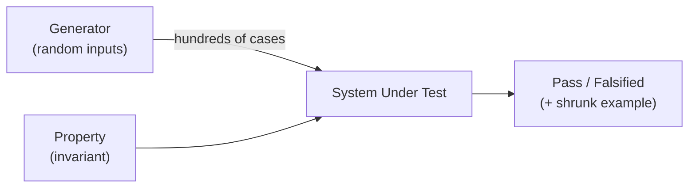

# Property-Based Testing (jqwik)

[← Back to README](../README.md)

---

**Property-based testing** (PBT) inverts the example-based approach: instead of writing specific inputs and expected outputs, you describe *properties* your code must satisfy, and the framework generates hundreds of random inputs to try to falsify them. When a failure is found, the framework **shrinks** the input to the smallest case that still fails.



**jqwik** is the leading PBT library for Java — it integrates with JUnit 5 natively.

---

## Maven Dependency

```xml
<dependency>
    <groupId>net.jqwik</groupId>
    <artifactId>jqwik</artifactId>
    <version>1.9.0</version>
    <scope>test</scope>
</dependency>
```

---

## Your First Property

```java
import net.jqwik.api.*;

class StringReverseProperties {

    @Property
    void reversingTwiceIsIdentity(@ForAll String s) {
        assertThat(reverse(reverse(s))).isEqualTo(s);
    }

    @Property
    void reversedLengthMatchesOriginal(@ForAll String s) {
        assertThat(reverse(s)).hasSize(s.length());
    }

    private String reverse(String s) {
        return new StringBuilder(s).reverse().toString();
    }
}
```

`@Property` runs 1 000 random trials by default. `@ForAll` injects generated values.

---

## Built-In Generators

```java
class BuiltInGenerators {

    @Property
    void integerArithmetic(@ForAll int a, @ForAll int b) {
        assertThat(a + b).isEqualTo(b + a);  // commutativity
    }

    @Property
    void listNeverShrinksBelowSorted(@ForAll List<@From("positiveInts") Integer> list) {
        List<Integer> sorted = list.stream().sorted().toList();
        assertThat(sorted).hasSizeGreaterThanOrEqualTo(0);
    }

    @Provide
    Arbitrary<Integer> positiveInts() {
        return Arbitraries.integers().between(1, 1_000);
    }
}
```

---

## Constraining Generated Values

```java
class ConstrainedGenerators {

    @Property
    void emailAlwaysContainsAtSign(
            @ForAll @Email String email) {
        assertThat(email).contains("@");
    }

    @Property
    void stringBetweenLengths(
            @ForAll @StringLength(min = 3, max = 20) String s) {
        assertThat(s.length()).isBetween(3, 20);
    }

    @Property
    void positiveIntegersArePositive(
            @ForAll @Positive int n) {
        assertThat(n).isGreaterThan(0);
    }

    @Property
    void alphabeticOnlyLetters(
            @ForAll @AlphaChars String s) {
        assertThat(s).matches("[a-zA-Z]*");
    }
}
```

---

## Custom Arbitraries

```java
class OrderProperties {

    @Provide
    Arbitrary<Order> validOrders() {
        Arbitrary<String> customerId = Arbitraries.strings()
            .alpha().ofMinLength(3).ofMaxLength(20)
            .map("CUST-"::concat);

        Arbitrary<BigDecimal> price = Arbitraries.bigDecimals()
            .between(BigDecimal.ONE, new BigDecimal("9999.99"))
            .ofScale(2);

        Arbitrary<Integer> quantity = Arbitraries.integers().between(1, 100);

        return Combinators.combine(customerId, price, quantity)
            .as((cid, p, qty) -> new Order(cid, p, qty));
    }

    @Property
    void totalIsAlwaysNonNegative(@ForAll("validOrders") Order order) {
        assertThat(order.total()).isGreaterThanOrEqualTo(BigDecimal.ZERO);
    }

    @Property
    void applyingDiscountReducesTotal(@ForAll("validOrders") Order order) {
        BigDecimal discount = new BigDecimal("0.10");
        BigDecimal discounted = order.withDiscount(discount).total();

        assertThat(discounted).isLessThan(order.total());
    }
}
```

---

## Stateful Testing — Action Sequences

jqwik can test stateful systems by generating sequences of actions and verifying invariants hold throughout.

```java
class ShoppingCartStatefulTest {

    @Property
    void cartInvariantsHoldThroughActions(
            @ForAll("cartActions") ActionSequence<ShoppingCart> actions) {
        actions.run(new ShoppingCart());
    }

    @Provide
    Arbitrary<ActionSequence<ShoppingCart>> cartActions() {
        return ActionSequence.sequencesOf(
            addItemAction(),
            removeItemAction(),
            applyDiscountAction()
        );
    }

    private Action<ShoppingCart> addItemAction() {
        return Action.just(
            "add item",
            cart -> {
                int before = cart.getItemCount();
                cart.add("Widget", new BigDecimal("10.00"), 1);
                assertThat(cart.getItemCount()).isGreaterThan(before);
            });
    }

    private Action<ShoppingCart> removeItemAction() {
        return Action.just(
            "remove Widget",
            cart -> {
                cart.remove("Widget");
                assertThat(cart.getTotal()).isGreaterThanOrEqualTo(BigDecimal.ZERO);
            });
    }

    private Action<ShoppingCart> applyDiscountAction() {
        return Action.just(
            "apply 10% discount",
            cart -> {
                BigDecimal before = cart.getTotal();
                cart.applyDiscount(new BigDecimal("0.10"));
                assertThat(cart.getTotal()).isLessThanOrEqualTo(before);
            });
    }
}
```

---

## Shrinking

When jqwik finds a failing case, it automatically shrinks the input to the minimal failing example:

```
Falsified after 47 tries
Shrunk 12 times
  Failing sample:
    s = "A"  ← smallest string that caused the failure
```

This makes the root cause obvious rather than debugging a 1 000-character random string.

---

## Configuring Trials

```java
@Property(tries = 5_000)   // run 5 000 trials
void heavyProperty(@ForAll int x) { ... }

@Property(tries = 50)     // quick sanity check
void lightProperty(@ForAll String s) { ... }

// Reproduce a specific failing seed
@Property(seed = "4234567890123456789")
void reproducibleProperty(@ForAll int x) { ... }
```

---

## Combining with Example-Based Tests

PBT and example-based tests complement each other:

```java
class DiscountServiceTest {

    // Example-based — pin known values
    @Test
    void tenPercentDiscountOn100() {
        assertThat(new DiscountService().apply(
            new BigDecimal("100.00"),
            new BigDecimal("0.10")))
            .isEqualByComparingTo("90.00");
    }

    // Property-based — verify invariants for all values
    @Property
    void discountAlwaysReducesPrice(
            @ForAll @BigRange(min = "0.01", max = "10000") BigDecimal price,
            @ForAll @BigRange(min = "0.01", max = "0.99") BigDecimal rate) {
        BigDecimal discounted = new DiscountService().apply(price, rate);
        assertThat(discounted).isLessThan(price);
    }
}
```

---

## Property-Based Testing Summary

| Concept | Meaning |
|---------|---------|
| Property | An invariant that must hold for all generated inputs |
| Arbitrary | A generator that produces random values of a given type |
| Shrinking | Reducing a failing input to its smallest form |
| `@ForAll` | Inject a generated value into a property method |
| `@Provide` | Mark a method that returns a custom `Arbitrary` |
| Trials | Number of random cases to run (default: 1 000) |
| Stateful testing | Generates sequences of actions and verifies invariants hold |

---

[← Back to README](../README.md)
