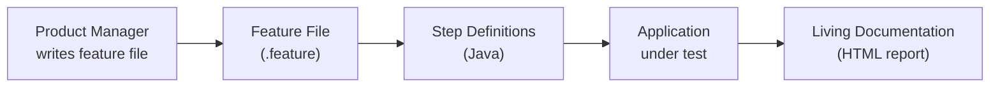

# BDD with Cucumber

[← Back to README](../README.md)

---

**Behaviour-Driven Development** (BDD) bridges the communication gap between developers, testers, and business stakeholders by writing specifications in plain English using the **Gherkin** language (`Given / When / Then`). **Cucumber** parses these feature files and maps each step to a Java method.



---

## Maven Dependencies

```xml
<dependency>
    <groupId>io.cucumber</groupId>
    <artifactId>cucumber-java</artifactId>
    <version>7.18.0</version>
    <scope>test</scope>
</dependency>
<dependency>
    <groupId>io.cucumber</groupId>
    <artifactId>cucumber-junit-platform-engine</artifactId>
    <version>7.18.0</version>
    <scope>test</scope>
</dependency>
<dependency>
    <groupId>io.cucumber</groupId>
    <artifactId>cucumber-spring</artifactId>
    <version>7.18.0</version>
    <scope>test</scope>
</dependency>
<dependency>
    <groupId>org.junit.platform</groupId>
    <artifactId>junit-platform-suite</artifactId>
    <scope>test</scope>
</dependency>
```

---

## Feature File

```gherkin
# src/test/resources/features/shopping-cart.feature
Feature: Shopping Cart

  Background:
    Given an empty shopping cart

  Scenario: Add a single item
    When I add "Laptop" priced at 999.99 with quantity 1
    Then the cart has 1 item
    And the total is 999.99

  Scenario: Apply a discount
    When I add "Shirt" priced at 100.00 with quantity 2
    And I apply a discount of 10 percent
    Then the total is 180.00

  Scenario Outline: Add multiple quantities
    When I add "<product>" priced at <price> with quantity <qty>
    Then the total is <total>

    Examples:
      | product | price | qty | total   |
      | Book    | 19.99 |   1 |  19.99  |
      | Book    | 19.99 |   3 |  59.97  |
      | Pen     |  2.50 |  10 |  25.00  |
```

---

## Step Definitions

```java
// src/test/java/com/example/steps/ShoppingCartSteps.java
import io.cucumber.java.Before;
import io.cucumber.java.en.*;

public class ShoppingCartSteps {

    private ShoppingCart cart;

    @Before
    public void setUp() {
        cart = new ShoppingCart();
    }

    @Given("an empty shopping cart")
    public void anEmptyShoppingCart() {
        cart = new ShoppingCart();
    }

    @When("I add {string} priced at {double} with quantity {int}")
    public void iAddItem(String name, double price, int qty) {
        cart.add(name, new BigDecimal(String.valueOf(price)), qty);
    }

    @When("I apply a discount of {int} percent")
    public void iApplyDiscount(int percent) {
        cart.applyDiscount(BigDecimal.valueOf(percent).divide(BigDecimal.valueOf(100)));
    }

    @Then("the cart has {int} item(s)")
    public void theCartHasItems(int count) {
        assertThat(cart.getItemCount()).isEqualTo(count);
    }

    @Then("the total is {double}")
    public void theTotalIs(double total) {
        assertThat(cart.getTotal())
            .isEqualByComparingTo(BigDecimal.valueOf(total));
    }
}
```

---

## JUnit Platform Suite Runner

```java
// src/test/java/com/example/CucumberIT.java
import org.junit.platform.suite.api.*;

@Suite
@IncludeEngines("cucumber")
@SelectClasspathResource("features")
@ConfigurationParameter(
    key   = CucumberOptions.PLUGIN_PROPERTY_NAME,
    value = "pretty, html:target/cucumber-report.html")
@ConfigurationParameter(
    key   = CucumberOptions.GLUE_PROPERTY_NAME,
    value = "com.example.steps")
public class CucumberIT {}
```

Run with `mvn test -Dtest=CucumberIT` or as part of the full test suite.

---

## Spring Integration

```java
// Shared Spring context across all step definition classes
@CucumberContextConfiguration
@SpringBootTest(webEnvironment = SpringBootTest.WebEnvironment.RANDOM_PORT)
public class CucumberSpringConfiguration {}
```

```java
// Step definitions can now @Autowire Spring beans
public class OrderApiSteps {

    @Autowired
    private TestRestTemplate restTemplate;

    @Autowired
    private OrderRepository orderRepository;

    private ResponseEntity<String> response;

    @When("I place an order for product {string}")
    public void iPlaceAnOrder(String productId) {
        response = restTemplate.postForEntity(
            "/api/orders",
            new OrderRequest(productId, 1),
            String.class);
    }

    @Then("the response status is {int}")
    public void theResponseStatusIs(int status) {
        assertThat(response.getStatusCode().value()).isEqualTo(status);
    }
}
```

---

## Full REST API Feature

```gherkin
# src/test/resources/features/orders.feature
Feature: Order API

  Scenario: Place a valid order
    Given the product "PROD-1" is in stock
    When I place an order for product "PROD-1" with quantity 2
    Then the response status is 201
    And the response contains an order ID

  Scenario: Out of stock product
    Given the product "PROD-2" is out of stock
    When I place an order for product "PROD-2" with quantity 1
    Then the response status is 422
    And the error message is "Product out of stock"
```

---

## Data Tables

```gherkin
Scenario: Bulk item import
  When I add the following items to the cart:
    | name    | price  | quantity |
    | Laptop  | 999.99 |        1 |
    | Mouse   |  29.99 |        2 |
    | Headset | 149.00 |        1 |
  Then the cart has 3 items
  And the total is 1208.97
```

```java
@When("I add the following items to the cart:")
public void iAddItems(DataTable table) {
    table.asMaps().forEach(row -> cart.add(
        row.get("name"),
        new BigDecimal(row.get("price")),
        Integer.parseInt(row.get("quantity"))));
}
```

---

## Hooks

```java
public class Hooks {

    @Autowired
    private DatabaseCleaner cleaner;

    @Before("@needsDatabase")
    public void setupDatabase() {
        cleaner.reset();   // run before each tagged scenario
    }

    @After
    public void takeScreenshot(Scenario scenario) {
        if (scenario.isFailed()) {
            // capture screenshot or log for UI tests
            scenario.attach("failure context".getBytes(),
                "text/plain", "context");
        }
    }
}
```

Tag scenarios: `@Tag("needsDatabase")` in Gherkin with `@needsDatabase`.

---

## BDD Summary

| Concept | Detail |
|---------|--------|
| Feature file | Plain English specification (`.feature`) using Gherkin |
| Scenario | One test case with Given/When/Then steps |
| Scenario Outline + Examples | Data-driven scenarios |
| Step definition | Java method annotated with `@Given`, `@When`, `@Then` |
| Background | Steps run before every scenario in a feature |
| Data Table | Inline table data passed to a step |
| `@Before` / `@After` | Setup and teardown hooks per scenario |
| Tags | `@smoke`, `@regression` — filter which scenarios to run |
| Living documentation | HTML reports that non-developers can read |

---

[← Back to README](../README.md)
