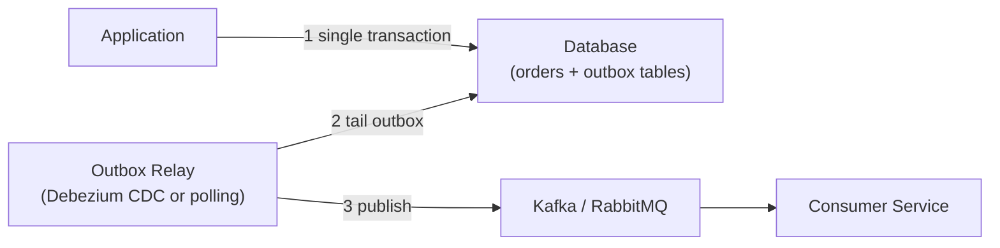

# Transactional Outbox Pattern

[← Back to README](../README.md)

---

The **Transactional Outbox** solves the **dual-write problem**: you cannot atomically write to a database and publish to a message broker. If you write to the DB and then publish to Kafka, the broker publish might fail and the event is lost — or the app crashes between the two. The outbox pattern makes event publishing reliable by writing events to an **outbox table in the same database transaction** as the business data, then forwarding them to the broker asynchronously.



---

## Why Not Write to Kafka Directly?

```java
// DANGEROUS — not atomic
@Transactional
public void placeOrder(Order order) {
    orderRepository.save(order);       // DB write succeeds
    kafkaTemplate.send("orders", event); // may fail or lag — event lost
}
```

If the Kafka publish fails after the DB commit, the event is never delivered. If the app crashes between the two, same result.

---

## Outbox Table

```sql
CREATE TABLE outbox_events (
    id          UUID PRIMARY KEY DEFAULT gen_random_uuid(),
    aggregate_type  VARCHAR(100) NOT NULL,
    aggregate_id    VARCHAR(100) NOT NULL,
    event_type      VARCHAR(100) NOT NULL,
    payload         JSONB        NOT NULL,
    created_at      TIMESTAMPTZ  NOT NULL DEFAULT NOW(),
    published       BOOLEAN      NOT NULL DEFAULT FALSE,
    published_at    TIMESTAMPTZ
);
```

---

## Writing to the Outbox

```java
@Entity
@Table(name = "outbox_events")
public class OutboxEvent {

    @Id
    @GeneratedValue
    private UUID id;

    private String aggregateType;
    private String aggregateId;
    private String eventType;

    @JdbcTypeCode(SqlTypes.JSON)
    private String payload;

    private Instant createdAt = Instant.now();
    private boolean published = false;
    private Instant publishedAt;

    // getters / setters
}
```

```java
@Service
public class OrderService {

    private final OrderRepository orderRepo;
    private final OutboxEventRepository outboxRepo;
    private final ObjectMapper objectMapper;

    @Transactional  // one DB transaction for both writes
    public OrderId placeOrder(PlaceOrderCommand cmd) {
        Order order = orderRepo.save(new Order(cmd));

        OutboxEvent event = new OutboxEvent();
        event.setAggregateType("Order");
        event.setAggregateId(order.getId().toString());
        event.setEventType("OrderPlaced");
        event.setPayload(objectMapper.writeValueAsString(
            new OrderPlacedEvent(order.getId(), order.customerId(), order.total())));

        outboxRepo.save(event);  // same transaction as order save

        return order.getId();
    }
}
```

---

## Relay — Option 1: Polling Publisher

Simple approach: a scheduled job polls the outbox and publishes unpublished events.

```java
@Component
public class OutboxPollingPublisher {

    private final OutboxEventRepository outboxRepo;
    private final KafkaTemplate<String, String> kafka;

    @Scheduled(fixedDelay = 1_000)   // poll every second
    @Transactional
    public void publishPending() {
        List<OutboxEvent> events = outboxRepo.findByPublishedFalseOrderByCreatedAt();

        for (OutboxEvent event : events) {
            String topic = topicFor(event.getEventType());

            kafka.send(topic, event.getAggregateId(), event.getPayload())
                .whenComplete((result, ex) -> {
                    if (ex == null) {
                        event.setPublished(true);
                        event.setPublishedAt(Instant.now());
                        outboxRepo.save(event);
                    }
                });
        }
    }

    private String topicFor(String eventType) {
        return switch (eventType) {
            case "OrderPlaced"    -> "orders.placed";
            case "OrderShipped"   -> "orders.shipped";
            case "OrderCancelled" -> "orders.cancelled";
            default               -> "events.unknown";
        };
    }
}
```

```java
public interface OutboxEventRepository extends JpaRepository<OutboxEvent, UUID> {

    @Lock(LockModeType.PESSIMISTIC_WRITE)
    List<OutboxEvent> findByPublishedFalseOrderByCreatedAt();
}
```

The pessimistic lock prevents two instances from publishing the same event if you run multiple app instances.

---

## Relay — Option 2: Debezium CDC (Change Data Capture)

**Debezium** tails the database WAL (Write-Ahead Log) and reacts to inserts/updates in near real-time. No polling delay, no missed events.

### Docker Compose

```yaml
services:
  debezium:
    image: debezium/connect:2.7
    ports:
      - "8083:8083"
    environment:
      BOOTSTRAP_SERVERS: kafka:9092
      GROUP_ID: debezium-group
      CONFIG_STORAGE_TOPIC: debezium.configs
      OFFSET_STORAGE_TOPIC: debezium.offsets
      STATUS_STORAGE_TOPIC: debezium.status
    depends_on:
      - kafka
      - postgres
```

### Register the Outbox Connector

```bash
curl -X POST http://localhost:8083/connectors \
  -H "Content-Type: application/json" \
  -d '{
    "name": "outbox-connector",
    "config": {
      "connector.class": "io.debezium.connector.postgresql.PostgresConnector",
      "database.hostname": "postgres",
      "database.port": "5432",
      "database.user": "app",
      "database.password": "secret",
      "database.dbname": "appdb",
      "table.include.list": "public.outbox_events",
      "transforms": "outbox",
      "transforms.outbox.type": "io.debezium.transforms.outbox.EventRouter",
      "transforms.outbox.route.by.field": "event_type",
      "transforms.outbox.route.topic.replacement": "orders.${routedByValue}"
    }
  }'
```

Debezium's `EventRouter` transform reads `event_type` from each inserted row and routes it to the matching Kafka topic automatically. No polling code needed.

---

## Idempotent Consumers

Because events may be delivered at least once (exactly-once requires additional coordination), consumers must be idempotent:

```java
@KafkaListener(topics = "orders.placed")
@Transactional
public void handleOrderPlaced(ConsumerRecord<String, String> record) {
    String eventId = record.headers()
        .lastHeader("eventId").value().toString();

    // Skip already-processed events
    if (processedEventRepository.existsById(eventId)) {
        return;
    }

    OrderPlacedEvent event = objectMapper.readValue(
        record.value(), OrderPlacedEvent.class);

    inventoryService.reserve(event.orderId(), event.lines());

    processedEventRepository.save(new ProcessedEvent(eventId, Instant.now()));
}
```

---

## Outbox Cleanup

```java
@Scheduled(cron = "0 0 3 * * *")   // 3 AM daily
@Transactional
public void cleanOldEvents() {
    Instant cutoff = Instant.now().minus(7, ChronoUnit.DAYS);
    outboxRepo.deleteByPublishedTrueAndPublishedAtBefore(cutoff);
}
```

---

## Transactional Outbox Summary

| Step | What Happens |
|------|-------------|
| 1 — Atomic write | Business data + outbox event written in one DB transaction |
| 2 — Relay reads outbox | Polling publisher or Debezium CDC tails the table |
| 3 — Publish to broker | Event sent to Kafka/RabbitMQ |
| 4 — Mark published | Outbox row updated or deleted after successful publish |

| Approach | Latency | Complexity | Multi-instance safe |
|----------|---------|------------|---------------------|
| Polling publisher | ~1 s | Low | With pessimistic lock |
| Debezium CDC | < 100 ms | Medium (extra service) | Yes, Debezium handles it |

---

[← Back to README](../README.md)
