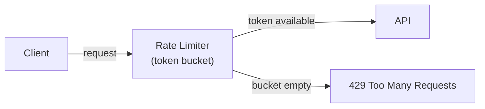

# Rate Limiting

[← Back to README](../README.md)

---

**Rate limiting** protects APIs from abuse, prevents resource exhaustion, and enforces fair use. It caps how many requests a client can make within a time window. Common algorithms are **token bucket** (smooth bursts), **fixed window** (simple), and **sliding window** (accurate).



---

## Token Bucket Algorithm

Each client has a bucket that refills at a fixed rate. Each request consumes one token. If the bucket is empty, the request is rejected.

```
Bucket capacity: 10 tokens
Refill rate:      1 token / second

Client A sends 10 requests instantly → all accepted (bucket drains to 0)
Client A sends 1 more request       → rejected (429)
1 second later                      → 1 token refills
```

---

## Bucket4j — In-Process Rate Limiting

### Maven Dependency

```xml
<dependency>
    <groupId>com.bucket4j</groupId>
    <artifactId>bucket4j-core</artifactId>
    <version>8.10.1</version>
</dependency>

<!-- Redis-backed (distributed) -->
<dependency>
    <groupId>com.bucket4j</groupId>
    <artifactId>bucket4j-redis</artifactId>
    <version>8.10.1</version>
</dependency>
```

### Per-IP Rate Limiting with a Servlet Filter

```java
@Component
@Order(1)
public class RateLimitingFilter implements Filter {

    // one bucket per IP address
    private final Map<String, Bucket> buckets = new ConcurrentHashMap<>();

    @Override
    public void doFilter(ServletRequest req, ServletResponse res,
                         FilterChain chain) throws IOException, ServletException {

        HttpServletRequest  request  = (HttpServletRequest)  req;
        HttpServletResponse response = (HttpServletResponse) res;

        String ip = request.getRemoteAddr();
        Bucket bucket = buckets.computeIfAbsent(ip, k -> createBucket());

        if (bucket.tryConsume(1)) {
            chain.doFilter(req, res);
        } else {
            response.setStatus(HttpServletResponse.SC_OK);
            response.setStatus(429);
            response.setContentType("application/json");
            response.getWriter().write(
                """
                {"error":"Too Many Requests","retryAfterSeconds":1}
                """);
        }
    }

    private Bucket createBucket() {
        return Bucket.builder()
            .addLimit(Bandwidth.builder()
                .capacity(100)
                .refillGreedy(100, Duration.ofMinutes(1))  // 100 req/min
                .build())
            .build();
    }
}
```

### Per-User Rate Limiting in a Service

```java
@Service
public class SearchService {

    private final Map<String, Bucket> userBuckets = new ConcurrentHashMap<>();

    public List<Product> search(String query, String userId) {
        Bucket bucket = userBuckets.computeIfAbsent(userId, id ->
            Bucket.builder()
                .addLimit(Bandwidth.builder()
                    .capacity(20)
                    .refillGreedy(20, Duration.ofSeconds(10))  // 20 req per 10 s
                    .build())
                .build());

        if (!bucket.tryConsume(1)) {
            throw new RateLimitExceededException(
                "Search limit exceeded. Try again in a few seconds.");
        }

        return productSearchService.search(query);
    }
}
```

### Tiered Rate Limits

```java
private Bucket createBucketForUser(User user) {
    return switch (user.plan()) {
        case FREE    -> Bucket.builder()
            .addLimit(Bandwidth.builder()
                .capacity(60).refillGreedy(60, Duration.ofHours(1)).build())
            .build();
        case PRO     -> Bucket.builder()
            .addLimit(Bandwidth.builder()
                .capacity(1_000).refillGreedy(1_000, Duration.ofHours(1)).build())
            .build();
        case ENTERPRISE -> Bucket.builder()
            .addLimit(Bandwidth.builder()
                .capacity(100_000).refillGreedy(100_000, Duration.ofHours(1)).build())
            .build();
    };
}
```

---

## Distributed Rate Limiting with Redis

In-memory buckets don't share state across multiple instances. Use Redis for distributed state:

```java
@Configuration
public class RateLimitConfig {

    @Bean
    public ProxyManager<String> proxyManager(RedissonClient redisson) {
        return Bucket4jRedisson.casBasedBuilder(redisson).build();
    }
}

@Service
public class DistributedRateLimiter {

    private final ProxyManager<String> proxyManager;

    public boolean tryConsume(String userId) {
        BucketConfiguration config = BucketConfiguration.builder()
            .addLimit(Bandwidth.builder()
                .capacity(100)
                .refillGreedy(100, Duration.ofMinutes(1))
                .build())
            .build();

        Bucket bucket = proxyManager.builder()
            .build(userId, () -> config);

        return bucket.tryConsume(1);
    }
}
```

---

## Spring Cloud Gateway — Gateway-Level Rate Limiting

Rate limit at the gateway before requests reach services:

```yaml
# application.yml — Spring Cloud Gateway
spring:
  cloud:
    gateway:
      routes:
        - id: order-service
          uri: lb://order-service
          predicates:
            - Path=/api/orders/**
          filters:
            - name: RequestRateLimiter
              args:
                redis-rate-limiter.replenishRate: 10     # tokens/second
                redis-rate-limiter.burstCapacity: 20     # max burst
                redis-rate-limiter.requestedTokens: 1
                key-resolver: "#{@userKeyResolver}"

      default-filters:
        - name: RequestRateLimiter
          args:
            redis-rate-limiter.replenishRate: 100
            redis-rate-limiter.burstCapacity: 200
```

```java
@Bean
public KeyResolver userKeyResolver() {
    // Rate limit by authenticated user ID
    return exchange -> exchange.getPrincipal()
        .map(Principal::getName)
        .defaultIfEmpty("anonymous");
}

@Bean
public KeyResolver ipKeyResolver() {
    // Rate limit by IP
    return exchange -> Mono.just(
        exchange.getRequest().getRemoteAddress().getAddress().getHostAddress());
}
```

Spring Cloud Gateway's `RequestRateLimiter` requires a Redis bean on the classpath.

---

## Rate Limit Headers

Communicate limits to clients via standard headers:

```java
@ExceptionHandler(RateLimitExceededException.class)
public ResponseEntity<ErrorResponse> handleRateLimit(
        RateLimitExceededException ex,
        HttpServletResponse response) {

    return ResponseEntity.status(HttpStatus.TOO_MANY_REQUESTS)
        .header("X-RateLimit-Limit",     "100")
        .header("X-RateLimit-Remaining", "0")
        .header("X-RateLimit-Reset",     String.valueOf(
            Instant.now().plusSeconds(60).getEpochSecond()))
        .header("Retry-After", "60")
        .body(new ErrorResponse("rate_limit_exceeded",
            "Too many requests. Retry after 60 seconds."));
}
```

---

## Testing Rate Limits

```java
@SpringBootTest(webEnvironment = SpringBootTest.WebEnvironment.RANDOM_PORT)
class RateLimitingTest {

    @Autowired
    TestRestTemplate restTemplate;

    @Test
    void after100Requests_returns429() {
        for (int i = 0; i < 100; i++) {
            ResponseEntity<String> response =
                restTemplate.getForEntity("/api/products", String.class);
            assertThat(response.getStatusCode()).isEqualTo(HttpStatus.OK);
        }

        // 101st request should be rate-limited
        ResponseEntity<String> limited =
            restTemplate.getForEntity("/api/products", String.class);
        assertThat(limited.getStatusCode())
            .isEqualTo(HttpStatus.TOO_MANY_REQUESTS);
    }
}
```

---

## Rate Limiting Summary

| Algorithm | Behaviour | Use Case |
|-----------|-----------|----------|
| Token bucket | Smooth bursts up to capacity, then refills | Most API use cases |
| Fixed window | Simple counter reset each interval | Coarse limits |
| Sliding window | Rolling average — no burst at boundary | Accurate fairness |

| Tool | Scope | Persistence |
|------|-------|-------------|
| Bucket4j (in-memory) | Single instance | No |
| Bucket4j + Redis | All instances | Redis |
| Spring Cloud Gateway | Gateway layer | Redis |

| HTTP Status | Header | Meaning |
|-------------|--------|---------|
| `429 Too Many Requests` | `Retry-After: 60` | Client exceeded rate limit |
| `X-RateLimit-Limit` | | Max requests allowed |
| `X-RateLimit-Remaining` | | Requests left in window |
| `X-RateLimit-Reset` | | Epoch second when window resets |

---

[← Back to README](../README.md)
