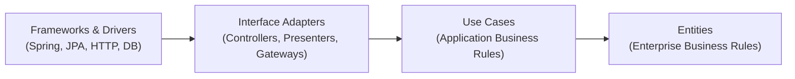

# Clean Architecture

[← Back to README](../README.md)

---

**Clean Architecture** (Robert C. Martin, "Uncle Bob") organises code into concentric rings. The key rule is the **Dependency Rule**: source code dependencies must point inward — inner rings know nothing about outer rings.



Inner rings contain stable, high-value business logic. Outer rings contain volatile implementation details that change frequently. Swapping a database, a web framework, or a message broker should require zero changes to the inner rings.

---

## Comparison to Hexagonal Architecture

| | Clean Architecture | Hexagonal Architecture |
|---|---|---|
| Terminology | Entities, Use Cases, Interface Adapters, Frameworks | Domain, Ports, Adapters |
| Rings / layers | 4 (explicitly named) | 3 conceptual zones |
| Dependency rule | Identical: always inward | Same |
| Practical difference | Splits "application" into Entities + Use Cases | No distinction |

They share the same fundamental insight — both are good choices. Clean Architecture adds more explicit naming for the business entity vs. use-case layer split.

---

## Package Structure

```
src/main/java/com/example/
├── domain/
│   └── entity/            ← Ring 1 — Entities
│       ├── Order.java
│       ├── OrderLine.java
│       └── Money.java
├── application/
│   ├── usecase/           ← Ring 2 — Use Cases
│   │   ├── PlaceOrderUseCase.java
│   │   └── CancelOrderUseCase.java
│   └── port/              ← Use-case output boundaries
│       ├── OrderGateway.java
│       └── PaymentGateway.java
├── adapter/               ← Ring 3 — Interface Adapters
│   ├── controller/
│   │   └── OrderController.java
│   ├── presenter/
│   │   └── OrderPresenter.java
│   └── gateway/
│       ├── JpaOrderGateway.java
│       └── StripePaymentGateway.java
└── infrastructure/        ← Ring 4 — Frameworks & Drivers
    ├── config/
    │   └── SpringConfig.java
    └── persistence/
        └── OrderJpaEntity.java
```

---

## Ring 1 — Entities

Pure business objects with enterprise-wide rules. No framework annotations.

```java
public class Order {

    private final OrderId id;
    private final CustomerId customerId;
    private final List<OrderLine> lines;
    private OrderStatus status;

    public Order(OrderId id, CustomerId customerId, List<OrderLine> lines) {
        if (lines.isEmpty()) throw new IllegalArgumentException("Order must have at least one line");
        this.id         = id;
        this.customerId = customerId;
        this.lines      = List.copyOf(lines);
        this.status     = OrderStatus.PENDING;
    }

    public void confirm() {
        if (status != OrderStatus.PENDING) {
            throw new IllegalStateException("Cannot confirm order in status: " + status);
        }
        this.status = OrderStatus.CONFIRMED;
    }

    public Money total() {
        return lines.stream()
            .map(OrderLine::lineTotal)
            .reduce(Money.ZERO, Money::add);
    }
}

public record Money(BigDecimal amount, Currency currency) {
    public static final Money ZERO = new Money(BigDecimal.ZERO, Currency.getInstance("USD"));

    public Money add(Money other) {
        if (!currency.equals(other.currency)) throw new IllegalArgumentException("Currency mismatch");
        return new Money(amount.add(other.amount), currency);
    }
}
```

---

## Ring 2 — Use Cases

Application-specific business rules. Orchestrate entities and call output ports.

```java
// Input boundary (what callers use)
public interface PlaceOrderUseCase {
    PlaceOrderResponse placeOrder(PlaceOrderRequest request);
}

// Output boundary (what the use case needs from outside)
public interface OrderGateway {
    void save(Order order);
    Optional<Order> findById(OrderId id);
}

public interface PaymentGateway {
    PaymentResult charge(CustomerId customerId, Money amount);
}
```

```java
public class PlaceOrderInteractor implements PlaceOrderUseCase {

    private final OrderGateway orderGateway;
    private final PaymentGateway paymentGateway;
    private final PlaceOrderPresenter presenter;

    public PlaceOrderInteractor(OrderGateway orderGateway,
                                 PaymentGateway paymentGateway,
                                 PlaceOrderPresenter presenter) {
        this.orderGateway   = orderGateway;
        this.paymentGateway = paymentGateway;
        this.presenter      = presenter;
    }

    @Override
    public PlaceOrderResponse placeOrder(PlaceOrderRequest request) {
        List<OrderLine> lines = request.lines().stream()
            .map(l -> new OrderLine(l.productId(), l.price(), l.quantity()))
            .toList();

        Order order = new Order(OrderId.generate(),
            new CustomerId(request.customerId()), lines);

        PaymentResult payment = paymentGateway.charge(
            order.customerId(), order.total());

        if (!payment.success()) {
            return presenter.paymentFailed(payment.declineReason());
        }

        order.confirm();
        orderGateway.save(order);
        return presenter.success(order);
    }
}
```

---

## Ring 3 — Interface Adapters

Convert data between the use-case format and the delivery/persistence format.

### Controller (Driving Adapter)

```java
// Knows about HTTP and the use-case input boundary
@RestController
@RequestMapping("/api/orders")
public class OrderController {

    private final PlaceOrderUseCase placeOrderUseCase;

    @PostMapping
    public ResponseEntity<OrderResponse> placeOrder(
            @RequestBody @Valid PlaceOrderHttpRequest request) {
        PlaceOrderRequest useCaseRequest = OrderControllerMapper.toRequest(request);
        PlaceOrderResponse response = placeOrderUseCase.placeOrder(useCaseRequest);
        return ResponseEntity.status(HttpStatus.CREATED)
            .body(OrderControllerMapper.toResponse(response));
    }
}
```

### Presenter

```java
// Formats use-case output for the delivery mechanism
public class PlaceOrderPresenter {

    public PlaceOrderResponse success(Order order) {
        return new PlaceOrderResponse(
            true,
            order.id().value().toString(),
            order.total().amount(),
            null);
    }

    public PlaceOrderResponse paymentFailed(String reason) {
        return new PlaceOrderResponse(false, null, null, reason);
    }
}
```

### Gateway (Driven Adapter)

```java
@Component
public class JpaOrderGateway implements OrderGateway {

    private final SpringOrderRepository springRepo;

    @Override
    public void save(Order order) {
        springRepo.save(OrderJpaEntity.fromDomain(order));
    }

    @Override
    public Optional<Order> findById(OrderId id) {
        return springRepo.findById(id.value()).map(OrderJpaEntity::toDomain);
    }
}
```

---

## Ring 4 — Frameworks & Drivers

Spring `@Configuration`, JPA entity classes, database schema. These are the most volatile and most replaceable.

```java
@Configuration
public class UseCaseConfig {

    @Bean
    public PlaceOrderUseCase placeOrderUseCase(
            OrderGateway orderGateway,
            PaymentGateway paymentGateway) {
        return new PlaceOrderInteractor(
            orderGateway,
            paymentGateway,
            new PlaceOrderPresenter());
    }
}
```

---

## Testing Each Ring

```java
// Ring 1 — pure unit test, zero dependencies
class OrderTest {
    @Test
    void confirmedOrderCannotBeConfirmedAgain() {
        Order order = new Order(OrderId.generate(), new CustomerId("c1"),
            List.of(new OrderLine("PROD-1", Money.of(10), 1)));
        order.confirm();
        assertThatThrownBy(order::confirm)
            .isInstanceOf(IllegalStateException.class);
    }
}

// Ring 2 — mock gateways, no Spring context
class PlaceOrderInteractorTest {
    OrderGateway      gateway  = mock(OrderGateway.class);
    PaymentGateway    payment  = mock(PaymentGateway.class);
    PlaceOrderInteractor sut  = new PlaceOrderInteractor(
        gateway, payment, new PlaceOrderPresenter());

    @Test
    void successfulOrder_savesAndReturnsId() {
        when(payment.charge(any(), any()))
            .thenReturn(new PaymentResult(true, "txn_1", null));

        PlaceOrderResponse response = sut.placeOrder(testRequest());

        assertThat(response.success()).isTrue();
        verify(gateway).save(any());
    }
}
```

---

## Clean Architecture Summary

| Ring | Contents | Key Rule |
|------|----------|----------|
| Entities | Business objects, domain rules | No framework imports |
| Use Cases | Application logic, orchestration | Imports only Ring 1 |
| Interface Adapters | Controllers, presenters, gateways | Imports Rings 1–2 |
| Frameworks & Drivers | Spring, JPA, HTTP, DB | Imports everything |

| Principle | Meaning |
|-----------|---------|
| Dependency Rule | Dependencies only point inward |
| Input boundary | Interface the controller uses to call the use case |
| Output boundary | Interface the use case uses to call the gateway |
| Entity | Core business concept — most stable ring |
| Interactor | Concrete use-case class implementing the input boundary |
| Presenter | Formats output for the delivery mechanism |

---

[← Back to README](../README.md)
