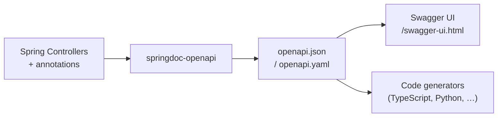

# OpenAPI / Swagger

[← Back to README](../README.md)

---

**OpenAPI** (formerly Swagger) is a standard specification for describing REST APIs. Spring Boot integrates with **springdoc-openapi**, which auto-generates an OpenAPI 3 document from your controllers and serves an interactive Swagger UI — no manual YAML required.



---

## Maven Dependency

```xml
<dependency>
    <groupId>org.springdoc</groupId>
    <artifactId>springdoc-openapi-starter-webmvc-ui</artifactId>
    <version>2.6.0</version>
</dependency>

<!-- WebFlux variant -->
<dependency>
    <groupId>org.springdoc</groupId>
    <artifactId>springdoc-openapi-starter-webflux-ui</artifactId>
    <version>2.6.0</version>
</dependency>
```

After adding the dependency, visit:
- **Swagger UI**: `http://localhost:8080/swagger-ui.html`
- **OpenAPI JSON**: `http://localhost:8080/v3/api-docs`
- **OpenAPI YAML**: `http://localhost:8080/v3/api-docs.yaml`

---

## API-Level Metadata

```java
@Configuration
public class OpenApiConfig {

    @Bean
    public OpenAPI openAPI() {
        return new OpenAPI()
            .info(new Info()
                .title("Order Service API")
                .description("Manages customer orders and fulfilment")
                .version("v1.0")
                .contact(new Contact()
                    .name("Platform Team")
                    .email("platform@example.com"))
                .license(new License()
                    .name("Apache 2.0")
                    .url("https://www.apache.org/licenses/LICENSE-2.0")))
            .addSecurityItem(new SecurityRequirement().addList("BearerAuth"))
            .components(new Components()
                .addSecuritySchemes("BearerAuth",
                    new SecurityScheme()
                        .type(SecurityScheme.Type.HTTP)
                        .scheme("bearer")
                        .bearerFormat("JWT")));
    }
}
```

---

## Annotating Controllers

```java
@RestController
@RequestMapping("/api/orders")
@Tag(name = "Orders", description = "Order management endpoints")
public class OrderController {

    @Operation(
        summary = "Place a new order",
        description = "Creates a new order and initiates payment processing"
    )
    @ApiResponses({
        @ApiResponse(responseCode = "201", description = "Order created",
            content = @Content(schema = @Schema(implementation = OrderResponse.class))),
        @ApiResponse(responseCode = "400", description = "Invalid request body",
            content = @Content(schema = @Schema(implementation = ErrorResponse.class))),
        @ApiResponse(responseCode = "422", description = "Business rule violation")
    })
    @PostMapping
    public ResponseEntity<OrderResponse> placeOrder(
            @RequestBody @Valid PlaceOrderRequest request) {
        // ...
    }

    @Operation(summary = "Get order by ID")
    @Parameter(name = "id", description = "Order UUID", example = "550e8400-e29b-41d4-a716-446655440000")
    @GetMapping("/{id}")
    public ResponseEntity<OrderResponse> getOrder(@PathVariable UUID id) {
        // ...
    }

    @Operation(summary = "List orders", description = "Paginated list of orders for the authenticated user")
    @GetMapping
    public Page<OrderSummary> listOrders(
            @Parameter(description = "Filter by status")
            @RequestParam(required = false) OrderStatus status,
            Pageable pageable) {
        // ...
    }
}
```

---

## Annotating DTOs

```java
@Schema(description = "Request body for placing an order")
public record PlaceOrderRequest(

    @Schema(description = "Customer identifier", example = "CUST-12345")
    @NotBlank
    String customerId,

    @Schema(description = "List of ordered items — must not be empty")
    @NotEmpty
    List<OrderLineRequest> lines
) {}

@Schema(description = "One line in an order")
public record OrderLineRequest(

    @Schema(description = "Product SKU", example = "PROD-ABC")
    @NotBlank
    String productId,

    @Schema(description = "Unit price at time of order", example = "29.99")
    @DecimalMin("0.01")
    BigDecimal price,

    @Schema(description = "Quantity ordered", minimum = "1", maximum = "1000")
    @Positive
    int quantity
) {}
```

---

## Grouping Endpoints

```java
// Separate Swagger UI groups for internal vs public APIs
@Bean
public GroupedOpenApi publicApi() {
    return GroupedOpenApi.builder()
        .group("public")
        .pathsToMatch("/api/**")
        .pathsToExclude("/api/admin/**")
        .build();
}

@Bean
public GroupedOpenApi adminApi() {
    return GroupedOpenApi.builder()
        .group("admin")
        .pathsToMatch("/api/admin/**")
        .addOpenApiCustomizer(api ->
            api.info(new Info().title("Admin API").version("v1")))
        .build();
}
```

---

## Configuration

```yaml
# application.yml
springdoc:
  api-docs:
    path: /v3/api-docs
    enabled: true
  swagger-ui:
    path: /swagger-ui.html
    operations-sorter: method       # sort by HTTP method
    tags-sorter: alpha              # sort tags alphabetically
    display-request-duration: true  # show response time
    enabled: true
  show-actuator: false              # hide /actuator endpoints
  packages-to-scan: com.example.api
  paths-to-match: /api/**
```

Disable in production if the spec is sensitive:

```yaml
# application-prod.yml
springdoc:
  api-docs:
    enabled: false
  swagger-ui:
    enabled: false
```

---

## Design-First: Generating Code from YAML

```yaml
# openapi.yaml (excerpt)
openapi: 3.0.3
info:
  title: Order Service
  version: 1.0.0
paths:
  /api/orders:
    post:
      operationId: placeOrder
      requestBody:
        required: true
        content:
          application/json:
            schema:
              $ref: '#/components/schemas/PlaceOrderRequest'
      responses:
        '201':
          description: Order created
```

```xml
<!-- Generate server stubs from spec -->
<plugin>
    <groupId>org.openapitools</groupId>
    <artifactId>openapi-generator-maven-plugin</artifactId>
    <version>7.7.0</version>
    <executions>
        <execution>
            <goals><goal>generate</goal></goals>
            <configuration>
                <inputSpec>${project.basedir}/src/main/resources/openapi.yaml</inputSpec>
                <generatorName>spring</generatorName>
                <configOptions>
                    <interfaceOnly>true</interfaceOnly>
                    <useSpringBoot3>true</useSpringBoot3>
                    <useTags>true</useTags>
                </configOptions>
            </configuration>
        </execution>
    </executions>
</plugin>
```

Your controllers implement the generated interfaces, keeping them in sync with the spec.

---

## Exporting the Spec for CI

```yaml
# .github/workflows/api-spec.yml
- name: Export OpenAPI spec
  run: |
    # Start the app, then curl the spec
    mvn spring-boot:run &
    sleep 15
    curl -o openapi.yaml http://localhost:8080/v3/api-docs.yaml
    kill %1

- name: Generate TypeScript client
  run: |
    npx @openapitools/openapi-generator-cli generate \
      -i openapi.yaml -g typescript-fetch -o frontend/src/api
```

---

## OpenAPI Summary

| Feature | Annotation / Config |
|---------|-------------------|
| Tag a controller | `@Tag(name = "Orders")` |
| Document an operation | `@Operation(summary = "...", description = "...")` |
| Document responses | `@ApiResponse(responseCode = "201", ...)` |
| Document a parameter | `@Parameter(description = "...")` |
| Document a schema field | `@Schema(description = "...", example = "...")` |
| Global security scheme | `OpenAPI.addSecurityItem()` + `Components.addSecuritySchemes()` |
| Group endpoints | `GroupedOpenApi` beans |
| Swagger UI path | `/swagger-ui.html` |
| OpenAPI JSON | `/v3/api-docs` |
| Disable in prod | `springdoc.swagger-ui.enabled: false` |

---

[← Back to README](../README.md)
