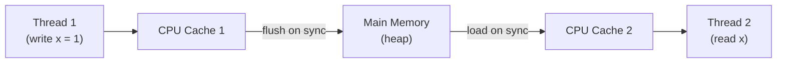

# Java Memory Model

[← Back to README](../README.md)

---

The **Java Memory Model** (JMM) defines the rules that govern how threads read and write shared variables. Without these rules, the JVM and CPU are free to reorder instructions and cache values in ways that make multi-threaded code behave unpredictably. Understanding the JMM is essential for writing correct concurrent code without over-synchronising.



Without synchronisation, Thread 2 may never see Thread 1's write.

---

## The Happens-Before Relationship

A **happens-before** edge guarantees that memory writes made before the edge are visible to code after the edge. If no happens-before relationship exists between two threads, there are no visibility guarantees.

### Built-In Happens-Before Rules

| Situation | What happens-before what |
|-----------|--------------------------|
| Within one thread | Each action happens-before the next |
| `synchronized` block | Unlock of monitor → lock of same monitor |
| `volatile` write | Write → any subsequent read of same variable |
| `Thread.start()` | Code before `start()` → first action in new thread |
| `Thread.join()` | All actions in joined thread → code after `join()` |
| `CountDownLatch.countDown()` | Action before `countDown()` → code after `await()` |
| Constructor completion | Object construction → finalizer execution |

---

## `volatile` — Visibility Without Atomicity

`volatile` guarantees that a write to a variable is immediately visible to all other threads. It does **not** guarantee atomicity for compound operations.

```java
public class StatusFlag {

    private volatile boolean running = true;  // without volatile, thread may cache stale value

    public void stop() {
        running = false;  // write is immediately visible to all threads
    }

    public void run() {
        while (running) {  // always reads from main memory
            doWork();
        }
    }
}
```

### When `volatile` is NOT enough

```java
// BROKEN — volatile does not make read-modify-write atomic
private volatile int counter = 0;

public void increment() {
    counter++;  // this is: read counter, add 1, write counter — NOT atomic
}
```

Two threads can read the same value, both add 1, and one increment is lost.

---

## `java.util.concurrent.atomic` — Atomic Operations

```java
import java.util.concurrent.atomic.*;

AtomicInteger counter = new AtomicInteger(0);

// Atomic increment — one CAS (compare-and-swap) instruction
counter.incrementAndGet();       // returns new value
counter.getAndIncrement();       // returns old value

// Conditional update
counter.compareAndSet(5, 10);    // sets to 10 only if current value is 5

AtomicLong    longVal   = new AtomicLong(0L);
AtomicBoolean boolVal   = new AtomicBoolean(false);
AtomicReference<String> ref = new AtomicReference<>("initial");

// Accumulator — high-throughput counting (avoids CAS contention)
LongAdder adder = new LongAdder();
adder.increment();
long total = adder.sum();    // less contention than AtomicLong under high concurrency
```

---

## `synchronized` — Mutual Exclusion + Visibility

`synchronized` provides both **mutual exclusion** (only one thread at a time) and **happens-before** (all writes before unlock are visible after lock).

```java
public class SafeCounter {

    private int count = 0;

    public synchronized void increment() {
        count++;
    }

    public synchronized int get() {
        return count;
    }
}
```

### Intrinsic Lock (monitor) vs `ReentrantLock`

```java
// ReentrantLock — more control than synchronized
private final ReentrantLock lock = new ReentrantLock();

public void doWork() {
    lock.lock();
    try {
        // critical section
    } finally {
        lock.unlock();
    }
}

// Try-lock — don't block if unavailable
if (lock.tryLock(100, TimeUnit.MILLISECONDS)) {
    try {
        // critical section
    } finally {
        lock.unlock();
    }
}

// ReadWriteLock — multiple concurrent readers, exclusive writers
private final ReadWriteLock rwLock = new ReentrantReadWriteLock();

public String read() {
    rwLock.readLock().lock();
    try { return data; }
    finally { rwLock.readLock().unlock(); }
}

public void write(String value) {
    rwLock.writeLock().lock();
    try { data = value; }
    finally { rwLock.writeLock().unlock(); }
}
```

---

## Double-Checked Locking

Classic lazy-initialization pattern — only correct with `volatile`:

```java
public class Singleton {

    // volatile prevents partial construction being visible
    private static volatile Singleton instance;

    private Singleton() {}

    public static Singleton getInstance() {
        if (instance == null) {              // first check (no lock)
            synchronized (Singleton.class) {
                if (instance == null) {      // second check (with lock)
                    instance = new Singleton();
                }
            }
        }
        return instance;
    }
}

// Better alternative — initialization-on-demand holder
public class Singleton {
    private static class Holder {
        static final Singleton INSTANCE = new Singleton();
    }
    public static Singleton getInstance() { return Holder.INSTANCE; }
}
```

---

## Memory Reordering

CPUs and compilers reorder instructions for performance. The JMM permits reordering unless a happens-before relationship prevents it.

```java
// May be reordered — a and b can be written in any order
int a = 1;
int b = 2;

// NOT reordered across a volatile write
a = 1;
volatileVar = true;  // happens-before barrier — a=1 is visible to any thread that reads volatileVar after
```

### `VarHandle` / `Acquire-Release` Semantics (Java 9+)

```java
import java.lang.invoke.*;

public class LockFreeStack<T> {

    private static final VarHandle HEAD;

    static {
        try {
            HEAD = MethodHandles.lookup()
                .findVarHandle(LockFreeStack.class, "head", Node.class);
        } catch (ReflectiveOperationException e) { throw new ExceptionInInitializerError(e); }
    }

    private volatile Node<T> head;

    public void push(T value) {
        Node<T> newHead = new Node<>(value);
        Node<T> current;
        do {
            current = head;
            newHead.next = current;
        } while (!HEAD.compareAndSet(this, current, newHead));
    }
}
```

---

## Common Concurrency Bugs

### Visibility Bug

```java
// BROKEN — flag not volatile, may loop forever on some JVMs
boolean done = false;

new Thread(() -> { while (!done) {} System.out.println("done"); }).start();
Thread.sleep(100);
done = true;  // write may not be seen by other thread
```

Fix: `private volatile boolean done = false;`

### Race Condition

```java
// BROKEN — check-then-act is not atomic
if (!map.containsKey(key)) {
    map.put(key, value);  // another thread may put the same key between these two lines
}

// Fix: use ConcurrentHashMap.putIfAbsent()
map.putIfAbsent(key, value);
// or
map.computeIfAbsent(key, k -> expensiveCompute(k));
```

### Publication of Partially Constructed Objects

```java
// BROKEN — object may be visible to other threads before constructor completes
public class UnsafePublication {
    public static UnsafePublication instance;

    public UnsafePublication() {
        instance = this;  // published before constructor body finishes
        this.data = "value";
    }
}
```

Fix: never publish `this` from a constructor. Use a factory method or `volatile`.

---

## Java Memory Model Summary

| Concept | Detail |
|---------|--------|
| Happens-before | Ordering guarantee that makes writes visible across threads |
| `volatile` | Guarantees visibility of reads/writes; no atomicity |
| `synchronized` | Mutual exclusion + visibility (happens-before on unlock→lock) |
| `AtomicInteger` | Lock-free atomic read-modify-write via CAS |
| `LongAdder` | High-throughput counter with less CAS contention than `AtomicLong` |
| `ReentrantLock` | Flexible explicit lock with try-lock and fairness options |
| `ReadWriteLock` | Multiple concurrent readers OR one exclusive writer |
| Memory reordering | JVM/CPU may reorder instructions; synchronisation prevents crossing |
| Double-checked locking | Requires `volatile` on the field to be safe |

---

[← Back to README](../README.md)
