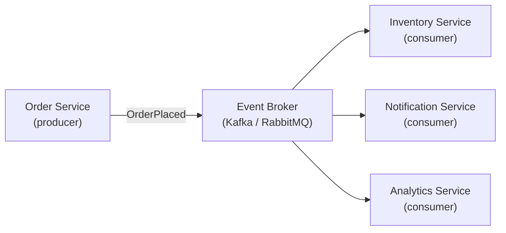
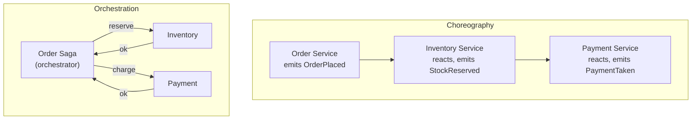

# Event-Driven Architecture

[← Back to README](../README.md)

---

**Event-Driven Architecture** (EDA) decouples services by having them communicate through events rather than direct calls. A service emits an event when something happens; interested services react to it independently. This enables loose coupling, independent scaling, and natural audit trails.



---

## Key Concepts

| Concept | Meaning |
|---------|---------|
| **Event** | An immutable record of something that happened in the past |
| **Producer** | Service that emits events |
| **Consumer** | Service that reacts to events |
| **Broker** | Infrastructure that routes events (Kafka, RabbitMQ, SNS) |
| **Topic / Exchange** | Named channel where events are published |
| **Consumer group** | Set of instances that share a topic's load |
| **At-least-once** | Events may be delivered more than once — consumers must be idempotent |
| **Exactly-once** | Guaranteed single delivery — requires transactional semantics |

---

## Choreography vs. Orchestration



| | Choreography | Orchestration |
|---|---|---|
| Coupling | Loose — services don't know each other | Tighter — orchestrator knows all steps |
| Visibility | Harder to trace the full flow | Easy — orchestrator tracks state |
| Resilience | Decentralized — no single point of failure | Orchestrator is a bottleneck |
| Use case | Simple, few steps | Complex, many steps with compensation |

---

## Event Design

### Event Structure

```java
// Every event carries who, what, and when
public record OrderPlacedEvent(
    String eventId,          // unique ID for idempotency
    String eventType,        // "OrderPlaced"
    Instant occurredAt,      // when it happened
    String orderId,          // aggregate ID
    String customerId,
    List<OrderLine> lines,
    BigDecimal total
) {
    public static OrderPlacedEvent from(Order order) {
        return new OrderPlacedEvent(
            UUID.randomUUID().toString(),
            "OrderPlaced",
            Instant.now(),
            order.id().toString(),
            order.customerId(),
            order.lines(),
            order.total()
        );
    }
}
```

### Versioning Events

```java
// Embed version in the event type or schema registry
public record OrderPlacedEventV2(
    String eventId,
    String eventType,      // "OrderPlaced.v2"
    int    schemaVersion,  // 2
    Instant occurredAt,
    String orderId,
    String customerId,
    List<OrderLine> lines,
    BigDecimal total,
    String currencyCode    // new field in v2
) {}
```

---

## Publishing Events with Kafka

```java
@Service
public class OrderService {

    private final OrderRepository repo;
    private final KafkaTemplate<String, Object> kafka;

    @Transactional  // DB + outbox in one transaction (see Transactional Outbox doc)
    public OrderId placeOrder(PlaceOrderCommand cmd) {
        Order order = repo.save(new Order(cmd));
        kafka.send("orders.placed",
            order.id().toString(),                   // partition key
            OrderPlacedEvent.from(order));
        return order.id();
    }
}
```

```java
@KafkaListener(topics = "orders.placed", groupId = "inventory-service")
@Transactional
public void onOrderPlaced(OrderPlacedEvent event) {
    inventoryService.reserve(event.orderId(), event.lines());
}
```

---

## Idempotent Consumers

Because events can be redelivered (at-least-once), consumers must handle duplicates:

```java
@KafkaListener(topics = "orders.placed", groupId = "notification-service")
@Transactional
public void onOrderPlaced(
        @Payload OrderPlacedEvent event,
        @Header(KafkaHeaders.RECEIVED_KEY) String key) {

    if (processedEvents.existsById(event.eventId())) {
        return;  // already handled
    }

    emailService.sendOrderConfirmation(event.customerId(), event.orderId());
    processedEvents.save(new ProcessedEvent(event.eventId(), Instant.now()));
}
```

---

## Dead-Letter Topics

Failed events are routed to a dead-letter topic for investigation and retry:

```java
@Configuration
public class KafkaConsumerConfig {

    @Bean
    public DefaultErrorHandler errorHandler(KafkaTemplate<?, ?> template) {
        DeadLetterPublishingRecoverer recoverer =
            new DeadLetterPublishingRecoverer(template,
                (record, ex) -> new TopicPartition(
                    record.topic() + ".DLT",
                    record.partition()));

        return new DefaultErrorHandler(recoverer,
            new FixedBackOff(1_000L, 3L));  // retry 3 times, 1 s apart
    }
}
```

---

## Spring Application Events (In-Process)

For events within a single application (not across services):

```java
// Event class
public record OrderConfirmedEvent(String orderId, String customerId) {}

// Publisher
@Service
public class OrderService {

    private final ApplicationEventPublisher events;

    @Transactional
    public void confirmOrder(String orderId) {
        Order order = repo.findById(orderId).orElseThrow();
        order.confirm();
        repo.save(order);
        events.publishEvent(new OrderConfirmedEvent(orderId, order.customerId()));
    }
}

// Listener — same JVM, different bean
@Component
public class EmailNotificationListener {

    @EventListener
    @Async  // don't block the transaction
    public void onOrderConfirmed(OrderConfirmedEvent event) {
        emailService.sendConfirmation(event.customerId(), event.orderId());
    }
}

// Transactional listener — runs AFTER the transaction commits
@TransactionalEventListener(phase = TransactionPhase.AFTER_COMMIT)
public void onOrderConfirmedAfterCommit(OrderConfirmedEvent event) {
    // guaranteed to run only if DB transaction committed successfully
    kafkaProducer.publish(event);
}
```

---

## Saga Pattern — Compensating Transactions

When a multi-step workflow fails partway, compensating events undo earlier steps:

```java
@Component
public class PlaceOrderSaga {

    @SagaEventHandler(associationProperty = "orderId")
    public void on(OrderPlacedEvent event) {
        commandGateway.send(new ReserveInventoryCommand(
            event.orderId(), event.lines()));
    }

    @SagaEventHandler(associationProperty = "orderId")
    public void on(InventoryReservedEvent event) {
        commandGateway.send(new ChargePaymentCommand(
            event.orderId(), event.total()));
    }

    @SagaEventHandler(associationProperty = "orderId")
    public void on(PaymentFailedEvent event) {
        // compensate — release the reserved inventory
        commandGateway.send(new ReleaseInventoryCommand(event.orderId()));
        commandGateway.send(new CancelOrderCommand(event.orderId()));
    }
}
```

---

## Event Schema Registry

In production, use **Confluent Schema Registry** with Avro or Protobuf to enforce schema compatibility:

```xml
<dependency>
    <groupId>io.confluent</groupId>
    <artifactId>kafka-avro-serializer</artifactId>
    <version>7.7.0</version>
</dependency>
```

```yaml
spring:
  kafka:
    producer:
      value-serializer: io.confluent.kafka.serializers.KafkaAvroSerializer
    consumer:
      value-deserializer: io.confluent.kafka.serializers.KafkaAvroDeserializer
    properties:
      schema.registry.url: http://localhost:8081
      specific.avro.reader: true
```

The registry enforces backward/forward compatibility — producers can't publish breaking schema changes.

---

## Event-Driven Architecture Summary

| Pattern | Use Case |
|---------|----------|
| Choreography | Simple flows, maximum decoupling |
| Orchestration / Saga | Complex multi-step flows with compensation |
| `@TransactionalEventListener` | Publish to broker only after DB commit |
| Dead-letter topic | Capture and replay failed events |
| Idempotent consumer | Handle at-least-once redelivery safely |
| Schema registry | Enforce schema compatibility across teams |
| Event sourcing | Store events as the source of truth (see Event Sourcing doc) |

---

[← Back to README](../README.md)
