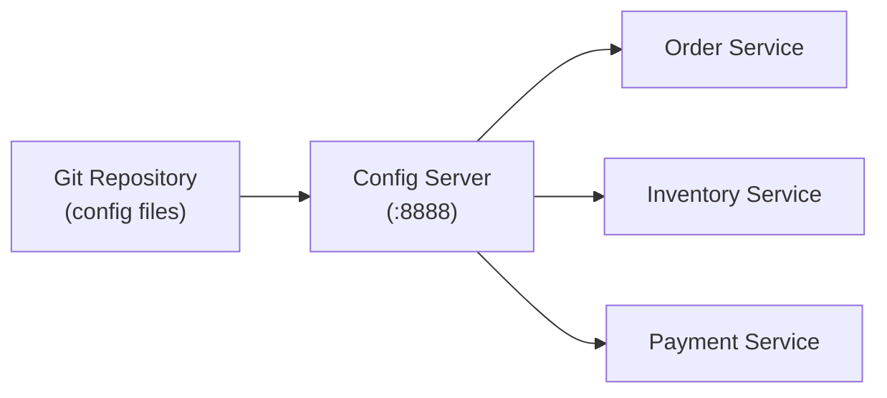

# Spring Cloud Config

[← Back to README](../README.md)

---

**Spring Cloud Config** provides centralized, externalized configuration for distributed systems. A **Config Server** serves property files from a Git repository (or filesystem/Vault); each microservice fetches its config on startup and can refresh it at runtime without redeploying.



---

## Config Server Setup

### Maven Dependency

```xml
<!-- Config Server application -->
<dependency>
    <groupId>org.springframework.cloud</groupId>
    <artifactId>spring-cloud-config-server</artifactId>
</dependency>
```

### Enable the Server

```java
@SpringBootApplication
@EnableConfigServer
public class ConfigServerApplication {
    public static void main(String[] args) {
        SpringApplication.run(ConfigServerApplication.class, args);
    }
}
```

### Configure the Git Backend

```yaml
# config-server/src/main/resources/application.yml
server:
  port: 8888

spring:
  cloud:
    config:
      server:
        git:
          uri: https://github.com/yourorg/config-repo
          default-label: main
          search-paths: '{application}'   # look in subdirectory named after the app
          clone-on-start: true
          # For private repos:
          username: ${GIT_USERNAME}
          password: ${GIT_TOKEN}
```

### Config File Naming Convention

```
config-repo/
├── application.yml             ← shared by all services
├── order-service.yml           ← order-service only
├── order-service-prod.yml      ← order-service in prod profile
├── inventory-service.yml
└── inventory-service-prod.yml
```

The server resolves config in priority order:
1. `{app}-{profile}.yml`
2. `{app}.yml`
3. `application-{profile}.yml`
4. `application.yml`

---

## Config Client Setup

### Maven Dependency

```xml
<!-- In each microservice -->
<dependency>
    <groupId>org.springframework.cloud</groupId>
    <artifactId>spring-cloud-starter-config</artifactId>
</dependency>
```

### Configure the Client

```yaml
# src/main/resources/application.yml
spring:
  application:
    name: order-service   # determines which config files are fetched
  config:
    import: optional:configserver:http://localhost:8888

  cloud:
    config:
      fail-fast: true         # fail on startup if config server unreachable
      retry:
        max-attempts: 6
        initial-interval: 1000
        multiplier: 1.1
        max-interval: 2000
```

On startup the service fetches `http://localhost:8888/order-service/default` and merges the returned properties.

---

## Fetching Config Manually

The config server exposes a REST API:

```bash
# GET /{application}/{profile}[/{label}]
curl http://localhost:8888/order-service/default
curl http://localhost:8888/order-service/prod
curl http://localhost:8888/order-service/default/main    # specific git branch
```

---

## Runtime Refresh with `@RefreshScope`

Without refresh, config is read once at startup. `@RefreshScope` allows beans to be re-created with new values after a `/actuator/refresh` POST.

### In the client service

```yaml
management:
  endpoints:
    web:
      exposure:
        include: refresh, health, info
```

```java
@RefreshScope
@RestController
public class FeatureController {

    @Value("${feature.new-checkout.enabled:false}")
    private boolean newCheckoutEnabled;

    @GetMapping("/api/checkout-variant")
    public String variant() {
        return newCheckoutEnabled ? "new" : "legacy";
    }
}
```

### Trigger a refresh

```bash
# POST to the service — beans annotated @RefreshScope are re-created
curl -X POST http://localhost:8080/actuator/refresh
```

---

## Broadcast Refresh with Spring Cloud Bus

With many service instances, posting to each `/actuator/refresh` individually is impractical. **Spring Cloud Bus** broadcasts the refresh event via Kafka or RabbitMQ.

```xml
<dependency>
    <groupId>org.springframework.cloud</groupId>
    <artifactId>spring-cloud-starter-bus-kafka</artifactId>
</dependency>
```

```bash
# POST to ONE instance — all instances refresh via the bus
curl -X POST http://localhost:8080/actuator/busrefresh
```

---

## Profiles and Environments

```yaml
# config-repo/order-service-prod.yml
spring:
  datasource:
    url: jdbc:postgresql://prod-db:5432/orders
    username: ${DB_USER}
    password: ${DB_PASSWORD}

app:
  payment:
    provider: stripe
    timeout-ms: 5000
```

```yaml
# config-repo/order-service.yml  (default — dev)
spring:
  datasource:
    url: jdbc:postgresql://localhost:5432/orders
    username: dev
    password: dev

app:
  payment:
    provider: mock
    timeout-ms: 1000
```

The active profile controls which file is loaded:

```bash
java -jar order-service.jar --spring.profiles.active=prod
```

---

## Encrypting Sensitive Values

Config Server supports symmetric or asymmetric encryption of property values:

```yaml
# config-server application.yml
encrypt:
  key: ${ENCRYPT_KEY}   # symmetric key
```

```bash
# Encrypt a value
curl -X POST http://localhost:8888/encrypt -d "my-secret-password"
# Returns: AQBd8z3M…

# Store the cipher in config repo
spring:
  datasource:
    password: '{cipher}AQBd8z3M…'
```

The server automatically decrypts `{cipher}` values before serving them to clients.

---

## Local Config Repo for Development

```yaml
# Filesystem backend (no Git needed locally)
spring:
  cloud:
    config:
      server:
        native:
          search-locations: classpath:/config
  profiles:
    active: native
```

```
src/main/resources/config/
├── application.yml
└── order-service.yml
```

---

## Running Locally with Docker Compose

```yaml
services:
  config-server:
    image: yourorg/config-server:latest
    ports:
      - "8888:8888"
    environment:
      GIT_URI: https://github.com/yourorg/config-repo
      GIT_TOKEN: ${GIT_TOKEN}

  order-service:
    image: yourorg/order-service:latest
    environment:
      SPRING_CONFIG_IMPORT: configserver:http://config-server:8888
    depends_on:
      - config-server
```

---

## Spring Cloud Config Summary

| Concept | Detail |
|---------|--------|
| Config Server | Standalone Spring Boot app with `@EnableConfigServer` |
| Config Client | `spring-cloud-starter-config` + `spring.config.import` |
| File resolution | `{app}-{profile}.yml` → `{app}.yml` → `application.yml` |
| `@RefreshScope` | Bean re-created on `/actuator/refresh` |
| Spring Cloud Bus | Broadcast refresh to all instances via Kafka/RabbitMQ |
| `{cipher}` | Encrypted property value decrypted by server |
| `fail-fast: true` | Service fails to start if config server is unreachable |
| Search path | Subdirectory in Git repo per application name |

---

[← Back to README](../README.md)
