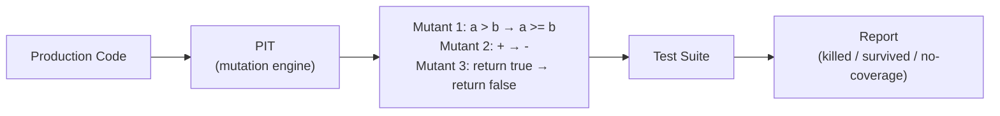

# Mutation Testing (PIT)

[← Back to README](../README.md)

---

**Mutation testing** measures test suite quality by automatically introducing small bugs (**mutations**) into production code and checking whether your tests catch them. If a test fails after a mutation, the mutant is **killed** (good). If no test fails, the mutant **survived** — revealing a gap in test coverage.



Line coverage tells you which lines were *executed*. Mutation testing tells you whether your assertions would actually catch a bug.

---

## Maven Setup

```xml
<plugin>
    <groupId>org.pitest</groupId>
    <artifactId>pitest-maven</artifactId>
    <version>1.16.1</version>
    <dependencies>
        <!-- JUnit 5 support -->
        <dependency>
            <groupId>org.pitest</groupId>
            <artifactId>pitest-junit5-plugin</artifactId>
            <version>1.2.1</version>
        </dependency>
    </dependencies>
    <configuration>
        <targetClasses>
            <param>com.example.domain.*</param>
            <param>com.example.service.*</param>
        </targetClasses>
        <targetTests>
            <param>com.example.*Test</param>
        </targetTests>
        <mutators>STRONGER</mutators>      <!-- or DEFAULTS, ALL -->
        <outputFormats>
            <outputFormat>HTML</outputFormat>
            <outputFormat>XML</outputFormat>
        </outputFormats>
        <mutationThreshold>80</mutationThreshold>   <!-- fail build if < 80% killed -->
        <coverageThreshold>90</coverageThreshold>   <!-- require 90% line coverage too -->
        <threads>4</threads>
        <timestampedReports>false</timestampedReports>
    </configuration>
</plugin>
```

---

## Running PIT

```bash
# Run mutation tests
mvn test-compile org.pitest:pitest-maven:mutationCoverage

# Open the report
open target/pit-reports/index.html
```

---

## Understanding Mutants

### Common Mutation Operators

| Mutation | Example | Killed by |
|----------|---------|-----------|
| Conditional boundary | `>` → `>=` | Test at the boundary value |
| Negate conditional | `if (x > 0)` → `if (!(x > 0))` | Test where condition is false |
| Math operator | `a + b` → `a - b` | Test that verifies the arithmetic result |
| Return value | `return true` → `return false` | Test that asserts the return value |
| Void method call | Remove `repository.save(order)` | Test that verifies side effects |
| Increment | `i++` → `i--` | Test with known loop iteration counts |

---

## Example — Before and After

```java
// Production code
public class DiscountCalculator {

    public BigDecimal apply(BigDecimal price, int customerAge) {
        if (customerAge >= 65) {
            return price.multiply(new BigDecimal("0.80"));  // 20% senior discount
        }
        if (customerAge < 18) {
            return price.multiply(new BigDecimal("0.90"));  // 10% youth discount
        }
        return price;
    }
}
```

```java
// Weak test — only tests the "happy path"
@Test
void seniorDiscount() {
    BigDecimal result = calc.apply(new BigDecimal("100.00"), 70);
    assertThat(result).isEqualByComparingTo("80.00");
}
```

**Surviving mutants with this test:**
- `>= 65` → `> 65` (boundary mutant) — age 65 itself not tested
- `< 18` → `<= 18` (boundary mutant) — youth boundary not tested
- Remove the youth discount branch entirely

```java
// Strong tests — kill all boundary mutants
@ParameterizedTest
@CsvSource({
    "64, 100.00, 100.00",   // just below senior threshold
    "65, 100.00,  80.00",   // exactly at senior threshold
    "66, 100.00,  80.00",   // above senior threshold
    "17, 100.00,  90.00",   // youth
    "18, 100.00, 100.00",   // exactly at youth upper bound — no discount
    "30, 100.00, 100.00",   // adult
})
void discountCalculation(int age, String price, String expected) {
    assertThat(calc.apply(new BigDecimal(price), age))
        .isEqualByComparingTo(expected);
}
```

---

## Interpreting the Report

The HTML report highlights source lines:

- **Green** — all mutants killed (tests are strong)
- **Red** — surviving mutants (test gaps)
- **Yellow** — no test covered this line

```
Mutation score: 87% (killed 68 / 78 mutants)

Survived mutants in DiscountCalculator.java:
  Line 4:  changed conditional boundary: >= to >     ← add test for age==65
  Line 7:  negated conditional: removed else branch  ← add test where both conditions false
```

---

## Targeting Specific Classes

```xml
<configuration>
    <!-- Only mutate domain and service layers — skip controllers, config, DTOs -->
    <targetClasses>
        <param>com.example.domain.**</param>
        <param>com.example.service.**</param>
    </targetClasses>
    <!-- Exclude generated code -->
    <excludedClasses>
        <param>com.example.generated.*</param>
    </excludedClasses>
    <!-- Exclude tests that are too slow to run per-mutant -->
    <excludedTestClasses>
        <param>com.example.*IT</param>
    </excludedTestClasses>
</configuration>
```

---

## CI Integration

```yaml
# .github/workflows/mutation-tests.yml
- name: Run mutation tests
  run: mvn test-compile org.pitest:pitest-maven:mutationCoverage

- name: Upload PIT report
  uses: actions/upload-artifact@v4
  with:
    name: pit-report
    path: target/pit-reports/
```

Gate the build on mutation score by setting `<mutationThreshold>` in the plugin config — the build fails if the score drops below the threshold.

---

## Mutation Testing Summary

| Term | Meaning |
|------|---------|
| Mutant | A copy of production code with one small change |
| Killed | A test failed after the mutation — test caught the bug |
| Survived | No test failed — gap in test suite |
| No-coverage | No test ran against this code at all |
| Mutation score | `killed / (killed + survived)` — higher is better |
| Conditional boundary | `>` ↔ `>=`, `<` ↔ `<=` — the most common surviving mutant type |
| `STRONGER` mutators | Larger set than `DEFAULTS` — catches more subtle gaps |
| `mutationThreshold` | Build fails if mutation score drops below this % |

---

[← Back to README](../README.md)
