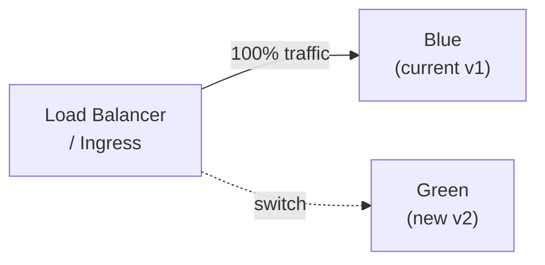
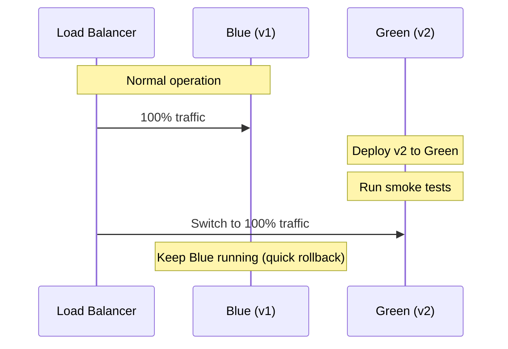
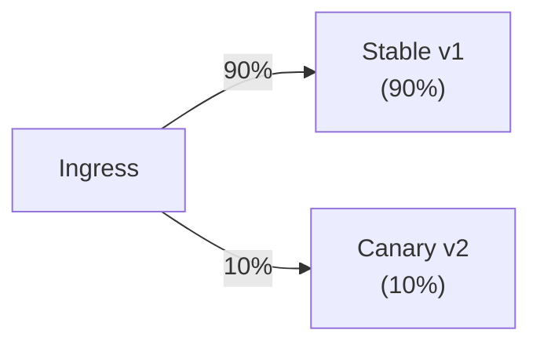

# Blue-Green & Canary Deployments

[← Back to README](../README.md)

---

Zero-downtime deployments mean users never see an error or outage during a release. The two core strategies are **blue-green** (full instant switch) and **canary** (gradual traffic shift). Both separate deployment from release.



---

## Blue-Green Deployment

Two identical environments run simultaneously. All traffic points to **blue** (current). Deploy to **green** (new), run smoke tests, then switch the load balancer. Rollback is instant — point back to blue.



### Kubernetes — Blue-Green with Services

```yaml
# blue-deployment.yaml
apiVersion: apps/v1
kind: Deployment
metadata:
  name: order-service-blue
  labels:
    app: order-service
    version: blue
spec:
  replicas: 3
  selector:
    matchLabels:
      app: order-service
      version: blue
  template:
    metadata:
      labels:
        app: order-service
        version: blue
    spec:
      containers:
        - name: order-service
          image: yourorg/order-service:v1.0
```

```yaml
# green-deployment.yaml
apiVersion: apps/v1
kind: Deployment
metadata:
  name: order-service-green
  labels:
    app: order-service
    version: green
spec:
  replicas: 3
  selector:
    matchLabels:
      app: order-service
      version: green
  template:
    metadata:
      labels:
        app: order-service
        version: green
    spec:
      containers:
        - name: order-service
          image: yourorg/order-service:v2.0
```

```yaml
# service.yaml — switch by changing the selector
apiVersion: v1
kind: Service
metadata:
  name: order-service
spec:
  selector:
    app: order-service
    version: blue    # change to "green" to switch traffic
  ports:
    - port: 80
      targetPort: 8080
```

```bash
# Switch traffic to green
kubectl patch service order-service \
  -p '{"spec":{"selector":{"version":"green"}}}'

# Rollback — switch back to blue
kubectl patch service order-service \
  -p '{"spec":{"selector":{"version":"blue"}}}'
```

---

## Canary Deployment

Route a small percentage of traffic to the new version. Monitor error rates, latency, and business metrics. Gradually increase the percentage until fully rolled out.



### Kubernetes — Canary with Nginx Ingress

```yaml
# stable-deployment.yaml
apiVersion: apps/v1
kind: Deployment
metadata:
  name: order-service-stable
spec:
  replicas: 9     # 9 pods
  template:
    spec:
      containers:
        - name: order-service
          image: yourorg/order-service:v1.0
```

```yaml
# canary-deployment.yaml
apiVersion: apps/v1
kind: Deployment
metadata:
  name: order-service-canary
spec:
  replicas: 1     # 1 pod = ~10% of traffic (simple weight by replica count)
  template:
    spec:
      containers:
        - name: order-service
          image: yourorg/order-service:v2.0
```

```yaml
# canary-ingress.yaml — Nginx canary annotation
apiVersion: networking.k8s.io/v1
kind: Ingress
metadata:
  name: order-service-canary
  annotations:
    nginx.ingress.kubernetes.io/canary: "true"
    nginx.ingress.kubernetes.io/canary-weight: "10"   # 10% of traffic
spec:
  rules:
    - host: api.example.com
      http:
        paths:
          - path: /api/orders
            pathType: Prefix
            backend:
              service:
                name: order-service-canary
                port:
                  number: 80
```

```bash
# Increase canary weight to 50%
kubectl annotate ingress order-service-canary \
  nginx.ingress.kubernetes.io/canary-weight=50 --overwrite

# Full rollout — remove canary, scale up stable to v2
kubectl set image deployment/order-service-stable \
  order-service=yourorg/order-service:v2.0
kubectl delete ingress order-service-canary
kubectl delete deployment order-service-canary
```

---

## Rolling Deployment (Kubernetes Default)

Kubernetes replaces pods one at a time — no need for separate blue/green environments:

```yaml
apiVersion: apps/v1
kind: Deployment
metadata:
  name: order-service
spec:
  replicas: 6
  strategy:
    type: RollingUpdate
    rollingUpdate:
      maxSurge: 2        # allow 2 extra pods during rollout
      maxUnavailable: 0  # never take any pods offline during rollout
  template:
    spec:
      containers:
        - name: order-service
          image: yourorg/order-service:v2.0
          readinessProbe:
            httpGet:
              path: /actuator/health/readiness
              port: 8080
            initialDelaySeconds: 10
            periodSeconds: 5
```

```bash
# Roll back if something goes wrong
kubectl rollout undo deployment/order-service

# Check rollout status
kubectl rollout status deployment/order-service
```

---

## Readiness and Liveness Probes

Essential for zero-downtime — Kubernetes won't route traffic to a pod until the readiness probe passes:

```yaml
# application.yml
management:
  endpoint:
    health:
      probes:
        enabled: true
  health:
    livenessState:
      enabled: true
    readinessState:
      enabled: true
```

```yaml
# In the Kubernetes deployment spec
livenessProbe:
  httpGet:
    path: /actuator/health/liveness
    port: 8080
  initialDelaySeconds: 20
  periodSeconds: 10
  failureThreshold: 3

readinessProbe:
  httpGet:
    path: /actuator/health/readiness
    port: 8080
  initialDelaySeconds: 10
  periodSeconds: 5
  failureThreshold: 3
```

---

## Database Migrations with Zero Downtime

Schema changes must be backward-compatible with both old and new code during the transition:

```
Phase 1: add column (nullable)     — both v1 and v2 work
Phase 2: deploy v2 (writes new col) — v1 still works (col nullable)
Phase 3: backfill data             — after v2 is fully deployed
Phase 4: add NOT NULL constraint   — next release
Phase 5: drop old column           — release after that
```

Never add a NOT NULL column without a default in a single migration on a live table.

---

## Deployment Strategies Summary

| Strategy | Traffic switch | Rollback | Resource cost |
|----------|---------------|----------|---------------|
| Rolling update | Gradual, pod-by-pod | `kubectl rollout undo` | Minimal extra |
| Blue-Green | Instant (service selector) | Point selector back | 2× resources |
| Canary | Gradual (weight %) | Delete canary | Small overhead |

| Probe | Purpose |
|-------|---------|
| Readiness | Pod is ready to receive traffic |
| Liveness | Pod is alive — restart if failing |
| Startup | Extra time for slow-starting apps |

---

[← Back to README](../README.md)
