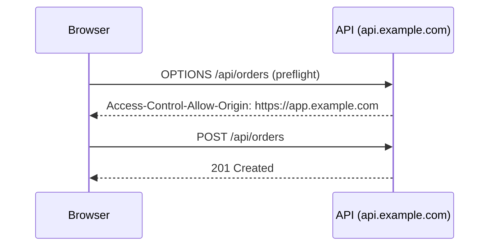
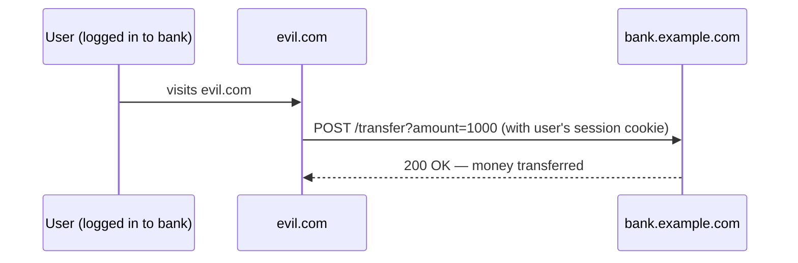

# CORS and CSRF

[← Back to README](../README.md)

---

## CORS — Cross-Origin Resource Sharing

Browsers enforce the **Same-Origin Policy**: JavaScript on `https://app.example.com` cannot call `https://api.example.com` unless the server explicitly allows it. **CORS** is the HTTP mechanism that relaxes this restriction in a controlled way.



---

### How CORS Works

1. **Simple requests** (GET, POST with plain text body): browser sends the request and checks the response headers.
2. **Preflighted requests** (PUT, DELETE, custom headers, JSON body): browser sends `OPTIONS` first; the server must respond with the allowed origins/methods/headers before the real request proceeds.

---

### Spring Boot — Global CORS

```java
@Configuration
public class CorsConfig implements WebMvcConfigurer {

    @Override
    public void addCorsMappings(CorsRegistry registry) {
        registry.addMapping("/api/**")
            .allowedOrigins(
                "https://app.example.com",
                "https://admin.example.com")
            .allowedMethods("GET", "POST", "PUT", "DELETE", "PATCH", "OPTIONS")
            .allowedHeaders("Authorization", "Content-Type", "X-Request-ID")
            .allowCredentials(true)   // required for cookies / Authorization header
            .maxAge(3600);            // preflight cache duration (seconds)
    }
}
```

### Per-Controller / Per-Method CORS

```java
@RestController
@RequestMapping("/api/products")
@CrossOrigin(origins = "https://shop.example.com", maxAge = 3600)
public class ProductController {

    @CrossOrigin(origins = "*")   // override at method level
    @GetMapping("/featured")
    public List<Product> getFeatured() { ... }
}
```

### CORS with Spring Security

When Spring Security is on the classpath, it intercepts requests before MVC. You must configure CORS at the security filter level too:

```java
@Bean
public SecurityFilterChain securityFilterChain(HttpSecurity http) throws Exception {
    http
        .cors(cors -> cors.configurationSource(corsConfigurationSource()))
        .csrf(AbstractHttpConfigurer::disable)   // REST APIs — see CSRF section
        // ...
    return http.build();
}

@Bean
public CorsConfigurationSource corsConfigurationSource() {
    CorsConfiguration config = new CorsConfiguration();
    config.setAllowedOrigins(List.of("https://app.example.com"));
    config.setAllowedMethods(List.of("GET", "POST", "PUT", "DELETE", "OPTIONS"));
    config.setAllowedHeaders(List.of("Authorization", "Content-Type"));
    config.setAllowCredentials(true);
    config.setMaxAge(3600L);

    UrlBasedCorsConfigurationSource source = new UrlBasedCorsConfigurationSource();
    source.registerCorsConfiguration("/api/**", config);
    return source;
}
```

### Common CORS Mistakes

| Mistake | Problem |
|---------|---------|
| `allowedOrigins("*")` with `allowCredentials(true)` | Browsers reject this combination — must specify exact origins |
| Only configuring MVC CORS but not Security | Spring Security blocks preflight before MVC config runs |
| Not including custom headers in `allowedHeaders` | Browser blocks requests with `X-Custom-Header` |
| Missing `OPTIONS` in `allowedMethods` | Preflight requests fail |

---

## CSRF — Cross-Site Request Forgery

CSRF is an attack where a malicious website tricks an authenticated user's browser into making a request to your API using the user's existing session cookie.



---

### When CSRF Matters

| App type | CSRF protection needed? |
|----------|------------------------|
| Browser app using session cookies | **Yes** |
| REST API using `Authorization: Bearer` JWT | **No** — JWT is not sent automatically by browser |
| REST API using cookies for auth | **Yes** |

---

### Spring Security CSRF — Stateful Session Apps

```java
@Bean
public SecurityFilterChain securityFilterChain(HttpSecurity http) throws Exception {
    http
        // Enable CSRF with cookie-based token (readable by JavaScript)
        .csrf(csrf -> csrf
            .csrfTokenRepository(CookieCsrfTokenRepository.withHttpOnlyFalse()))
        // ...
    return http.build();
}
```

The server sets a `XSRF-TOKEN` cookie. The client reads it and sends it back as a request header `X-XSRF-TOKEN`. The server validates that the header value matches the cookie.

```javascript
// Axios — read cookie and attach header automatically
axios.defaults.xsrfCookieName = 'XSRF-TOKEN';
axios.defaults.xsrfHeaderName = 'X-XSRF-TOKEN';
```

### Disable CSRF for Stateless REST APIs

JWT-authenticated APIs don't need CSRF protection — browsers won't automatically attach an `Authorization` header:

```java
http.csrf(AbstractHttpConfigurer::disable);
```

### Explicit CSRF Token with Spring MVC (Server-Side Rendering)

```html
<!-- Thymeleaf — automatically includes CSRF token in forms -->
<form th:action="@{/transfer}" method="post">
    <input type="hidden" th:name="${_csrf.parameterName}" th:value="${_csrf.token}"/>
    <!-- or with Thymeleaf security extras: just use th:action and it's included automatically -->
    <button type="submit">Transfer</button>
</form>
```

---

### SameSite Cookie Attribute

Modern browsers offer a simpler CSRF defence — set `SameSite=Strict` or `SameSite=Lax` on the session cookie:

```yaml
server:
  servlet:
    session:
      cookie:
        same-site: strict   # cookie not sent on cross-site requests at all
        http-only: true     # not accessible to JavaScript
        secure: true        # HTTPS only
```

| SameSite | Behaviour |
|----------|-----------|
| `Strict` | Cookie never sent on cross-site requests (including top-level navigation) |
| `Lax` | Cookie sent on top-level GET navigation but not POST/PUT from other sites |
| `None` | Cookie sent on all requests — must be paired with `Secure` |

`SameSite=Lax` is now the browser default for cookies without an explicit `SameSite` attribute.

---

## CORS & CSRF Summary

### CORS

| Concept | Detail |
|---------|--------|
| Same-Origin Policy | Browser blocks cross-origin requests by default |
| Preflight (`OPTIONS`) | Browser asks server if the real request is allowed |
| `allowedOrigins` | Must list exact origins; avoid `*` with credentials |
| `allowCredentials(true)` | Required for cookies / `Authorization` header |
| Spring Security + CORS | Configure via `CorsConfigurationSource` bean |

### CSRF

| Concept | Detail |
|---------|--------|
| CSRF attack | Malicious site triggers state-changing requests using victim's cookie |
| CSRF token | Server-issued unique value the attacker can't read (double-submit pattern) |
| `CookieCsrfTokenRepository` | Sets `XSRF-TOKEN` cookie; client sends it back as `X-XSRF-TOKEN` header |
| SameSite cookie | Browser-enforced defence — `Strict` / `Lax` block cross-site cookie sends |
| Disable for JWT APIs | Stateless APIs using `Authorization: Bearer` don't need CSRF protection |

---

[← Back to README](../README.md)
