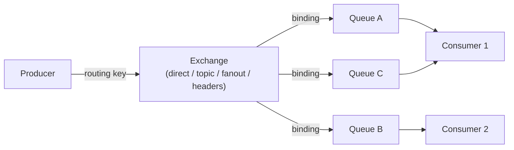

# RabbitMQ Deep Dive

[← Back to README](../README.md)

---

**RabbitMQ** is a message broker implementing the **AMQP** protocol. Unlike Kafka (append-only log), RabbitMQ uses a routing model: producers publish to **exchanges**, which route messages to **queues** based on **bindings** and **routing keys**. Consumers read from queues and acknowledge messages.



---

## Exchange Types

| Type | Routing Behaviour |
|------|------------------|
| **Direct** | Route to queues whose binding key exactly matches the routing key |
| **Topic** | Route using wildcard patterns (`*` = one word, `#` = zero or more words) |
| **Fanout** | Broadcast to all bound queues — routing key is ignored |
| **Headers** | Route based on message headers instead of routing key |

---

## Maven Dependency

```xml
<dependency>
    <groupId>org.springframework.boot</groupId>
    <artifactId>spring-boot-starter-amqp</artifactId>
</dependency>
```

---

## Configuration

```yaml
spring:
  rabbitmq:
    host: localhost
    port: 5672
    username: guest
    password: guest
    virtual-host: /
    listener:
      simple:
        acknowledge-mode: manual   # manual ack for reliability
        prefetch: 10               # max unacked messages per consumer
        retry:
          enabled: true
          initial-interval: 1000
          max-attempts: 3
          multiplier: 2.0
```

---

## Declaring Infrastructure

```java
@Configuration
public class RabbitConfig {

    public static final String ORDER_EXCHANGE    = "orders";
    public static final String ORDER_PLACED_KEY  = "order.placed";
    public static final String ORDER_QUEUE       = "orders.inventory";
    public static final String DLX               = "orders.dlx";
    public static final String DLQ               = "orders.inventory.dead";

    // Dead Letter Exchange & Queue
    @Bean
    public DirectExchange deadLetterExchange() {
        return new DirectExchange(DLX);
    }

    @Bean
    public Queue deadLetterQueue() {
        return QueueBuilder.durable(DLQ).build();
    }

    @Bean
    public Binding deadLetterBinding() {
        return BindingBuilder.bind(deadLetterQueue())
            .to(deadLetterExchange())
            .with(ORDER_QUEUE);  // routing key for DLQ
    }

    // Main Exchange & Queue
    @Bean
    public TopicExchange orderExchange() {
        return new TopicExchange(ORDER_EXCHANGE);
    }

    @Bean
    public Queue inventoryQueue() {
        return QueueBuilder.durable(ORDER_QUEUE)
            .withArgument("x-dead-letter-exchange", DLX)
            .withArgument("x-dead-letter-routing-key", ORDER_QUEUE)
            .withArgument("x-message-ttl", 300_000)   // 5-min TTL
            .build();
    }

    @Bean
    public Binding inventoryBinding() {
        return BindingBuilder.bind(inventoryQueue())
            .to(orderExchange())
            .with("order.#");   // matches order.placed, order.confirmed, etc.
    }

    // Message converter — JSON
    @Bean
    public Jackson2JsonMessageConverter messageConverter() {
        return new Jackson2JsonMessageConverter();
    }

    @Bean
    public RabbitTemplate rabbitTemplate(ConnectionFactory cf) {
        RabbitTemplate template = new RabbitTemplate(cf);
        template.setMessageConverter(messageConverter());
        template.setConfirmCallback((correlationData, ack, cause) -> {
            if (!ack) log.error("Message not confirmed: {}", cause);
        });
        template.setMandatory(true);  // return unroutable messages
        return template;
    }
}
```

---

## Running RabbitMQ Locally

```yaml
# compose.yml
services:
  rabbitmq:
    image: rabbitmq:3.13-management
    ports:
      - "5672:5672"    # AMQP
      - "15672:15672"  # Management UI → http://localhost:15672  (guest/guest)
```

---

## Publishing Messages

```java
@Service
public class OrderEventPublisher {

    private final RabbitTemplate rabbitTemplate;

    public void publishOrderPlaced(OrderPlacedEvent event) {
        rabbitTemplate.convertAndSend(
            RabbitConfig.ORDER_EXCHANGE,
            RabbitConfig.ORDER_PLACED_KEY,
            event,
            message -> {
                message.getMessageProperties().setMessageId(event.eventId());
                message.getMessageProperties().setDeliveryMode(
                    MessageDeliveryMode.PERSISTENT);  // survive broker restart
                return message;
            });
    }
}
```

---

## Consuming Messages

```java
@Component
public class InventoryConsumer {

    @RabbitListener(queues = RabbitConfig.ORDER_QUEUE)
    public void onOrderPlaced(
            @Payload OrderPlacedEvent event,
            Channel channel,
            @Header(AmqpHeaders.DELIVERY_TAG) long deliveryTag) throws IOException {

        try {
            inventoryService.reserve(event.orderId(), event.lines());
            channel.basicAck(deliveryTag, false);   // acknowledge — remove from queue

        } catch (OutOfStockException e) {
            // Reject without requeue → goes to DLQ
            channel.basicNack(deliveryTag, false, false);

        } catch (TransientException e) {
            // Reject with requeue → retry later
            channel.basicNack(deliveryTag, false, true);
        }
    }
}
```

---

## Exchange Patterns

### Fanout — Broadcast to All Consumers

```java
@Bean
public FanoutExchange notificationExchange() {
    return new FanoutExchange("notifications");
}

// Each service binds its own queue to the fanout exchange
@Bean
public Queue emailQueue()  { return QueueBuilder.durable("notifications.email").build(); }
@Bean
public Queue smsQueue()    { return QueueBuilder.durable("notifications.sms").build(); }
@Bean
public Queue pushQueue()   { return QueueBuilder.durable("notifications.push").build(); }

@Bean public Binding emailBinding()  { return BindingBuilder.bind(emailQueue()).to(notificationExchange()); }
@Bean public Binding smsBinding()    { return BindingBuilder.bind(smsQueue()).to(notificationExchange()); }
@Bean public Binding pushBinding()   { return BindingBuilder.bind(pushQueue()).to(notificationExchange()); }
```

### Topic — Wildcard Routing

```
Routing key: "order.placed.EU"
Binding patterns:
  "order.#"        → matches (any order event, any region)
  "order.placed.*" → matches (order placed, any region)
  "*.placed.*"     → matches (any entity placed, any region)
  "order.shipped"  → does NOT match
```

### Direct — Competing Consumers (Work Queue)

```java
// Multiple consumers on the same queue — each message processed by only one
@RabbitListener(queues = "tasks", concurrency = "3-10")
public void processTask(TaskPayload task) {
    taskService.execute(task);
}
```

RabbitMQ round-robins messages across competing consumers.

---

## Request-Reply (RPC)

```java
// Synchronous RPC over RabbitMQ
@Service
public class PricingClient {

    private final RabbitTemplate rabbitTemplate;

    public PriceResponse getPrice(PriceRequest request) {
        return (PriceResponse) rabbitTemplate.convertSendAndReceive(
            "pricing.exchange",
            "pricing.request",
            request);
    }
}

// Server side
@RabbitListener(queues = "pricing.requests")
public PriceResponse handlePricingRequest(PriceRequest request) {
    return pricingService.calculate(request);
}
```

---

## Dead Letter Queue — Inspecting and Replaying

```java
// Move a message from DLQ back to the main queue for reprocessing
@PostMapping("/admin/dlq/replay")
public int replayDeadLetters(@RequestParam(defaultValue = "100") int max) {
    int count = 0;
    Message message;
    while (count < max &&
           (message = rabbitTemplate.receive(RabbitConfig.DLQ, 100)) != null) {
        rabbitTemplate.send(
            RabbitConfig.ORDER_EXCHANGE,
            RabbitConfig.ORDER_PLACED_KEY,
            message);
        count++;
    }
    return count;
}
```

---

## RabbitMQ Summary

| Concept | Detail |
|---------|--------|
| Exchange | Routes messages; types: direct, topic, fanout, headers |
| Queue | Buffer where messages wait for consumers |
| Binding | Rule connecting an exchange to a queue (with optional routing key) |
| Routing key | String used by direct/topic exchanges to decide which queue |
| Ack | Consumer signals successful processing — message deleted |
| Nack + requeue | Consumer rejects message — returned to front of queue |
| Nack + no requeue | Consumer rejects — routed to DLX if configured |
| DLX / DLQ | Dead-letter exchange/queue for failed or expired messages |
| `x-message-ttl` | Per-queue message expiry in milliseconds |
| Prefetch | Max unacknowledged messages per consumer (flow control) |
| Competing consumers | Multiple consumers on one queue; each message handled by one |
| Fanout | One message delivered to all bound queues |
| RPC | `convertSendAndReceive` for synchronous request-reply |

---

[← Back to README](../README.md)
