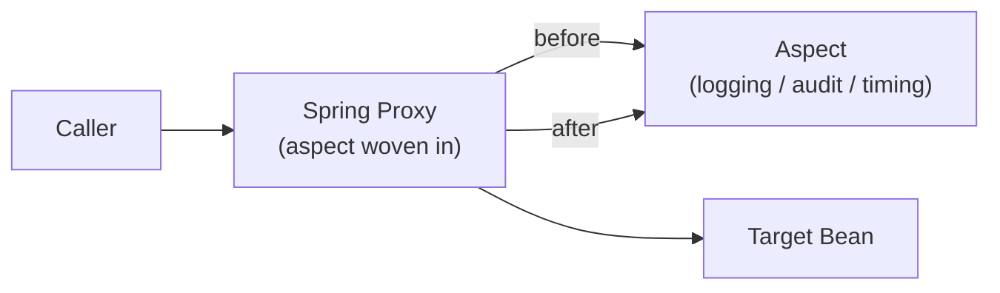

# Spring AOP

[← Back to README](../README.md)

---

**Aspect-Oriented Programming** (AOP) separates cross-cutting concerns — logging, auditing, security, transactions — from business logic. Instead of sprinkling the same code across every method, you define it once in an **aspect** and declare where it applies with a **pointcut**.



Spring AOP works by wrapping beans in a **proxy** at startup. The proxy intercepts calls and runs advice code around the real method.

---

## Maven Dependency

```xml
<dependency>
    <groupId>org.springframework.boot</groupId>
    <artifactId>spring-boot-starter-aop</artifactId>
</dependency>
```

---

## Core Concepts

| Term | Meaning |
|------|---------|
| **Aspect** | Class containing cross-cutting logic (`@Aspect`) |
| **Advice** | The action taken — `@Before`, `@After`, `@Around`, `@AfterReturning`, `@AfterThrowing` |
| **Pointcut** | Expression that selects which methods to intercept |
| **Join point** | A specific method execution matched by a pointcut |
| **Weaving** | Applying aspects to target objects (Spring does this at runtime via proxies) |

---

## Pointcut Expressions

```java
// execution(modifiers? return-type declaring-type?.method(params) throws?)

// All public methods in the service package
execution(public * com.example.service.*.*(..))

// All methods in any class annotated @Service
within(@org.springframework.stereotype.Service *)

// Methods annotated with a custom annotation
@annotation(com.example.annotation.Audited)

// Methods with a specific argument type
execution(* *..*(com.example.domain.Order, ..))

// Combining expressions
execution(* com.example.service.*.*(..)) && !execution(* com.example.service.*.find*(..))
```

---

## Advice Types

```java
@Aspect
@Component
public class LoggingAspect {

    // Runs before the method
    @Before("execution(* com.example.service.*.*(..))")
    public void logBefore(JoinPoint jp) {
        log.info("Calling: {}.{}",
            jp.getTarget().getClass().getSimpleName(),
            jp.getSignature().getName());
    }

    // Runs after the method returns normally
    @AfterReturning(
        pointcut = "execution(* com.example.service.*.*(..))",
        returning = "result")
    public void logAfterReturning(JoinPoint jp, Object result) {
        log.info("Returned from {}: {}", jp.getSignature().getName(), result);
    }

    // Runs after the method throws an exception
    @AfterThrowing(
        pointcut = "execution(* com.example.service.*.*(..))",
        throwing  = "ex")
    public void logAfterThrowing(JoinPoint jp, Throwable ex) {
        log.error("Exception in {}: {}", jp.getSignature().getName(), ex.getMessage());
    }

    // Runs after the method — regardless of outcome
    @After("execution(* com.example.service.*.*(..))")
    public void logAfterFinally(JoinPoint jp) {
        log.debug("Completed: {}", jp.getSignature().getName());
    }
}
```

---

## `@Around` — Most Powerful Advice

`@Around` wraps the entire method call. You control whether it runs at all and can modify arguments and return values.

```java
@Aspect
@Component
public class TimingAspect {

    @Around("execution(* com.example.service.*.*(..))")
    public Object measureTime(ProceedingJoinPoint pjp) throws Throwable {
        long start = System.currentTimeMillis();
        try {
            Object result = pjp.proceed();   // call the real method
            long elapsed = System.currentTimeMillis() - start;
            log.info("{} completed in {} ms",
                pjp.getSignature().toShortString(), elapsed);
            return result;
        } catch (Throwable t) {
            long elapsed = System.currentTimeMillis() - start;
            log.warn("{} failed after {} ms: {}",
                pjp.getSignature().toShortString(), elapsed, t.getMessage());
            throw t;
        }
    }
}
```

---

## Custom Annotation Pointcut

Define a marker annotation and apply aspects only where you put it:

```java
// 1. Define the annotation
@Target(ElementType.METHOD)
@Retention(RetentionPolicy.RUNTIME)
public @interface Audited {
    String action() default "";
}

// 2. Apply it in production code
@Service
public class OrderService {

    @Audited(action = "PLACE_ORDER")
    public OrderId placeOrder(PlaceOrderCommand cmd) { ... }

    @Audited(action = "CANCEL_ORDER")
    public void cancelOrder(String orderId) { ... }
}

// 3. Intercept in the aspect
@Aspect
@Component
public class AuditAspect {

    private final AuditLogRepository auditLog;

    @Around("@annotation(audited)")
    public Object audit(ProceedingJoinPoint pjp, Audited audited) throws Throwable {
        String user = SecurityContextHolder.getContext()
            .getAuthentication().getName();
        try {
            Object result = pjp.proceed();
            auditLog.save(new AuditEntry(
                audited.action(), user, "SUCCESS", Instant.now()));
            return result;
        } catch (Exception e) {
            auditLog.save(new AuditEntry(
                audited.action(), user, "FAILURE: " + e.getMessage(), Instant.now()));
            throw e;
        }
    }
}
```

---

## Practical Examples

### Method-Level Caching (manual)

```java
@Around("@annotation(cacheable)")
public Object cache(ProceedingJoinPoint pjp,
                    org.springframework.cache.annotation.Cacheable cacheable)
        throws Throwable {
    String key = pjp.getSignature().toShortString()
        + Arrays.toString(pjp.getArgs());
    Object cached = localCache.get(key);
    if (cached != null) return cached;
    Object result = pjp.proceed();
    localCache.put(key, result);
    return result;
}
```

### Rate Limiting per User

```java
@Around("@annotation(rateLimited)")
public Object rateLimit(ProceedingJoinPoint pjp, RateLimited rateLimited)
        throws Throwable {
    String userId = getCurrentUserId();
    if (!rateLimiter.tryConsume(userId)) {
        throw new RateLimitExceededException("Too many requests");
    }
    return pjp.proceed();
}
```

### Retry on Failure

```java
@Around("@annotation(retryable)")
public Object retry(ProceedingJoinPoint pjp, Retryable retryable) throws Throwable {
    int attempts = retryable.maxAttempts();
    Throwable last = null;
    for (int i = 0; i < attempts; i++) {
        try {
            return pjp.proceed();
        } catch (Exception e) {
            last = e;
            Thread.sleep(retryable.backoffMs() * (long) Math.pow(2, i));
        }
    }
    throw last;
}
```

---

## Pointcut Reuse

```java
@Aspect
@Component
public class CommonPointcuts {

    // Define once, reference everywhere
    @Pointcut("within(com.example.service..*)")
    public void serviceLayer() {}

    @Pointcut("within(com.example.adapter..*)")
    public void adapterLayer() {}

    @Pointcut("@annotation(com.example.annotation.Audited)")
    public void auditedMethods() {}
}

@Aspect
@Component
public class LoggingAspect {

    @Before("CommonPointcuts.serviceLayer()")
    public void log(JoinPoint jp) { ... }
}
```

---

## AOP Limitations

| Limitation | Detail |
|------------|--------|
| Self-invocation | `this.method()` inside the same bean bypasses the proxy — use `AopContext.currentProxy()` or inject self |
| Private methods | Spring AOP cannot intercept private methods — only public/protected |
| Final classes | Cannot proxy final classes (use class-based proxying with CGLIB, not JDK proxy) |
| Constructor interception | Not supported — use AspectJ for full interception |

```java
// Self-invocation workaround
@Service
public class OrderService {

    @Autowired
    private OrderService self;  // inject the proxy, not 'this'

    public void outer() {
        self.inner();  // goes through the proxy — AOP fires
    }

    @Transactional
    public void inner() { ... }
}
```

---

## Spring AOP Summary

| Advice | When it runs |
|--------|-------------|
| `@Before` | Before the method — cannot prevent execution |
| `@AfterReturning` | After normal return — receives return value |
| `@AfterThrowing` | After exception — receives exception |
| `@After` | After any outcome (like `finally`) |
| `@Around` | Wraps entire call — most powerful, must call `pjp.proceed()` |

| Pointcut designator | Matches |
|---------------------|---------|
| `execution(...)` | Method signature |
| `within(...)` | Type or package |
| `@annotation(...)` | Methods annotated with a given annotation |
| `@within(...)` | Types annotated with a given annotation |
| `args(...)` | Methods with specific argument types |
| `&&`, `\|\|`, `!` | Combine expressions |

---

[← Back to README](../README.md)
